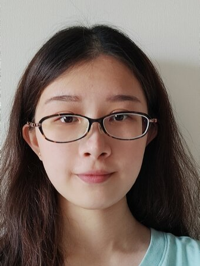
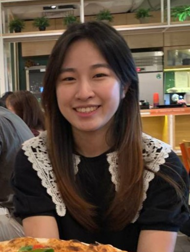

We are a team based in the [School of Computing, National University of Singapore](http://www.comp.nus.edu.sg).

## Project team

### Li Xintong

[[homepage](https://ay2223s2-cs2103t-w09-3.github.io/tp/)]
[[github](https://github.com/Emrysil)]
[[portfolio](team/johndoe.md)]

* Role: Developer
* Responsibilities: develop drug inventory sub-system
* Contact: e0772646@u.nus.edu

### Tseng Chen-Yu

[[github](http://github.com/cydtseng)]
[[portfolio](team/johndoe.md)]

* Role: Developer 
* Responsibilities: Working on Patient subsystem

### Chen Shuwen

[[github](https://github.com/CShuwen] [[portfolio](team/johndoe.md)]

* Role: Developer 
* Responsibilities: Working on Patient Subsystem

### Jean Doe

[[github](http://github.com/johndoe)]
[[portfolio](team/johndoe.md)]

* Role: Developer
* Responsibilities: Dev Ops + Threading

### James Doe

[[github](http://github.com/johndoe)]
[[portfolio](team/johndoe.md)]

* Role: Developer
* Responsibilities: UI
