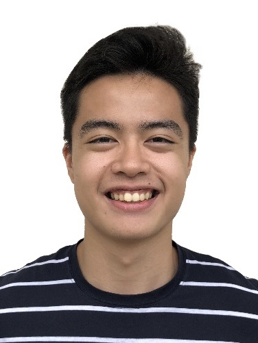
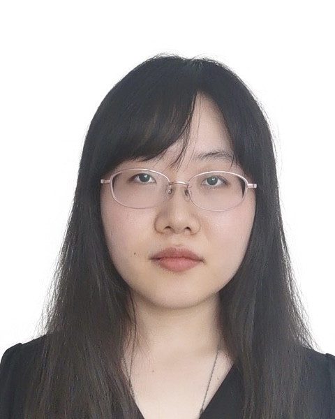
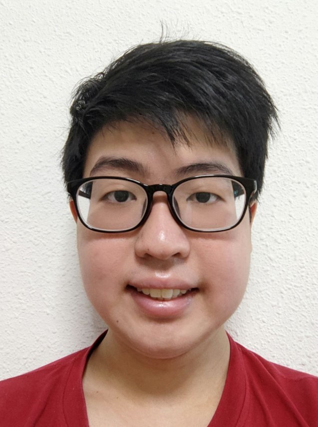

We are a team based in the [School of Computing, National University of Singapore](http://www.comp.nus.edu.sg).

## Project team

### Ang Jing Jie

[[github](https://github.com/ajjajjajjajj)]
[[portfolio](team/ajjajjajjajj.md)]

* Role: Developer
* Responsibilities: Testing, Code quality, Integration

### Wesley Bennett Loo Dela Cruz

[[github](http://github.com/wesleybldc)]
[[portfolio](team/wesleybldc.md)]

* Role: Developer
* Responsibilities: Integration, Testing, Code quality

### Wang Peixuan

[[github](http://github.com/wpx12011)]
[[portfolio](team/wpx12011.md)]

* Role: Developer
* Responsibilities: Integration, Testing, Code quality

### Benedict Tan Yian Ming

[[github](http://github.com/benedict733)]
[[portfolio](team/benedict733.md)]

* Role: Developer
* Responsibilities: Integration, Testing, Code quality

### Evan Lee Wen Jun

[[github](http://github.com/evanpy)]
[[portfolio](team/evanpy.md)]

* Role: Developer
* Responsibilities: Integration, Testing, Code quality
