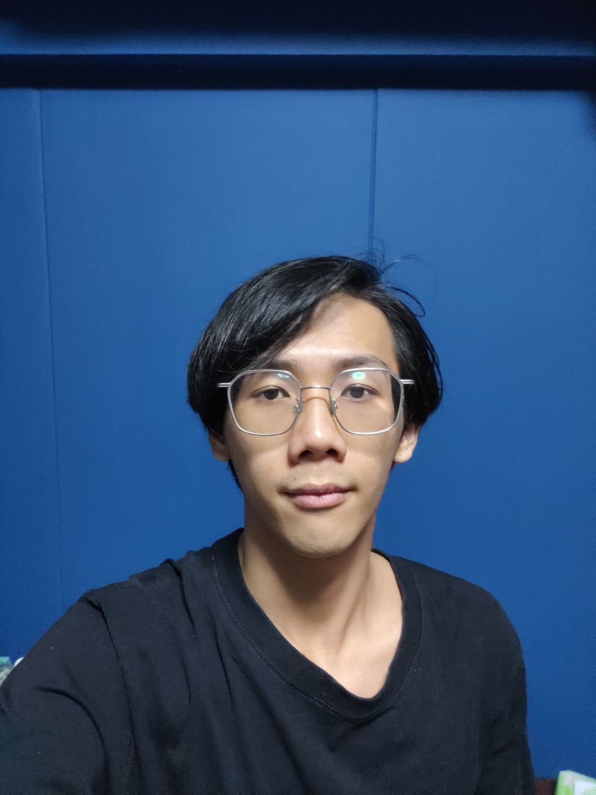

We are a team based in the [School of Computing, National University of Singapore](http://www.comp.nus.edu.sg).

You can reach us at the email `seer[at]comp.nus.edu.sg`

## Project team

### Chen Jiarui

[[github](http://github.com/chen-jerry-junior)] [[portfolio](team/chen-jerry-junior.md)]

* Role: Team Lead
* Responsibilities: Data & UI

### Joshua Chiang

[[github](http://github.com/chickenchiang)]
[[portfolio](team/chickenchiang.md)]

* Role: Developer
* Responsibilities: UI

### See Wei Xun

[[github](http://github.com/swx0)] [[portfolio](team/swx0.md)]

* Role: Developer
* Responsibilities: Developer guide, Documentation

### William Chau Wei Xuan

[[github](http://github.com/willcwx)]
[[portfolio](team/willcwx.md)]

* Role: Developer
* Responsibilities: Testing, Integration
