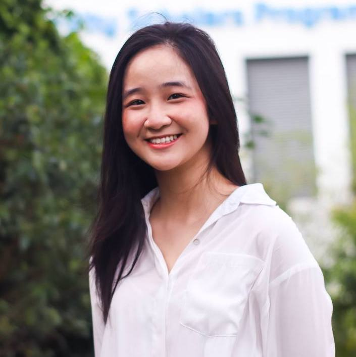
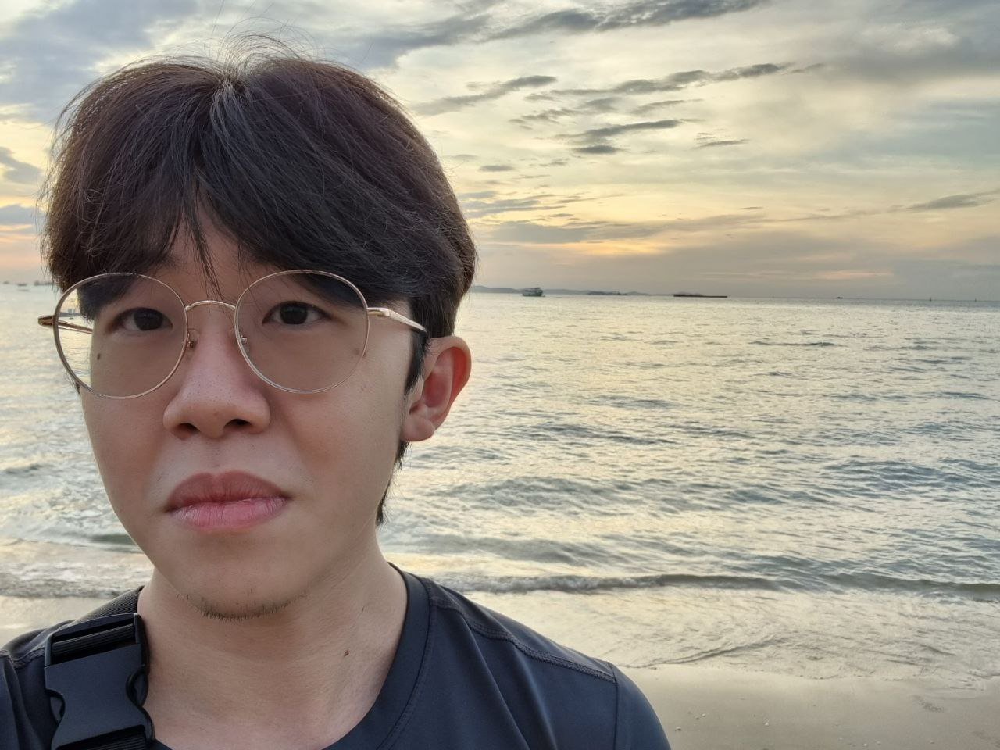
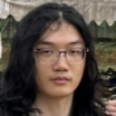
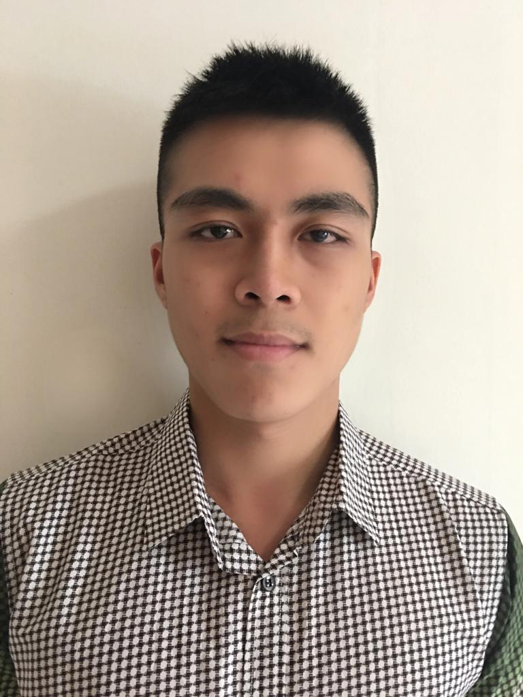
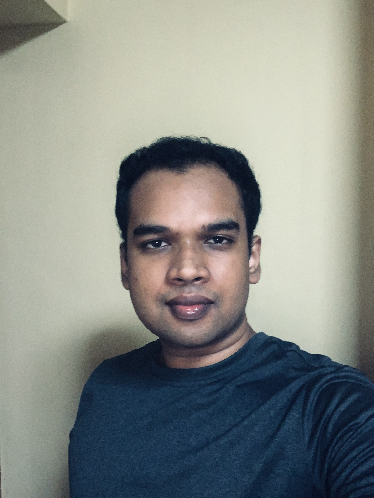

We are a team based in the [School of Computing, National University of Singapore](http://www.comp.nus.edu.sg).

You can reach us at the email `seer[at]comp.nus.edu.sg`

## Project team

### Nguyen Hong Ngoc

[[github](http://github.com/RubyNguyen07)]
[[portfolio](team/rubynguyen07.md)]

* Role: Developer
* Responsibilities: Developing and testing Statistics Dashboard and GUI. 

### Douglas Chow

[[github](http://github.com/douglch)]
[[portfolio](team/douglch.md)]

* Role: In charge of `Client`
* Responsibilities: Writing and testing the class for Client Panel - Create, Delete.

### Li Junyi

[[github](http://github.com/immanuelhume)]
[[portfolio](team/immanuelhume.md)]

* Role: Developer
* Responsibilities: Functionality and test for `Project` entity and CRUD, and fuzzy search

### Stanley Neoh

[[github](https://github.com/StanleyNeoh)]
[[portfolio](team/stanleyneoh.md)]

* Role: Developer
* Responsibilities: Writing and testing the classes for UiEvents, UiAction, and command box modes

### Sachin Kalinga

[[github](http://github.com/sachindavid96)]
[[portfolio](team/sachindavid96.md)]

* Role: Developer
* Responsibilities: Implementing the Parser
