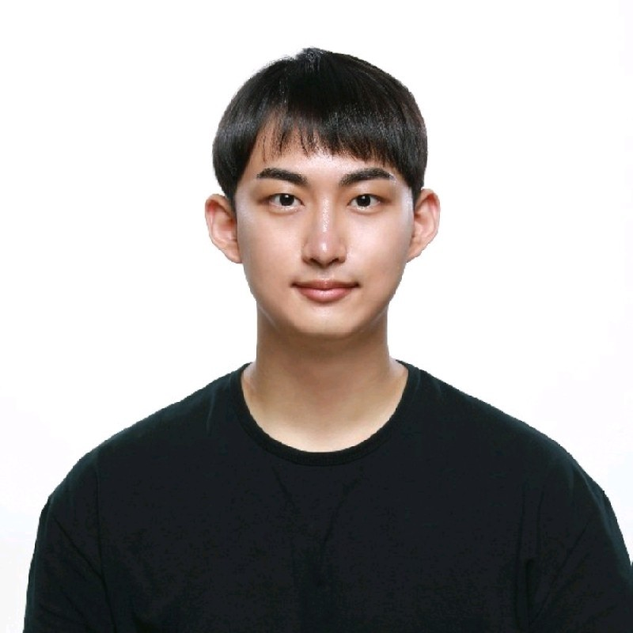
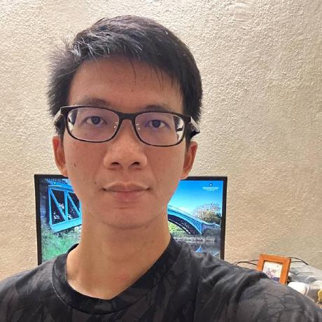

We are a team based in the [School of Computing, National University of Singapore](http://www.comp.nus.edu.sg).

You can reach us at the email `seer[at]comp.nus.edu.sg`

## Project team

### Damith C. Rajapakse

[[homepage](http://www.comp.nus.edu.sg/~damithch)]
[[github](https://github.com/damithc)]

* Role: Project Advisor

### KIM JUNGBAE

[[github](https://github.com/jbkim1999)]

* Role: Project Advisor

### Lee Kay Yen

[[github](http://github.com/kayyenl)]
[[portfolio](team/johndoe.md)]

* Role: Developer
* Responsibilities: UI

### Wei Wenjie

[[github](http://github.com/spwwj)]
[[portfolio](team/spwwj.md)]

* Role: Developer
* Responsibilities: Data

### Guo Kecheng

[[github](https://github.com/Guo-KeCheng)]
[[portfolio](team/guokecheng.md)]

* Role: Developer
* Responsibilities: UI
