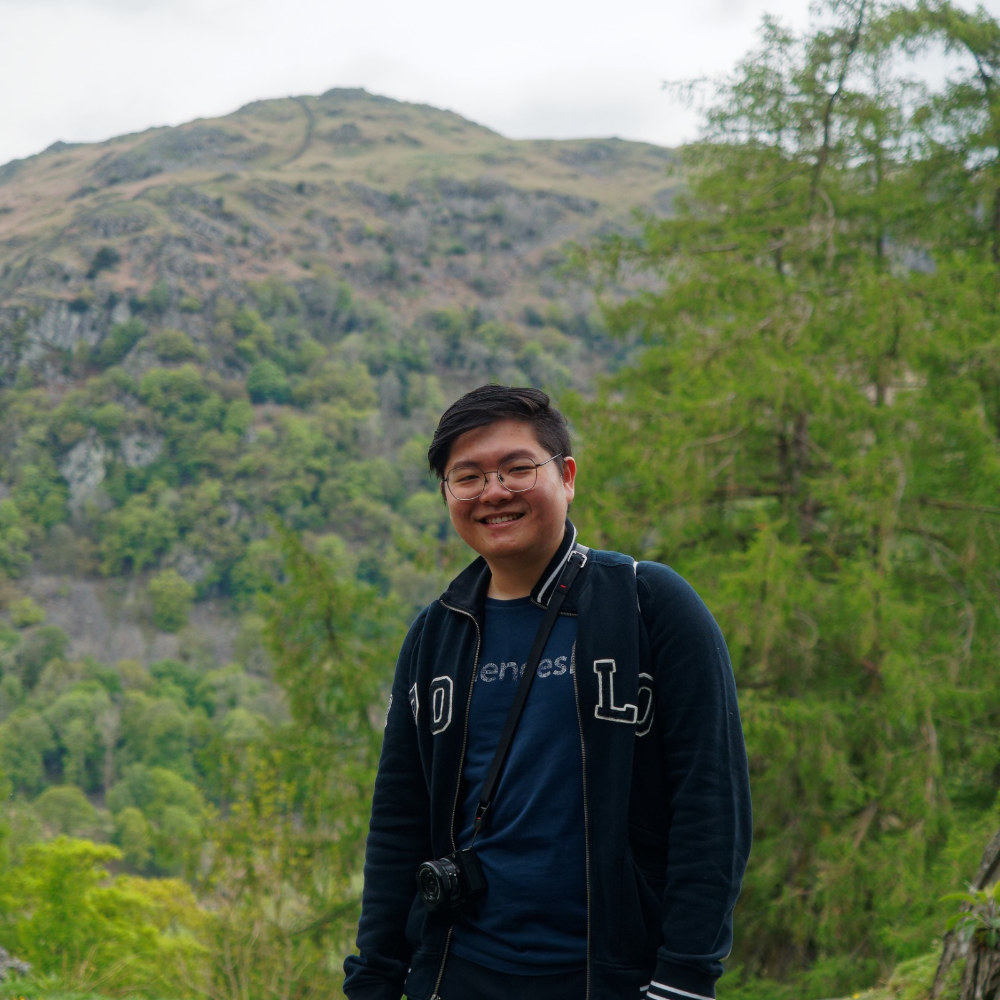
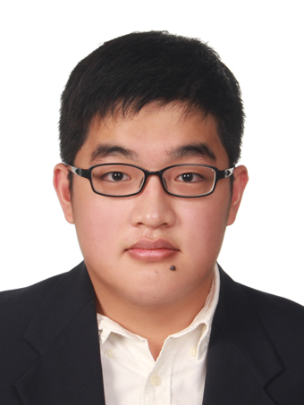
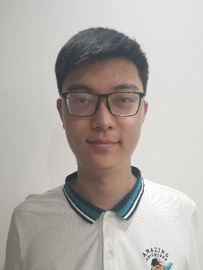
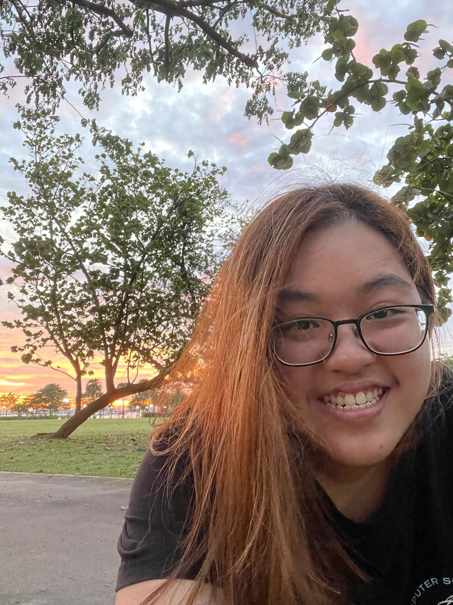

We are a team based in the [School of Computing, National University of Singapore](http://www.comp.nus.edu.sg).

You can reach us at the email `seer[at]comp.nus.edu.sg`

## Project team

### Lee Yu Heng

[[homepage](https://www.yuhenglee.com)]
[[github](https://github.com/Huggenguggen)]
[[portfolio](team/huggenguggen.md)]

* Role: Developer
* Responsibilities: Alert/Find Feature + UI

### Ong Chong Yang

[[github](http://github.com/lywich)]
[[portfolio](team/lywich.md)]

* Role: Developer
* Responsibilities: Refactoring + Scheduling + Integration

### Hao Zeyu

[[github](https://github.com/PROGRAMMERHAO)] [[portfolio](team/programmerhao.md)]

* Role: Developer
* Responsibilities: Subsection/Remove-subsection feature, Find/Add features enhancements

### Joy Ng Jing Ru

[[github](http://github.com/joyngjr)]
[[portfolio](team/joyngjr.md)]

* Role: Documentation
* Responsibilities: Delete/Stats/Schedule Feature
