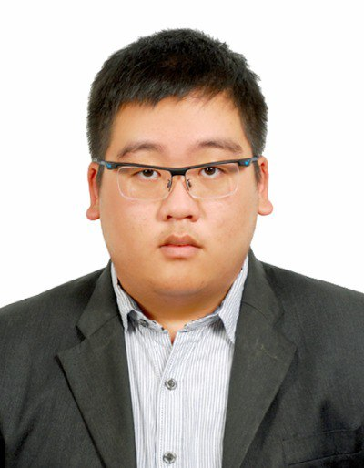
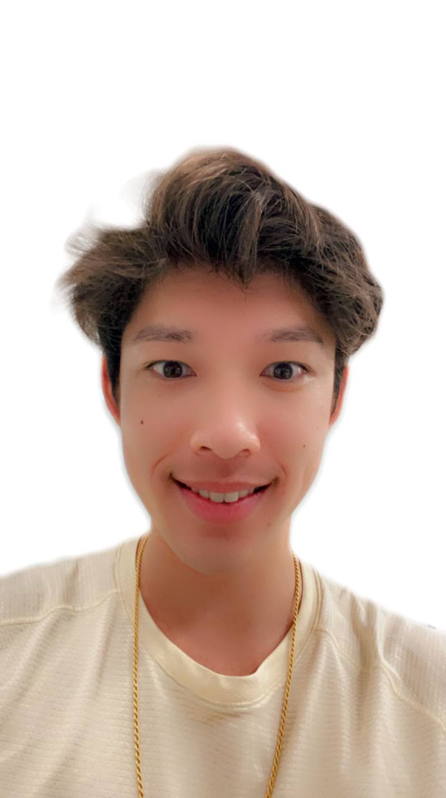
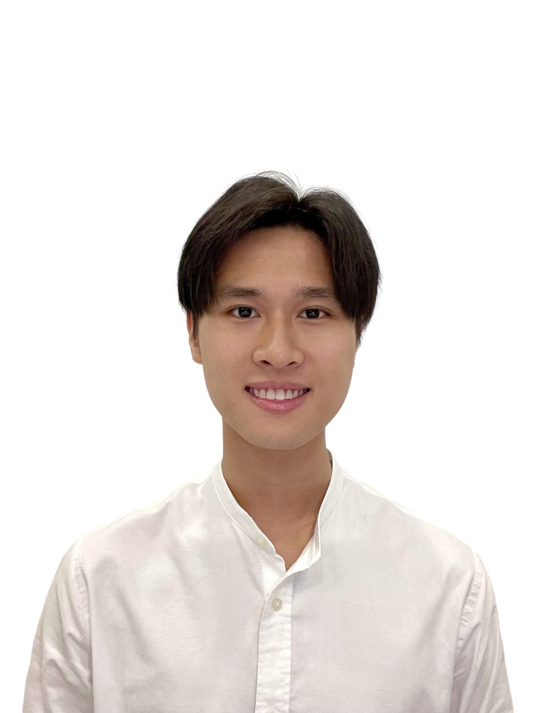
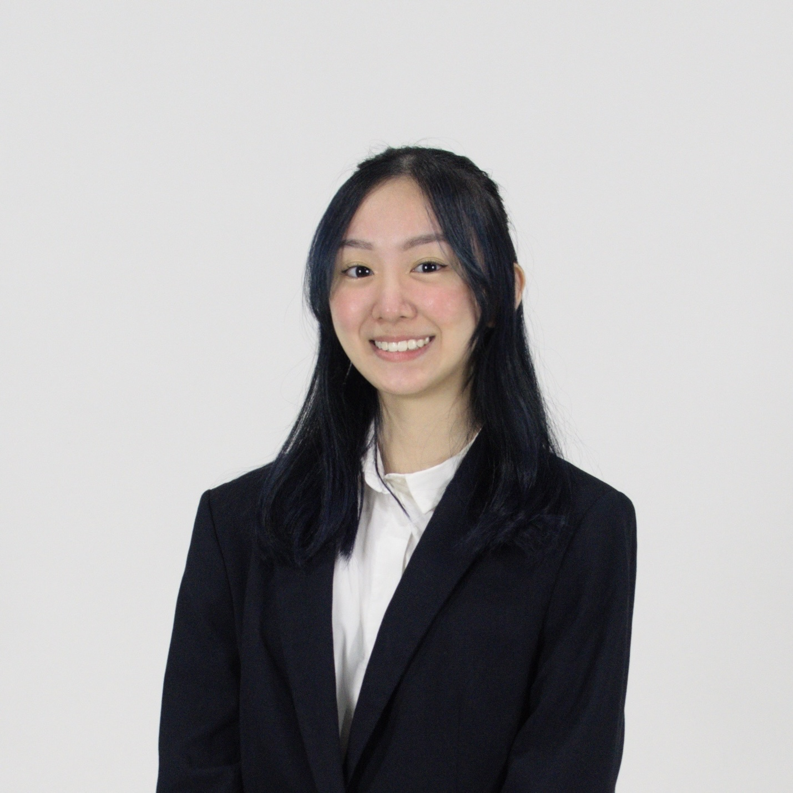

We are a team based in the [School of Computing, National University of Singapore](http://www.comp.nus.edu.sg).

## Project team

### Leon Lim

[[github](http://github.com/tempura-person)]
[[portfolio](team/tempura-person.md)]

* Role: Team Lead
* Responsibilities: UI

### Oliver Loo

[[github](http://github.com/oliverloo0909)] [[portfolio](team/Oliverloo0909.md)]

* Role: Developer
* Responsibilities: Data

### Jeng Yee

[[github](http://github.com/jengoc415)]
[[portfolio](team/jengoc415.md)]

* Role: Developer
* Responsibilities: Dev Ops + Threading

### Tricia Goh

[[github](http://github.com/tricixg)]
[[portfolio](team/tricixg.md)]

* Role: Developer
* Responsibilities: UI
