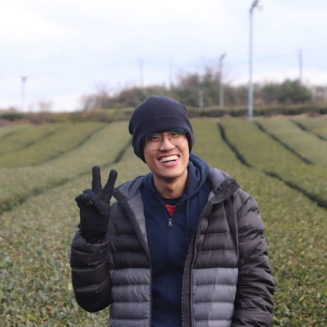
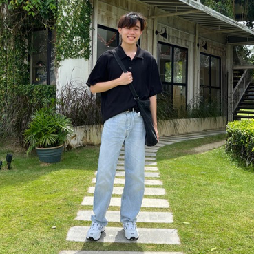
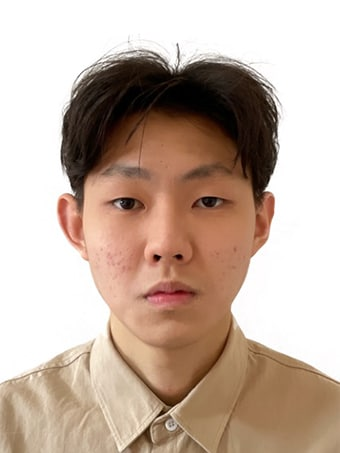
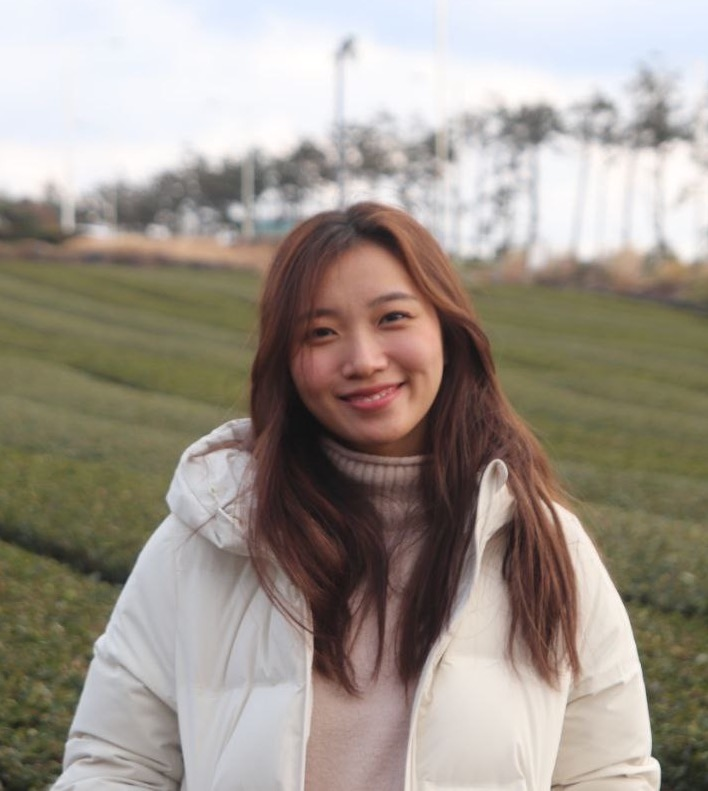
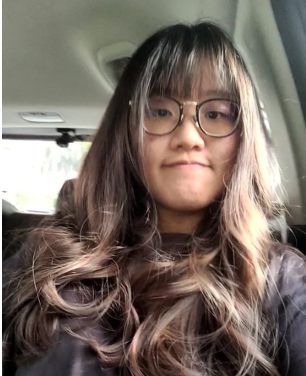

We are a team based in the [School of Computing, National University of Singapore](http://www.comp.nus.edu.sg).

You can reach us at the email `seer[at]comp.nus.edu.sg`

## Project team

### Clyde Lhui

[[github](https://github.com/clydelhui)]
[[portfolio](team/clydelhui.md)]

* Roles: Documentation and Scheduling and Tracking
* Responsibilities: Responsible for the quality of various project documents.
In charge of defining, assigning and tracking project tasks.

### Lyndon Lim Liang Hng

[[github](http://github.com/lyndonlim27)]
[[portfolio](team/lyndonlim27.md)]

* Role: Team Lead and Testing
* Responsibilities: Responsible for overall project coordination and ensure testing of project is done properly and on time.

### Du Jiahua

[[github](https://github.com/edures888)]
[[portfolio](team/edures888.md)]

* Role: Integration
* Responsibilities: In charge of versioning of the code, maintaining the code repository, integrating various parts of
  the software to create a whole.

### Gao Mengqi

[[github](https://github.com/gmengqi)]
[[portfolio](team/gmengqi.md)]

* Role: Deliverables & deadline
* Responsibilities: Ensure project deliverables are done on time and in the right format 

### Kristen Chung Jia Yi

[[github](http://github.com/alvozyn)]
[[portfolio](team/alvozyn.md)]

* Role: Code Quality
* Responsibilities: Check if the code quality adherence to coding standard
