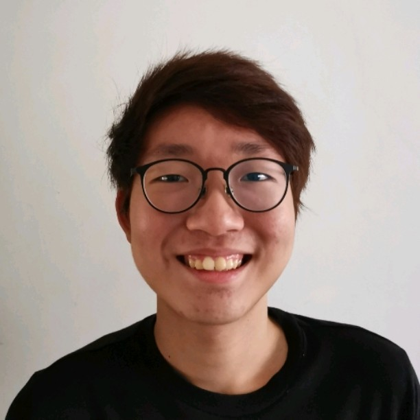

We are a team based in the [School of Computing, National University of Singapore](http://www.comp.nus.edu.sg).

## Project team

### Lee Jia Wei

[[homepage](https://jiaweilee.com)]
[[github](https://github.com/Beebeeoii)]
[[portfolio](team/beebeeoii.md)]

* Role: Team Member

### Kannusami Saraan

[[github](http://github.com/ks2499)]
[[portfolio](team/ks2499.md)]

* Role: Team Member
* Responsibilities: To be added

### Johnny Doe

[[github](http://github.com/jeremykhoo-NUS)] [[portfolio](team/jeremykhoo-NUS.md)]

* Role: Developer
* Responsibilities: code

### Jean Doe

[[github](http://github.com/johndoe)]
[[portfolio](team/johndoe.md)]

* Role: Developer
* Responsibilities: Dev Ops + Threading

### Kelvin Chua

[[github](http://github.com/chuakid)]
[[portfolio](team/chuakid.md)]

- Role: To Be Added
- Responsibilities: To Be Added
