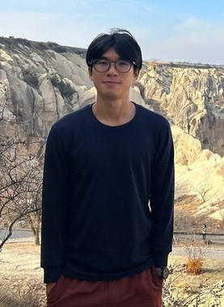

We are a team based in the [School of Computing, National University of Singapore](http://www.comp.nus.edu.sg).

You can reach us at the email `seer[at]comp.nus.edu.sg`

## Project team

### TRUONG MINH DUONG

[[github](https://github.com/Zhongli5712)]

* Role: Developer
* Responsibilities: new courses

### LEE YI

[[github](https://github.com/leeyi45)]

* Role: Team Lead
* Responsibilities: display and storage

### LIAO ZE LI, JACQUES

[[github](https://github.com/jugsliao)]

* Role: Developer
* Responsibilities: add tutors

### JETHRO SIM SHENG YANG

[[github](https://github.com/gekhro)]

* Role: Developer
* Responsibilities: add students