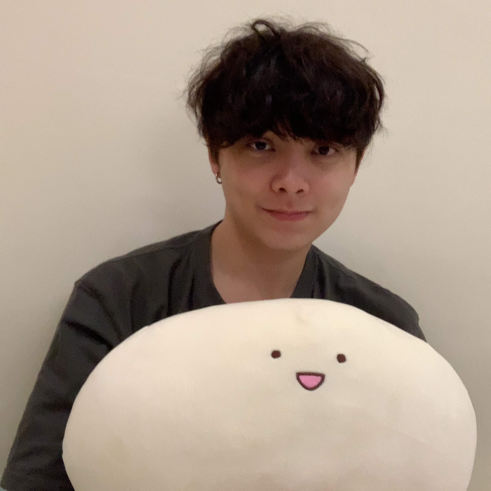
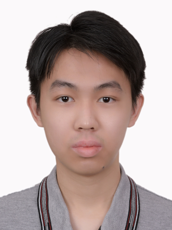

We are a team based in the [School of Computing, National University of Singapore](http://www.comp.nus.edu.sg).

You can reach us at the email `seer[at]comp.nus.edu.sg`

## Project team

### John Doe

[[homepage](http://www.comp.nus.edu.sg/~damithch)]
[[github](https://github.com/johndoe)]
[[portfolio](team/johndoe.md)]

* Role: Project Advisor

### Lai Hui Qi

[[github](http://github.com/laihuiqi)]
[[portfolio](team/laihuiqi.md)]

* Role: Developer
* Responsibilities: `clear`, `delete` and `exit` feature

### Benjamin Wee 

[[github](http://github.com/benjamin-wee)] [[portfolio](team/benjamin-wee.md)]

* Role: Developer
* Responsibilities: `list` feature

### Jean Doe

[[github](http://github.com/johndoe)]
[[portfolio](team/laihuiqi.md)]

* Role: Developer
* Responsibilities: Dev Ops + Threading

### Lok Jian Ming

[[github](http://github.com/jianminglok)]
[[portfolio](team/jianminglok.md)]

* Role: Developer
* Responsibilities: Add contact and edit status feature
