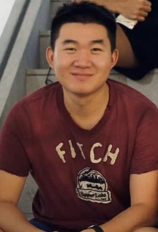
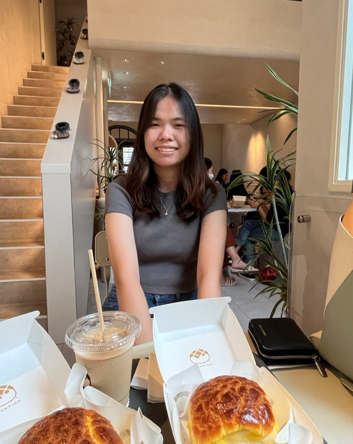
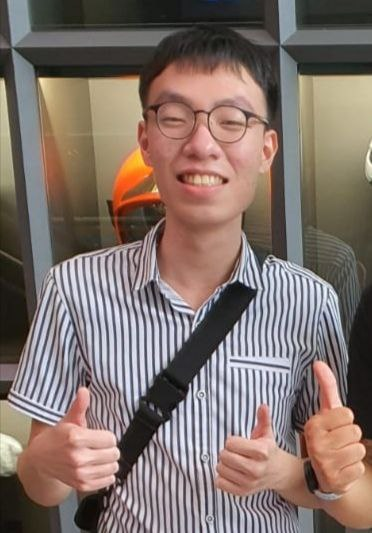

We are a team based in the [School of Computing, National University of Singapore](http://www.comp.nus.edu.sg).

## Project team

### Chen Xinyang (Xylus)

[[github](https://github.com/xyluschen)]
[[portfolio](team/xyluschen.md)]

* Role: Team Lead
* Responsibilities: Code Quality

### Tan Hui Xuan

[[github](http://github.com/huixuant)]
[[portfolio](team/huixuant.md)]

* Role: Developer
* Responsibilities: Deliverables and Scheduling

### Cai Xinjie Noah

[[github](http://github.com/noahxinjie)]
[[portfolio](team/noahxinjie.md)]

* Role: Developer
* Responsibilities: Documentation

### Huang Zhizhou

[[github](http://github.com/huangzz125)]
[[portfolio](team/huangzz125.md)]

* Role: Developer
* Responsibilities: Code Integration

### Yao Jiaxin

[[github](http://github.com/yaojiax)]
[[portfolio](team/yaojiax.md)]

* Role: Developer
* Responsibilities: Testing
