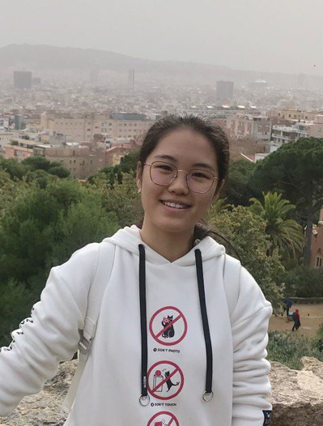
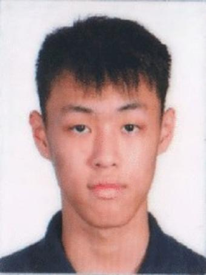
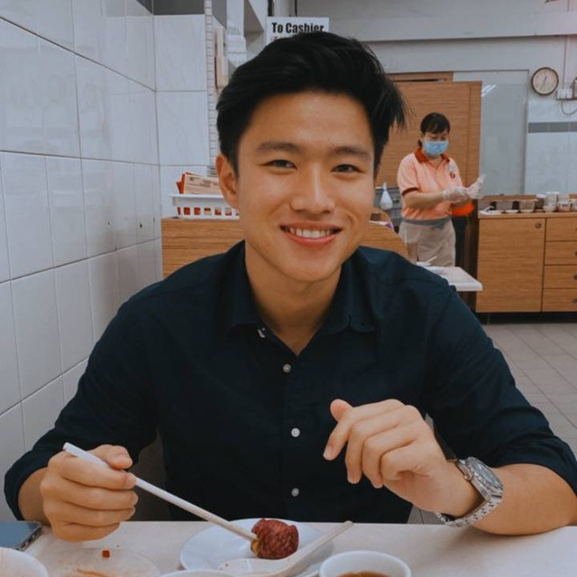

We are a team based in the [School of Computing, National University of Singapore](http://www.comp.nus.edu.sg).

You can reach us at the email `what email should we put here?`

# Project team

## Nguyen Viet Anh

[[github](https://github.com/VietAnh1010)]
[[portfolio](team/vietanh1010.md)]

- Role: Team lead, Integration, Java expert
- Responsibilities: Parser, Model

## Liu JiaYue

[[github](http://github.com/liujiayue314)]
[[portfolio](team/liujiayue314.md)]

- Role: Developer
- Responsibilities: Storage

## Ethan Chen Ee Shuen

[[github](http://github.com/bipbipboopboop)] [[portfolio](team/bipbipboopboop.md)]

- Role: Developer
- Responsibilities: UI, Integration

## Daniel Ling Zhi Yuan

[[github](http://github.com/daniellingzy)]
[[portfolio](team/johndoe.md)]

- Role: Test Engineer 
- Responsibilities: Software Development Testing

## James Doe

[[github](http://github.com/johndoe)]
[[portfolio](team/johndoe.md)]

- Role: Developer
- Responsibilities: UI
