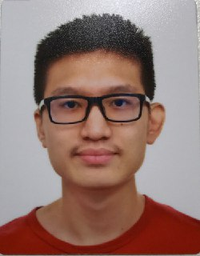

We are a team based in the [School of Computing, National University of Singapore](http://www.comp.nus.edu.sg).

AutoM8 was developed as a team project for the CS2103 Software Engineering module.

Feel free to check out at our individual project portfolios listed below, and if you have any queries, don't hesitate to reach out to us on GitHub.

## Project team

### Leow Li Yong

[[GitHub](http://github.com/ginloy)]
[[Portfolio](team/ginloy.md)]

* Role: Developer
* Responsibilities: Logic, Parsers, Utils

### Kimberly Barcelon Pontanares

[[GitHub](http://github.com/kimberlybp)]
[[Portfolio](team/kimberlybp.md)]

* Role: Developer
* Responsibilities: UI, Integration, Storage

### Julio Harjo

[[GitHub](https://github.com/junlee1991)]
[[Portfolio](team/junlee1991.md)]

* Role: Developer
* Responsibilities: DevOps, Additional Command Logic, Documentation

### Edwin Lim

[[github](https://github.com/9fc70c892)]
[[portfolio](team/9fc70c892.md)]

* Role: Developer
* Responsibilities: Model, Basic Command Logic, Code Quality
