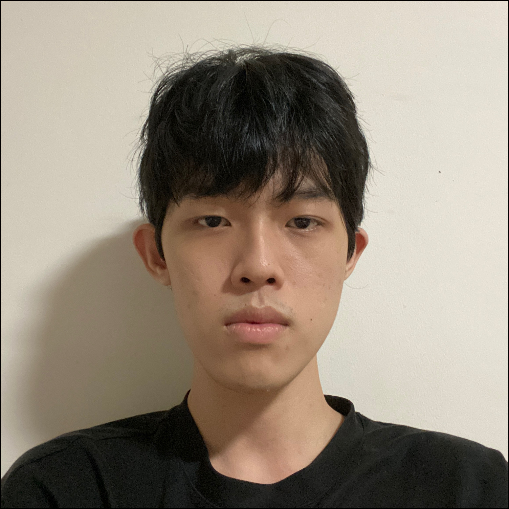
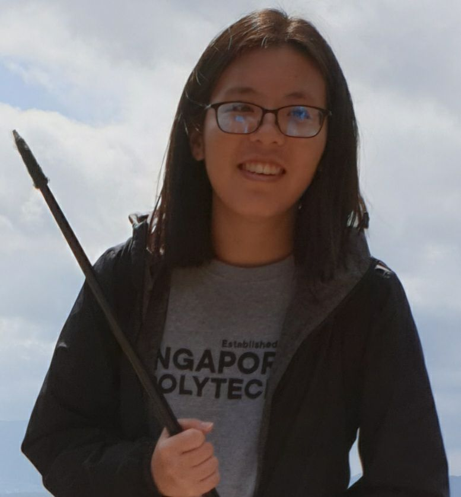

We are a team based in the [School of Computing, National University of Singapore](http://www.comp.nus.edu.sg).

You can reach us at the email `PetPal[at]comp.nus.edu.sg`

## Project team

### Lin Yuan Xun

[[github](https://github.com/YuanXun9834)]
[[portfolio](team/YuanXun9834.md)]

* Role: Project Advisor

### Soo Weng Kit

[[github](http://github.com/wengkit1)]
[[portfolio](team/wengkit1.md)]

* Role: Team Lead
* Responsibilities: UI

### He Shuimei

[[homepage](https://shuimeihe.github.io/)]
[[github](http://github.com/shuimeihe)]
[[portfolio](team/shuimeihe.md)]

* Role: Developer
* Responsibilities: Data

### Daniel Kur

[[github](http://github.com/daniel-kur)]
[[portfolio](team/daniel-kur.md)]

* Role: Developer
* Responsibilities: Dev Ops + Threading

