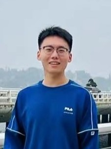

We are a team based in the [School of Computing, National University of Singapore](http://www.comp.nus.edu.sg).

## Project team

### Muhammad Reyaaz

[[github](https://github.com/arpspoofing)]
[[portfolio](team/arpspoofing.md)]

* Role: Team Lead.
* Responsibilities: UI, Documentation, Deliverables and deadlines, Git Expert, and in charge of events.

### Shi Jiaao

[[github](https://github.com/ShiJiaAo)]
[[portfolio](team/shijiaao.md)]

* Role: Developer.
* Responsibilities: Code Quality, Deliverables and deadlines, and in charge of integrating students and events.

### Chew Chun Kiat

[[github](http://github.com/nerdyboy98)]
[[portfolio](team/nerdyboy98.md)]

* Role: Developer.
* Responsibilities: Deliverables, and Help and Sorting of events, and Consistency.

### Eric

[[github](http://github.com/shittake)]
[[portfolio](team/shittake.md)]

* Role: Developer
* Responsibilities: Sorting and filtering of students, and ensure integration with events.

### Jia Tong

[[github](http://github.com/JThh)]
[[portfolio](team/jthh.md)]

* Role: Developer
* Responsibilities: UI for notes, integrate students with notes, integrate events with notes.
