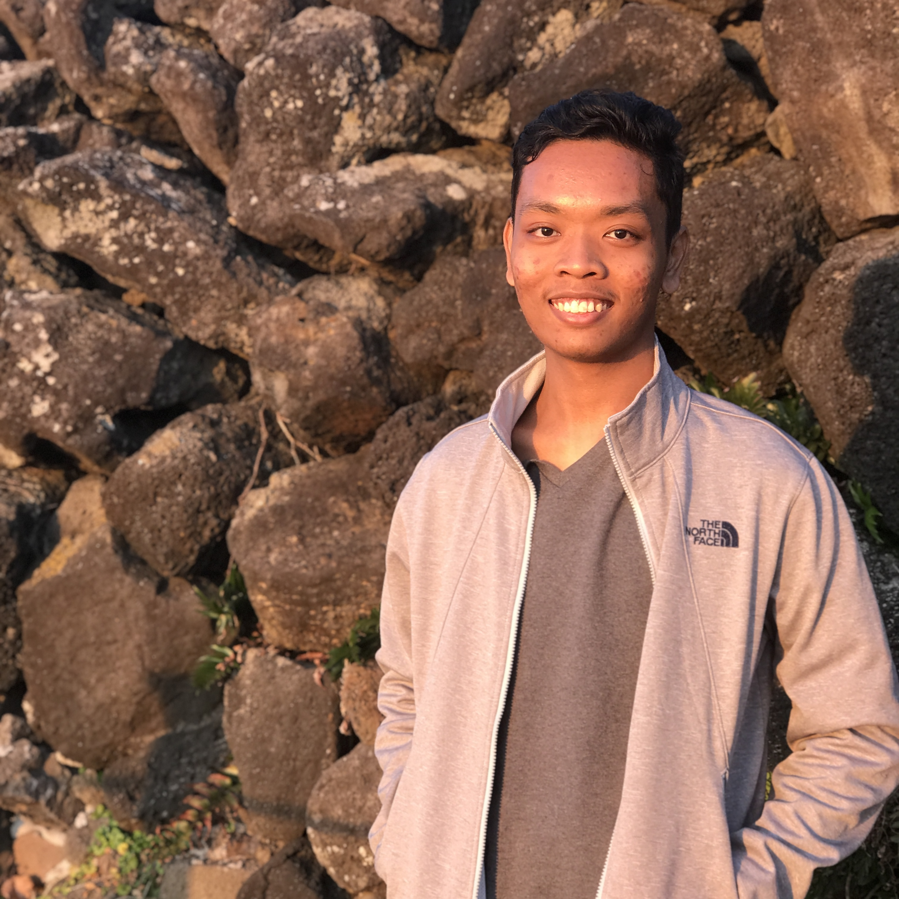

We are a team based in the [School of Computing, National University of Singapore](http://www.comp.nus.edu.sg).

## Project team

### Tan Kai Min Russell

[[github](https://github.com/russelltankaimin)]
[[portfolio](team/russelltankaimin.md)]

* Role: Developer, Team Lead
* Responsibilities: `view` command, `TimingRecommender`, Deliverables, Deadlines, Gradle issues

### Izz Hafeez Bin Zek Hazley

[[github](http://github.com/mynameizzhafeez)]
[[portfolio](team/mynameizzhafeez.md)]

* Role: Lead Developer
* Responsibilities: Data

### Tan Li Thai Sean

[[github](http://github.com/seanfirefox)]
[[portfolio](team/seanfirefox.md)]

* Role: Developer
* Responsibilities: UX

### Wang Zichen

[[github](http://github.com/zichen-3974)]
[[portfolio](team/zichen-3974.md)]

* Role: Developer, Creative Director
* Responsibilities: UI

### Chon Jin Yong Kenny

[[github](http://github.com/kennycjy)]
[[portfolio](team/kennycjy.md)]

* Role: Developer
* Responsibilities: Entire tagging/untagging functionality
