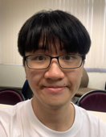
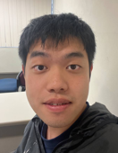

We are a team based in the [School of Computing, National University of Singapore](http://www.comp.nus.edu.sg).

You can reach us at the email `seer[at]comp.nus.edu.sg`

## Project team

### Wen Li

[[github](http://github.com/wendy0107)]
[[portfolio](team/wendy0107.md)]

* Role: Team Lead
* Responsibilities: Leading the team

### Shaun Tan

[[github](https://github.com/EvitanRelta)]
[[portfolio](team/evitanrelta.md)]

* Role: Developer
* Responsibilities: Dev Ops

### Shao Hong

[[github](http://github.com/Sheemo)]
[[portfolio](team/sheemo.md)]

* Role: Developer
* Responsibilities: UI

### Benny

[[github](http://github.com/Bentimate)]
[[portfolio](team/bentimate.md)]

* Role: Developer
* Responsibilities: Coding

### Wei Chun

[[github](http://github.com/alextang809)]
[[portfolio](team/alextang809.md)]

* Role: Developer
* Responsibilities: Data
