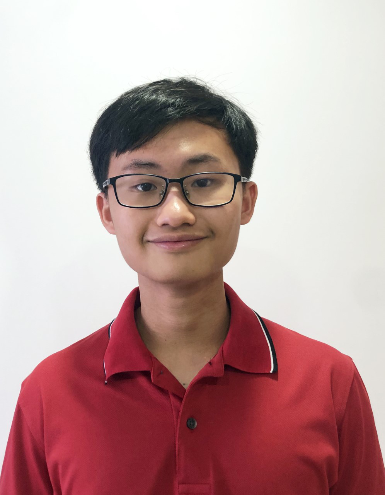

We are a team based in the [School of Computing, National University of Singapore](http://www.comp.nus.edu.sg).

You can reach us at any one of the following emails:
* [Tan Wei Zhe](mailto:tweizhe@gmail.com)
* [Quek Jia Zhi, Shaun](mailto:zhacatomn@gmail.com)
* [Goh Yong Jing](mailto:e0693145@u.nus.edu) 
* [Lee Zong Xun](mailto:lzongxun@u.nus.edu)

## Project team

### Tan Wei Zhe

[[github](https://github.com/wz2k)]
[[portfolio](team/wz2k.md)]

* Role: Developer
* Responsibilities:
  * Documentation (week 10)
  * Code Quality (week 11)
  * Team Lead (week 9)
  * Integration (week 1, week 12)
  * Deliverables and Deadlines (week 8, week 13)

### Goh Yong Jing

[[github](http://github.com/gohyongjing)]
[[portfolio](team/gohyongjing.md)]

* Role: Developer
* Responsibilities:
  * Team Lead (week 7, 12)
  * Documentation (week 8, 13)
  * Code Quality (week 9)
  * Integration (week 10)
  * Deliverables and Deadlines (week 11)

### Quek Jia Zhi, Shaun

[[github](http://github.com/zhacatomn)] [[portfolio](team/zhacatomn.md)]

* Role: Developer
* Responsibilities: 
  * Team Lead (week 8)
  * Documentation (week 9)
  * Code Quality (week 10)
  * Integration (week 11)
  * Deliverables and Deadlines (week 7, 12)

### Jean Doe

[[github](http://github.com/johndoe)]
[[portfolio](team/johndoe.md)]

* Role: Developer
* Responsibilities: Dev Ops + Threading

### Lee Zong Xun

[[github](http://github.com/Zxun2)]
[[portfolio](team/Zxun2.md)]

* Role: Developer
* Responsibilities: 
  * Team Lead (week 10)
  * Integration (week 8, 13)
  * Documentation (week 11)
  * Code Quality (week 7, 12)
  * Deliverables and Deadlines (week 9)