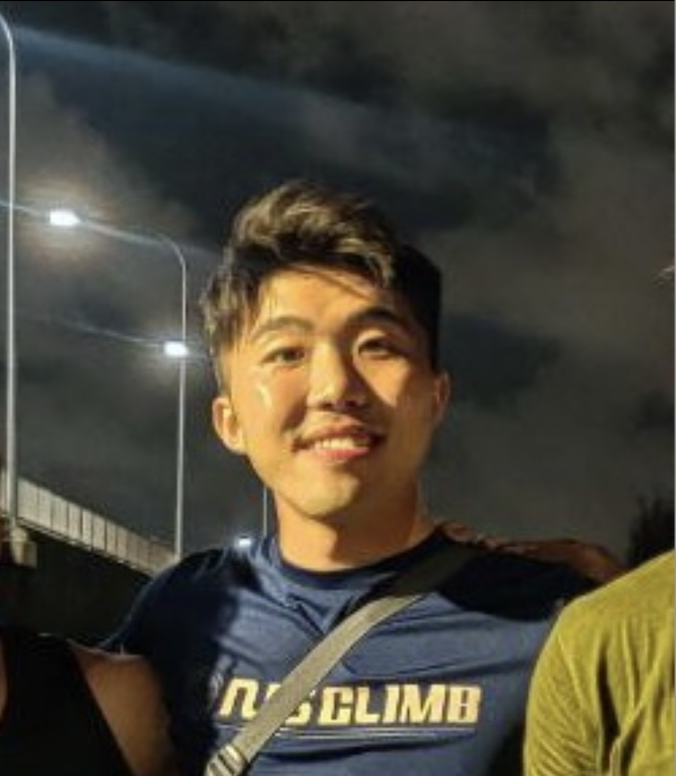

We are a team based in the [School of Computing, National University of Singapore](http://www.comp.nus.edu.sg).

## Project team

### Andre Lin

[[github](https://github.com/4ndrelim)]
[[portfolio](team/andre.md)]

* Role: Developer
* Responsibilities: Integration & Tracking
* In-charge of: Leave features

### Kenneth Kiang

[[github](https://github.com/kennethk-1201)]
[[portfolio](https://kennethkiang.netlify.app/)]

* Role: Team Lead

### Chee Jer En

[[github](http://github.com/jerrrren)]
[[portfolio](team/jerrrren.md)]

* Role: Code Quality Tracker
* Responsibilities: Check code quality

### Johnny Doe

[[github](http://github.com/johndoe)] [[portfolio](team/4ndrelim.md)]

* Role: Developer
* Responsibilities: Data

### Jean Doe

[[github](http://github.com/johndoe)]
[[portfolio](team/4ndrelim.md)]

* Role: Developer
* Responsibilities: Dev Ops + Threading

### James Doe

[[github](http://github.com/johndoe)]
[[portfolio](team/4ndrelim.md)]

* Role: Developer
* Responsibilities: UI
