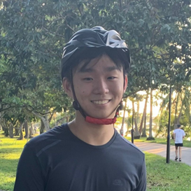

We are a team based in the [School of Computing, National University of Singapore](http://www.comp.nus.edu.sg).

Our team was formed to complete a Team Project (tp)
as a graded component in our module, [CS2103T](https://nusmods.com/modules/CS2103T/software-engineering).

## Project team

### Jed Ng

[[github](https://github.com/jednghk)]
[[portfolio](team/jednghk.md)]

### Ryo Hilmawan

[[github](http://github.com/CloudHill)]
[[portfolio](team/CloudHill.md)]

* Role: Developer

### Dawson Lui

[[github](http://github.com/Infrix)]
[[portfolio](team/Infrix.md)]

* Role: Developer

### Javon Teo

[[github](http://github.com/JavonTeo)]
[[portfolio](team/JavonTeo.md)]

* Role: Developer

### Goh Jun Yi

[[github](http://github.com/Junyi00)]
[[portfolio](team/Junyi00.md)]

* Role: Developer
