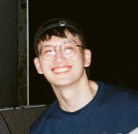

We are a team based in the [School of Computing, National University of Singapore](http://www.comp.nus.edu.sg).

You can reach us at the email `seer[at]comp.nus.edu.sg`

## Project team

### Pierce Ng Wei Sheng

[[github](https://github.com/igezt)]

* Role: Team lead
* Responsibilities: Model

### Stanley Han

[[github](http://github.com/hansstanley)]
[[portfolio](team/hansstanley.md)]

* Roles:
  * Integration
  * Scheduling and tracking
  * Git expert
* Responsibilities:
  * In charge of UI

### Lim Jian Rong, Nicholas

[[github](http://github.com/nicljr)] [[portfolio](team/nicljr.md)]

* Role:
  * Code Quality
  * Deliverables And Deadlines
* Responsibilities: In Charge of Calendar

### Tan Wei Xuan Rachel

[[github](http://github.com/rachtan27)]
[[portfolio](team/rachtan27.md)]

* Role: Testing
* Responsibilities:
  * In charge of Commands

### Shane Duggan

[[github](http://github.com/shuggan)]

* Role: Documentation
* Responsibilities: Storage
