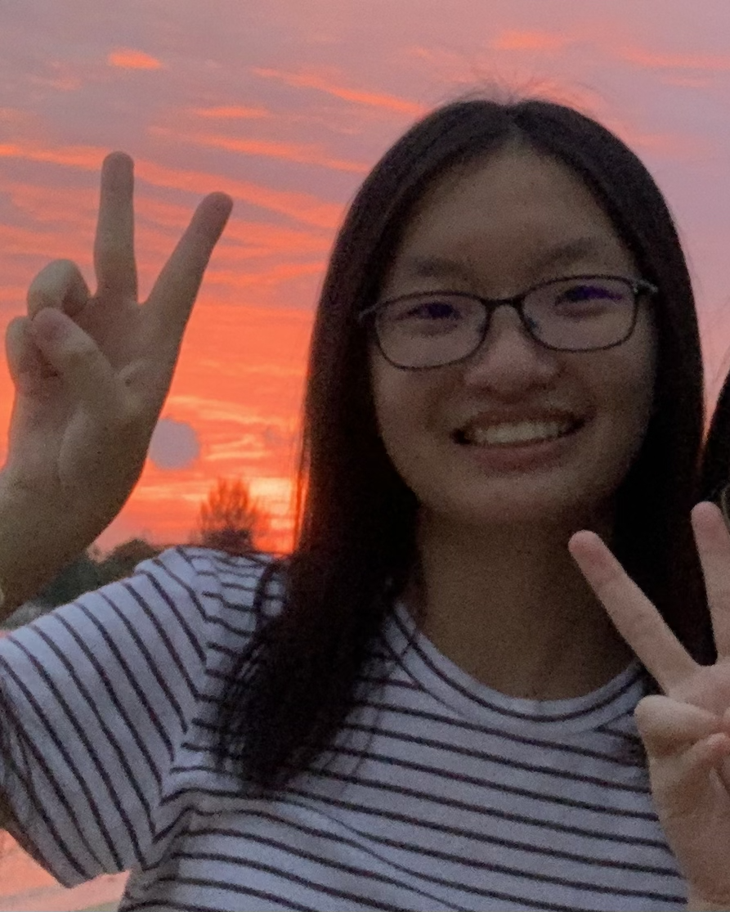

We are a team based in the [School of Computing, National University of Singapore](http://www.comp.nus.edu.sg).

You can reach us at the email `seer[at]comp.nus.edu.sg`

## Project team

### Markus Yeo

[[github](https://github.com/markusyeo)]
[[portfolio](team/markusyeo.md)]

* Role: Developer
* Responsibilities: Data

### Sum Hung Yee

[[github](http://github.com/sumhungyee)]
[[portfolio](team/sumhungyee.md)]

* Role: Team Lead
* Responsibilities: UI

### Aeron Toh

[[github](http://github.com/Tohtoroo)]
[[portfolio](team/Tohtoroo.md)]

* Role: Developer
* Responsibilities: Data

### Valerie Tan

[[github](http://github.com/valerietanhx)]
[[portfolio](team/valerietanhx.md)]

* Role: Developer
* Responsibilities: Dev Ops + Threading

### Samuel Murugasu

[[github](http://github.com/axmszr)]
[[portfolio](team/axmszr.md)]

* Role: Developer
* Responsibilities: UI
