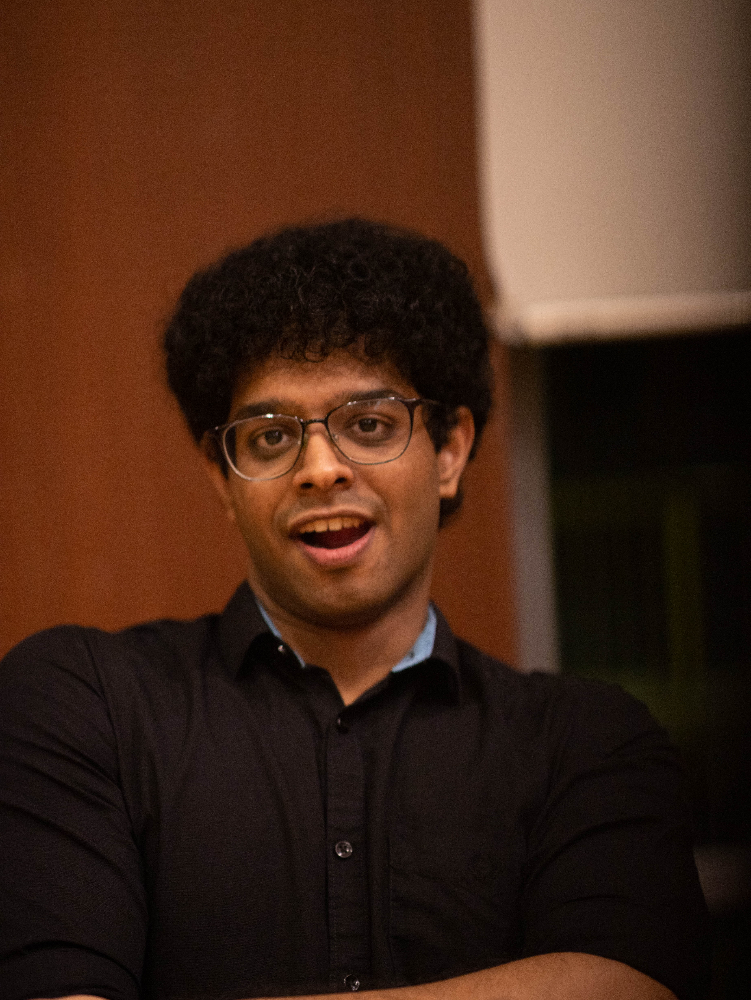

We are the Docedex team! We are undergraduates based in the [School of Computing, National University of Singapore](http://www.comp.nus.edu.sg).

**_Our contact information will be updated soon!_**

## Project team

### Vigneshwar Hariharan

[[github](http://github.com/vigonometry)]
[[portfolio](team/vigonometry.md)]

* Role: Code quality
* Responsibilities: Looks after code quality, ensures adherence to coding standards, etc.

### Amos Hung

[[github](http://github.com/Bobfree546)] [[portfolio](team/amos.md)]

* Role: Testing
* Responsibilities: Ensures the testing of the project is done properly and on time.

### Krishnamoorthi Praveen

[[github](http://github.com/praveenkrishna0512)]
[[portfolio](team/praveenkrishna0512.md)]

* Role: Documentation
* Responsibilities: Responsible for the quality of various project documents.

### Owen Yap Yuhan

[[github](http://github.com/owen-yap)]
[[portfolio](team/owen-yap.md)]

* Role: Project Manager
* Responsibilities: Responsible for overall project coordination and in charge of defining, \
assigning, and tracking project tasks.
