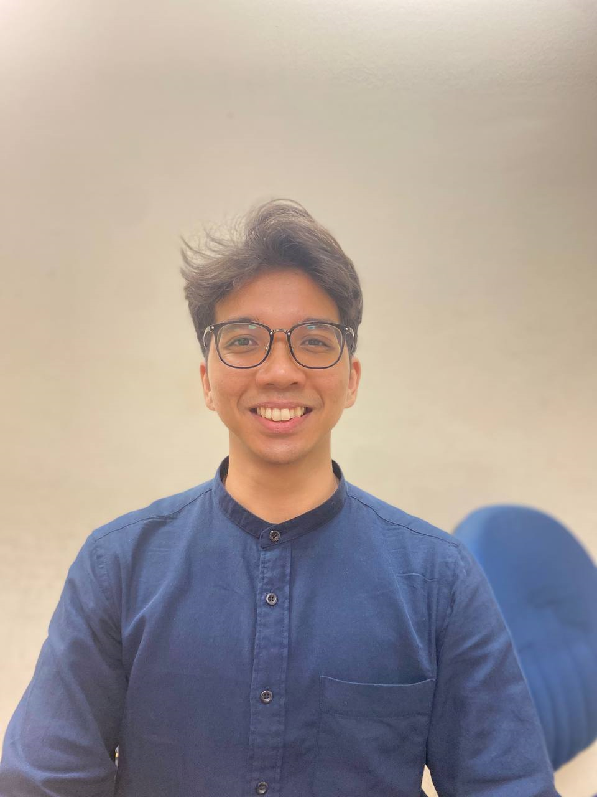

We are a team based in the [School of Computing, National University of Singapore](http://www.comp.nus.edu.sg).

## Project team

### Melvin Ong

[[github](https://github.com/mehvin)]
[[portfolio](team/mehvin.md)]

* Role: Project Advisor

### Muhammad Shazrin

[[github](http://github.com/shazxrin)]
[[portfolio](team/shazxrin.md)]

* Role: Developer
* Responsibilities: Code quality + Testing

### Oskar Lew

[[github](http://github.com/skeltons)] 
[[portfolio](team/skeltons.md)]

* Role: Developer
* Responsibilities: Data

### Jean Doe

[[github](http://github.com/johndoe)]
[[portfolio](team/johndoe.md)]

* Role: Developer
* Responsibilities: Dev Ops + Threading

### James Doe

[[github](http://github.com/johndoe)]
[[portfolio](team/johndoe.md)]

* Role: Developer
* Responsibilities: UI
