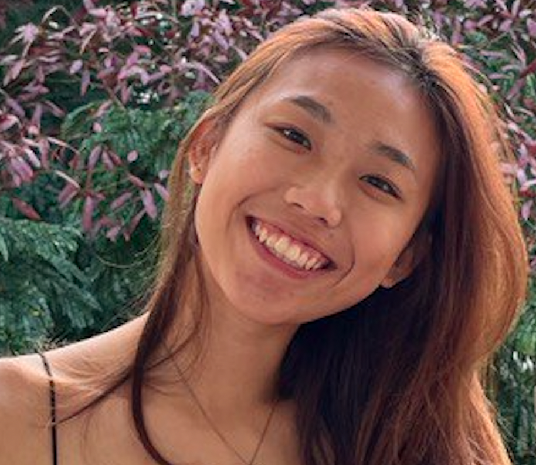

We are a team based in the [School of Computing, National University of Singapore](http://www.comp.nus.edu.sg).

You can reach us at the email `coNtactUS@comp.nus.edu.sg`

## Project team

### The Myth

[[homepage](http://www.comp.nus.edu.sg/~damithch)]
[[github](https://github.com/damithc)]
[[portfolio](team/damithc.md)]

* Role: Project Advisor

### Bahatheq Tariq Ahmed S

[[github](http://github.com/Tariq-droid)]
[[portfolio](team/Tariq-droid.md)]

* Role: TBA
* Responsibilities: TBA

### Jamie Leow Hui Lin

[[github](http://github.com/jamieeeleow)] 
[[portfolio](team/jamieeeleow.md)]

* Role: TBA
* Responsibilities: TBA

### Chew Ting Yi

[[github](http://github.com/tingyic)]
[[portfolio](team/tingyic.md)]

* Role: TBA
* Responsibilities: TBA

### Hee Jia Yuan

[[github](http://github.com/jayhee3)]
[[portfolio](team/jayhee3.md)]

* Role: TBA
* Responsibilities: TBA
