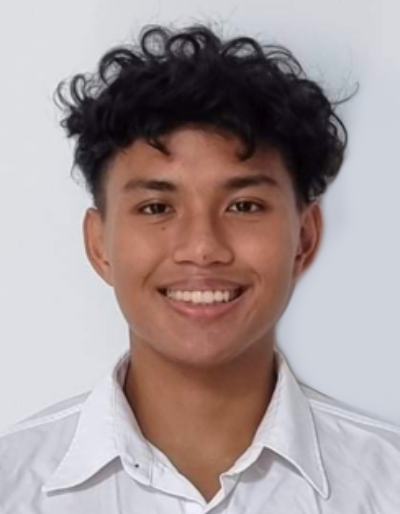

We are a team based in the [School of Computing, National University of Singapore](http://www.comp.nus.edu.sg).

You can reach us at the email `seer[at]comp.nus.edu.sg`

## Project team

### Rui Yi Gan

[[homepage](https://sg.linkedin.com/in/rui-yi-gan)]
[[github](https://github.com/ruiyigan)]
[[portfolio](team/ruiyigan.md)]

* Role: Project Advisor
* Responsibilities: Testing

### Lian Kok Hai

[[homepage](https://liankokhai.com)]
[[github](http://github.com/unfazing)]
[[portfolio](team/unfazing.md)]

* Role: Team Lead
* Responsibilities: UI

### Park Hyunjin

[[github](http://github.com/hj-prk)] 
[[portfolio](team/hj-prk.md)]

* Role: Developer
* Responsibilities: Data

### Tran Hieu Nghia

[[github](http://github.com/rockman007372)]
[[portfolio](team/rockman007372.md)]

* Role: Developer
* Responsibilities: Dev Ops + Threading

### Bryan Juniano

[[github](http://github.com/junianob)]
[[portfolio](team/junianob.md)]

* Role: Developer
* Responsibilities: UI
