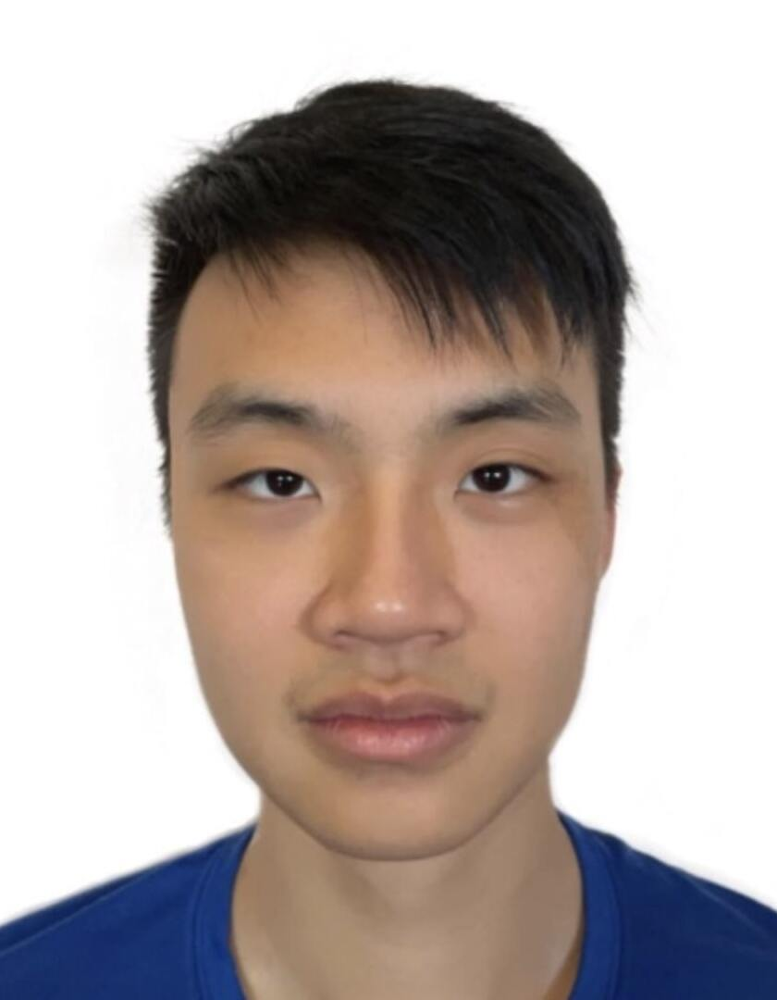

We are a team based in the [School of Computing, National University of Singapore](http://www.comp.nus.edu.sg).

## Project team
[[homepage](https://ay2223s2-cs2103t-w09-4.github.io/tp/)]

### Lim Jun Hao

[[github](https://github.com/junhao247)]
[[portfolio](team/junhao247.md)]

* Role: Project Advisor
* Responsibilities: Develop ExecutivePro system

### Lim Yan Ling

[[github](https://github.com/yanlings)]
[[portfolio](team/yanlings.md)]

* Role: Developer
* Responsibilities: Develop ExecutivePro system

### Guo Yulong

[[github](http://github.com/gyulong1)] [[portfolio](team/gyulong1.md)]

* Role: Developer
* Responsibilities: Develop ExecutivePro system

### Ang Ben Xuan

[[github](https://github.com/abenx162)] [[portfolio](team/abenx162.md)]

* Role: Developer
* Responsibilities: Develop ExecutivePro

### Panav Dua

[[github](http://github.com/panavdua)]
[[portfolio](team/panavdua.md)]

* Role: Developer
* Responsibilities: Develop ExecutivePro
