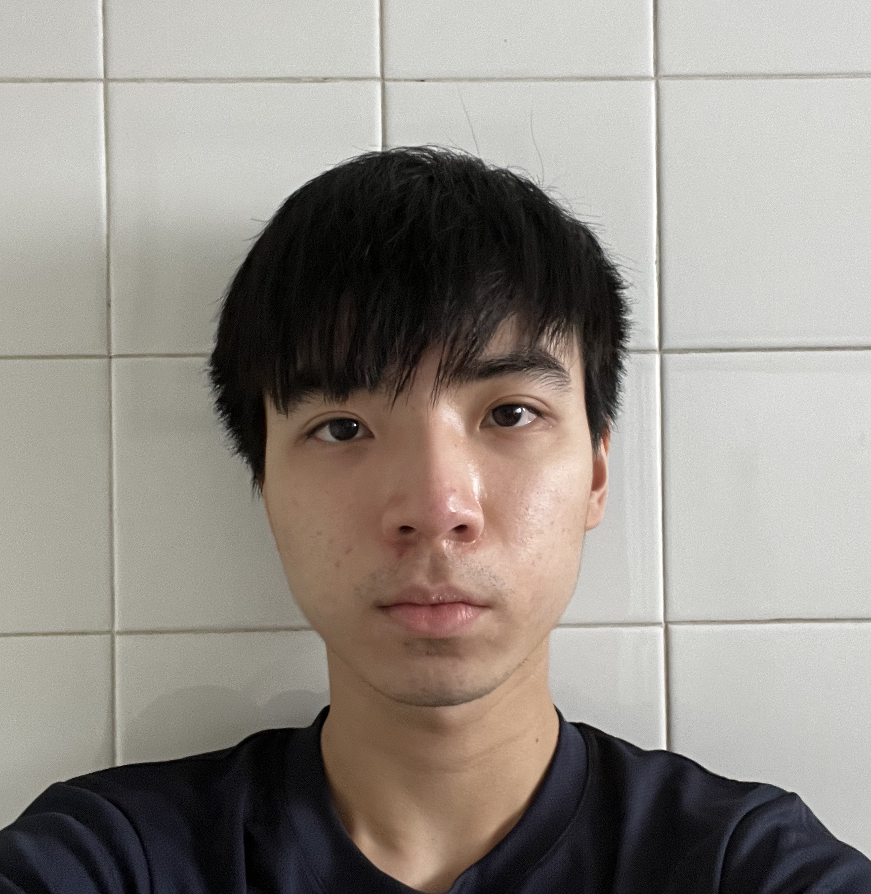

We are a team based in the [School of Computing, National University of Singapore](http://www.comp.nus.edu.sg).

You can reach us at the email `seer[at]comp.nus.edu.sg`

## Project team

### Teo Rayon

[[github](https://github.com/NoyaRoeT)]
[[portfolio](team/noyaroet.md)]

* Role: Developer
* Responsibilities: Backend & Features

### Zenith Yap

[[github](https://github.com/zenithyap)]
[[portfolio](team/zenithyap.md)]

* Role: Developer
* Responsibilities: UI

### Wong Jia Jun

[[github](http://github.com/Wong-Jia-Jun)]
[[portfolio](team/wong-jia-jun.md)]

* Role: Developer
* Responsibilities: UI
### Wong Yong Xiang

[[github](http://github.com/wongyx)]
[[portfolio](team/wongyx.md)]

* Role: Developer
* Responsibilities: TBC

### Zhou Yuxin

[[github](http://github.com/zhoyx)]
[[portfolio](team/zhoyx.md)]

* Role: Developer
* Responsibilities: Backend work
