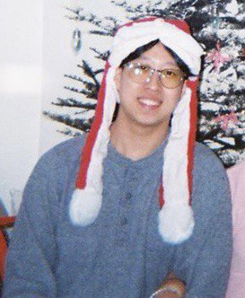
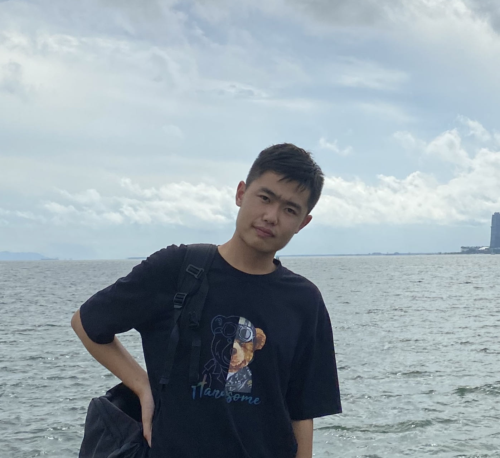

We are a team based in the [School of Computing, National University of Singapore](http://www.comp.nus.edu.sg).

## Project team

### Jonathon Low Eng Kiat

[[github](https://github.com/Creationsv2)]
[[portfolio](team/creationsv2.md)]

* Role: Developer
* Responsibilities: 
  * `add` command
  * `nric`, `tag`, `doctor` fields
  * User Guide

### Ong Wei Jie

[[github](http://github.com/ongweijie7)]
[[portfolio](team/ongweijie7.md)]

* Role: Developer
* Responsibilities: 
  * `filter` command
  * `gender`, `dateofbirth` fields
  * Developer Guide

### Sean Chin Jun Kai

[[github](http://github.com/seanchinjunkai)]
[[portfolio](team/seanchinjunkai.md)]

* Role: Developer
* Responsibilities: 
  * `help` and `delete` commands
  * `drugallergy` field
  * User Guide

### Ma Yu Chen

[[github](http://github.com/dawg420)]
[[portfolio](team/dawg420.md)]
* Role: Developer
* Responsibilities:
  * `backup`, `load`, `viewbackups` and `deletebackups` commands
  * `medicine` field
  * Developer Guide

### Pei Wenqi

[[github](http://github.com/cedricpei)]
[[portfolio](team/cedricpei.md)]

* Role: Developer
* Responsibilities:
  * GUI
  * `undo`, `redo`, `light`, `dark`, `view` commands
  * User Guide
