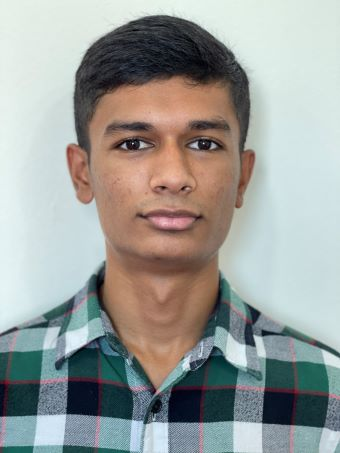

We are a team based in the [School of Computing, National University of Singapore](http://www.comp.nus.edu.sg).

You can reach us at the email `seer[at]comp.nus.edu.sg`

## Project team

### Navaneeth Ramapurath

[[github](https://github.com/nramapurath)]
[[portfolio](team/nramapurath.md)]

- Role: Team Lead
- Code Focus Area: Logic, model
- Primary Role: Scheduling and tracking
- Secondary Role: Testing

### Jerald Kiew

[[github](http://github.com/jeraldkiew)]
[[portfolio](team/jeraldkiew.md)]

- Role: Developer
- Code Focus Area: Model
- Primary Role: Documentation
- Secondary Role: Code Quality

### K Sunil Avinash

[[github](http://github.com/ksunil2001)]
[[portfolio](team/ksunil2001.md)]

- Role: Developer
- Code Focus Area: Storage
- Primary Role: Code Quality
- Secondary Role: Documentation

### Nicholas Arlin Halim

[[github](http://github.com/daytona65)]
[[portfolio](team/daytona65.md)]

- Role: Developer
- Code Focus Area: UI
- Primary Role: Code Integration
- Secondary Role: Testing

### Sun Yitong

[[github](http://github.com/yitong241)]
[[portfolio](team/yitong241.md)]

- Role: Developer
- Code Focus Area: Logic
- Primary Role: Deliverables and deadlines
- Secondary Role: Scheduling and tracking
