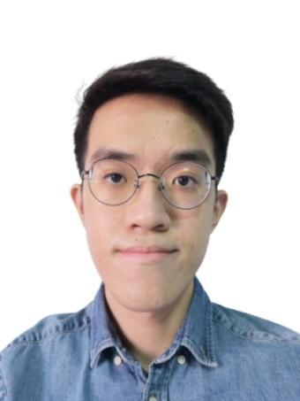

We are a team based in the [School of Computing, National University of Singapore](http://www.comp.nus.edu.sg).

You can reach us at the email `seer[at]comp.nus.edu.sg`

## Project team

### Shan Hng

[[github](https://github.com/shanhng)]
[[portfolio](team/shanhng.md)]

* Role: UI Developer
* Responsibilities: 
  * Implementation of Features `calendar`
  * Created UI components
  * Managing Developer Guide related edits

### Branson Lam

[[github](http://github.com/bransonlj)]
[[portfolio](team/bransonlj.md)]

* Role: Developer 
* Responsibilities:
  * Implementation of Features `stats` and `edit`
  * Fixing feature bugs and add test cases 

### Anshumaan Tyagi

[[github](http://github.com/anshumaantgi)] [[portfolio](team/anshumaantgi.md)]

* Role: Developer
* Responsibilities:
  * Implementation of Features `event add` and `event delete`
  * Fixing feature bugs and add test cases 

### Karen Lam

[[github](https://github.com/Karen-Lam)]
[[portfolio](team/karen-lam.md)]

* Role: Developer
* Responsibilities:
  * Implementation of Features `list`, `clash` and saving of data
  * Managing User Guide related edits

### Sarthak Saxena

[[github](http://github.com/sarthak181)]
[[portfolio](team/sarthak181.md)]

* Role: Developer
* Responsibilities: 
  * Implementation of Features `find` and `event find`
  * Managing Developer Guide related edits and add test cases 
