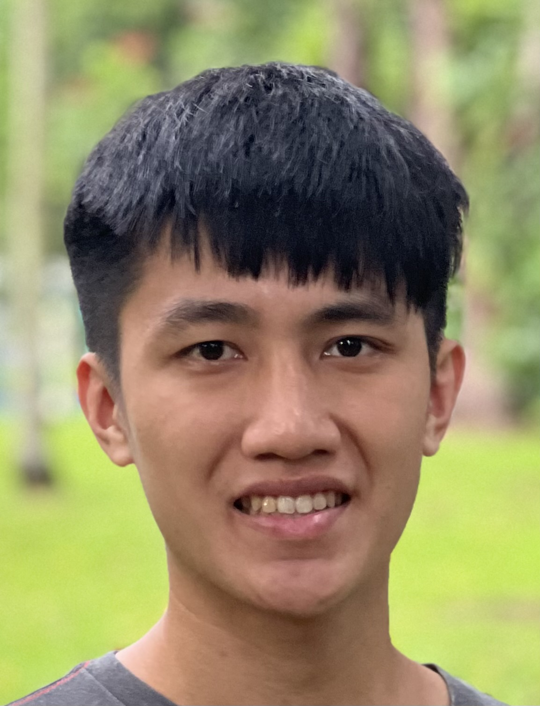

We are a team based in the [School of Computing, National University of Singapore](http://www.comp.nus.edu.sg).

## Project team

### Jarrett Teo

[[github](https://github.com/Jarrett0203)]
[[portfolio](team/jarrett0203.md)]

* Role: Developer
* Responsibilities: Team Lead

### Glen Lim

[[github](http://github.com/glyfy)]
[[portfolio](team/glyfy.md)]

* Role: Developer
* Responsibilities: UI

### Kenz Antonius

[[github](http://github.com/kenzantonius)]
[[portfolio](team/kenzantonius.md)]

* Role: Developer
* Responsibilities: Data

### Sanjevi Ravi

[[github](http://github.com/sanjevi13)]
[[portfolio](team/sanjevi13.md)]

* Role: Developer
* Responsibilities: Testing

### Kynhan Tang

[[github](http://github.com/kynhan)]
[[portfolio](team/kynhan.md)]

* Role: Developer
* Responsibilities: Integration
