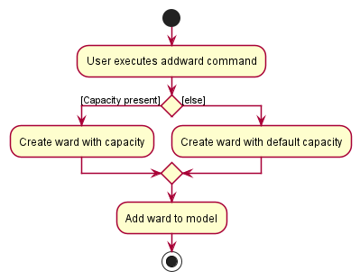

**MedInfo** is a desktop application that empowers clinics and hopitals  to manage their patients.

This Developer Guide provides an in-depth documentation on how **MedInfo** is designed and implemented.
It covers the architecture of **MedInfo** and provides detailed descriptions regarding the implementation design.

You can use this guide to maintain, upgrade, and evolve **MedInfo**.

## Table of contents

* [Acknowledgements](#acknowledgements)
* [Getting Started](#setting-up-getting-started)
* [Design](#design)
    * [Architecture](#architecture)
    * [UI](#ui-component)
    * [Logic](#logic-component)
    * [Model](#model-component)
    * [Storage](#storage-component)
    * [Common Classes](#common-classes)
* [Implementation](#implementation)
    * [Add Patients Feature](#adding-a-patient)
    * [Add Wards Feature](#adding-a-ward)
    * [Edit Patients Feature](#editing-a-patient)
    * [Delete Patients Feature](#deleting-a-patient)
    * [Find Patients Feature](#finding-patients)
    * [List Patients Feature](#list-all-patients)
    * [[Proposed] Undo Redo Feature](#proposed-undoredo-feature)
    * [[Proposed] Data Archiving](#proposed-data-archiving)
* [Appendix: Requirements](#appendix-requirements)
    * [Target User Profile](#target-user-profile)
    * [Value Proposition](#value-proposition)
    * [User Stories](#user-stories)
    * [Use Cases](#use-cases)
        * [Use case: **add a patient**](#use-case-uc01---add-a-patient)
        * [Use case: **delete a patient**](#use-case-uc02---delete-a-patient)
        * [Use case: **edit a patient**](#use-case-uc03---edit-a-patient)
        * [Use case: **find a patient**](#use-case-uc04---find-a-patient)
        * [Use case: **clear all patients**](#use-case-uc05---clear-all-patients)
        * [Use case: **add a ward**](#use-case-uc06---add-a-new-ward)
        * [Use case: **delete a ward**](#use-case-uc07---delete-a-ward)
        * [Use case: **sort patients**](#use-case-uc08---sort-patients)
    * [Non-Functional Requirement](#non-functional-requirements)
    * [Glossary](#glossary)
* [Appendix: Instructions for Manual Testing ](#appendix-instructions-for-manual-testing)
  * [**Launch and shutdown**](#launch-and-shutdown)
  * [**Delete a patient**](#delete-a-patient)
  * [**Save data**](#save-data)
* [Appendix: Planned Enhancements](#appendix-planned-enhancements)

---

## Acknowledgements

- {list here sources of all reused/adapted ideas, code, documentation, and third-party libraries -- include links to the original source as well}

---

## Setting up, getting started

Refer to the guide [_Setting up and getting started_](SettingUp.md).

---

## Design

:bulb: **Tip:** The `.puml` files used to create diagrams in this document can be found in the [diagrams](https://github.com/se-edu/addressbook-level3/tree/master/docs/diagrams/) folder. Refer to the [_PlantUML Tutorial_ at se-edu/guides](https://se-education.org/guides/tutorials/plantUml.html) to learn how to create and edit diagrams.

### Architecture

The **_Architecture Diagram_** given above explains the high-level design of the App.

Given below is a quick overview of main components and how they interact with each other.

**Main components of the architecture**

**`Main`** has two classes called [`Main`](https://github.com/se-edu/addressbook-level3/tree/master/src/main/java/seedu/address/Main.java) and [`MainApp`](https://github.com/se-edu/addressbook-level3/tree/master/src/main/java/seedu/address/MainApp.java). It is responsible for,

- At app launch: Initializes the components in the correct sequence, and connects them up with each other.
- At shut down: Shuts down the components and invokes cleanup methods where necessary.

[**`Commons`**](#common-classes) represents a collection of classes used by multiple other components.

The rest of the App consists of four components.

- [**`UI`**](#ui-component): The UI of the App.
- [**`Logic`**](#logic-component): The command executor.
- [**`Model`**](#model-component): Holds the data of the App in memory.
- [**`Storage`**](#storage-component): Reads data from, and writes data to, the hard disk.

**How the architecture components interact with each other**

The _Sequence Diagram_ below shows how the components interact with each other for the scenario where the user issues the command `delete 1`.

Each of the four main components (also shown in the diagram above),

- defines its _API_ in an `interface` with the same name as the Component.
- implements its functionality using a concrete `{Component Name}Manager` class (which follows the corresponding API `interface` mentioned in the previous point.)

For example, the `Logic` component defines its API in the `Logic.java` interface and implements its functionality using the `LogicManager.java` class which follows the `Logic` interface. Other components interact with a given component through its interface rather than the concrete class (reason: to prevent outside component's being coupled to the implementation of a component), as illustrated in the (partial) class diagram below.

The sections below give more details of each component.

### UI component

The **API** of this component is specified in [`Ui.java`](https://github.com/se-edu/addressbook-level3/tree/master/src/main/java/seedu/address/ui/Ui.java)

The UI consists of a `MainWindow` that is made up of parts e.g.`CommandBox`, `ResultDisplay`, `PersonListPanel`, `StatusBarFooter` etc. All these, including the `MainWindow`, inherit from the abstract `UiPart` class which captures the commonalities between classes that represent parts of the visible GUI.

The `UI` component uses the JavaFx UI framework. The layout of these UI parts are defined in matching `.fxml` files that are in the `src/main/resources/view` folder. For example, the layout of the [`MainWindow`](https://github.com/se-edu/addressbook-level3/tree/master/src/main/java/seedu/address/ui/MainWindow.java) is specified in [`MainWindow.fxml`](https://github.com/se-edu/addressbook-level3/tree/master/src/main/resources/view/MainWindow.fxml)

The `UI` component,

- executes user commands using the `Logic` component.
- listens for changes to `Model` data so that the UI can be updated with the modified data.
- keeps a reference to the `Logic` component, because the `UI` relies on the `Logic` to execute commands.
- depends on some classes in the `Model` component, as it displays `Person` object residing in the `Model`.

### Logic component

**API** : [`Logic.java`](https://github.com/se-edu/addressbook-level3/tree/master/src/main/java/seedu/address/logic/Logic.java)

Here's a (partial) class diagram of the `Logic` component:

How the `Logic` component works:

1. When `Logic` is called upon to execute a command, it uses the `MedInfoParser` class to parse the user command.
1. This results in a `Command` object (more precisely, an object of one of its subclasses e.g., `AddCommand`) which is executed by the `LogicManager`.
1. The command can communicate with the `Model` when it is executed (e.g. to add a patient).
1. The result of the command executzion is encapsulated as a `CommandResult` object which is returned back from `Logic`.

The Sequence Diagram below illustrates the interactions within the `Logic` component for the `execute("delete 1")` API call.

:information_source: **Note:** The lifeline for `DeleteCommandParser` should end at the destroy marker (X) but due to a limitation of PlantUML, the lifeline reaches the end of diagram.

Here are the other classes in `Logic` (omitted from the class diagram above) that are used for parsing a user command:

How the parsing works:

- When called upon to parse a user command, the `MedInfoParser` class creates an `XYZCommandParser` (`XYZ` is a placeholder for the specific command name e.g., `AddCommandParser`) which uses the other classes shown above to parse the user command and create a `XYZCommand` object (e.g., `AddCommand`) which the `MedInfoParser` returns back as a `Command` object.
- All `XYZCommandParser` classes (e.g., `AddCommandParser`, `DeleteCommandParser`, ...) inherit from the `Parser` interface so that they can be treated similarly where possible e.g, during testing.

### Model component

**API** : [`Model.java`](https://github.com/se-edu/addressbook-level3/tree/master/src/main/java/seedu/address/model/Model.java)

The `Model` component,

- stores the address book data i.e., all `Person` objects (which are contained in a `UniquePersonList` object).
- stores the currently 'selected' `Person` objects (e.g., results of a search query) as a separate _filtered_ list which is exposed to outsiders as an unmodifiable `ObservableList<Person>` that can be 'observed' e.g. the UI can be bound to this list so that the UI automatically updates when the data in the list change.
- stores a `UserPref` object that represents the user’s preferences. This is exposed to the outside as a `ReadOnlyUserPref` objects.
- does not depend on any of the other three components (as the `Model` represents data entities of the domain, they should make sense on their own without depending on other components)

### Storage component

**API** : [`Storage.java`](https://github.com/se-edu/addressbook-level3/tree/master/src/main/java/seedu/address/storage/Storage.java)

The `Storage` component,

- can save both address book data and user preference data in json format, and read them back into corresponding objects.
- inherits from both `MedInfoStorage` and `UserPrefStorage`, which means it can be treated as either one (if only the functionality of only one is needed).
- depends on some classes in the `Model` component (because the `Storage` component's job is to save/retrieve objects that belong to the `Model`)

### Common classes

Classes used by multiple components are in the `seedu.medinfo.commons` package.

---

## **Implementation**

This section describes some noteworthy details on how certain features are implemented in MedInfo.

### Adding a patient
In MedInfo, a user can add a patient using the `add` command.
#### Implementation
- The `add` command takes in 2 compulsory fields (name and NRIC) and 1 optional field (status)
- It is supported by the `AddCommandParser` that extracts the relevant fields from the entered command.

The following activity diagram summarizes what happens when a user enters an `add` command:

Details:
- The user enters an `add` command with the name and NRIC specified.
- If the user entered a `Status` (prefixed by `s/`), the patient created will have that status.
- The created patient is added to the model.

### Adding a ward
In MedInfo, a user can add a patient using the `addward` command.
#### Implementation
- The `add` command takes in 1 compulsory field (ward name) and 1 optional field (capacity)
- It is supported by the `AddWardCommandParser` that extracts the relevant fields from the entered command.

The following activity diagram summarizes what happens when a user enters an `addward` command:

Details:
- The user enters an `addward` command with the ward name specified.
- If the user entered a `Capacity` (prefixed by `c/`), the ward created will have that capacity.
- The created ward is added to the model.

### Editing a patient
In MedInfo, a user can edit a patient using the `edit` command.
#### Implementation
- The `edit` command takes in 1 compulsory argument (index) and up to 3 optional fields (status, ward and discharge date).
- It is supported by the `EditCommandParser` that extracts the relevant fields from the entered command.

The following activity diagram summarizes what happens when a user enters an `edit` command:

Details:
- The index is based on the last displayed list of patients. This design choice was made as:
  - A user would most likely perform a `find` or `list` operation to confirm the patient to edit.
  - Finding patient by NRIC would be too cumbersome for the user.
- Name and NRIC are not editable as these are identifying fields of a patient.

### Deleting a patient
In MedInfo, a user can edit a patient using the `delete` command.
#### Implementation
- The `delete` command takes in 1 compulsory argument (index).
- It is supported by the `DeleteCommandParser` that extracts the index from the entered command.

The following activity diagram summarizes what happens when a user enters a `delete` command:

Details:
- When a user executes this command, they are greeted with an alert window to confirm deletion.
  - Clicking 'OK' at this point will let MedInfo proceed with the deletion.
  - Clicking 'Cancel' or closing the window will abort the deletion and trigger a `list` operation.
- Aborting a deletion leads to a `list` operation so that the user can view all patients.
- The index is based on the last displayed list of patients. This design choice was made as:
    - A user would most likely perform a `find` or `list` operation to confirm the patient to delete.
    - Finding patient by NRIC would be too cumbersome for the user.

### Finding patients
In MedInfo, a user can find patients matching certain conditions using the `find` command.
#### Implementation
- The `find` command takes in 1 compulsory field (one of either name, NRIC or status).
- It is supported by the `FindCommandParser` which extracts one of the possible fields:
  - Name entered in the command (prefixed by `name/`)
  - NRIC entered in the command (prefixed by `nric/`)
  - Status entered in the command (prefixed by `s/`)
- If the user enters multiple fields, MedInfo highlights the error to the user.

The following activity diagram summarizes what happens when a user enters a `find` command:

### List all patients
In MedInfo, a user can list all patients using the `list` command.
#### Implementation
- The `list` command does not take in any arguments.

The following activity diagram summarizes what happens when a user enters a `find` command:

### \[Proposed\] Data archiving

_{Explain here how the data archiving feature will be implemented}_

---

## **Documentation, logging, testing, configuration, dev-ops**

- [Documentation guide](Documentation.md)
- [Testing guide](Testing.md)
- [Logging guide](Logging.md)
- [Configuration guide](Configuration.md)
- [DevOps guide](DevOps.md)

---

## **Appendix: Requirements**

### Target user profile

- has a need to manage a significant number of patients coming into an A&E in a private hospital
- can type fast
- prefers typing to execute commands and allocating patients by their status to their respective wards
- is reasonably comfortable using CLI apps

### Value proposition

- solve the problem of slow and multiple step process of allocating patients to their respective wards in an A&E
- provide faster access to a particular patient’s details for hospital admin staff
- provide a more efficient process of managing patients by their status to cater to patients who are in urgent need of care, which in turn provides a better quality of service
- provide a simple system to keep track and update a patient's discharge date

### User stories

Priorities: High (must have) - `* * *`, Medium (nice to have) - `* *`, Low (unlikely to have) - `*`

| Priority | As a …​      | I want to …​                                       | So that I can…​                                                                             |
|----------|--------------|----------------------------------------------------|---------------------------------------------------------------------------------------------|
| `* * *`  | staff member | add a patient                                      | record more information later                                                               |
| `* * *`  | staff member | add a ward                                         | assign patients to the ward later                                                           |
| `* * *`  | staff member | add personal particulars to a patient              | record their name and NRIC                                                                  |
| `* * *`  | staff member | add current status of patient                      | keep track of patient status                                                                |
| `* * *`  | staff member | add current ward of patient                        | keep track of patient location                                                              |
| `* * *`  | staff member | add a discharge date to hospitalised patients      | keep track of discharge dates                                                               |
| `* * *`  | staff member | view the list of commands                          | use the system proficiently                                                                 |
| `* * *`  | staff member | search for patients by personal particulars        | do a basic search to find a certain patient                                                 |
| `* * *`  | staff member | search for patients by discharge date              | plan for future patient discharges                                                          |
| `* * *`  | staff member | update personal particulars of a patient           | keep the personal particulars of a patient up to date                                       |
| `* * *`  | staff member | update patient ward                                | move patients to different wards                                                            |
| `* * *`  | staff member | update the status of a patient                     | keep the status of a patient up to date                                                     |
| `* * *`  | staff member | update the discharge date of hospitalised patients | change the discharge date of a hospitalised patient due to unexpected medical complications |
| `* * *`  | staff member | remove a patient                                   | put the patient on hold or remove duplicate entries                                         |
| `* * *`  | staff member | remove the discharge date of a patient             | put the patient's discharge date on hold while awaiting further assessment                  |
| `* *`    | staff member | view the list of patients sorted by discharge date | plan for future patient discharges                                                          |
| `* *`    | staff member | see patients with approaching discharge dates      | be aware of approaching discharge patients                                                  |
| `* *`    | staff member | view patients by ward                              | find patients in a ward and check the occupancy within certain wards                        |
| `* *`    | staff member | view patients by status                            | address higher priority patients more quickly                                               |
| `* *`    | staff member | view list of wards                                 | see current wards in system at a glance                                                     |
| `* *`    | staff member | view list of patients                              | see current patients in system at a glance                                                  |
| `* *`    | staff member | update the name of a ward                          | keep the name of a ward up to date                                                          |
| `* *`    | staff member | update the capacity of a ward                      | keep the maximum number of patients in a ward up to date                                    |
| `* *`    | staff member | view the current total occupancy                   | see the total number of patients currently admitted                                         |
| `* *`    | staff member | view the total capacity of a ward                  | see the maximum number of patients I can admit to this ward                                 |
| `* *`    | staff member | view the current occupancy of a ward               | see the number of patients currently admitted to a ward, and to know if a ward is full      |
| `* *`    | staff member | confirm a deletion of a patient                    | avoid accidentally deleting a patient, which cannot be undone                               |

_{More to be added}_

### Use cases

(For all use cases below, the **System** is the `MedInfo` and the **Actor** is the `user`, unless specified otherwise)

#### Use case: UC01 - Add a patient

**MSS**

1. User requests to add a new patient to MedInfo.
2. The user enters patient details.
   1. The following are required information:
      - Name
      - NRIC
   2. The following are non-required information:
      - Status
      - Ward
3. The system adds the user into the MedInfo system.
4. The system shows the new created user in the patient list.

   Use case ends.

**Extensions**

- 2a. If any of the required fields are not completed.

  - 2a1. the user is informed of this and show the correct format for the command

Use case resumes at step 2.

- 2b. If the entered NRIC is already present in another record in the system.

  - 2b1. the user is informed that the NRIC is already present in the system.

  Use case resumes at step 2.

- 2c. If the input field is invalid.

  - 2c1. the user is informed of this, and correct format for the command is displayed.

  Use case resumes at step 2.

- 2d. If the entered ward is not present in the system.

  - 2d1. the user is informed that the ward does not exist in the system.

  Use case resumes at step 2.

#### Use case: UC02 - Delete a patient

**MSS**

1.  User requests to list filtered patients
2.  MedInfo shows a list of filtered patients
3.  User requests to delete a specific patient in the list by index number
4.  MedInfo shows confirmation window
5.  MedInfo deletes the patient

    Use case ends.

**Extensions**

- 2a. The list is empty.

  Use case ends.

- 3a. The requested patient's index number is invalid.

    - 3a1. MedInfo shows an error message.

      Use case resumes at step 2.

- 4a. The user cancels the deletion in the confirmation window

    - 4a1. MedInfo shows the patient list

  - 4b1. MedInfo shows an error message.

    Use case resumes at step 2.

#### Use case: UC03 - Edit a patient

**MSS**

1.  User requests to list filtered patients
2.  MedInfo shows a list of filtered patients
3.  User requests to edit a specific patient in the list by index number
    1. The following can be edited:
       - Status
       - Ward
       - Discharge Date
    2. The following cannot be edited:
       - Name
       - NRIC
4.  MedInfo edits the patient

    Use case ends.

**Extensions**

- 2a. The list is empty.

  Use case ends.

- 3a. The requested patient's index number is invalid.

  - 3a1. MedInfo shows an error message.

    Use case resumes at step 2.

- 3b. The prefixes entered are invalid.

    - 3b1. MedInfo shows an error message.

      Use case resumes at step 2.

- 3b. The Status entered is invalid.

    - 3b1. MedInfo shows an error message.

      Use case resumes at step 2.

- 3b. The Ward entered is invalid.

    - 3b1. MedInfo shows an error message.

      Use case resumes at step 2.

- 3b. The Discharge Date entered is invalid.

    - 3b1. MedInfo shows an error message.

      Use case resumes at step 2.

- 3d. User tries to edit a non-editable field (Name/NRIC).

  - 3d1. MedInfo shows an error message.

    Use case resumes at step 2.

#### Use case: UC04 - Find a patient

**MSS**

1.  User requests to find specific patients by either NRIC or Name or Status or Ward
2.  MedInfo shows a list of patients

    Use case ends.

**Extensions**

- 1a. The requested patient's NRIC does not exist in the system.

  - 1a1. MedInfo does not list any patients.

    Use case ends.

- 1b. The requested patient's Name does not exist in the system.

  - 1b1. MedInfo does not list any patients.

    Use case ends.

- 1c. The requested patient's Status does not exist in the system.

  - 1c1. MedInfo does not list any patients.

    Use case ends.

- 1d. The requested patient's Ward does not exist in the system.

- 1d1. MedInfo does not list any patients.

  Use case ends.

#### Use case: UC05 - Clear all patients

**MSS**

1. User requests to clear all the patient records in the system
2. MedInfo shows confirmation window
3. MedInfo deletes all patients in the system

    Use case ends.

- 3a. The user cancels the deletion in the confirmation window
    - 3a1. MedInfo shows the patient list

#### Use case: UC06 - Add a new ward

**MSS**

1. User requests to add a new ward to MedInfo.
2. The user enters ward details.
    1. The following are required information:
        - Name
    2. The following are non-required information:
        - Capacity
3. The system adds the ward into the MedInfo system.
4. The system shows the new created ward in the ward list.

   Use case ends.

**Extensions**
* 2a. If any of the required fields are not completed.

    * 2a1. the user is informed of this and show the correct format for the command

Use case resumes at step 2.

* 2b. If the entered Name is already present in another record in the system.

    * 2b1. the user is informed that the Name is already present in the system.

  Use case resumes at step 2.

* 2c. If the input field is invalid.

    * 2c1. the user is informed of this, and correct format for the command is displayed.

  Use case resumes at step 2.

#### Use case: UC07 - Delete a ward

**MSS**

1.  User requests to list wards
2.  MedInfo shows a list of wards
3.  User requests to delete a specific ward in the list by index number
4.  MedInfo shows confirmation window
5.  MedInfo deletes the patient

    Use case ends.

**Extensions**

- 2a. The ward list is empty.

  Use case ends.

- 3a. The requested ward's index number is invalid.

    - 3a1. MedInfo shows an error message.

      Use case resumes at step 2.

- 3b. The requested ward has patients inside

   - 3b1. MedInfo shows an error message.

    Use case resumes at step 2.

- 4a. The user cancels the deletion in the confirmation window
    - 4a1. MedInfo shows the patient list

      Use case resumes at step 2

#### Use case: UC08 - Sort Patients

**MSS**

1. User requests to list patients
2. MedInfo shows a list of patients
3. User requests to sort all the patients by a specific order
4. MedInfo sorts all the patients
5. MedInfo displays the sorted list

    Use case ends

**Extensions**

- 2. The patient list is empty

    Use case ends.
- 3a. The requested sorting order is invalid
  - 3a1. MedInfo shows an error message.

    Use case resumes at step 2.

- 3b. The requested sorting field is invalid
    - 3b1. MedInfo shows an error message.

      Use case resumes at step 2.

_{More to be added}_

### Non-Functional Requirements

1.  Should work on any _mainstream OS_ as long as it has Java `11` or above installed.
2.  Should be able to hold up to 1000 patients without a noticeable sluggishness in performance for typical usage.
3.  A user with above average typing speed for regular English text (i.e. not code, not system admin commands) should be able to accomplish most of the tasks faster using commands than using the mouse.
4.  Should mask the NRIC of patients when listing (e.g. XXXXX264G).
5.  The product is not required to validate the medical records.

_{More to be added}_

### Glossary

- **Mainstream OS**: Windows, Linux, Unix, OS-X
- **CLI**:  Command Line Interface
- **Use case**: It describes an interaction between the user and the system for a specific functionality of the system.
- **Priority Level**: Level of seriousness of a patient's health condition (e.g. `Stable`, `Mild`, `Severe`)
- **Medical Record**: Blood type, allergies, medical cases and history of medical conditions

_{More to be added}_

---

## **Appendix: Instructions for manual testing**

Given below are instructions to test the app manually.

:information_source: **Note:** These instructions only provide a starting point for testers to work on;
testers are expected to do more *exploratory* testing.

### Launch and shutdown

1. Initial launch

   1. Download the jar file and copy into an empty folder

   2. Double-click the jar file Expected: Shows the GUI with a set of sample contacts. The window size may not be optimum.

2. Saving window preferences

   1. Resize the window to an optimum size. Move the window to a different location. Close the window.

   2. Re-launch the app by double-clicking the jar file. 
      Expected: The most recent window size and location is retained.

3. _{ more test cases …​ }_

### Delete a patient

1. Deleting a patient while all patients are being shown

   1. Prerequisites: List all patients using the `list` command. Multiple patients in the list.

   2. Test case: `delete 1` 
      Expected: First contact is deleted from the list. Details of the deleted contact shown in the status message. Timestamp in the status bar is updated.

   3. Test case: `delete 0` 
      Expected: No patient is deleted. Error details shown in the status message. Status bar remains the same.

   4. Other incorrect delete commands to try: `delete`, `delete x`, `...` (where x is larger than the list size) 
      Expected: Similar to previous.

2. _{ more test cases …​ }_

### Save data

1. Dealing with missing/corrupted data files

   1. _{explain how to simulate a missing/corrupted file, and the expected behavior}_

2. _{ more test cases …​ }_

---

## **Appendix: Planned Enhancements**

Given below are a few enhancements we hope to bring into future iterations of MedInfo:

### Date-time validation:
Currently, MedInfo allows the user to input dates in the past (e.g.`01/01/1000 1000`). While there may be reason to
input past date-times, such as if the user forgot to enter dates previously, MedInfo is meant to be a **current**
patient tracking system. As such, inputting dates from the past would not make sense as the patients would have been
discharged already (and hence have no reason to be recorded in MedInfo).

Possible Implementation:
- This could be implemented by adding a method in `Discharge.java` to check if a given date is a valid future
discharge date (by comparing to the current date)
- The method created above would then be called within `parseDischarge()` in `ParserUtil.java` to ensure that a
valid future discharge date-time was entered

### Strict NRIC validation:
Currently, MedInfo checks whether a valid NRIC has been entered based on a validaton regex within
`Nric.java` (`^[STFG]\d{7}[A-Z]$`). This regex restricts the NRIC to be a capital letter (either
S/F/T/G) followed by 7 numbers and a capital letter. True valid NRICs make use of stronger validation
logic, involving check digits. Such validation would need to be added before using MedInfo in a
real-life scenario. However, due to the constraints it would place on testing during development,
it shall be implemented in the future instead.

### UI component behaviour on window resizing
On resizing, the status bar maintains its centered location as from the full-size window. As a result,
the information in it gets truncated. As this information is critical, future enhancements should address this, and
other UI components that get cut off on window resizing.

Possible implementations:
- adjusting padding
- setting position constraint
- setting a higher minimum window width

### Multiple parameter search
Currently, MedInfo only allows finding patients by **onw** of four parameters:
1. name (`name/`)
2. NRIC (`nric/`)
3. status (`s/`)
4. ward name (`w/`)

The `find` command does not allow multiple parameters to be used at once. For example, attempting to find critical
patients in ward 'ER1' with the command `find s/red w/ER1` would result in an error. However, as a hospital
staff, finding patients matching multiple criteria is a valid use-case. Hence, this is planned as a future enhancement.

### Find by ward
Currently, the `find` command in MedInfo finds patients by wards as it does patients by name, i.e. by displaying
all patients that match any of the keywords supplied. As a result, the logic is slightly flawed. Consider the
scenario of trying to find patients in a ward named 'Class A', when the other wards in the system include 'Class B'
and 'Class C'. Entering `find w/Class A` would also display patients in the other 2 wards due to the common keyword
'Class'. This should be addressed in future iterations of MedInfo by making the `find` command match ward name
exactly.

### Handling long names
Currently, long names are truncated (with `...`) once they go past the maximum displayable length. This makes it
impossible to get long patient names after entry into the system. This would need to be addressed in the future.

Possible implementation:
- limit name input to 40 characters: While simple to implement (change validation regex in `Name.java` to
`[\\p{Alnum}][\\p{Alnum} ]{0,39}`, it is not recommended, as it does not handle the case of patients with names
longer than 40 characters
- text wrapping to display the whole name within the patient card in the UI

### Expand `help` command
Currently, entering the `help` command in MedInfo opens a small dialog box with a link to MedInfo's website. While
the user can read the user guide from the website to learn how to use the commands, perhaps a quick command summary
could be added to this window for returning users who do not wish to open the website but just need a quick refresher
on the commands.

Possible implementation:
- add command summary in text to help window display
