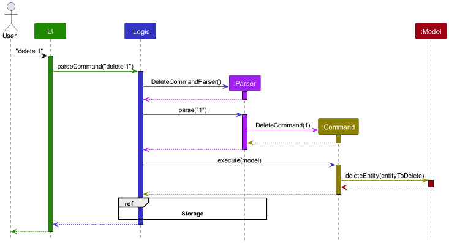
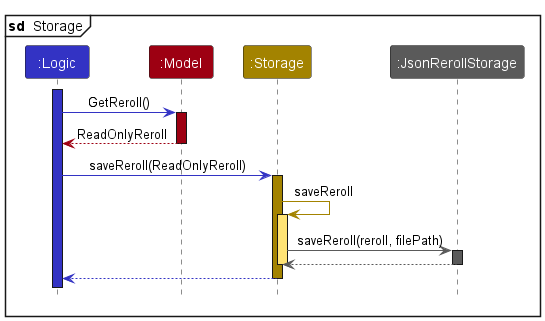
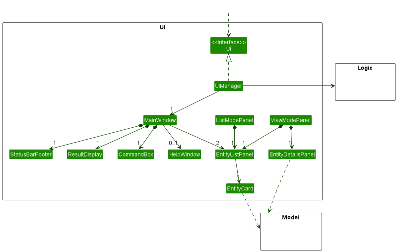
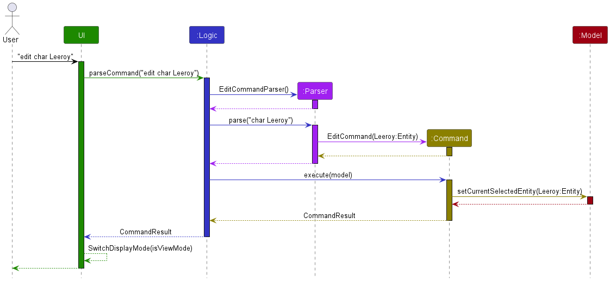
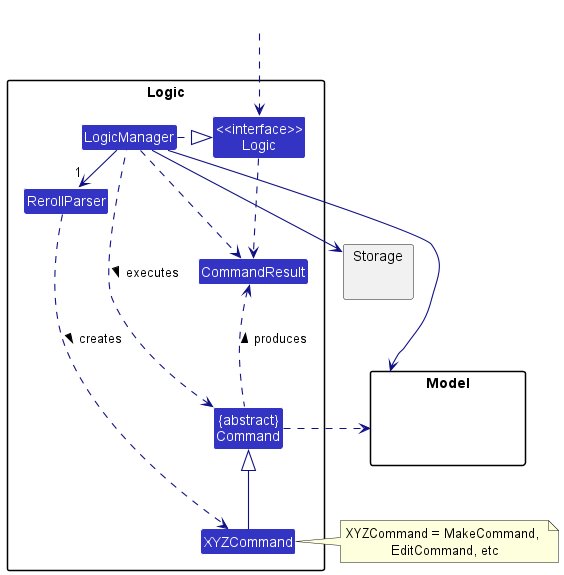
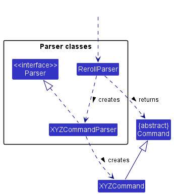
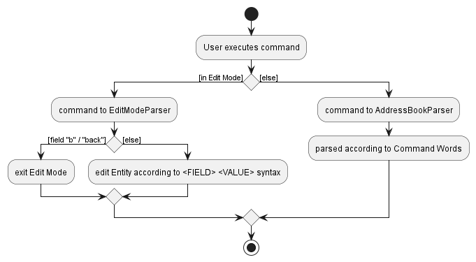
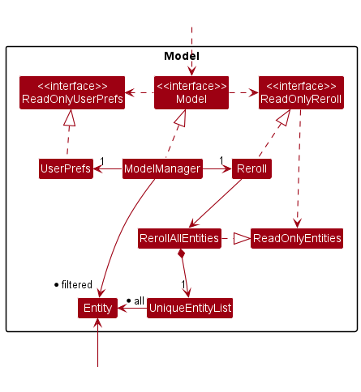
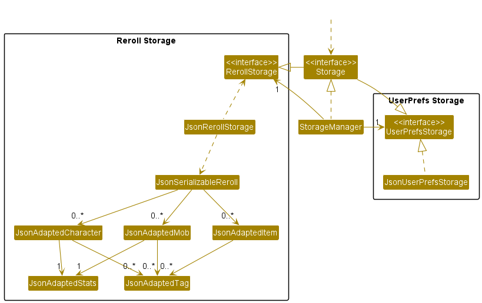
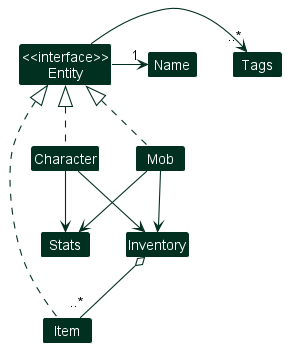

 

  
<h3 align="center">TTRPG Entity Management Solution</h3>
  

    An all-in-one developer's guide to Reroll!
     
    <a href="https://nus-cs2103-ay2223s2.github.io/tp/"><strong>Explore the docs »</strong></a>
     
    <a href="https://github.com/AY2223S2-CS2103T-T15-1/tp/blob/master/docs/AboutUs.md">Meet the Team</a>
     
    🎉 Version 1.4 is out! Check out the latest release
    <a href="https://github.com/AY2223S2-CS2103T-T15-1/tp/releases/">here</a>.
     
     
    
    
    
  

* Table of Contents {:toc}

--------------------------------------------------------------------------------------------------------------------

## **Acknowledgements**

* {list here sources of all reused/adapted ideas, code, documentation, and third-party libraries -- include links to the
  original source as well}

--------------------------------------------------------------------------------------------------------------------

## **Setting up, getting started**

Refer to the guide [_Setting up and getting started_](SettingUp.md).

--------------------------------------------------------------------------------------------------------------------

### Architecture

The ***Architecture Diagram*** given above explains the high-level design of the App.

Given below is a quick overview of main components and how they interact with each other.

**Main components of the architecture**

**`Main`** has two classes
called [`Main`](https://github.com/AY2223S2-q-T15-1/tp/blob/master/src/main/java/seedu/address/Main.java)
and [`MainApp`](https://github.com/AY2223S2-q-T15-1/tp/blob/master/src/main/java/seedu/address/MainApp.java). It
is responsible for,

* At app launch: Initializes the components in the correct sequence, and connects them up with each other.
* At shut down: Shuts down the components and invokes cleanup methods where necessary.

[**`Commons`**](#common-classes) represents a collection of classes used by multiple other components.

The rest of the App consists of four components.

* [**`UI`**](#ui-component): The UI of the App.
* [**`Logic`**](#logic-component): The command executor.
* [**`Model`**](#model-component): Holds the data of the App in memory.
* [**`Storage`**](#storage-component): Reads data from, and writes data to, the hard disk.

**How the architecture components interact with each other**

The *Sequence Diagram* below shows how the components interact with each other for the scenario where the user issues
the command `list`.

Each of the main components (also shown in the diagram above),

* defines its *API* in an `interface` with the same name as the Component.
* implements its functionality using a concrete `{Component Name}Manager` class (which follows the corresponding
  API `interface` mentioned in the previous point.

For example, the `Logic` component defines its API in the `Logic.java` interface and implements its functionality using
the `LogicManager.java` class which follows the `Logic` interface. Other components interact with a given component
through its interface rather than the concrete class (reason: to prevent outside component's being coupled to the
implementation of a component), as illustrated in the (partial) class diagram below.

The sections below give more details of each component.

### UI component

The **API** of this component is specified
in [`Ui.java`](https://github.com/AY2223S2-q-T15-1/tp/blob/master/src/main/java/seedu/address/ui/Ui.java)

The UI consists of a `MainWindow` that is made up of parts e.g.`CommandBox`, `ResultDisplay`, `ViewModePanel`
, `EditModePanel`, `StatusBarFooter` etc. All these, including the `MainWindow`, inherit from the abstract `UiPart`
class which captures the commonalities between classes that represent parts of the visible GUI.

The `UI` component uses the JavaFx UI framework. The layout of these UI parts are defined in matching `.fxml` files that
are in the `src/main/resources/view` folder. For example, the layout of
the [`MainWindow`](https://github.com/AY2223S2-q-T15-1/tp/blob/master/src/main/java/seedu/address/ui/MainWindow.java)
is specified
in [`MainWindow.fxml`](https://github.com/AY2223S2-q-T15-1/tp/blob/master/src/main/resources/view/MainWindow.fxml)

The `UI` component,

* executes user commands using the `Logic` component.
* listens for changes to `Model` data so that the UI can be updated with the modified data.
* keeps a reference to the `Logic` component, because the `UI` relies on the `Logic` to execute commands.
* depends on some classes in the `Model` component, as it displays `Entity` objects residing in the `Model`.

The `ListModePanel` and `ViewModePanel` are UI elements that contain the necessary components to display the regular
operating mode and the view / edit mode of Reroll respectively. Upon being triggered by the appropriate
`CommandResult`, the `UI` switches modes through `SwitchUiMode`, unparenting the previous (`ListModePanel` by default),
and parenting the alternative panel to `MainWindow`.

This is to create a seamless transition for the user and to free up screen real estate when not in view / edit mode.
`ViewModePanel` contains a `EntityDetailsPanel`, which fetches entity data from `Model` after every command executed in
edit mode to ensure that the user is kept up to date with changes.

### Logic component

**
API** : [`Logic.java`](https://github.com/AY2223S2-q-T15-1/tp/blob/master/src/main/java/seedu/address/logic/Logic.java)

Here's a (partial) class diagram of the `Logic` component:

How the `Logic` component works:

1. When `Logic` is called upon to execute a command, it uses the `RerollParser` or `EditModeParser` class to parse
   the user command.
1. This results in a `Command` object (more precisely, an object of one of its subclasses e.g., `MakeCommand`) which is
   executed by the `LogicManager`.
1. The command can communicate with the `Model` when it is executed (e.g. to add a entity).
1. The result of the command execution is encapsulated as a `CommandResult` object which is returned back from `Logic`.

The Sequence Diagram below illustrates the interactions within the `Logic` component for the `execute("delete 1")` API
call.

:information_source: **Note:** The lifeline for `DeleteCommandParser` should end at the destroy marker (X) but due to a limitation of PlantUML, the lifeline reaches the end of diagram.

Here are the other classes in `Logic` (omitted from the class diagram above) that are used for parsing a user command:

How the parsing works:

* When called upon to parse a user command, the `RerollParser` class creates an `XYZCommandParser` (`XYZ` is a
  placeholder for the specific command name e.g., `MakeCommandParser`) which uses the other classes shown above to parse
  the user command and create a `XYZCommand` object (e.g., `MakeCommand`) which the `RerollParser` returns back as
  a `Command` object.
* All `XYZCommandParser` classes (e.g., `MakeCommandParser`, `DeleteCommandParser`, ...) inherit from the `Parser`
  interface so that they can be treated similarly where possible e.g, during testing.

`Logic` keeps a boolean `isInEditMode` as runtime state that determines which of `RerollParser`
and `EditModeParser`
to use for incoming commands. `EditModeParser` differs in that it treats all user input as a `EditValueCommand`, which
allows us to simplify the syntax for that command to simply `<FIELD> <VALUE>` as opposed to `<COMMAND> <FIELD> <VALUE>`.
This is done to smoothen the experience for the end user, who might need to edit many fields in a short period of time.

### Model component

**
API** : [`Model.java`](https://github.com/AY2223S2-q-T15-1/tp/blob/master/src/main/java/seedu/address/model/Model.java)

The `Model` component,

* stores Reroll data i.e., all `Entity` objects (which are contained in a `UniqueEntityList` object).
* stores the currently 'selected' `Entity` objects (e.g., results of a search query) as a separate _filtered_ list which
  is exposed to outsiders as an unmodifiable `ObservableList<Entity>` that can be 'observed' e.g. the UI can be bound to
  this list so that the UI automatically updates when the data in the list change.
* stores a `UserPref` object that represents the user’s preferences. This is exposed to the outside as
  a `ReadOnlyUserPref` objects.
* does not depend on any of the other three components (as the `Model` represents data entities of the domain, they
  should make sense on their own without depending on other components)

**Note:** `RerollAllEntities`, the class which stores all entities, is abstracted from `Reroll`, to support future
functionality outside of entity list manipulation.

### Storage component

**
API** : [`Storage.java`](https://github.com/AY2223S2-CS2103T-T15-1/tp/blob/master/src/main/java/seedu/address/storage/Storage.java)

The `Storage` component,

* can save both Reroll data and user preference data in json format, and read them back into corresponding objects.
* inherits from both `RerollStorage` and `UserPrefStorage`, which means it can be treated as either one (if only the
  functionality of only one is needed).
* depends on some classes in the `Model` component (because the `Storage` component's job is to save/retrieve objects
  that belong to the `Model`)

### Entities

In order to facilitate operations and management of various aspects of user data, we have split entities into 3 classes
implementing the `Entity` interface.

Each class holds their own the classification-specific fields while exposing the data for the `Ui` thru the interface
method `getFields`.

#### Inventory

Characters and Mobs in Reroll contain an `Inventory`, which can contain references to up to any number of `Item`s. Do
note that these `Item` are added to the inventory as a immutable copy of the item when the `inventory add` command is
used in edit mode.

### Common classes

Classes used by multiple components are in the `seedu.addressbook.commons` package.

--------------------------------------------------------------------------------------------------------------------

## **Implementation**

This section describes some noteworthy details on how certain features are implemented.

### Make Command Parsing

#### Design considerations

In Reroll, there are 3 different entity classes (`Character`, `Mob`, `Item`) that users can keep track of. Each class
has a set of unique fields to keep track of, resulting in a combined number of ~15 fields to keep track of. Thus, it is
important to minimize mental load on the user during the creation of new entities.

#### Alternative approaches

1. **Current design**: Minimal make command with new syntax \
   Sample command: `make char King Arthur` - makes a new Character that has the name _King Arthur_ \
   This approach only allows users to create an entity with a given name, all other fields can only be filled in using
   the `edit` command. This allows users to create entities quickly by eliminating the need to input prefixes.
2. Alternative: Reuse AB3 syntax, allow user to enter all fields at once \
   Sample command: `make char n/King Arthur str/10 dex/5 int/3 ...` - makes a new Character with all the specified
   fields\
   This approach allows users to create detailed entities with just one command. However, usage of prefixes such as `n/`
   increases the mental load on the user to keep track of all the different prefixes, and increases their chance of
   making mistakes while inputting commands.

_{more aspects and alternatives to be added}_

### \[Proposed\] Data archiving

_{Explain here how the data archiving feature will be implemented}_

--------------------------------------------------------------------------------------------------------------------

## **Documentation, logging, testing, configuration, dev-ops**

* [Documentation guide](Documentation.md)
* [Testing guide](Testing.md)
* [Logging guide](Logging.md)
* [Configuration guide](Configuration.md)
* [DevOps guide](DevOps.md)

--------------------------------------------------------------------------------------------------------------------

## **Appendix: Requirements**

### Product scope

**Target user profile**:

Our key target user group is Table-Top Role Playing Game(TTRPG) players looking for a powerful entity management system
for their gameplay.

The people in our user group who would benefit most from this product generally would have the following qualities:

* Need or struggle to store large repository of past ideas, including story, characters, monsters and items
* Type fast and prefer CLI
* Need inspiration for character, item and monster creation that a randomizer would help address

**Value proposition**:

Our product is a more expansive and well-organized system capable of managing TTRPG entities better than a traditional
pen and paper format.

### User stories

Priorities: High (must have) - `* * *`, Medium (nice to have) - `* *`, Low (unlikely to have) - `*`

| Priority | As a …​                 | I want to …​                                                                | So that I can…​                                                        |
|----------|-------------------------|-----------------------------------------------------------------------------|------------------------------------------------------------------------|
| `* * *`  | TTRPG facilitator       | add entity                                                                  | have entities                                                          |
| `* * *`  | TTRPG facilitator       | edit entity stats                                                           | update stats over time                                                 |
| `* * *`  | TTRPG facilitator       | delete entity                                                               | remove unwanted entities                                               |
| `* * *`  | TTRPG player            | save my character sheets                                                    | locate details of entities without having to go through the entire list |
| `* * *`  | TTRPG player            | hide private contact details                                                | minimize chance of someone else seeing them by accident                |
| `* * `   | new user                | get more help on commands                                                   | learn how to use the app                                               |
| `* *`    | TTRPG facilitator       | search for specific entities                                                | get details of a desired entity                                        |
| `* *`    | TTRPG facilitator       | sort and filter entity sheets by various tags and categories                | have easy access to similar entities                                   |
| `* *`    | TTRPG facilitator       | tag Creature and Character sheets                                           | organize entities into groups for easier locating                      |
| `* *`    | TTRPG facilitator       | track the effects of rests(restoration actions) on my players               | automate the process                                                   |
| `* *`    | TTRPG facilitator       | quickly refer to the instructions                                           | easily settle disputes in my players                                   |
| `* *`    | TTRPG facilitator       | design custom Scenario on the fly                                           | have easy reference to relevant entities                               |
| `* *`    | TTRPG player            | access the character templates                                              | have an idea of what is needed during character creation               |
| `* *`    | TTRPG player            | quickly create a character sheet myself and send it to the RPG facilitator  | allow the facilitator easy access to my character                      |
| `* *`    | TTRPG Scenario Designer | save ideas for various entities when they occur to me                       | have a store of ideas and WIP concepts                                 |
| `*`      | new user                | play around with sample data                                                | experience the features of the app                                     |
| `*`      | TTRPG facilitator       | import files created by others                                              | make use of entities others have created                               |
| `*`      | TTRPG facilitator       | input my dice rolls                                                         | automatically calculate roll effects                                   |
| `*`      | TTRPG facilitator       | use digital dice                                                            | do not rely on physical dice                                           |
| `*`      | TTRPG facilitator       | randomize stats of entities                                                 | generate different entities automatically                              |
| `*`      | TTRPG facilitator       | change the instructions sheet                                               | easily implement house rules                                           |
| `*`      | TTRPG facilitator       | organise DnD games digitally                                                | conduct a session without a physical venue                             |
| `*`      | TTRPG player            | import my character sheet from the TTRPG facilitator                        | have easy access to a usable character                                 |
| `*`      | TTRPG player            | read up on the character sheets my RPG facilitator has made in my own timev | refresh my memory easily                                               |
| `*`      | TTRPG player            | refresh my knowledge of game rules by reading the instructions              | play without an external copy of the rules                             |
| `*`      | TTRPG player            | view logs of the entities                                                   | keep up with history                                                   |
| `*`      | TTRPG player            | catch up on the story so far by referring to the stored storyline recaps    | keep up to date with the story                                         |
| `*`      | expert user             | enter short-form CLI commands                                               | so that I am more efficient                                            |
| `*`      | experienced designer    | export to .txt files                                                        | so that others can use my creations                                    |

The user stories are not limited to those in this list. More can be added in the future as new features are developed.

### Use cases

(For all use cases below, the **System** is the `Reroll` and the **Actor** is the `user`, unless specified otherwise)

**Use case: Edit an entity**

**MSS**

1. User request to enter edit mode for specified entity
2. Reroll enters edit mode
3. User requests to replace specified field with new value
4. Reroll edits the specified entity and display it

   Steps 3-4 are repeated for as many fields as required.
5. User exits edit mode

   Use case ends

**Extensions**

* 2a. The specifications of the entity are invalid
    * 2a1. Reroll shows an error message.

      Use case resumes at step 1
* 3a. The given fields are invalid
    * 3a.1 Reroll shows an error message and exits edit mode

      Use case resumes at step 1

**Use case: Add item to inventory of entity**

**MSS**

1. User request to enter edit mode for specified entity
2. Reroll enters edit mode
3. User request to add specified item
4. Reroll adds specified item to entity's inventory

   Use case ends

**Extensions**

* 2a. The specifications of the entity are invalid
    * 2a1. Reroll shows an error message.

      Use case resumes at step 1
* 3a. Item does not exist in Reroll
    * 3a1. Reroll shows an error message and exits edit mode

      Use case resumes at step 1

*{More to be added}*

### Non-Functional Requirements

1. Should work on any _mainstream OS_ as long as it has Java `11` or above installed.
2. Should be able to hold up to 500 _entities_ without a noticeable sluggishness in performance for typical usage.
3. A user with above average typing speed for regular English text (i.e. not code, not system admin commands) should be
   able to accomplish most of the tasks faster using commands than using the mouse.
4. The application is not required to be compatible with any existing tracking applications.
5. The application should be usable by new players not familiar with RPG trackers.

### Glossary

* **Mainstream OS**: Windows, Linux, Unix, OS-X
* **Entities**: General term for __characters__, _mobs_ and _items_
* **Characters**: Characters, typically humans, that are controlled by players participating in a table-top RPG game
* **Mobs**: Non-player characters (NPCS) that are typically monsters
* **Items**: Weapons, armor or tools that players can keep and use

--------------------------------------------------------------------------------------------------------------------

## **Appendix: Planned Enhancements**

Future enhancements are planned to improve Reroll.

1. Currently, fields such as weight, cost and challenge rating accepts negative values. Parser will be updated to detect
   such invalid values and print an error message.
2. More case-insensitive commands will be implemented. Currently [CLASSIFICATION] must be in lowercase to work, causing
   confusion among the testers.
3. Entities with very long name does not wrap in the GUI. Changes to GUI to remedy this is expected.
4. The current error message for a failed `delete` command is too general. We plan to tweak this
   to mention whether it was an incorrect format, invalid `Classification` or `Name` that caused the failure.

--------------------------------------

## **Appendix: Instructions for manual testing**

Given below are instructions to test the app manually.

:information_source: **Note:** These instructions only provide a starting point for testers to work on;
testers are expected to do more *exploratory* testing.

### Launch and shutdown

1. Initial launch

    1. Download the jar file and copy into an empty folder

    2. Double-click the jar file Expected: Shows the GUI with a set of sample entities. The window size may not be optimum.

2. Saving window preferences

    1. Resize the window to an optimum size. Move the window to a different location. Close the window.

    2. Re-launch the app by double-clicking the jar file. 
       Expected: The most recent window size and location is retained.

3. _{ more test cases …​ }_

### Deleting a entity

1. Deleting a entity while all entities are being shown

    1. Prerequisites: List all entities using the `list` command. Multiple entities in the list.

    2. Test case: `delete char Leeroy` 
       Expected: Character named Leeroy is deleted from the list. Details of the deleted entity shown in the status message. Timestamp in the status bar is updated.

    3. Test case: `delete char` 
       Expected: No entity is deleted. Error details shown in the status message. Status bar remains the same.

    4. Other incorrect delete commands to try: `delete`, `delete garbage`  

       Expected: Similar to previous.

2. _{ more test cases …​ }_

### Saving data

1. Dealing with missing/corrupted data files

    1. _{explain how to simulate a missing/corrupted file, and the expected behavior}_

1. _{ more test cases …​ }_
