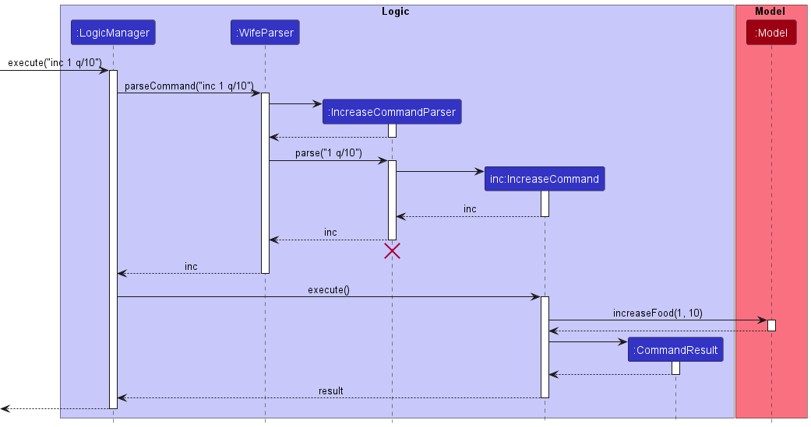
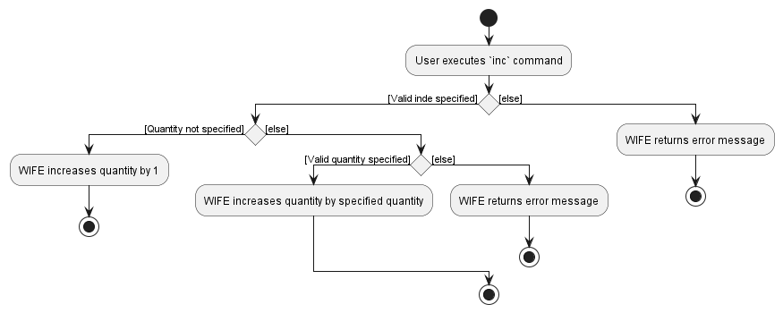
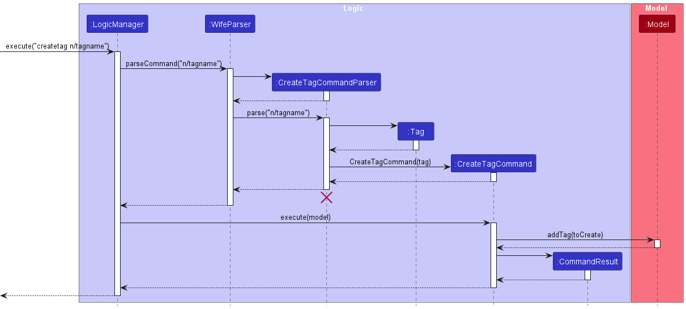
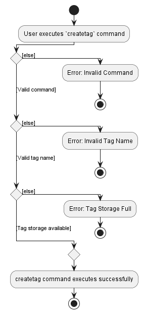
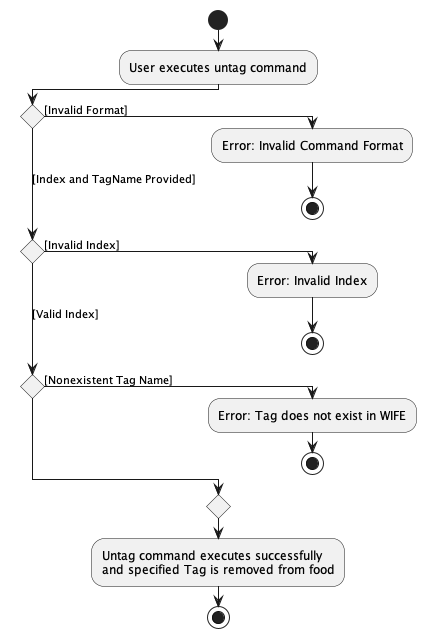
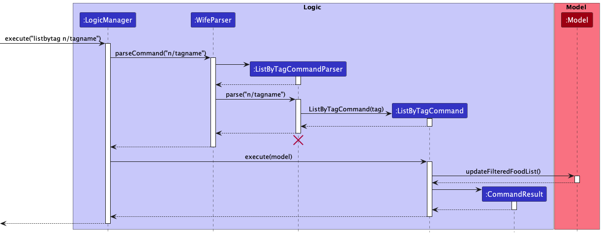
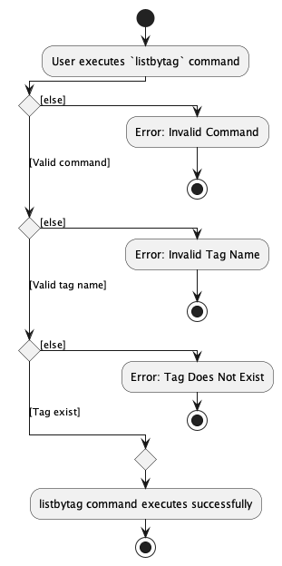
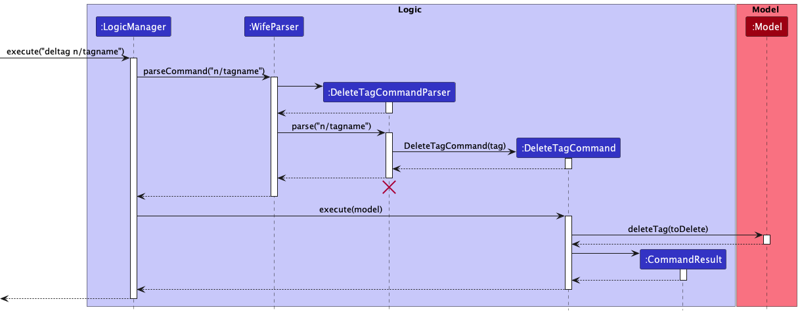
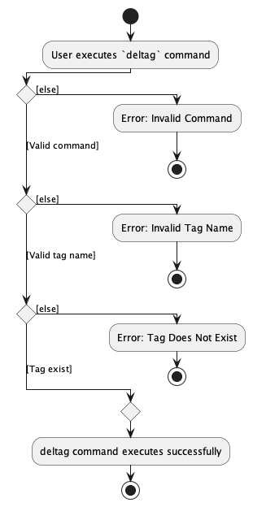

## DEVELOPER GUIDE FOR WIFE

---

## Introduction

WIFE is a food inventory management system that aims to aid busy users in managing food items in their fridge. With its
inventory management system, users can easily edit their fridge's inventory and view it in a sleek and easy-to-read
list. Users can also tag their food items according to their preferences. 
 

This developer guide aims to provide detailed documentation for WIFE's design and implementation. This includes its
architecture, design choices as well outlines for all features of the software. This project is released under the MIT
license, making it open source and available for anyone to use and modify.
--------------------------------------------------------------------------------------------------------------------

## Table of Contents

* [Introduction](#introduction)
* [Acknowledgments](#acknowledgements)
* [Setting up, getting started](#setting-up-getting-started)
* [Design](#design)
  * [Architecture](#architecture)
  * [UI component](#ui-component)
  * [Logic component](#logic-component)
  * [Model component](#model-component)
  * [Storage component](#storage-component)
* [Implementation](#implementation) 
  * [General implementation](#general-implementation-details)
  * [General consideration design](#general-consideration-design)
  * [Food-related features](#food-related-features)
    * [Add a Food](#add-a-food)
    * [Edit a Food](#edit-a-food)
    * [Increase/Decrease quantity of a Food](#increasedecrease-quantity-of-a-food)
    * [View details of a Food](#view-details-of-a-food-item)
  * [Tag-related features](#tag-related-features)
    * [Overview](#overview)
    * [Design considerations](#design-considerations)
    * [Create a new tag](#create-a-new-tag)
    * [Tag a Food](#tag-a-food)
    * [Untag a Food](#untag-a-food)
    * [List Foods by tag(s)](#list-foods-by-tags)
    * [Delete Foods by tag(s)](#delete-foods-by-tags)
    * [Delete tag(s)](#delete-tags)
  * [General Features](#general-features)
    * [help](#dynamic-help)
  * [Documentation and other guides](#documentation-logging-testing-configuration-dev-ops)
  * [Requirements](#appendix-requirements)
    * [Product scope](#product-scope)
    * [User stories](#user-stories)
    * [Use cases](#use-cases)
      * [Use case UC01: Add a Food](#use-case-uc01-add-a-food)
      * [Use case UC02: Lists all Foods](#use-case-uc02-lists-all-foods)
      * [Use case UC03: Edit a Food](#use-case-uc03-edit-a-food)
      * [Use case UC04: Increase the quantity of a Food](#use-case-uc04-increase-the-quantity-of-a-food)
      * [Use case UC05: Decrease the quantity of a Food](#use-case-uc05-decrease-the-quantity-of-a-food)
      * [Use case UC06: Delete a Food](#use-case-uc06-delete-a-food)
      * [Use case UC07: Create a new tag](#use-case-uc07-create-a-new-tag)
      * [Use case UC08: Tag a Food](#use-case-uc08-tag-a-food)
      * [Use case UC09: List Foods by tags](#use-case-uc09-list-foods-by-tags)
      * [Use case UC10: Delete Foods by tags](#use-case-uc10-delete-foods-by-tags)
      * [Use case UC11: Delete tags](#use-case-uc11-delete-tags)
      * [Use case UC12: View help](#use-case-uc12-view-help)
    * [Non-functional requirements](#non-functional-requirements)
    * [Instructions for manual testing](#appendix-instructions-for-manual-testing)
    * [Glossary](#glossary)

## Acknowledgements

WIFE is a brownfield software project developed at the School of Computing at National University of Singapore.
It was adapted from a previous project called AddressBook Level-3, and it was developed as part of the CS2103T Software
Engineering Module.

Java dependencies:

-   [Jackson](https://github.com/FasterXML/jackson) for JSON-related operations
-   [JavaFX](https://openjfx.io/) for GUI
-   [JUnit 5](https://github.com/junit-team/junit5) for testing

Documentation dependencies:

-   [Jekyll](https://jekyllrb.com/) for conversion of .md files to .html files for rendering of website
-   [PlantUML](https://plantuml.com/) for UML diagrams

--------------------------------------------------------------------------------------------------------------------

## **Setting up, getting started**

Refer to the guide [_Setting up and getting started_](SettingUp.md).

---

## **Design**

Below is a high-level view of how WIFE is structured, including its key components.

### Architecture

The **_Architecture Diagram_** given above explains the high-level design of the App.

Given below is a quick overview of main components and how they interact with each other.

**Main components of the architecture**

**`Main`** has two classes called [`Main`](https://github.com/se-edu/addressbook-level3/tree/master/src/main/java/seedu/address/Main.java) and [`MainApp`](https://github.com/se-edu/addressbook-level3/tree/master/src/main/java/seedu/address/MainApp.java). It is responsible for,

-   At app launch: Initializes the components in the correct sequence, and connects them up with each other.
-   At shut down: Shuts down the components and invokes cleanup methods where necessary.

[**`Commons`**](#common-classes) represents a collection of classes used by multiple other components.

The rest of the App consists of four components.

-   [**`UI`**](#ui-component): The UI of the App.
-   [**`Logic`**](#logic-component): The command executor.
-   [**`Model`**](#model-component): Holds the data of the App in memory.
-   [**`Storage`**](#storage-component): Reads data from, and writes data to, the hard disk.

**How the architecture components interact with each other**

The _Sequence Diagram_ below shows how the components interact with each other for the scenario where the user issues the command `delete 1`.

Each of the four main components (also shown in the diagram above),

-   defines its _API_ in an `interface` with the same name as the Component.
-   implements its functionality using a concrete `{Component Name}Manager` class (which follows the corresponding API `interface` mentioned in the previous point.

For example, the `Logic` component defines its API in the `Logic.java` interface and implements its functionality using the `LogicManager.java` class which follows the `Logic` interface. Other components interact with a given component through its interface rather than the concrete class (reason: to prevent outside component's being coupled to the implementation of a component), as illustrated in the (partial) class diagram below.

The sections below give more details of each component.

### UI component

The **API** of this component is specified in [`Ui.java`](https://github.com/se-edu/addressbook-level3/tree/master/src/main/java/seedu/address/ui/Ui.java)

_(Diagram to be updated)_

The UI consists of a `MainWindow` that is made up of parts e.g.`CommandBox`, `ResultDisplay`, `StatusBarFooter` etc. All these, including the `MainWindow`, inherit from the abstract `UiPart` class which captures the commonalities between classes that represent parts of the visible GUI.

The `UI` component uses the JavaFx UI framework. The layout of these UI parts are defined in matching `.fxml` files that are in the `src/main/resources/view` folder. For example, the layout of the [`MainWindow`](https://github.com/se-edu/addressbook-level3/tree/master/src/main/java/seedu/address/ui/MainWindow.java) is specified in [`MainWindow.fxml`](https://github.com/se-edu/addressbook-level3/tree/master/src/main/resources/view/MainWindow.fxml)

The `UI` component,

-   executes user commands using the `Logic` component.
-   listens for changes to `Model` data so that the UI can be updated with the modified data.
-   keeps a reference to the `Logic` component, because the `UI` relies on the `Logic` to execute commands.
-   depends on some classes in the `Model` component, as it displays `Food` object residing in the `Model`.

### Logic component

**API** : [`Logic.java`](https://github.com/se-edu/addressbook-level3/tree/master/src/main/java/seedu/address/logic/Logic.java)

Here's a (partial) class diagram of the `Logic` component:

How the `Logic` component works:

* When `Logic` is called upon to execute a command, it uses the `WifeParser` class to parse the user command.
* This results in a `Command` object (more precisely, an object of one of its subclasses e.g., `AddCommand`) which is executed by the `LogicManager`.
* The command can communicate with the `Model` when it is executed (e.g. to add a Food).
* The result of the command execution is encapsulated as a `CommandResult` object which is returned back from `Logic`.

The Sequence Diagram below illustrates the interactions within the `Logic` component for the `execute("delete 1")` API call.

:information_source: **Note:** The lifeline for `DeleteCommandParser` should end at the destroy marker (X) but due to a limitation of PlantUML, the lifeline reaches the end of diagram.

Here are the other classes in `Logic` (omitted from the class diagram above) that are used for parsing a user command:

How the parsing works:

-   When called upon to parse a user command, the `WifeParser` class creates an `XYZCommandParser` (`XYZ` is a placeholder for the specific command name e.g., `AddCommandParser`) which uses the other classes shown above to parse the user command and create a `XYZCommand` object (e.g., `AddCommand`) which the `WifeParser` returns back as a `Command` object.
-   All `XYZCommandParser` classes (e.g., `AddCommandParser`, `DeleteCommandParser`, ...) inherit from the `Parser` interface so that they can be treated similarly where possible e.g, during testing.

### Model component

**API** : [`Model.java`](https://github.com/se-edu/addressbook-level3/tree/master/src/main/java/seedu/address/model/Model.java)

_(Model Diagram to be updated)_

The `Model` component,

-   stores WIFE data i.e., all `Food` and `Tag` objects (which are contained in a `UniqueFoodList` and `UniqueTagList` objects).
-   stores the currently 'selected' `Food` and `Tag` objects (e.g., results of a search query) as a separate _filtered_ list which is exposed to outsiders as an unmodifiable `ObservableList<Food>` and `ObservableList<Tag>` that can be 'observed' e.g. the UI can be bound to this list so that the UI automatically updates when the data in the list change.
-   stores a `UserPref` object that represents the user’s preferences. This is exposed to the outside as a `ReadOnlyUserPref` objects.
-   does not depend on any of the other three components (as the `Model` represents data entities of the domain, they should make sense on their own without depending on other components)

:information_source: **Note:** An alternative (arguably, a more OOP) model is given below. It has a `Tag` list in the `WIFE`, which `Food` references. This allows `Wife` to only require one `Tag` object per unique tag, instead of each `Food` needing their own `Tag` objects. 

### Storage component

**API** : [`Storage.java`](https://github.com/se-edu/addressbook-level3/tree/master/src/main/java/seedu/address/storage/Storage.java)

_(Model Diagram to be updated)_

The `Storage` component,

-   can save both WIFE data and user preference data in json format, and read them back into corresponding objects.
-   inherits from both `WifeStorage` and `UserPrefStorage`, which means it can be treated as either one (if only the functionality of only one is needed).
-   depends on some classes in the `Model` component (because the `Storage` component's job is to save/retrieve objects that belong to the `Model`)

### Common classes

Classes used by multiple components are in the `seedu.wife.commons` package.

---

## **Implementation**

This section describes some noteworthy details on how certain features are implemented.

### Food-related Features

#### General Implementation Details

Wife's `Food` object is composed of classes that represent the various attributes available in each `Food`. To ensure
efficient storage and organization, all items are stored in a UniqueFoodList, while their corresponding `Tag` are stored
in a separate UniqueTagList. `UniqueTagList` enforces a maximum limit on the number of tags that can be added to
Wife. By using these lists, Wife can easily manage and access its inventory, ensuring that it remains optimized
and easy to use.

The related attributes of a `Food` are:

- `Name`: Name of the Food
- `Unit`: Unit of measurement of the Food
- `Quantity`: Quantity of the Food
- `ExpiryDate`: Expiry Date of the Food
- `Tags` : Tags attached to a Food

#### General Consideration Design

The design of `Food` class follows closely to the original `Person` class in AB3, with some modifications made to fit
the usage of WIFE.

-   `Person` class was renamed to `Food` with its attribute modified to the attributes mentioned above.
-   Addition of individual tags storage for each item to store their associated `Tag`.

#### Add a Food

The `add` command adds a new `Food` in WIFE.

**Implementation**

The first stage of the implementation is parsing the user input to a new `AddCommand` object. `AddCommandParser` is used
to parse and validate the user input for each attributes of `Food`. After which an `AddCommand` object is created with 
the new `Food` object with validated attributes.

The second step necessitates the execution of `AddCommand#execute()` to facilitate the insertion of `Food` into 
`UniqueFoodList`.

**Usage Scenario**

1. The user specifies a set of attributes for the new `Food` when adding a new `Food`.
2. If any of the attributes is empty, an error response is returned and users will be prompted to key in the command
   with all necessary attributes being inserted.
3. If any of the inserted attributes is invalid, an error response is returned and users will be prompted to key in the
   command with valid attributes.
4. If the `Food` inserted by the user has the same name and expiry date as another `Food` in the `Model`, an error is
   returned to inform the user that there is a duplicated copy of `Food` in the `UniqueFoodList`.
5. Completion of step 4 without any exceptions will result in successful addition of a new `Food` in WIFE and stored in
   `UniqueFoodList`

The following sequence diagram shows how the `add` command.

_(Sequence diagram to be inserted)_

#### Edit a Food

**Overview**

The `edit` command edits the attribute of selected `Food` in WIFE. The selected `Food` is specified
by retrieving from the one-indexed food list.

**Implementation**

The first stage of the implementation is parsing the user input to a new `EditCommand` object. `EditCommandParser` is 
used to parse and check whether the user input for the new attribute of `Food` is valid. After which an `EditCommand` 
object is created with new `Food` with updated attributes. 

The second step necessitates the execution of `EditCommand#execute()` to facilitate the updating of `Food` in WIFE.

**Usage Scenario**

1. The user specifies the food index that represents the `Food` to be edited.
2. If the index provided is a negative or zero index, an error response is returned and users will be
   prompted to enter a valid index.
3. The user specifies the new attribute(s) for the `Food` when editing the `Food`. There must be at least one attribute
   provided when editing `Food`.
4. If any of the attributes is empty, an error response is returned and users will be prompted to key in the command
   with all necessary attributes being inserted.
5. If any of the inserted attributes is invalid, an error response is returned and users will be prompted to key in the
   command with valid attributes.
6. If the `Food` inserted by the user has the same name and expiry date as another `Food` in the `Model`, an error is
   returned to inform the user that there is a duplicated copy of `Food` in the `UniqueFoodList`.
7. Completion of step 6 without any exceptions will result in successful addition of a new `Food` in WIFE and stored in
   `UniqueFoodList`

The following sequence diagram shows how the `add` command.

_(Sequence diagram to be inserted)_

#### Increase/Decrease quantity of a Food.

**Overview**

The increase/decrease quantity feature is meant to be a shorthand for users to change the quantity of a particular food item.
Traditionally, to change the quantity of an item, the user would use the edit command to edit the quantity of a food item.
The user can now specify `inc` or `dec` to increase or decrease the quantity of the indexed food item respectively.

**Design considerations**

-   **Alternative 1:** The command parameter will be the new quantity of the food item to edit

    -   Pros:
        -   Easily implemented. The command parameter will be set as the new quantity of the item.
    -   Cons:
        -   May not be intuitive for the user, as the command is to increase/decrease the quantity.
        -   Can be unnecessarily complicated for the user, i.e entering a higher quantity than the current quantity for
            `inc` and vice versa.
        -   Does not significantly value-add to the product as compared to just using the edit command.

-   **Alternative 2 (Current implementation):** The command parameter will be the quantity to increase/decrease the
    quantity of the food item by.
    -   Pros:
        -   Intuitive for the user to key in the quantity they want to increase/decrease by.
    -   Cons:
        -   Parameter to increase/decrease quantity must be checked that it is a positive integer.
        -   Users will have to use separate commands to increase and decrease quantity.

Another aspect that was considered when implementing this feature was having a default quantity to increase and decrease
if no quantity was specified. We realised it was intuitive for users to make the default increment or decrement set to
1, easing convenience for the user.

**Implementation**

 Note: The implementation for `inc` and `dec` are the same, except the variable names and logic used to calculate 
new quantity (Addition/Subtraction) The described implementation is for the `inc` command. 

The first stage of the implementation is parsing the user input to `IncreaseCommand`. `IncreaseCommandParser` is used
to parse and check whether the user input  is valid. After which a `IncreaseCommand` object is created along with a
`IncreaseFoodDescriptor` instance to increase the quantity of the current food item.

The second step necessitates the execution of `IncreaseCommand#execute()`.

**Usage Scenario**

1. The user specifies an index of the food item to be edited.
2. If the index is out of bounds from the food list, an error response is returned and users will be prompted to key in
   the command with the valid index.
3. If no specific quantity is specified, the quantity of the indexed food item will be increased by one.
4. If a specific quantity is specified, the quantity of the indexed food item will be increased by that value.
5. If the specific quantity is lesser than or equal to 0, an error response is returned and users will be prompted to
   key in the command with a valid quantity.

The following activity diagram summarizes what happens when a user executes a new `inc` command:

**Design considerations**

-   **Alternative 1 (Current implementation):** The command view with the index of the food item to view the details of.

    -   Pros:
        -   Intuitive for the user to key in the quantity they want to increase/decrease by.
    -   Cons:
        -   Parameter to increase/decrease quantity must be checked that it is a positive integer.
        -   Feels like a hacky solution to the problem.
        -   Does not significantly value-add to the product as compared to just using the edit command.

-   **Alternative 2 :** Have a ui switcher to switch between the different views i.e. list view and details view.
    -   Pros:
        -   Code should be easier to maintain, or add new views in the future.
    -   Cons:
        -   Difficulty in implementing the switcher.
        -   Difficulty in implementing the different views.

#### View details of a Food.

**Overview**
The view feature is meant to be a shorthand for users to view the details of a particular Food.
Traditionally, to view the details of a FOod, the user would use the list command to view its details.
The user can now specify `view` to view more details of the indexed Food such as its full name.

The following UML diagram shows `view` and its associated class.

_(UML diagram to be inserted)_

**Implementation**

The first stage of the implementation is checking that the command is `view` and that the index is valid. 
`ViewCommandParser` is used to parse and check whether the user input is valid. After which a `ViewCommand` object is 
created which will be used to switch the view from the list view to the details view.

**Usage Scenario**

1. The user specifies an index of the food item to be viewed.
2. If the index is out of bounds from the food list, an error response is returned and users will be prompted to key in
   the command with the valid index.
3. If no specific quantity is specified, an error response is returned and users will be prompted to key in
   the command with the valid index.
4. If a specific quantity is specified, the item will be displayed in the view.
5. If the specific quantity is lesser than or equal to 0, an error response is returned and users will be prompted to
   key in the command with a valid index.

The following activity diagram shows the usage of the `view` command.

_(Actvity diagram to be inserted)_

### Tag-related Features

#### Overview

The tagging functionality is facilitated by the `UniqueTagList` stored in `WIFE`. Creating or deleting tags will result 
in changes being made to the tags that exist within the `UniqueTagList`, which is home to all current `Tag` objects. 
Furthermore, each food item within WIFE has its own assortment of associated `Tag` objects, which are stored in an 
internal `Set<Tag>`.

When a `Tag` is tagged or untagged from a `Food`, the corresponding `Tag` object is added to or removed from the 
`Set<Tag>` that is stored within the `Food`. This approach allows for effective tagging and organization of items across 
multiple lists.

The following UML diagram shows `Tag` and its associated class.

#### Design considerations:

**Aspect: How to store the tags for WIFE and each food item. **

* **Alternative 1 (current choice):** Store `Tag` in `UniqueTagList` and each `Food` stores its own set of associated
  `Tag` objects.
    * Pros:
        * Easy to implement. Tagging a `Food` simply just adds a `Tag` to the tags set associated to `Food`.
        * Users are able to create and reuse the same `Tag` that may be extensible for editing to suit their own use
          case.
    * Cons:
        * May have performance issues in terms of memory usage as additional storage is used.

* **Alternative 2:** Instantiates `Tag` with a specified name and stores all food classified by the tag as a parameter
  of the associated food list in the instantiated `Tag` class.
    * Pros:
        * Low space requirement. There is no need to store the set of associated `Tag`, `Set<Tag>` in `Food`. The association
          of `Food` to `Tag` is represented by `List<Food>` in `Tag` object.
        * Easily extensible. Creating a new `Tag` can be done by simply instantiating a new `Tag` object.
    * Cons:
        * May be more complicated in terms of implementation as compared to alternative 1.
        * Approach is not as intuitive as compared to alternative 1 (simpler to add each `Tag` to the `Food`)

#### Create a new tag

**Overview**

User can create a new pre-defined `Tag` in WIFE with the `createtag` command. The `createtag` command creates a new tag
in WIFE which can be used to classify food items in food lists. Once the tag is
created using this command, the tag can be applied to food items using the `tag` command.

**Implementation**

The first stage of the implementation is parsing the user input (tag name) to `CreateTagCommand`. `CreateTagCommandParser` 
is used to parse and check whether the user input command is valid. After which a `CreateTagCommand` object is created 
with the specified tag name.

The second step necessitates the execution of `CreateTagCommand#execute()`. This then facilitates the creation of new `Tag`
and add the new `Tag` into `UniqueTagList`.

The following sequence diagram shows how the `createtag` command works.

**Usage Scenario**

1. The user specifies a tag name for the new tag when creating a new tag.
2. If the tag name is empty, an error response is returned and users will be prompted to key in the command with the valid
   tag name.
3. If the tag name is invalid, an error response is returned and users will be prompted to key in the command with a valid
   tag name.
4. If the tag name inserted by the user has the same tag name as another tag in the `Model`, an error is returned to
   inform the user that there is already a duplicated copy of tag in the `UniqueTagList`.
5. If the tag storage of WIFE is full, an error response is returned to inform that the user has reached the maximum
   capacity of the tag storage and will not be able to insert additional tag.
6. Completion of step 5 without any exceptions will result in successful creation of a new `Tag` in WIFE and stored in
   `UniqueTagList`

The following activity diagram summarizes what happens when a user executes a new `createtag` command:

#### Tag a Food

User may choose to tag a `Food` in `WIFE` with any of the pre-defined `Tag` created. This can simply
be done using the command `tag`. This tagging function allows user to easily classify their `Food` in
the fridge.

**Implementation**

The first stage of the implementation is parsing the user input to `TagFoodCommand`. `TagFoodCommandParser` is used
to parse and check whether the user input is valid. After which a `TagFoodCommand` object is created with the specified
index and tag name.

The second step necessitates the execution of `TagFoodCommand#execute()`. This then facilitates the insertion of `Tag`
into the tag set associated with `Food` at specified index.

**Usage Scenario**

1. The user specifies the index of the food to be tagged and the name of the tag.
2. If the index is out of bounds from the food list, an error response is returned and users will be prompted to key in
   the command with the valid index.
3. If no specific tag name is specified, an error response is returned and users will be prompted to key in
   the command with a tag name.
4. If the tag name specified does not exist in WIFE, an error response is returned and users will need to create the tag
   before having access to the tag.
5. Completion of step 4 without any exception will result in successful tagging of the food with the
   specified tag.

#### Untag a Food

The `untag` feature removes a specified tag from a food item.

**Implementation**

The first stage of the implementation is parsing the user input to `UntagCommand`. `UntagCommandParser` is used to 
parse and check whether the user input is valid - if the tag exists or does not exist in the food item's internal tag 
set. After which, an `UntagCommand` object is created with the specified tag name to be removed. 

The second stage requires `UntagCommand#execute()` to be called which then removes the tag from the `Food` at specified index.

**Usage Scenario**

1. The user specifies tag name to be removed for a food item index.
2. If the food item does not have that tag, an error response is returned and users will be prompted to key in the command with a valid tag name.
3. Completion of step 1 without any exceptions will result in successful removal of the specified `Tag` from the `Food` item.

The activity diagrams of the `untag` and `tag` commands are similar.

#### List Foods by tag(s).

**Overview**
The List by tag feature is meant to be a list all the food by the specified tags.

The following sequence diagram shows `listbytag`.

**Design considerations**

-   **Alternative 1:** The command parameter will be the tag name of the food to display

    -   Pros:
        -   Easily implemented. The command parameter will show the food with the specified tag name
    -   Cons:
        -   May not be convenient for the user, as the command allows only 1 tag name at a time.

-   **Alternative 2 (Current implementation):** The command parameter will be the tag name of the food to display.
    -   Pros:
        -   Convenient for the user to key in multiple tag names to display.
    -   Cons:
        -   Parameter for multiple tag names must be checked that it is not empty
        -   Users will have to use separate commands by `n/` which maybe a hassle

**Implementation**
The first stage of the implementation is parsing the user input to `ListByTagCommand`. `ListByTagCommandParser` is used
to parse and check whether the user input is valid. After which a `ListByTagCommand` object is created with the specified
tag name.

The second step necessitates the execution of `ListByTagCommand#execute()`. This then returns a `FilteredFoodList` with
`Food` associated with specified `Tag`.

**Usage Scenario**

1. The user specifies tags of the food item to be displayed.
2. If no tag is specified, an error response is returned to prompt user to follow the command format.
3. If the tag does not exist in `UniqueTagList`, an error response is returned and users will be prompted to key in the command with the valid tag name.
4. If a valid tag is specified, the indexed food item with the specified tags will be displayed.

The following activity diagram shows the usage of the `listbytag` command.

#### Delete Foods by tag(s).

**Overview**
The Delete by tag feature is meant to be delete all the food by the specified tags.

The following sequence diagram shows `delbytag`.

**Design considerations**

-   **Alternative 1:** The command parameter will be the tag name of the food to delete

    -   Pros:
        -   Easily implemented. The command parameter will delete the food with the specified tag name
    -   Cons:
        -   May not be convenient for the user, as the command allows only 1 tag name at a time.

-   **Alternative 2 (Current implementation):** The command parameter will be the tag name of the food to delete.
    -   Pros:
        -   Convenient for the user to key in multiple tag names to display.
    -   Cons:
        -   Parameter for multiple tag names must be checked that it is not empty
        -   Users will have to use separate commands by `n/` which maybe a hassle

**Implementation**

The first stage of the implementation is parsing the user input to `DeleteByTagCommand`. `DeleteByTagCommandParser` is used
to parse and check whether the user input is valid. After which a `DeleteByTagCommand` object is created with the specified tag name.

The second step necessitates the execution of `DeleteByTagCommand#execute()`. This then facilitates the deletion of all
`Food` associated with specified `Tag`.

**Usage Scenario**

1. The user specifies tags of the food item to be delete.
2. If no tag is specified, an error response is returned to prompt user to follow the command format.
3. If the tag does not exist in `UniqueTagList`, an error response is returned and users will be prompted to key in the command with the valid tag name.
4. If a valid tag is specified, the food item with the specified tags will be deleted.

The following activity diagram shows the usage of the `delbytag` command.

#### Delete tag(s)

The `deltag` command deletes existing tag(s) in WIFE. This means food that are initially tagged with the specified tag(s) will have that tag removed.

**Implementation**

The first stage of the implementation is parsing the user input to `DeleteTagCommand`. `DeleteTagCommandParser` is used 
to parse and check whether the user input is valid. After which a `DeleteTagCommand` object is created with the 
specified tag name. 

The second stage requires `DeleteTagCommand#execute()` to be called which then removes the tag from the `UniqueTagList`
and all its appearance in `Food`.

The following sequence diagram shows how the `deltag` command.

**Usage Scenario**

1. The user specifies tag name(s) for the tag(s) to be deleted.
2. If the tag name is empty, an error response is returned and users will be prompted to key in the command with the valid tag name.
3. If all tag name(s) are invalid, an error response is returned and users will be prompted to key in the command with a valid tag name.
4. If some tag name(s) are invalid, invalid tag names will be ignored and valid tag names will be processed.
5. Completion of step 4 without any exceptions will result in successful deletion of specified `Tag` in WIFE and `Food` with specified tag(s) will have that tag(s) removed

The following activity diagram summarizes what happens when a user executes a new `deltag` command:

### General Features

#### Dynamic Help

The dynamic help mechanism allows the user to receive in-app help for the specific command being queried i.e. `help add`. It extends the traditional help functionality where the user only received general help. The help commands and respective outputs are stored internally as enums in `HelpMenu.java`. Additionally, `HelpMenu.java` implements the following operations:

HelpMenu#getGeneralHelp() — Retrieves a general help message if the user inputs `help`.
HelpMenu#getCommandHelp() — Retrieves the command specific help message.
HelpMenu#parseCommand() — Parses the command input in `help COMMAND` to ensure it is a valid command.

These operations are invoked in `HelpCommandParser.java` which calls HelpMenu#getGeneralHelp() or HelpMenu#getCommandHelp() depending on the help command input after parsing the input with HelpMenu#parseCommand().

**Implementation**

Step 1. After successful retrieval of the help message, the message is passed to the `HelpCommand` object returned by `HelpCommandParser`.

Step 2. The `LogicManager` executes the `HelpCommand` object which generates a `Command Result` object with the help message.

Step 3. MainWindow#executeCommand() extracts the help message from the `CommandResult` and sends it to `HelpWindow` as the text to be set in the FXML `label`.

---

## **Documentation, logging, testing, configuration, dev-ops**

Here are links to other documentation that you might find useful when developing WIFE:

* [Documentation guide](Documentation.md)
* [Testing guide](Testing.md)
* [Logging guide](Logging.md)
* [Configuration guide](Configuration.md)
* [DevOps guide](DevOps.md)

---
## **Appendix: Planned Enhancements**

#### User Interface
1. The enter button text gets truncated on some devices. We suspect this to be an OS related issue and plan to fix this in the future.

## **Appendix: Requirements**

### Product scope

**Target user profile**:

-   Fridge owner who cares about food waste and wish to track their fridge inventory.

**Value proposition**:

-   The perfect solution to make sure you’re always one step ahead when managing your inventory, saving you time and
    money while reducing food waste.

### User stories 

Priorities: High (must have) - `* * *`, Medium (nice to have) - `* *`, Low (unlikely to have) - `*`

| Priority | As a …​                            | I want to …​                                          | So that I can…​                             |
|----------|------------------------------------|-------------------------------------------------------|---------------------------------------------|
| `* * *`  | Organised user                     | add food items to my list                             | track what is in my fridge                  |
| `* * *`  | Meal planner                       | set expiration dates for items in my fridge           | plan meals around items that are expiring   |
| `* * *`  | Organised user                     | set item categories for fridge items                  | easily find what I need when cooking.       |
| `* * *`  | Organised user                     | delete ingredients                                    | know what ingredients I have thrown away    |
| `* *`    | Organised user                     | layout items                                          | see where all my food items are             |
| `* *`    | Fridge owner                       | transfer my list to another system                    | use the same system with another fridge     |
| `* *`    | Organised User                     | search for specific food items                        | see whether I still have it in my fridge    |
| `* *`    | User with unique items             | leave comments on items                               | remember any particular remarks             |
| `* *`    | User who likes visuals             | attach images to items                                | remember what they look like                |
| `* *`    | User who manages finances          | know how much is spent every month                    | track my monthly finances                   |
| `* *`    | User who likes to try new products | rate the items                                        | know whether to buy the same item next time |
| `* *`    | Forgetful user                     | see past purchases                                    | remember what I have bought in the past     |
| `* *`    | Forgetful user                     | set reminders for items                               | remember to use them before they expire     |
| `*`      | User who likes to cook             | see recipes with the food in my fridge as ingredients | decide what meals I can make                |
| `*`      | User who does grocery shopping     | generate a grocery list                               | bring it to the supermarket                 |

### Use cases

(For all use cases below, the **System** is the `Well Informed Fridge Environment (WIFE)` and the **Actor** is the `user`, unless specified otherwise)

### **Use case UC01: Add a Food**

**MSS**

1. User add item by giving WIFE the name of the item.
2. User confirms.
3. WIFE adds the item to the list and displays all current items in the fridge.
   Use case ends.

**Extensions**

-   2a. WIFE detects an error in the entered data.

    -   2a1. WIFE requests for the correct data.
    -   2a2. User enters new data.
    -   Steps 2a1-2a2 are repeated until the data entered are correct.  
        Use case resumes from step 3.

-   \*a. At any time, User chooses to cancel the transfer.
    -   \*a1. OBS requests to confirm the cancellation.
    -   \*a2. User confirms the cancellation.  
        Use case ends.

### **Use case UC02: Lists all Foods**

**MSS**

1. User ask to view all food items in WIFE.
2. WIFE displays all food items that are in the fridge.  
   Use case ends.

**Extensions:**

-   1a. WIFE is empty.
    -   1a1. WIFE displays a message that tells the User that there are no items.  
        Use case ends.

### **Use case UC03: Edit a Food**

**MSS**

1.  User requests to update an item in the fridge.
2.  WIFE updates the item and displays successful update message.

    Use case ends.

**Extensions**

* 1a. WIFE is empty.
    * 1a1. WIFE displays a message that tells the User that there are no items
      and cannot update specified item

      Use case ends.
* 1b. User selects an item that does not exist.
    * 1b1. WIFE displays a message that tells the User that specified item does not exist.

      Use case ends.
    * 
### **Use case UC04: Increase the quantity of a Food**

**MSS**

1. User selects a food item to increase its quantity in WIFE.
2. WIFE informs the user that the increase has been completed.
   Use case ends.

**Extensions**

* 1a. User selects an invalid food item.
    * 1a1. WIFE displays a message that tells the User that the selected food item is invalid.
      Use case ends.

* 1b. The user does not specify the quantity of the food item to increase by
    * 1b1. WIFE increases the quantity of the specified food item by 1.
      Use case resumes from Step 2.
* 1c. The user specifies a value that is lesser than or equal to 0 for the quantity of the food item to increase by.
    * 1b1. WIFE displays a message that tells the user that the specified value is invalid.
      Use case ends.

### **Use case UC05: Decrease the quantity of a Food**
The same as Use Case UC08: Increment the quantity of a food item, except that it is to decrease the quantity of a food
item.

**Additional Extensions**
* 1d. The user specifies a value that is larger than the current quantity of the food item
  * 1d1. WIFE displays a message that tells the user that the specified value is invalid.
    Use case ends.

### **Use case UC06: Delete a Food**

**MSS**

1. User requests to delete specified food items in WIFE.
2. WIFE deletes food item and displays successful deletion message.  
   Use case ends.

**Extensions:**

-   1a. WIFE is empty.
    -   1a1. WIFE displays a message that tells the User that there are no items and cannot delete specified item.  
        Use case ends.
-   1b. User selects an index that is more than the food items in WIFE.
    -   1b1. WIFE displays a message that tells the User that the food item index provided is invalid.  
        Use case ends.

### **Use case UC07: Create a new tag**

**MSS**

1. User adds a new tag by giving WIFE the name of the tag.
2. User confirms.
3. WIFE adds the tag to the list and displays all current tags in the fridge.
   Use case ends.

**Extensions**

* 1a. User keyed in an invalid tag name.
    * 1a1. WIFE displays a message that tells the User that there the tag name keyed in by
    * the user is invalid.

      Use case ends.

* 1b. Tag already exists in WIFE's list of pre-defined tags.
    * 1a1. WIFE displays a message that tells the User that there are already similar tags
    * in the list, hence, no action will be carried out.

      Use case ends.

### **Use case UC08: Tag a Food**

**MSS**

1.  User requests to list the food items stored in WIFE.
2.  WIFE shows the full list of food items.
3.  User tag food item at specified index with tags pre-defined by WIFE.
4.  WIFE tagged the food item with the chosen tag.

    Use case ends.

**Extensions**

-   2a. The list is empty. WIFE informs the user that the list is empty. 
    Use case ends.

-   3a. The given index is invalid.

    -   3a1. WIFE displays an error message to inform the user that the index
    -   inserted is invalid.  
        Use case resumes at step 2.

-   4a. Chosen tag is not in the pre-defined list of tags.
    -   4a1. WIFE shows an error message.
    -   4a2. WIFE asks if the user wish to add the new tags into the tag list.  
        Use case resumes at step 2.

### **Use case UC09: List Foods by tags**

**MSS**

1. User requests to view food items with specified tags.
2. WIFE displays all the food items with the specified tags.
   Use case ends.

**Extensions**

-   1a. User requests an invalid tag.

    -   1a1. WIFE displays a message that tells the User that there are no food item tagged with the specified tag.
        Use case ends.

-   1b. The user specify valid and invalid tags togther.
    -   1b1. WIFE displays food items with valid tags. It also tells User which tag is valid or invalid.
        Use case ends.

### **Use case UC10: Delete Foods by tags**

**MSS**

1. User requests to delete food items with specified tags.
2. WIFE deletes and displays all the food items with the specified tags.
   Use case ends.

**Extensions**

-   1a. User requests an invalid tag.

    -   1a1. WIFE displays a message that tells the User that there are no food item tagged with the specified tag to be deleted.
        Use case ends.

-   1b. The user specify valid and invalid tags togther.
    -   1b1. WIFE deletes and displays food items with valid tags.
        Use case ends.

### **Use case UC11: Delete tags**

**MSS**

1. User requests to delete pre-defined tags in WIFE.
2. WIFE deletes pre-defined tags in WIFE and untag itself from the food items. It then tells the users the tags that are deleted
   Use case ends.

**Extensions**

-   1a. User requests an invalid tag.

    -   1a1. WIFE displays a message that tells the User that the tag specified is does not exit in WIFE
        Use case ends.

-   1b. The user specify valid and invalid tags togther.
    -   1b1. WIFE ignores invalid tags.
        Use case resumes at step 2.

### **Use case UC12: View help**
**MSS:**
1. User asks the WIFE for the help page
2. WIFE displays all available commands and corresponding formats  
   Use case ends.

### Non-Functional Requirements

1.  Should work on any _mainstream OS_ as long as it has Java `11` or above installed.
2.  Should be able to hold up to 1000 food items without a noticeable sluggishness in performance for typical usage.
3.  A user with above average typing speed for regular English text (i.e. not code, not system admin commands) should be able to accomplish most of the tasks faster using commands than using the mouse.
4.  Application’s dimension should be a minimum of 450 by 600 pixels.
5.  Should support a minimum of 50 items in storage.
6.  There should be no more than 1 second of lag when a user inputs a command.
7.  A first-time user should be able to easily perform CRUD operations on items.

--------------------------------------------------------------------------------------------------------------------

## **Appendix: Instructions for manual testing**

Given below are instructions to test the app manually. Ideally, please follow the testing instructions in sequence, as
some tests may be dependent on previous instructions.

:information_source: **Note:** These instructions only provide a starting point for testers to work on;
testers are expected to do more *exploratory* testing.

### Initial Launch

1. Download the jar file and copy into an empty folder

2. Double-click the jar file
   * Expected: Shows the GUI with a set of sample data.

### Tests for Food-related features

#### Add a Food
`add n/Broccoli u/STALK q/2 e/03-03-2033`

Expected Output in Food List: New Food "Broccoli" added into the list.

Expected Output in Result Display: New food added: Broccoli (expires on: 03-03-2033)

#### List all Foods

`list`

Expected Output in Food List: All Foods stored in WIFE are shown.

Expected Output in Result Display: Listed all food items!

#### Edit a Food 

`edit 2 q/10`

Expected Output in Food List: "Broccoli" Food has new `Quantity` of 10.

Expected Output in Result Display: Edited food item: Broccoli (expires on: 03-03-2033)

This command is editing the "Broccoli" Food that was added when testing the `add` command.

#### Find a Food

`find broc meij`

Expected Output in Food List: "Meiji Milk" and "Broccoli" appear in the Food List.

Expected Output in Result Display: 2 food item(s) found!

#### Increase quantity of a Food

`inc 1 q/100`

Expected Output in Food List: "Meiji Milk" Food's `Quantity` increased by 100

Expected Output in Result Display: Increased Food: Meiji Milk (expires on: 13-11-2024) by 100

`inc 1`

Expected Output in Food List: "Meiji Milk" Food's `Quantity` increased by 1

Expected Output in Result Display: Increased Food: Meiji Milk (expires on: 13-11-2024) by 1

#### Decrease quantity of a Food

`dec 1 q/100`

Expected Output in Food List: "Meiji Milk" Food's `Quantity` decreased by 100

Expected Output in Result Display: Decreased Food: Meiji Milk (expires on: 13-11-2024) by 100

`dec 1`

Expected Output in Food List: "Meiji Milk" Food's `Quantity` decreased by 1

Expected Output in Result Display: Decreased Food: Meiji Milk (expires on: 13-11-2024) by 1

#### Delete a Food

`delete 2`

Expected Output in Food List: "Broccoli" Food has been removed from the Food List

Expected Output in Result Display: Deleted Food: Broccoli (expires on: 03-03-2033)

### Sort Foods by expiry date

`expiry`

Expected Output in Food List: All Food items are sorted in ascending order (Foods with a closer expiry date appear at
the top)

Expected Output in Result Display: Food items are being sorted by their expiry dates.

### Tag-related features

#### Create a new tag

`createtag n/milky`

Expected output in Result Display: Tag(s) successfully created: Milky

#### Tag a Food

`tag 1 n/milky`

Expected Output in Food List: "Meiji Milk" Food has been tagged with the tag "Milky"

Expected Output in Result Display: Meiji Milk successfully tagged with Milky

#### Untag a Food

`untag 1 n/milky`

Expected Output in Food List: "Meiji Milk" Food has been untagged with the tag "Milky"

Expected Output in Result Display: Meiji Milk successfully untagged with Milky

#### List all tags

`listtag`

Expected output in Result Display: Here are your existing tags: New Used Dairy Milky

#### List Foods by tag(s)

Prerequisite: Before testing this feature and the "Delete Foods by tag(s)" feature, please key in the following commands
sequentially.

`add n/Broccoli u/STALK q/2 e/03-03-2033`
`createtag n/vegetables`
`tag 1 n/milky`
`tag 2 n/vegetables`

`listbytags n/vegetables`

Expected Output in Food List: "Broccoli" Food appears in the Food List

Expected Output in Result Display: Listed all food with the following tags:
[Vegetables]

#### Delete Foods by tag(s)

Prerequisite: Ensure you have entered the prerequisite commands mentioned in "List Foods by tag(s).
THen, enter the `list` command to show all Food items first.

`delbytag n/vegetables`

Expected Output in Food List: "Broccoli" Food is removed from the Food List.

Expected Output in Result Display: Deleted Food:
Broccoli (expires on: 03-03-2033)

#### Delete tag(s)

`deltag n/milky`

Expected Output in Food List: All occurrences of the `Milky` tag that are tagged to food items in the food the list
will be deleted. ("Meiji Milk" Food will not be deleted!)

Expected Output in Result Display: Tag successfully deleted: [Milky]

### General Features

#### Help

`help`

Expected Output: The Help Window pops up and shows a general help message.

`help add`

Expected Output: The Help Window pops up and shows a help message for the `add` command.

#### Clear

`clear`

Expected output in Food List: All Foods and tags have been removed.

Expected output in Results Display: WIFE has been cleared!

#### Exit

`exit`

Expected output: WIFE application closes.

--------------------------------------------------------------------------------------------------------------------
### Glossary

* **Mainstream OS**: Windows, Linux, Unix, OS-X  
* **WIFE** - Well Informed Fridge Environment  
* **Main Success Scenario (MSS)** - The most straightforward interaction for a given use case with no errors.  
