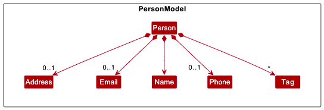
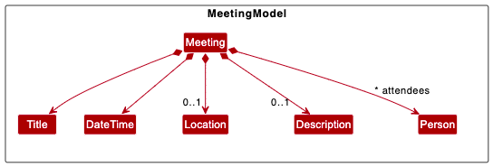

* Table of Contents
{:toc}

--------------------------------------------------------------------------------------------------------------------

## **Acknowledgements**

We would like to thank:

* [CS2103T AY22/23 Semester 2 teaching team](https://nus-cs2103-ay2223s2.github.io/website/admin/instructors.html) for imparting valuable knowledge, skills and guidance
* [SE-edu AddressBook 3](https://github.com/se-edu/addressbook-level3) which `QuickContacts` is built on
* Open-source libraries used in `QuickContacts`:
  * [JavaFX](https://openjfx.io/)
  * [Jackson](https://github.com/FasterXML/jackson)
  * [JUnit](https://junit.org/junit5/)
* Colors from [Ayu](https://raw.githubusercontent.com/ayu-theme/ayu-colors/master/colors.svg)

--------------------------------------------------------------------------------------------------------------------

## **Setting up, getting started**

Refer to the guide [_Setting up and getting started_](SettingUp.md).

--------------------------------------------------------------------------------------------------------------------

## **Design**

<div markdown="span" class="alert alert-primary">

:bulb: **Tip:** The `.puml` files used to create diagrams in this document can be found in the [diagrams](https://github.com/AY2223S2-CS2103T-T11-2/tp/tree/master/docs/diagrams) folder. Refer to the [_PlantUML Tutorial_ at se-edu/guides](https://se-education.org/guides/tutorials/plantUml.html) to learn how to create and edit diagrams.
</div>

### Architecture


The ***Architecture Diagram*** given above explains the high-level design of the App.

Given below is a quick overview of main components and how they interact with each other.

#### Main components of the architecture

**`Main`** has two classes called [`Main`](https://github.com/AY2223S2-CS2103T-T11-2/tp/tree/master/src/main/java/seedu/address/Main.java) and [`MainApp`](https://github.com/AY2223S2-CS2103T-T11-2/tp/tree/master/src/main/java/seedu/address/MainApp.java). It is responsible for,
* At app launch: Initializes the components in the correct sequence, and connects them up with each other.
* At shut down: Shuts down the components and invokes cleanup methods where necessary.

[**`Commons`**](#common-classes) represents a collection of classes used by multiple other components.

The rest of the App consists of four components.

* [**`UI`**](#ui-component): The UI of the App.
* [**`Logic`**](#logic-component): The command executor.
* [**`Model`**](#model-component): Holds the data of the App in memory.
* [**`Storage`**](#storage-component): Reads data from, and writes data to, the hard disk.

#### Interaction between architecture components

The **_Sequence Diagram_** below shows how the components interact with each other for the scenario where the user issues the command `delete 1`.


Each of the four main components (also shown in the diagram above),

* defines its *API* in an `interface` with the same name as the Component.
* implements its functionality using a concrete `{Component Name}Manager` class (which follows the corresponding API `interface` mentioned in the previous point.

For example, the `Logic` component defines its API in the `Logic.java` interface and implements its functionality using the `LogicManager.java` class which follows the `Logic` interface. Other components interact with a given component through its interface rather than the concrete class (reason: to prevent outside component's being coupled to the implementation of a component), as illustrated in the (partial) **_class diagram_** below.


The sections below give more details of each component.

### UI component

The **API** of this component is specified in [`Ui.java`](https://github.com/AY2223S2-CS2103T-T11-2/tp/tree/master/src/main/java/seedu/address/ui/Ui.java)


The UI consists of a `MainWindow` that is made up of parts e.g.`CommandBox`, `ResultDisplay`, `PersonListPanel`, `MeetingListPanel`, `StatusBarFooter` etc. All these, including the `MainWindow`, inherit from the abstract `UiPart` class which captures the commonalities between classes that represent parts of the visible GUI.

The `UI` component uses the JavaFx UI framework. The layout of these UI parts are defined in matching `.fxml` files that are in the `src/main/resources/view` folder. For example, the layout of the [`MainWindow`](https://github.com/AY2223S2-CS2103T-T11-2/tp/tree/master/src/main/java/seedu/address/ui/MainWindow.java) is specified in [`MainWindow.fxml`](https://github.com/AY2223S2-CS2103T-T11-2/tp/tree/master/src/main/resources/view/MainWindow.fxml)

The `UI` component,

* executes user commands using the `Logic` component.
* listens for changes to `Model` data so that the UI can be updated with the modified data.
* keeps a reference to the `Logic` component, because the `UI` relies on the `Logic` to execute commands.
* depends on some classes in the `Model` component, as it displays `Person` object residing in the `Model`.

### Logic component

**API** : [`Logic.java`](https://github.com/AY2223S2-CS2103T-T11-2/tp/tree/master/src/main/java/seedu/address/logic/Logic.java)

Here's a (partial) **_class diagram_** of the `Logic` component:


How the `Logic` component works:
1. When `Logic` is called upon to execute a command, it uses the `QuickcContactsParser` class to parse the user command.
1. This results in a `Command` object (more precisely, an object of one of its subclasses e.g., `AddCommand`) which is executed by the `LogicManager`.
1. The command can communicate with the `Model` when it is executed (e.g. to add a person).
1. The result of the command execution is encapsulated as a `CommandResult` object which is returned back from `Logic`.

The Sequence Diagram below illustrates the interactions within the `Logic` component for the `execute("delete 1")` API call.


<div markdown="span" class="alert alert-info">:information_source: **Note:** The lifeline for `DeleteCommandParser` should end at the destroy marker (X) but due to a limitation of PlantUML, the lifeline reaches the end of diagram.
</div>

Here are the other classes in `Logic` (omitted from the class diagram above) that are used for parsing a user command:


How the parsing works:
* When called upon to parse a user command, the `QuickContactsParser` class creates an `XYZCommandParser` (`XYZ` is a placeholder for the specific command name e.g., `AddCommandParser`) which uses the other classes shown above to parse the user command and create a `XYZCommand` object (e.g., `AddCommand`) which the `QuickContactsParser` returns back as a `Command` object.
* All `XYZCommandParser` classes (e.g., `AddCommandParser`, `DeleteCommandParser`, ...) inherit from the `Parser` interface so that they can be treated similarly where possible e.g, during testing.

### Model component
**API** : [`Model.java`](https://github.com/AY2223S2-CS2103T-T11-2/tp/tree/master/src/main/java/seedu/address/model/Model.java)


The `Model` component,

* stores the address book data i.e., all `Person` objects (which are contained in a `UniquePersonList` object) and `Meeting` objects (which are contained in a `UniqueMeetingList` object).
* stores the currently 'selected' `Person` objects (e.g., results of a search query) as a separate _filtered_ list which is exposed to outsiders as an unmodifiable `ObservableList<Person>` that can be 'observed' e.g. the UI can be bound to this list so that the UI automatically updates when the data in the list change.
* stores a `UserPref` object that represents the user’s preferences. This is exposed to the outside as a `ReadOnlyUserPref` objects.
* does not depend on any of the other three components (as the `Model` represents data entities of the domain, they should make sense on their own without depending on other components)



The `Person` model,

* consists of individual classes `Name`, `Phone`, `Email`, `Address` and `Tag` which are used to store the respective information of a `Person`.



The `Meeting` model,

* consists of individual classes `Title`, `DateTime`, `Person`, `Location` and `Description` which are used to store the respective information of a `Meeting`.

### Storage component

**API** : [`Storage.java`](https://github.com/AY2223S2-CS2103T-T11-2/tp/tree/master/src/main/java/seedu/address/storage/Storage.java)


The `Storage` component,
* can save both address book data and user preference data in json format, and read them back into corresponding objects.
* inherits from both `QuickBookStorage` and `UserPrefStorage`, which means it can be treated as either one (if only the functionality of only one is needed).
* depends on some classes in the `Model` component (because the `Storage` component's job is to save/retrieve objects that belong to the `Model`)

### Common classes

Classes used by multiple components are in the `seedu.quickcontacts.commons` package.

--------------------------------------------------------------------------------------------------------------------

## **Feature Implementation**

This section describes some noteworthy details on how certain features are implemented. Person and Meetings have similar functionality, how they are implemented are similar.
Without loss of generality the specifications below can be applied to both class of objects.

For example. in the sections we refer to a `UnqiueList` object, In the code there are two of such objects. One that acts on meeting `UniqueMeetingList`
, and another that acts on person `UniquePersonList`. Depending on which object functionality you are exploring just substitute the general object with the
specific object. We write in a general so that we cover breath first, and so that we may adhere to [DRY principle](https://en.wikipedia.org/wiki/Don%27t_repeat_yourself)

To help, general objects are underlined to indicate that each object has its own implementation of the object.
### CRUD Operations
#### Adding
##### Description
The <u>`AddCommand`</u> handles the addition of Objects into quickbook. See the syntax here [add command](#command-summary)
##### Implementation

When adding an `Object` the control flow is like the [main sequence diagram](#interaction-between-architecture-components)
1. The user queries the `UI` to add using an [add command](#command-summary) prefix
2. `UI` calls the QuickBookParser through `LogicManager` to initiate an <u>`AddParser`</u> object
3. QuickBookParser then passes the arguments to the <u>`AddParser`</u> object
4. <u>`AddParser`</u> initiates an <u>`AddCommand`</u> object
5. <u>`AddCommand`</u> object is passed all the way back to `LogicManager`
6. `LogicManager` calls execute on <u>`AddCommand`</u>
7.  `AddCommand` updates the model and returns a `CommandResult` to `LogicManager`
8. `LogicManager` updates the <u>`UniqueList`</u> pertaining to the `Object`

Below is the Sequence Diagram


##### Exceptions
The `AddMeetingCommand` throws a `CommandException` if the object's names is found in the address book (i.e.
no person in the address book has a matching name). The name must match exactly (**case-sensitive**) or else the
'CommandException' will be thrown.

#### Editing
##### Description
The `EditCommand` is responsible for handling the editing of `Objects` in QuickBook. It allows users to modify the details of a specific meeting. See the syntax here: [editMeeting command](#command-summary)
##### Implementation

When editing a meeting, the control flow is as follows:

1. The user queries the UI to edit a meeting using the "edit" command prefix.
2. The UI calls the `QuickBookParser` through `LogicManager` to initiate an <u>`EditParser`</u> object.
3. The `QuickBookParser` then passes the arguments to the <u>`EditParser`</u> object.
4. The <u>`EditParser`</u> initiates an <u>`EditCommand`</u> object.
5. The <u>`EditCommand`</u> object is passed all the way back to `LogicManager`.
6. `LogicManager` calls `execute()` on the <u>`EditCommand`</u>.
7. The <u>`EditCommand`</u> updates the model with the edited meeting details and returns a `CommandResult` to `LogicManager`.
8. `LogicManager` updates the `UniqueList` with the edited object information by deleting the old and replacing with the new object with the updated information.

Below is the Sequence Diagram


##### Exceptions
The `EditCommand` throws a `CommandException` if any of the object's names is not found in the address book. The name must match exactly (**case-sensitive**) or else the
'CommandException' will be thrown.


#### Deleting
##### Description
The `DeleteCommand` handles the deletion of Objects from quickbook. See the syntax here [delete command](#command-summary)
##### Implementation

When deleting an `Object`, the control flow is as follows
1. The user queries the UI to delete using a delete command prefix.
2. The UI calls the QuickBookParser through LogicManager to initiate a <u>`DeleteParser`</u> object.
3. QuickBookParser then passes the arguments to the <u>`DeleteParser`</u> object.
4. <u>`DeleteParser`</u> initiates a <u>`DeleteCommand`</u> object.
5. <u>`DeleteCommand`</u> object is passed all the way back to LogicManager.
6. LogicManager calls execute on <u>`DeleteCommand`</u>.
7. <u>`DeleteCommand`</u> updates the model and returns a `CommandResult` to LogicManager.
8. LogicManager updates the <u>`UniqueList`</u> pertaining to the Object.

Below is the Sequence Diagram for the interactions inside the Logic Component for the delete command:


##### Exceptions
The `DeleteCommand` throws a CommandException if the specified index is not found in quickbook.

#### Finding (only for person in contacts)
##### Description
The `FindCommand` finds persons in the address book. See the syntax here [find command](#command-summary).
##### Implementation
When finding meetings, the control flow is as follows:
1. The user queries the `UI` to find using a [find command](#command-summary) prefix.
2. `UI` calls the QuickBookParser through `LogicManager` to initiate a `FindCommandParser` object.
3. `FindCommandParser` takes in a list of names and creates a `FindCommand` object.
4.`FindCommand` is executed, and a `MeetingContainsNamesPredicate` is passed to the `updateFilteredMeetingList` method in the `Model` component.
5. `LogicManager` creates a  `ContainsNamesPredicate`
6. passing it to the `updateFilteredMeetingList` method in the `Model` component
7.`UI` displays the filtered meetings to the user.

Below is the Sequence Diagram:


#### Exceptions
The `FindMeetingCommand` throws a `CommandException` if no names are provided and there is trailing whitespace.
The names no need to match exactly (**case-INsensitive**) but the Meetings are only filtered by one of the contact's names,
as *space* is used as a delimiter. The command can be used **without arguments** to get back the original view of all meetings.

### Exporting and importing of contacts
##### Description
Exporting generates a JSON for the contacts at the indices given.
For example, `export p/ 1 p/2` generates a JSON for the first and second contacts.
Example JSON:
```json
[ {
  "name" : "Alice Pauline",
  "phone" : "94351253",
  "email" : "alice@example.com",
  "address" : "123, Jurong West Ave 6, #08-111",
  "tagged" : [ "friends" ]
}, {
  "name" : "Benson Meier",
  "phone" : "98765432",
  "email" : "johnd@example.com",
  "address" : "311, Clementi Ave 2, #02-25",
  "tagged" : [ "owesMoney", "friends" ]
} ]
```
The JSON is generated using the Jackson library, through the use of the JsonUtil utility class. The JSON can be pasted in again proceeding the import command to import the information in the export command

#### Design Considerations

**Alternative 1**: Use some other format (eg. `XML` or `YAML`) for exporting

Could provide more readable and/or less text for copying.

**Alternative 2 (current choice)**: Use existing `JSON` format

Benefit: can directly copy-paste to and from the data files that already exist in the system.

#### Implementation
Here we only describe the Export command. Import is the same, besides step 5. where it instead calls add on the model to add the specified objects in JSON (similar to how storage loads the save file)
Control flow is as follows.
1. The user queries the `UI` to export using a [export command](#command-summary) prefix.
2. `UI` calls the QuickBookParser through `LogicManager` to initiate a <u>`ExportCommandParser`</u> object.
3. `ExportCommandParser` creates a <u>`ExportCommand`</u> object.
4. <u>`ExportCommand`</u> is returned to `LogicManager`
5. `LogicManager` executes <u>`ExportCommand`</u>
6. <u>`ExportCommand`</u> queries `ModelManager` for Json string
7. <u>`ExportCommand`</u> returns Json string to `LogicManager` and `ModelManager`
8. `UI` outputs the JSON string

Below is the Sequence Diagram:


### Difference in Meetings
#### Implementation
meetings  has additional functionality of returning meetings between two dates. This is implemented through the use of a
`isBetween` function implemented in the `Meeting` class. The program will first gather all the meetings in the
corresponding indexes provided, then search for meetings between the start and end dates. If either date is empty, then
only the other date is considered.

#### Exceptions
Using the exported JSON, one can then import it using `import THE_JSON`.

Before importing, a check is done to make sure there are no duplicate values. This is done before the actual importing
to ensure we do not have "half imports".

Consider a situation where we have `[Person2, Person3]` in the system. If we
import `[Person1, Person2, Person3, Person4]` without considering duplicates first, Person1 will be imported
followed by the import of Person2 throwing a DuplicatePersonError, resulting in the command throwing a failure
message and Person4 not being imported but the system now has `[Person1, Person2, Person3]`.
The JSON is parsed using the Jackson library. If the Jackson library is unable to parse the json, an error message
is thrown.

However, if the user wishes to "force import", a `f/` parameter is provided. This imports for each `Person` if the
Person does not already exist, and ignores those that do.
This allows the previous situation to complete with `[Person1, Person2, Person3, Person4]` in the system.

### Autocompletion of Argument Prefixes

Autocompletion of command inputs is facilitated by the individual command parsers (`XYZCommandParser`) which are
implementing the `Parser` interface in the `Logic` component. Each `XYZCommandParser` implements how autocompletion
should work for that particular command by overriding `Parser#getAutocompleteSuggestion`. This action is triggered when
the user presses `TAB` when the command input starts with a valid command.

The `CommandBox` UI component is actively listening for `TAB` keystrokes by having a `KeyPressedHandler` which will
trigger `XYZCommandParser#getAutocompleteSuggestion`. A `AutocompleteResult` would then be returned to the `CommandBox`
which contains the `Prefix` to be appended to the current command input, or used to replace the last `Prefix` in the
current command input.

#### Design Considerations

**Alternative 1**: Autocomplete by appending the next relevant `Prefix` that is missing

* This will be easier to implement as all we need is to have a list of `Prefix` that is relevant for the command and
cycle through and append those that are missing from the current command input.
* Checking for missing `Prefix` from the command input can be achieved with the help of `ArgumentTokenizer`.
* Downside: some commands such as `edit` does not need all the `Prefix` as user might just want to modify two
attributes. Simply cycling through and appending missing `Prefix` might require users to backspace some
unnecessary `Prefix`.

**Alternative 2 (current choice)**: Autocomplete by custom behaviour depending on the command

* This would require each `XYZCommandParser` to implement their own behaviour on how autocompletion should
behave for that particular command.
* Benefit: There is more flexibility in customising how to best cater autocompletion for each individual
command to better the user experience.

### Traversal of Commands

Traversal of commands is facilitated by `CommandHistory` model in addition to `KeyPressedHandler` in the `CommandBox` UI component.

Internally, `CommandHistory` utilises [`LinkedList`](https://docs.oracle.com/javase/7/docs/api/java/util/LinkedList.html) to store all the commands that have been executed by the user. Note that `LinkedList` is a [doubly-linked list](https://en.wikipedia.org/wiki/Doubly_linked_list) and this allows us to traverse the list of commands forward and backward in O(1) [time complexity](https://en.wikipedia.org/wiki/Time_complexity). Traversal of the list is facilitated by a `static` pointer.

`CommandBox` UI component is actively listening to the `UP` and `DOWN` keys which would be handled by the `KeyPressedHandler`, which is responsible for traversing the command history using `CommandHistory`.

### DateTime parsing

Storing of `dateTime` (date and/or time) of `Meeting` is facilitated by `DateTime`.

The `dateTime` of a `Meeting` requires users to input a date, but leaves the time of the meeting to be optional. Internally, `DateTime` stores the date using [`LocalDate`](https://docs.oracle.com/javase/8/docs/api/java/time/LocalDate.html) and the time using [`LocalTime`](https://docs.oracle.com/javase/8/docs/api/java/time/LocalTime.html). However, since the time is an optional field, the optionality of the time is implemented by wrapping `LocalTime` with the Java [`Optional`](https://docs.oracle.com/javase/8/docs/api/java/util/Optional.html) class.  This brings about various benefits and is further discussed below.

Moreover, `DateTime` allows for various formats of parsing in a `dateTime` value (22/02 3.30PM, 2202 1530, 22.02.2023 etc). This is facilitated by first having a list of formats for dates and times separately. Moreover, separators (`.`, `:`, `/` etc) are maintained and inserted for each format dynamically. For example:

* `dd{SEP}MM{SEP}yyyy` specifies the format for `dd/MM/yyyy`, `dd.MM.yyyy` and `dd-MM-yyyy` for separators `/`, `.` and `-` respectively.

This way, formats are easily extensible and maintainable. The parsing of `dateTime` inputs into `LocalDate` and `LocalTime` objects are facilitated by breaking up the input into 2 parts: date and time, before using `LocalDate#parse` and `LocalTime#parse` respectively.

#### Design Considerations

**Aspect: How to encapsulate the time of a `Meeting` which is optional**

* **Alternative 1**: Have the time set to `null` if user does not provide the time.
  * This would risk [`NullPointerException`](https://docs.oracle.com/javase/7/docs/api/java/lang/NullPointerException.html) being thrown if the time is not provided but there are attempts of accessing the time.
  * As a result of the point above, there will be many instances of null checks, which would contribute to unnecessary code verbosity.
* **Alternative 2**: Make use of `LocalTime.MAX` to represent that the time is not provided.
  * This alternative removes the risk of `NullPointerException` that comes with Alternative 1.
  * However, there would still be many instances of checks whether the time equals to `LocalTime.MAX`, which would contribute to unnecessary code verbosity.
* **Alternative 3 (current choice)**: Utilise Java `Optional` to wrap the time.
  * By doing so, there will not be any `NullPointerException` and enables us to make use of the provided methods (`orElse` etc.) that helps to carry out the logic based on the presence of the time.

### Sort Meeting commands (only in meetings)
#### Sorting
##### Description
The `SortMeetingCommand` is a Java class that allows the user to sort meetings stored in a `Model` object based on a specified attribute, such as title, date and time, location, or description. The sorting is done by creating a `Comparator` for the specified attribute and passing it to the `sortFilteredMeetingList` method in the `Model` object. See the syntax here [sort command](#command-summary).
##### Implementation

When sorting meetings, the control flow is as follows:
1. The user issues a sort command with the desired attribute and optional reverse flag.
2. The `UI` calls the `QuickBookParser` through `LogicManager` to initiate a `SortMeetingCommandParser` object.
3. The `SortMeetingCommandParser` parses the command and creates a `SortMeetingCommand` object.
4. The `SortMeetingCommand` is executed, and the correct `Comparator` for the specified attribute is applied to the `Model` object's `sortFilteredMeetingList` method.
5. `LogicManager` returns a `CommandResult` to the `UI` with a success message indicating the attribute by which the meetings have been sorted.

Below is the Sequence Diagram:


### Light Theme
The current theme is stored as a boolean inside GuiSettings, which is stored inside UserPrefs. Clicking the button
toggles the boolean and removes the current stylesheet (eg. LightTheme.css/DarkTheme.css) and adds the opposite
stylesheet to the scene.

--------------------------------------------------------------------------------------------------------------------

## **Documentation, logging, testing, configuration, dev-ops**

* [Documentation guide](Documentation.md)
* [Testing guide](Testing.md)
* [Logging guide](Logging.md)
* [Configuration guide](Configuration.md)
* [DevOps guide](DevOps.md)

--------------------------------------------------------------------------------------------------------------------

## **Appendix: Requirements**

This sections describes the user requirements we intend to address with `QuickContacts`.

### Target User Profile

`QuickContacts` is designed for users with busy schedules of meeting people.

* need to manage a large number of contacts and meetings
* prefer desktop apps over other types
* can type fast
* prefers typing to mouse interactions
* is reasonably comfortable using CLI apps

### Value proposition

`QuickContacts` allows users to manage contacts and meetings faster than a typical mouse/GUI-driven application.

### User stories

**Priority levels**:

* High (must have) - `* * *`
* Medium (nice to have) - `* *`
* Low (unlikely to have) - `*`

| Priority | As a …​                                      | I want to …​                                      | So that I can…​                                                        |
|----------|----------------------------------------------|---------------------------------------------------|------------------------------------------------------------------------|
| `* * *`  | new user                                     | see usage instructions                            | refer to instructions when I forget how to use the App                 |
| `* * *`  | user                                         | add a new person                                  |                                                                        |
| `* * *`  | user                                         | delete a person                                   | remove entries that I no longer need                                   |
| `* * *`  | user                                         | find a person by name                             | locate details of persons without having to go through the entire list |
| `* *`    | user                                         | hide private contact details                      | minimize chance of someone else seeing them by accident                |
| `*`      | user with many persons in the contact book   | sort persons by name                              | locate a person easily                                                 |
| `*`      | user                                         | Find a person by tag                              | I can filter the contacts by tags                                      |
| `*`      | user                                         | Sort by tag priority                              | I can find the most important contacts                                 |
| `*`      | user                                         | Assign tag priority                               |                                                                        |
| `*`      | user                                         | Retrieve deleted contacts                         |                                                                        |
| `*`      | user                                         | Set a date for deletion of contacts               | Remove the contacts automatically                                      |
| `*`      | user                                         | Add a contact                                     | Store my contact in app                                                |
| `*`      | user                                         | Delete a contact                                  | Remove unwanted contacts                                               |
| `*`      | user                                         | Edit a contact                                    | Change details of existing contacts                                    |
| `*`      | user                                         | Assign tag to contact                             | Categorise my contacts                                                 |
| `*`      | user                                         | Use the help command                              | To see available commands                                              |
| `*`      | power user                                   | Assign shortcuts to different actions             | I can cut down on the time taken to type                               |
| `*`      | User with many connections                   | Export my contacts                                | I can share my contacts easily                                         |
| `*`      | User with many connections                   | Copy the details of my contacts                   | I can share my contacts easily                                         |
| `*`      | User with many existing contacts             | Import my contacts automatically                  | I don\'t have to spend too much time creating contacts one by one      |
| `*`      | User with many meetups with people           | Sort meetings based on the date and time          | I can prioritize my time well                                          |
| `*`      | Busy user with many meetups                  | Receive notifications about meetups with contacts | I won\'t be late for meetups                                           |
| `*`      | User with many meetups with people           | Create a meeting                                  | Schedule a meeting                                                     |
| `*`      | User with many meetups with people           | Edit a meeting                                    | Change meeting details                                                 |
| `*`      | User with many meetups with people           | Delete a meeting                                  | Remove cancelled or completed meetings                                 |
| `*`      | User with many meetups with people           | View all meetings                                 | See in a glance the meetings that I have                               |
| `*`      | User with many meetups with people           | View meeting details                              | Understand what my meeting is about                                    |
| `*`      | Users with meetings                          | Add a reminder to meeting                         | So I do not forget the meeting                                         |
| `*`      | Users with meetings                          | Edit reminder of meeting                          | Change how frequent my reminders are                                   |
| `*`      | Users with meetings                          | Delete a reminder                                 | So I am not spammed with reminders                                     |
| `*`      | Users with many meetings                     | Tag meeting                                       | Organize they types of meetings                                        |
| `*`      | User who are very familiar with the keyboard | Add custom keybinds                               | So that I am faster at organizing contacts                             |
| `*`      | User with many meetings                      | See how many days left to a meeting               | I don\'t forget to attend one                                          |
| `*`      | User in a hurry                              | Undo previous action up to 3 previous actions     | I can be fast and a bit sloppy without worrying                        |
| `*`      | User who use the app for a long time         | Set a reminder to tag people                      | In future I can better organize people                                 |
| `*`      | User who forget what is in contacts          | Ask if person/meeting still relevant              | So that the contact remain relatively clean                            |
| `*`      | User assign name to priority tag             | Customise the tags                                | I can remember more easily who is ranked higher                        |

### Use cases

For all use cases below, the **system** is `QuickContacts` and the **Actor** is the `user`, unless specified otherwise.

**Use case: UC1 - Add a contact**

MSS:

1. User requests to add a contact.
2. `QuickContacts` adds that contact.
3. `QuickContacts` shows new contact in list.

    Use case ends.

Extensions:

* 1a. Input for a required field is illegal.
  * 1a1. `QuickContacts` prompts user with an error message.
  * Use case resumes at step 1.

**Use case: UC2 - Delete a contact**

MSS:

1. User requests to list contacts.
2. `QuickContacts` shows a list of contacts.
3. User requests to delete a specific contact in the list.
4. `QuickContacts` deletes the contact.

    Use case ends.

Extensions:

* 2a. The list is empty.
  * `QuickContacts` returns an empty list.
  * Use case ends.
* 3a. Index for the contact to be deleted is invalid.
  * `QuickContacts` prompts user with an error message.
  * Use case resumes from step 3.

**Use case: UC3 - Find a contact**

MSS:

1. User requests searches contact by name.
2. `QuickContacts` shows that person.

    Use case ends.

Extensions:

* 1a. Input for a required field is illegal.
  * 1a1. Show error message.
  * Use case continues at step 1.

**Use case: UC4 - Edit an existing contact's details**

MSS:

1. User requests to edit a contact.
2. `QuickContacts` shows the contact with the updated details.

    Use case ends.

Extensions:

* 1a. Input for a field is illegal.
  * 1a1. Show error message.
  * Use case continues at step 1.

* 1b. Contact cannot be found.
  * 1b1. Show error message.
  * Use case continues at step 1.

**Use case: UC5 - User want to list all**

MSS:

1. User requests to list.
2. `QuickContacts` shows all the person and meetings.

    Use case ends.

Extensions:

* 1a. list is empty.
  * Use case ends.

**Use case: UC6 - User wants to clear everything**

MSS:

1. User requests to `clear`.
2. `QuickContacts` deletes all contacts and meetings.

    Use case ends.

**Use case: UC7 - User wants to exit**

MSS:

1. User requests to exit.
2. `QuickContacts` closes.

    Use case ends.

**Use case: UC8 - Add a meeting**

MSS:

1. User requests to add a meeting.
2. `QuickContacts` adds that meeting.
3. `QuickContacts` shows new meeting in list.

    Use case ends.

Extensions:

* 1a. String in a field illegal.
  * 1a1. Show error message.
  * Use case resumes at step 1.

**Use case: UC9 - Delete a meeting**

MSS:

1. User requests to list meetings.
2. `QuickContacts` shows a list of meetings.
3. User requests to delete a specific meeting in the list.
4. `QuickContacts` deletes the meeting.

    Use case ends.

Extensions:

* 2a. The list is empty.
  * Use case ends.

* 3a. The given index is invalid.
  * 3a1. `QuickContacts` shows an error message.
  * Use case resumes at step 2.

**Use case: UC10 - Edit a meeting**

MSS:

1. User requests to edit a meeting.
2. `QuickContacts` shows the meeting with the updated details.

    Use case ends.

Extensions:

* 1a. String in a field illegal.
  * 1a1. Show error message.
  * Use case continues at step 1.

* 1b. Meeting cannot be found.
  * 1b1. Show error message.
  * Use case continues at step 1.

**Use case: UC11 - Sort by meeting attribute**

MSS:

1. User wants to sort by a meeting attribute.
2. `QuickContacts` sorts the original list by order requested by user.
3. `QuickContacts` shows the sorted list.

**Use case: UC12 - Export Contacts**

MSS:

1. User requests to export contacts.
2. `QuickContacts` shows the exported contacts.

    Use case ends.

Extensions:

* 1a. String in a field illegal.
  * 1a1. Show error message.
  * Use case resumes at step 1.

* 1a. Person index not given.
  * 1a1. Show error message.
  * Use case continues at step 1.

* 1b. Person index cannot be found.
  * 1b1. Show error message.
  * Use case continues at step 1.

**Use case: UC13 - Import Contacts**

MSS:

1. User requests to import contacts.
2. `QuickContacts` imports the meetings and updates the view.

    Use case ends.

Extensions:

* 1a. Contacts format malformed.
  * 1a1. Show error message.
  * Use case continues at step 1.

* 1b. Contacts not provided.
  * 1b1. Show error message.
  * Use case continues at step 1.

* 1c. Duplicate contact without user indicating force import.
  * 1c1. Show error message.
  * Use case continues at step 1.

* 1d. User indicates force import.
  * All contacts imported.
  * Use case ends.

**Use case: UC14 - Export Meetings**

MSS:

1. User requests to export meetings.
2. QuickContacts shows the exported meetings.

    Use case ends.

Extensions:

* 1a. Meeting index not given.
  * 1a1. Show error message.
  * Use case continues at step 1.

* 1b. Meeting index cannot be found.
  * 1b1. Show error message.
  * Use case continues at step 1.

**Use case: UC15 - Import Meetings**

MSS:

1. User requests to import meetings.
2. QuickContacts imports the meetings and updates the view.

    Use case ends.

Extensions:

* 1a. Meetings format malformed.
  * 1a1. Show error message.
  * Use case continues at step 1.

* 1b. Meetings not provided.
  * 1b1. Show error message.
  * Use case continues at step 1.

* 1c. Duplicate meeting without user indicating force import.
  * 1c1. Show error message.
  * Use case continues at step 1.

* 1d. User indicates force import.
  * All meetings imported.
  * Use case ends.

**Use case: UC16 - Mark Meetings as Done**

MSS:

1. User marks meetings as done.
2. QuickContacts updates meetings and updates the view.

   Use case ends.

Extensions:

* 1a. Meeting index not found.
    * 1a1. Show error message.

* 1b. Meetings not provided.
    * 1b1. Show error message.

    Use case ends.
### Non-Functional Requirements

1. Should work on any _mainstream OS_ as long as it has Java `11` or above installed.
2. Should be able to hold up to 1000 persons without a noticeable sluggishness in performance for typical usage.
3. A user with above average typing speed for regular English text (i.e. not code, not system admin commands) should be able to accomplish most of the tasks faster using commands than using the mouse.
4. Can support 1000 meetings with same amount of lag as 10 meeting.
5. Commands should be intuitive to not technical people.
6. Should be clear that meeting and people are 2 separate things.

### Glossary

* **Mainstream OS**: Windows, Linux, Unix, OS-X
* **Meetings**: Important dates with a duration and a place
* **Find**: Searches by name field, case-insensitive, match all matching words individually
* **GUI**: Graphic User Interface
* **MSS**: Main Success Scenario
* **OS**: Operating System
* **Java**: Programming Language by SUN Oracle
* **CLI**: Command Line Interface
* **LinkedList**: Data structure that consists of nodes that contain data and a reference to the next node
* **Time complexity**: Amount of time taken by an algorithm to run, as a function of the length of the input

--------------------------------------------------------------------------------------------------------------------

## **Appendix: Instructions for manual testing**

Given below are instructions to test the app manually.

<div markdown="span" class="alert alert-info">:information_source: **Note:** These instructions only provide a starting point for testers to work on;
testers are expected to do more *exploratory* testing.

</div>

### Launch and shutdown

1. Initial launch

   1. Download the jar file and copy into an empty folder

   2. Double-click the jar file Expected: Shows the GUI with a set of sample contacts. The window size may not be optimum.

2. Saving window preferences

   1. Resize the window to an optimum size. Move the window to a different location. Close the window.

   2. Re-launch the app by double-clicking the jar file.<br>
       Expected: The most recent window size and location is retained.

### Deleting a contact

1. Deleting a contact while all contacts are being shown

   1. Prerequisites: List all contacts using the `list` command. Multiple contacts in the list.

   2. Test case: `delete 1`<br>
      Expected: First contact is deleted from the list. Details of the deleted contact shown in the status message. Timestamp in the status bar is updated.

   3. Test case: `delete 0`<br>
      Expected: No contact is deleted. Error details shown in the status message. Status bar remains the same.

   4. Other incorrect delete commands to try: `delete`, `delete x`, `...` (where x is larger than the list size)<br>
      Expected: Similar to previous.

### Creating a meeting

1. Creating a meeting with a contact:

    1. Prerequisites: Contact `Alex Yeo` exists in QuickContacts.

    2. Test case: `addm m/Lunch with Alex dt/2003 15:00 p/Alex Yeo`<br>
       Expected: New meeting with `Alex Yeo` on 20 March (of the current year) at 3PM is created, and it is displayed in the meetings list.

    3. Test case: `addm m/Lunch with Alex dt/2003 25:00 p/Alex Yeo l/The Deck des/Weekly catch-up`<br>
       Expected: Meeting is not created since `25:00` is an invalid time. Error details shown in the status message. Status bar remains the same.

2. Creating a meeting without a contact:

    1. Test case: `addm m/Dinner at home dt/2003222`<br>
       Expected: New meeting is created for `200322` (20 March 2022).

    2. Test case: `addm m/Dinner at home`<br>
       Expected: Meeting is not created as a date(and time) is required. Error details shown in the status message. Status bar remains the same.

### Saving data

1. To simulate data file is not found:

   1. Prerequisite: `QuickContacts` is currently not running and the data files have been generated.

   2. Rename the file `quickcontacts.json` in the same directory to `quickcontacts.json.backup`.

   3. Launch `QuickContacts`.

   Expected: `QuickContacts` launches normally and re-generates the sample default data.

2. To simulate data file is corrupted:

   1. Prerequisite: `QuickContacts` is currently not running and the data files have been generated.

   2. Open `quickcontacts.json` with a text editor, add a few random characters and save it.

   3. Launch `QuickContacts`.

   Expected: A warning message will be displayed and `QuickContacts` will start from an empty data file.

3. To simulate restoring data from a backup data file:

   1. Prerequisite: `QuickContacts` is currently not running and the data files have been generated and you have the backup file ready. Assume that the backup file is named `quickcontacts.json.backup`.

   2. Delete `quickcontacts.json` from the directory that contains `quickcontacts.jar`.

   3. Move `quickcontacts.json.backup` into the same directory as `quickcontacts.jar`.

   4. Rename `quickcontacts.json.backup` to `quickcontacts.json`.

   5. Launch `QuickContacts`.

   Expected: `QuickContacts` will launch normally with the data restored from the backup.

## Command summary

| Action                       | Format, Examples                                                                                                                                                                                                     |
|------------------------------|----------------------------------------------------------------------------------------------------------------------------------------------------------------------------------------------------------------------|
| **Create a contact**         | `add n/CONTACT_NAME [p/CONTACT_PHONE_NUMBER] [e/CONTACT_EMAIL] [a/CONTACT_ADDRESS] [t/CONTACT_TAG]...` <br> e.g., `add n/James Ho p/22224444 e/jamesho@example.com a/123, Clementi Rd, 1234665 t/friend t/colleague` |
| **Reset all data**           | `clear`                                                                                                                                                                                                              |
| **Delete a contact**         | `delete INDEX`<br> e.g., `delete 3`                                                                                                                                                                                  |
| **Edit a contact**           | `edit INDEX [n/CONTACT_NAME] [p/CONTACT_PHONE_NUMBER] [e/CONTACT_EMAIL] [a/CONTACT_ADDRESS] [t/CONTACT_TAG]...`<br> e.g.,`edit 2 n/James Lee e/jameslee@example.com`                                                 |
| **Find a contact**           | `find KEYWORD [MORE_KEYWORDS]`<br> e.g., `find James Jake`                                                                                                                                                           |
| **List all contacts**        | `list`                                                                                                                                                                                                               |
| **Help**                     | `help`                                                                                                                                                                                                               |
| **Create a meeting**         | `addm m/MEETING_TITLE dt/MEETING_DATE_TIME [p/MEETING_ATTENDEE]... [l/MEETING_LOCATION] [des/MEETING_DESCRIPTION]`                                                                                                   |
| **Edit a meeting**           | `editm INDEX [m/MEETING_TITLE] [dt/MEETING_DATE_TIME] [p/MEETING_ATTENDEE]... [l/MEETING_LOCATION] [des/MEETING_DESCRIPTION]`                                                                                        |
| **Find a meeting**           | `findm KEYWORD [MORE_KEYWORDS]` <br> e.g, `findm James Jake`                                                                                                                                                         |
| **List all meetings**        | `findm`                                                                                                                                                                                                              |
| **Mark meeting as done**     | `mark m/INDEX [m/MORE_INDEXES]...`                                                          <br/>                        <br/>                                                                                       |
| **Mark meeting as not done** | `unmark m/INDEX [m/MORE_INDEXES]...`                                                        <br/>            <br/>                                                                                                   |
| **View pending Meetings**    | `pending`                                                                                                                                                                                                            |
| **Delete a meeting**         | `delm INDEX` <br> e.g., `delm 3`                                                                                                                                                                                     |
| **Export a contact**         | `export p/INDEX [p/MORE_INDEXES]...` <br> e.g., `export p/1 p/2 p/3`                                                                                                                                                 |
| **Export a meeting**         | `exportm m/INDEX [m/MORE_INDEXES]...` <br> e.g., `exportm m/1 m/2 m/3`                                                                                                                                               |
| **Import a contact**         | `import VALID_JSON`                                                                                                                                                                                                  |
| **Import a meeting**         | `importm VALID_JSON`                                                                                                                                                                                                 |
| **Sort meetings**            | `sortm SORT_FIELD [r]` <br> e.g., `sortm dt/`                                                                                                                                                                        |


## Appendix: Planned Enhancements
1. Currently, the UI shows a blank area when an attribute is undefined for contacts and meetings.
    2. Proposed Fix: Have a placeholder `No ATTRIBUTE defined` for each attribute.
3. Currently, once we define an attribute for a contact, we are unable to remove it.
    4. Proposed Fix: Add a new command "deleteattribute" for this purpose.
