# **Table of Contents**
1. [Introduction](#1-introduction)
   * [Software Overview](#software-overview)
   * [Intended Audience](#intended-audience)
   * [Using the Guide](#using-the-guide)
   * [Content Overview](#content-overview)
   * [About Us](#about-us)
   * [Getting Help](#getting-help)
   * [Core Technologies](#core-technologies)
   * [Acknowledgements](#acknowledgements)
   * [Version Control](#version-control)
   * [Issue Tracker](#issue-tracker)
2. [Development Environment](#2-development-environment)
3. [Tips](#3-tips)
   * [Sample Data](#sample-data)
4. [Design](#4-design)
   * [Architecture](#architecture)
     * [Main Components of the Architecture](#main-components-of-the-architecture)
     * [How the Architecture Components Interact with Each Other](#how-the-architecture-components-interact-with-each-other)
   * [UI Component](#ui-component)
   * [Model Component](#model-component)
   * [Person](#person)
       * [Name](#name)
       * [Address](#address)
       * [Phone](#phone)
       * [Email](#email)
       * [Telegram Handle](#telegram-handle)
       * [Group Tag Set](#group-tag-set)
       * [Module Tag Set](#module-tag-set)
   * [Tag](#tag)
       * [Group Tag](#group-tag)
       * [Module Tag](#module-tag)
   * [Utils](#utils)
       * [Sample Data Util](#sample-data-util)
   * [Logic Component](#logic-component)
   * [Commands](#commands)
       * [Add Command](#add-command)
       * [Edit Command](#edit-command)
       * [Delete Command](#delete-command)
       * [Tag Command](#tag-command)
       * [User Command](#user-command)
       * [Find Command](#find-command)
       * [Sort Command](#sort-command)
       * [List Command](#list-command)
       * [Exit Command](#exit-command)
   * [Parsers](#parsers)
       * [Argument Multimap](#argument-multimap)
       * [Prefix](#prefix)
   * [Storage Component](#storage-component)
   * [Commons Component](#common-classes)
5. [Testing](#5-testing)
   * [Unit Tests](#unit-tests)
   * [Testing Models](#testing-models)
   * [Testing Commands](#testing-commands)
   * [Testing Parsers](#testing-parsers)
   * [Measuring Coverage of Integration Tests](#measuring-coverage-of-integration-tests)
   * [Create Code Coverage Report](#create-code-coverage-report)
   * [Read Code Coverage Report](#read-code-coverage-report)
   * [Continuous Integration](#continuous-integration)
6. [Documentation](#6-documentation)
   * [Using PlantUML](#using-plantuml)
7. [Appendix](#7-appendix)
   * [Project Requirements](#project-requirements)
   * [Product Scope](#product-scope)
     * [Target User Profile](#target-user-profile)
     * [Value Proposition](#value-proposition)
   * [Use Cases](#use-cases)
   * [Non-Functional Requirements](#non-functional-requirements)
   * [Instructions for Manual Testing](#instructions-for-manual-testing)
   * [Glossary](#glossary)
   * [Documentation, logging, testing, configuration, dev-ops](#documentation-logging-testing-configuration-dev-ops)

# **1. Introduction**

---

## **Software Overview**
EduMate is a desktop app designed for NUS students to manage their academic and social lives. It is optimized for use through a Command Line Interface (CLI) while still providing the benefits of a Graphical User Interface (GUI). If you type quickly, eduMate can complete contact and module management tasks faster than traditional GUI apps.

---

## **Intended Audience**
This guide is intended primarily for developers who want to work on the **EduMate** Software code base at [https://github.com/AY2223S2-CS2103T-W14-2/tp](https://github.com/AY2223S2-CS2103T-W14-2/tp).

:information_source: To get started, you'll want to set up your [Development Environment](#2-development-environment) and make sure you understand the branching strategy described in the [Version Control](#version-control) section and how to make a pull request. Thorough [testing](#5-testing) is expected for all pull requests, such that all testable methods are amply tested.

---

## **Using the Guide**
### **What Do the Emojis Mean**

| Emoji                | GFMD form              | What does it mean                                                   |
|----------------------|------------------------|---------------------------------------------------------------------|
| :construction:       | `:construction:`       | Feature under construction                                          |
| :question:           | `:question:`           | Frequently asked question (FAQ)                                     |
| :heavy_check_mark:   | `:heavy_check_mark:`   | What the developer should do                                        |
| :warning:            | `:warning:`            | Warning to the developer, number of warning signs show the severity |
| :bulb:               | `:bulb:`               | Tip for the developer                                               |
| :information_source: | `:information_source:` | Information for the developer                                       |

---

## **Content Overview**
Here is a brief overview of the guide's content, so that it is easier for you to understand the software and our development workflow:

* [**Development Environment**](#2-development-environment) - what you need to do before you can start writing code
* [**Tips**](#3-tips) - useful tips that make the developmental process easier
* [**Design**](#4-design) - how **EduMate** is currently implemented
* [**Testing**](#5-testing) - expectations and workflow for the testing process
* [**Documentation**](#6-documentation) - expectations and workflow for the documentation process
* [**Appendix**](#7-appendix) - additional information you may find useful

---

## **About Us**
Please refer to the [About Us](AboutUs.md) page for information about the developers.

---

## **Getting Help**
To be filled

---

## **Core Technologies**
To be filled

---

## **Acknowledgements**
* This project is based on the [AddressBook Level 3 (AB3)](https://se-education.org/addressbook-level3/) project created by the [SE-EDU initiative](https://se-education.org/).
* Libraries used: [JavaFX](https://openjfx.io/), [JUnit5](https://github.com/junit-team/junit5).

---

## **Version Control**
### **The `master` Branch**

The `master` branch represents stable released versions of the **EduMate** software. It is expected that this version always works as expected.

:warning::warning: You must not merge a PR into the branch if it fails some tests.

:heavy_check_mark: Instead, you should fork from this master branch into your own repo and work on new features on a branch off your own repo. Your `master` branch should always be synced with the upstream `master` branch.

### **How to Make a Pull Request**

Once you've made changes to your branch, create a Pull Request (PR) on the upstream `master` branch and link the PR with any relevant issues and milestones.

:warning::warning: You must not review and merge your own PR. Instead, wait for somebody else to review it for you. In this way, we can cross-check each others' code, leading to fewer errors.

---

## **Issue Tracker**

We use GitHub Issues as our issue tracker, and here is how to use the issue labels:

| Issue Label Name               | Description                                                             |
|--------------------------------|-------------------------------------------------------------------------|
| `deliverables.Individual`      | Individual submission requirements (for the module)                     |
| `deliverables.Team`            | Team submission requirements (for the module)                           |
| `documentation.DeveloperGuide` | Improvements or additions to the Developer Guide                        |
| `documentation.UserGuide`      | Improvements or additions to the User Guide                             |
| `modify`                       | Existing feature needs to be modified                                   |
| `new`                          | New feature needs to be implemented                                     |
| `priority.High`                | The task needs to be completed immediately                              |
| `priority.Medium`              | The task needs to be completed in the near future                       |
| `priority.Low`                 | The task can be postponed                                               |
| `severity.High`                | The bug needs to be fixed immediately                                   |
| `severity.Medium`              | The bug needs to be fixed in the near future                            |
| `severity.Low`                 | The bug can be fixed later                                              |
| `type.Bug`                     | Something is not working and needs to be fixed                          |
| `type.Discuss`                 | Something needs to be discussed with the rest of the team               |
| `type.Investigate`             | Something needs to be investigated, but is not a bug                    |
| `type.Task`                    | Something needs to be done                                              |
| `type.Story`                   | A feature which addresses a user story                                  |
| `type.Epic`                    | A big feature which can be broken down into smaller stories e.g. search |
| `type.Testing`                 | Test cases need to be written                                           |

# **2. Development Environment**

:information_source: Refer to the guide [_Setting up and getting started_](SettingUp.md) to know what you need to do before you can start writing code.

# **3. Tips**

---

## **Sample Data**

Sample data for **EduMate** can be found [here](https://github.com/AY2223S2-CS2103T-W14-2/tp/blob/master/src/main/java/seedu/address/model/util/sampleData.txt). It is a set of 100 persons with procedurally-generated fields.

:information_source: Each row represents a person's information, with the `|` separating the different fields.

In order, they are: `name|phone|email|address|telegram|groups|modules`. Note that groups and modules are separated by a space.

For example, `Bee Shan|81121128|beeshan@gmail.com|200 Bishan Road|@beeshan|NS CCA|CS3242 BT3101 CS1010E CS3219 CE3165` provides information for a person with the following details:

| Field           | Value                                   |
|-----------------|-----------------------------------------|
| Name            | Bee Shan                                |
| Phone           | 81121128                                |
| Email           | beeshan@gmail.com                       |
 | Address         | 200 Bishan Road                         |
 | Telegram Handle | @beeshan                                |
 | Groups          | NS, CCA                                 |
 | Modules         | CS3242, BT3101, CS1010E, CS3219, CE3165 |

:information_source: These names were chosen so that we can easily extract more information such as Location (as coordinates) for use in future features.

:warning: Try not to alter this data too much, as some persons (like Albert Park) are used in testing.

# **4. Design**

---

## **Architecture**

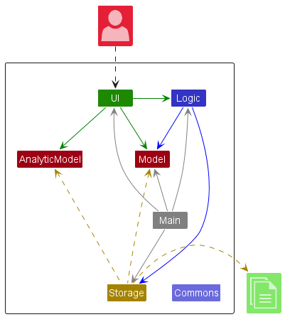

    <b>Figure 4.1.1</b> Architecture Diagram for the high-level design of the App

 

Given below is a quick overview of main components and how they interact with each other.

### **Main components of the architecture**

**`Main`** has two classes called [`Main`](https://github.com/AY2223S2-CS2103T-W14-2/tp/blob/master/src/main/java/seedu/address/Main.java) and [`MainApp`](https://github.com/AY2223S2-CS2103T-W14-2/tp/blob/master/src/main/java/seedu/address/MainApp.java). It is responsible for,
* At app launch: Initializes the components in the correct sequence, and connects them up with each other.
* At shut down: Shuts down the components and invokes cleanup methods where necessary.

[**`Commons`**](#common-classes) represents a collection of classes used by multiple other components.

The rest of the App consists of four components.

* [**`UI`**](#ui-component): The UI of the App.
* [**`Logic`**](#logic-component): The command executor.
* [**`Model`**](#model-component): Holds the data of the App in memory.
* [**`Storage`**](#storage-component): Reads data from, and writes data to, the hard disk.

### **How the architecture components interact with each other**

The *Sequence Diagram* below shows how the components interact with each other for the scenario where the user issues the command `delete 1`.

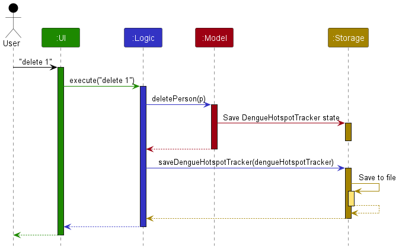

    <b>Figure 4.1.2</b> Sequence Diagram for the command <code>delete 1</code>

 

Each of the four main components (also shown in the diagram above),

* defines its *API* in an `interface` with the same name as the Component.
* implements its functionality using a concrete `{Component Name}Manager` class (which follows the corresponding API `interface` mentioned in the previous point.

For example, the `Logic` component defines its API in the `Logic.java` interface and implements its functionality using the `LogicManager.java` class which follows the `Logic` interface. Other components interact with a given component through its interface rather than the concrete class (reason: to prevent outside component's being coupled to the implementation of a component), as illustrated in the (partial) class diagram below.

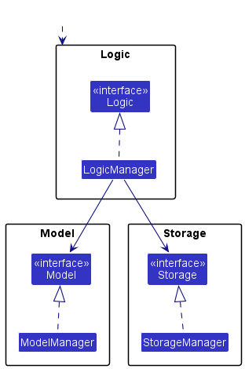

    <b>Figure 4.1.3</b> Class Diagram for Component Managers

 

The sections below give more details of each component.

---

## **UI Component**

The **API** of this component is specified in [`Ui.java`](https://github.com/AY2223S2-CS2103T-W14-2/tp/blob/master/src/main/java/seedu/address/ui/Ui.java)

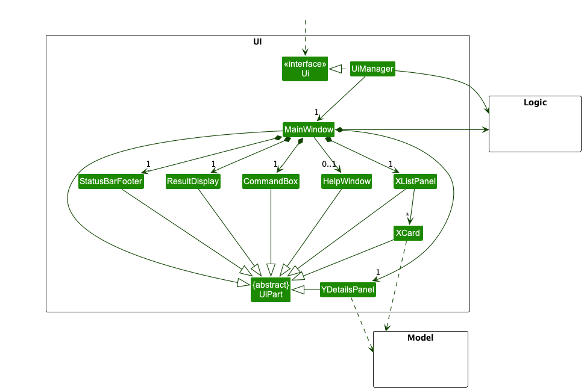

    <b>Figure 4.2.1</b> Class Diagram for UI Components

 

The UI consists of a `MainWindow` that is made up of parts e.g.`CommandBox`, `ResultDisplay`, `PersonListPanel`, `StatusBarFooter` etc. All these, including the `MainWindow`, inherit from the abstract `UiPart` class which captures the commonalities between classes that represent parts of the visible GUI.

The `UI` component uses the JavaFx UI framework. The layout of these UI parts are defined in matching `.fxml` files that are in the `src/main/resources/view` folder. For example, the layout of the [`MainWindow`](https://github.com/AY2223S2-CS2103T-W14-2/tp/blob/master/src/main/java/seedu/address/ui/MainWindow.java) is specified in [`MainWindow.fxml`](https://github.com/AY2223S2-CS2103T-W14-2/tp/blob/master/src/main/resources/view/MainWindow.fxml)

The `UI` component,

* executes user commands using the `Logic` component.
* listens for changes to `Model` data so that the UI can be updated with the modified data.
* keeps a reference to the `Logic` component, because the `UI` relies on the `Logic` to execute commands.
* depends on some classes in the `Model` component, as it displays `Person` object residing in the `Model`.

{to be filled by Zichen}

---

## **Model Component**

**API** : [`Model.java`](https://github.com/AY2223S2-CS2103T-W14-2/tp/blob/master/src/main/java/seedu/address/model/Model.java)

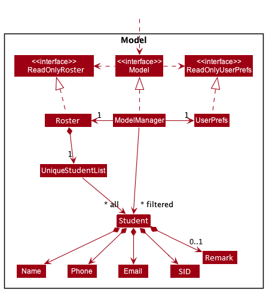

    <b>Figure 4.3.1</b> Class Diagram for Model Components

The `Model` component,

* stores the address book data i.e., all `Person` objects (which are contained in a `UniquePersonList` object).
* stores the currently 'selected' `Person` objects (e.g., results of a search query) as a separate _filtered_ list which is exposed to outsiders as an unmodifiable `ObservableList<Person>` that can be 'observed' e.g. the UI can be bound to this list so that the UI automatically updates when the data in the list change.
* stores a `UserPref` object that represents the user’s preferences. This is exposed to the outside as a `ReadOnlyUserPref` objects.
* does not depend on any of the other three components (as the `Model` represents data entities of the domain, they should make sense on their own without depending on other components)

### **Person**

**API** : [`Person.java`](https://github.com/AY2223S2-CS2103T-W14-2/tp/blob/master/src/main/java/seedu/address/model/person/Person.java)

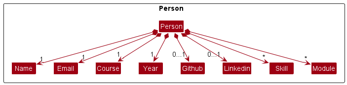

    <b>Figure 4.3.2</b> Class Diagram for Person Components

#### **Name**
#### **Address**
#### **Phone**
#### **Email**
#### **Telegram Handle**
#### **Group Tag Set**
#### **Module Tag Set**

### **Tag**
#### **Group Tag**
#### **Module Tag**

### **Utils**
#### **Sample Data Util**

---

## **Logic Component**

**API** : [`Logic.java`](https://github.com/AY2223S2-CS2103T-W14-2/tp/blob/master/src/main/java/seedu/address/logic/Logic.java)

Here's a (partial) class diagram of the `Logic` component:

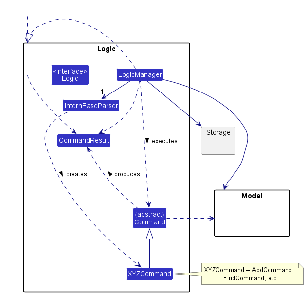

    <b>Figure 4.4.1</b> Class Diagram for Logic Components

 

How the `Logic` component works:
1. When `Logic` is called upon to execute a command, it uses the `EduMateParser` class to parse the user command.
2. This results in a `Command` object (more precisely, an object of one of its subclasses e.g., `AddCommand`) which is executed by the `LogicManager`.
3. The command can communicate with the `Model` when it is executed (e.g. to add a person).
4. The result of the command execution is encapsulated as a `CommandResult` object which is returned back from `Logic`.

### **Commands**
#### **Add Command**

The Sequence Diagram below illustrates the interactions within the `Logic` component for the `execute("add n/Bart...")` API call.

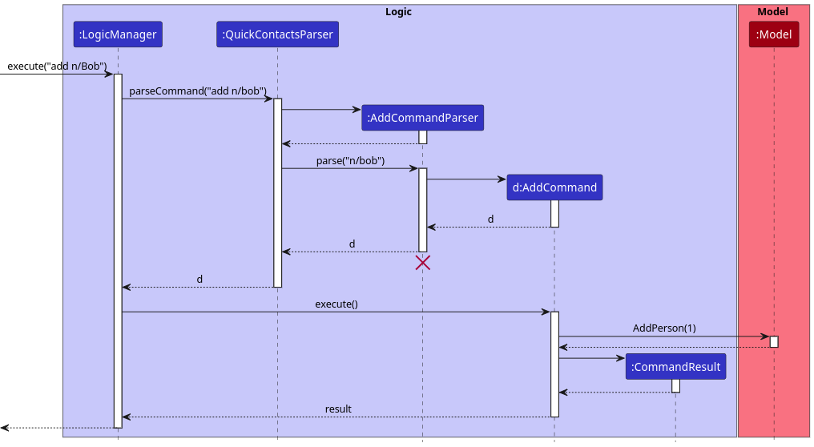

    <b>Figure 4.4.2</b> Sequence Diagram for a typical `add` command

 

:information_source: **Note:** The lifeline for `AddCommandParser` should end at the destroy marker (X) but due to a limitation of PlantUML, the lifeline reaches the end of diagram.

#### **Edit Command**

The Sequence Diagram below illustrates the interactions within the `Logic` component for the `execute("edit 1...")` API call.

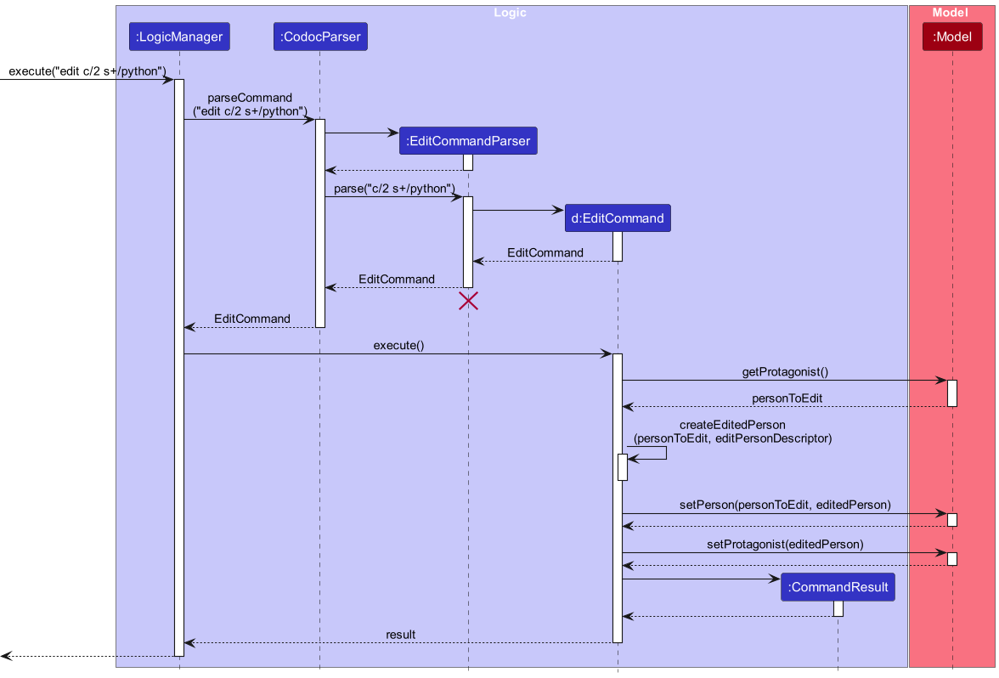

    <b>Figure 4.4.3</b> Sequence Diagram for a typical `edit` command

 

:information_source: **Note:** The lifeline for `EditCommandParser` should end at the destroy marker (X) but due to a limitation of PlantUML, the lifeline reaches the end of diagram.

#### **Delete Command**

The Sequence Diagram below illustrates the interactions within the `Logic` component for the `execute("delete 1")` API call.

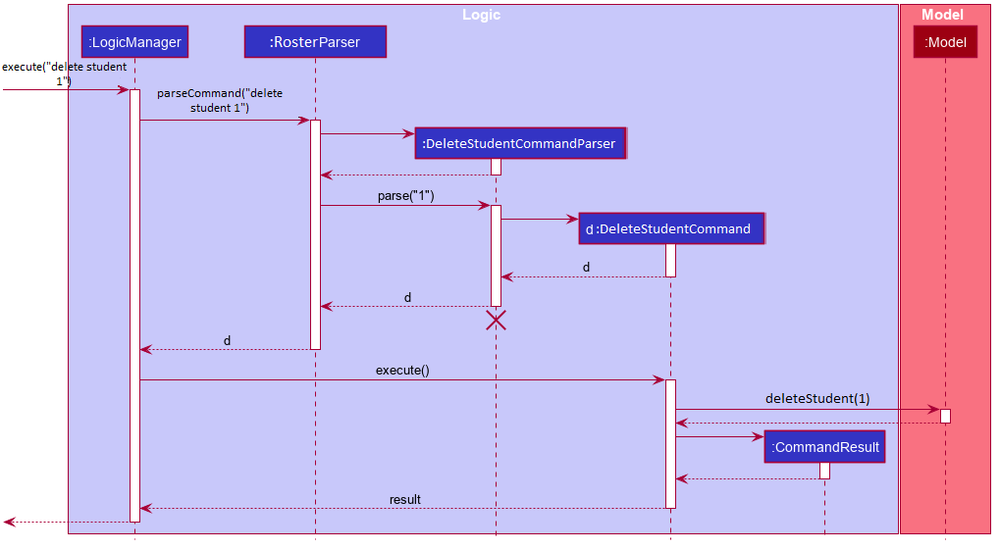

    <b>Figure 4.4.4</b> Sequence Diagram for a typical <code>delete</code> command

 

:information_source: **Note:** The lifeline for `DeleteCommandParser` should end at the destroy marker (X) but due to a limitation of PlantUML, the lifeline reaches the end of diagram.

#### **Tag Command**

{to be filled by Kenny}

#### **User Command**

{to be filled by Russell}

#### **Find Command**

{to be filled by Sean}

#### **Sort Command**

{to be filled by Hafeez}

#### **List Command**

{to be filled}

#### **Exit Command**

{to be filled}

### **Parsers**

Here are the other classes in `Logic` (omitted from the class diagram above) that are used for parsing a user command:

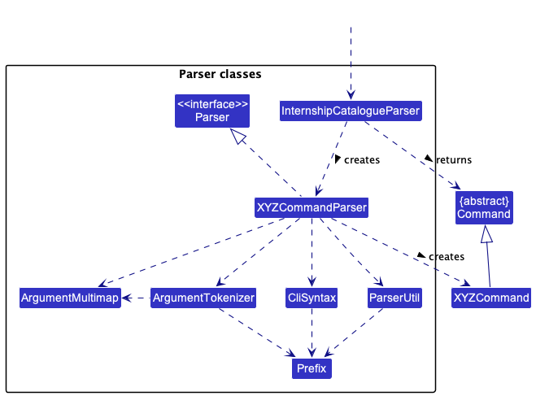

    <b>Figure 4.4.x</b> Class Diagram for Parser Components

 

How the parsing works:
* When called upon to parse a user command, the `EduMateParser` class creates an `XYZCommandParser` (`XYZ` is a placeholder for the specific command name e.g., `AddCommandParser`) which uses the other classes shown above to parse the user command and create a `XYZCommand` object (e.g., `AddCommand`) which the `EduMateParser` returns back as a `Command` object.
* All `XYZCommandParser` classes (e.g., `AddCommandParser`, `DeleteCommandParser`, ...) inherit from the `Parser` interface so that they can be treated similarly where possible e.g, during testing.

#### **Argument Multimap**

{to be filled}

#### **Prefix**

{to be filled}

---

## **Storage Component**

**API** : [`Storage.java`](https://github.com/AY2223S2-CS2103T-W14-2/tp/blob/master/src/main/java/seedu/address/storage/Storage.java)

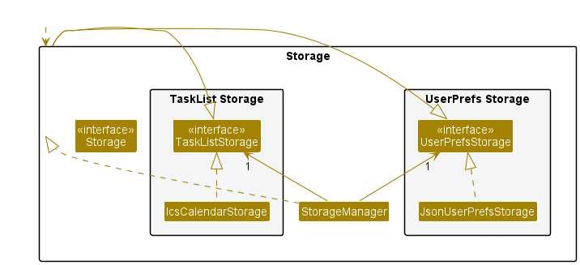

    <b>Figure 4.5.1</b> Class Diagram for Storage Components

 

The `Storage` component,
* can save both address book data and user preference data in json format, and read them back into corresponding objects.
* inherits from both `EduMateStorage` and `UserPrefStorage`, which means it can be treated as either one (if only the functionality of only one is needed).
* depends on some classes in the `Model` component (because the `Storage` component's job is to save/retrieve objects that belong to the `Model`)

---

## **Common Classes**

Classes used by multiple components are in the `seedu.address.commons` package.

# **5. Testing**

---

## **Unit Tests**

{to be filled}

### **Testing Models**
{to be filled}
### **Testing Commands**
{to be filled}
### **Testing Parsers**
{to be filled}

---

## **Measuring Coverage of Integration Tests**
{to be filled}
### **Create Code Coverage Report**
{to be filled}
### **Read Code Coverage Report**
{to be filled}

---

## **Continuous Integration**
{to be filled}

# **6. Documentation**

---

## **Useful Text Boxes**

:bulb: Use `alert-primary` to show tips for the developer

  

:heavy_check_mark: Use `alert-success` to tell the developer what should be done

:information_source: Use `alert-info` to show information for the developer

:warning: Use `alert-warning` to warn the user about performing a certain action

:warning::warning:  Use `alert-danger` to _**strongly**_ warn the user about performing a certain action

:construction: Use `alert-dark` to indicate a feature under development

---

## **Using PlantUML**

:bulb: **Tip:** The `.puml` files used to create diagrams in this document can be found in the [diagrams](https://github.com/se-edu/addressbook-level3/tree/master/docs/diagrams/) folder. Refer to the [_PlantUML Tutorial_ at se-edu/guides](https://se-education.org/guides/tutorials/plantUml.html) to learn how to create and edit diagrams.

# **7. Appendix**

---

## **Project Requirements**

### **Product Scope**

#### **Target user profile**

* has a need to manage a significant number of contacts
* prefer desktop apps over other types
* can type fast
* prefers typing to mouse interactions
* is reasonably comfortable using CLI apps
* is an NUS student

#### **Value proposition**

Help NUS students maintain both their social and academic life by lowering the barriers to meet up and make new friends within modules.

### **User Stories**

Priorities: High (must have) - `***`, Medium (nice to have) - `**`, Low (unlikely to have) - `*`

| Priority | As a …​   | I want to …​                                           | So that I can…​                              |
|----------|-----------|--------------------------------------------------------|----------------------------------------------|
| `***`    | student   | view all my modules in one place                       | be more organised in my work                 |
| `***`    | user      | use this app quickly with the command line             | quickly plan my modules                      |
| `***`    | user      | view my personal information                           | share it to whoever needs it                 |
| `***`    | user      | update my profile                                      | personalise my experience                    |
| `***`    | user      | add module tags to new contacts                        | track what modules my friends are taking     |
| `***`    | user      | tag and untag modules from existing contacts           | be flexible in recording my friends' modules |
| `***`    | user      | filter my contacts based on module tag                 | find friends taking the same module as me    |
| `**`     | user      | sort my contacts based on the number of shared modules | find out who are likely my close friends     |

### **Use Cases**

(For all use cases below, the **System** is the `EduMate` and the **Actor** is the `user`, unless specified otherwise)

**Use case: UC01 - View the list of all contacts**

**MSS**

1. User requests to list contacts.
2. EduMate shows a list of all contacts.

   Use case ends.

**Extensions**

* 2a. The list is empty.

  Use case ends.

**Use case: UC02 - Add a contact**

**MSS**

1. User requests to add a person to the contact list with their details.
2. EduMate shows the list of contacts with the newly added person.

   Use case ends.

**Extensions**

* 1a. The given details are invalid.
    * 1a1. EduMate shows an error message.

  Use case resumes at step 1
* 1b. The person already exists in the contact list.
    * 1b1. EduMate shows an error message.

  Use case resumes at step 1

**Use case: UC03 - Edit a contact**

**MSS**

1. User requests to edit a person's details with new information.
2. EduMate edits the person's information.

   Use case ends.

**Extensions**

* 1a. The given index is invalid.
    * 1a1. EduMate shows an error message.

  Use case resumes at step 1.
* 1b. The given details are invalid.
    * 1b1. EduMate shows an error message.

  Use case resumes at step 1.

**Use case: UC04 - Delete a contact**

1. User requests to delete a person from the contact list.
2. EduMate deletes the person from the contact list.

   Use case ends.

**Extensions**

* 1a. The given index is invalid.
    * 1a1. EduMate shows an error message.

  Use case resumes at step 1.

**Use case: UC05 - Tag a module to a contact**

1. User requests to add a module tag to a contact.
2. EduMate tags the module to the contact.

   Use case ends.

**Extensions**

* 1a. The given index is invalid.
    * 1a1. EduMate shows an error message.

  Use case resumes at step 1.

* 1b. The given details is invalid.
    * 1b1. EduMate shows an error message.

  Use case resumes at step 1.

**Use case: UC06 - Untag a module from a contact**

1. User requests to remove a module tag from a contact.
2. EduMate untags the module from the contact.

   Use case ends.

**Extensions**

* 1a. The given index is invalid.
    * 1a1. EduMate shows an error message.

  Use case resumes at step 1.

* 1b. The given details is invalid.
    * 1b1. EduMate shows an error message.

  Use case resumes at step 1.

**Use case: UC07 - Tag a group to a contact**

1. User requests to add a group tag to a contact.
2. EduMate tags the group to the contact.

   Use case ends.

**Extensions**

* 1a. The given index is invalid.
    * 1a1. EduMate shows an error message.

  Use case resumes at step 1.

* 1b. The given details is invalid.
    * 1b1. EduMate shows an error message.

  Use case resumes at step 1.

**Use case: UC08 - Untag a group from a contact**

1. User requests to remove a group tag from a contact.
2. EduMate untags the group from the contact.

   Use case ends.

**Extensions**

* 1a. The given index is invalid.
    * 1a1. EduMate shows an error message.

  Use case resumes at step 1.

* 1b. The given details is invalid.
    * 1b1. EduMate shows an error message.

  Use case resumes at step 1.

**Use case: UC09 - Find contacts based on search criteria**

1. User requests to <u>view the list of contacts (UC01)</u>.
2. User requests to find contacts based on search criteria.
3. EduMate shows a list of contacts satisfying the search criteria.

   Use case ends.

**Extensions**

* 2a. The given details are invalid.
    * 2a1. EduMate shows an error message.

* 3a. The filtered list is empty.

  Use case ends

**Use case: UC10 - Sort contacts based on matching modules**

1. User requests to <u>view the list of contacts (UC01)</u>.
2. User requests to sort contacts.
3. EduMate shows a list of contacts sorted by their number of shared modules.

   Use case ends.

**Extensions**

* 3a. The sorted list is empty.

  Use case ends.

**Use case: UC11 - View user profile**

1. User requests to view their user profile.
2. EduMate shows the user information.

   Use case ends.

**Extensions**

* 2a. User information is empty.

  Use case ends.

### **Non-Functional Requirements**

1. Should work on any _mainstream OS_ as long as it has Java `11` or above installed.
2. Should be able to hold up to 1000 persons without a noticeable sluggishness in performance for typical usage.
3. A user with above average typing speed for regular English text (i.e. not code, not system admin commands) should be able to accomplish most of the tasks faster using commands than using the mouse.
4. Any user action should be parsed and executed within 1 second.
5. Each person should be able to hold up to 10 group and module tags without a noticeable sluggishness in performance for typical usage.
6. The product does not require internet connection to function.
7. The code should be open source.

---

## **Instructions for Manual Testing**

Given below are instructions to test the app manually.

:information_source: **Note:** These instructions only provide a starting point for testers to work on;
testers are expected to do more *exploratory* testing.

### **Launch and shutdown**

1. Initial launch

    * 1a. Download the jar file and copy into an empty folder

    * 1b. Double-click the jar file Expected: Shows the GUI with a set of sample contacts. The window size may not be optimum.

2. Saving window preferences

    * 2a. Resize the window to an optimum size. Move the window to a different location. Close the window.

    * 2b. Re-launch the app by double-clicking the jar file. 
      Expected: The most recent window size and location is retained.

### **Deleting a person**

1. Deleting a person while all persons are being shown

    * 1a. Prerequisites: List all persons using the `list` command. Multiple persons in the list.

    * 1b. Test case: `delete 1` 
      Expected: First contact is deleted from the list. Details of the deleted contact shown in the status message. Timestamp in the status bar is updated.

    * 1c. Test case: `delete 0` 
      Expected: No person is deleted. Error details shown in the status message. Status bar remains the same.

    * 1d. Other incorrect delete commands to try: `delete`, `delete x`, `...` (where x is larger than the list size) 
      Expected: Similar to previous.

### **Saving data**

1. Dealing with missing/corrupted data files

   * 1a. _{explain how to simulate a missing/corrupted file, and the expected behavior}_

---

## **Glossary**

* **Command Line Interface (CLI)**: A text-based user interface (UI) used to run programs, manage computer files and interact with the computer
* **Graphical User Interface (GUI)**: A form of user interface that allows users to interact with electronic devices through graphical icons
* **Mainstream OS**: Windows, Linux, Unix, OS-X
* **NUS**: National University of Singapore
* **Private contact detail**: A contact detail that is not meant to be shared with others
* **Pull Request (PR)**: An event that takes place in software development when a contributor/developer is ready to begin the process of merging new code changes with the main project repository
* **Repo (Repository)**: A storage location for software packages, mainly residing on GitHub

---

## **Documentation, logging, testing, configuration, dev-ops**

* [Documentation guide](Documentation.md)
* [Testing guide](Testing.md)
* [Logging guide](Logging.md)
* [Configuration guide](Configuration.md)
* [DevOps guide](DevOps.md)

---
