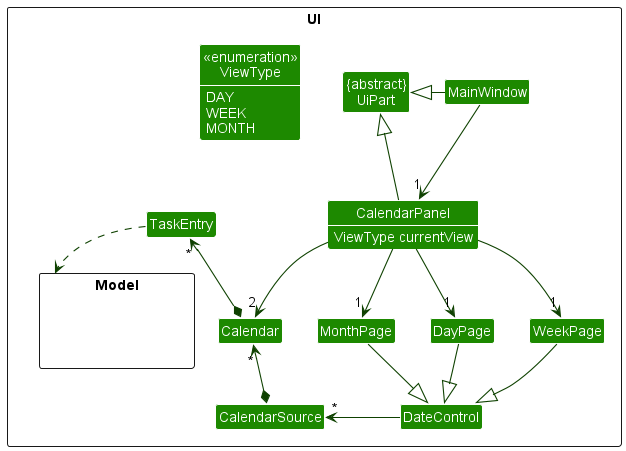
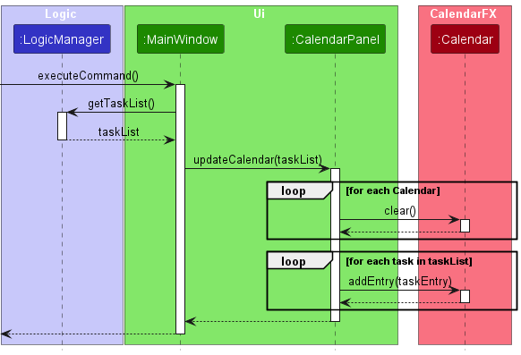
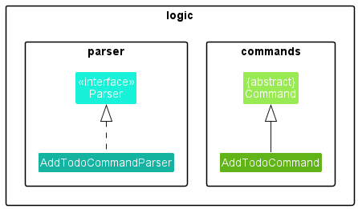
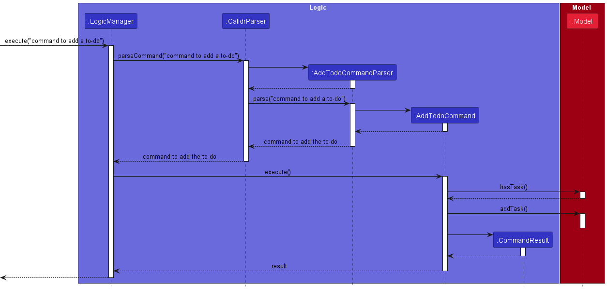
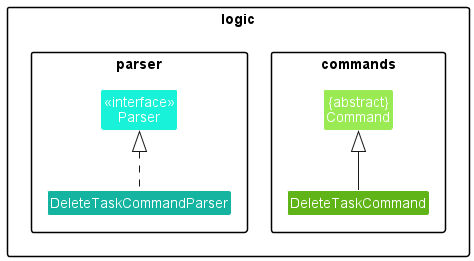
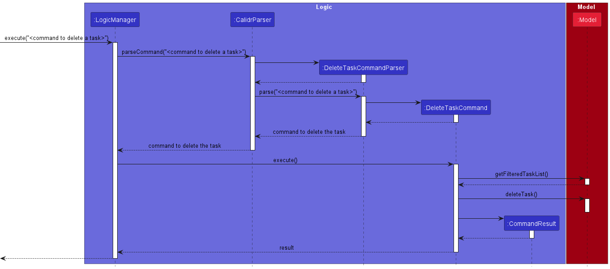
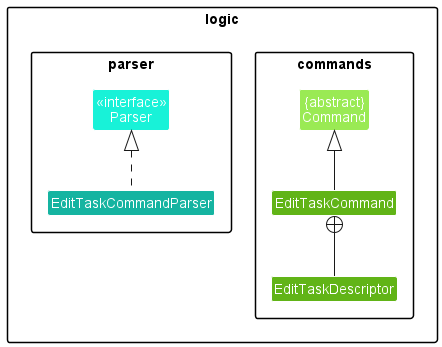

* Table of Contents
  {:toc}

--------------------------------------------------------------------------------------------------------------------

Calidr is a **time-management and scheduling calendar application**, optimized for use via a Command Line Interface (
CLI) while still having the benefits of a Graphical User Interface (GUI). This application uses the AddressBook-Level3
project created by the [SE-EDU initiative](https://se-education.org/) as its framework.

## Implementation

This section describes how certain components and features are implemented.

### Calendar Panel

The `CalendarPanel` is the component that displays the calendar graphically, featuring several calendar formats. It is
read-only,
extends AB3's `UIPart`, replaces `PersonListPanel` and is implemented using the
open-source [CalendarFX](https://github.com/dlsc-software-consulting-gmbh/CalendarFX) framework.

The `CalendarPanel` is instantiated in `MainWindow` with a `DateControl` object. The `TaskEntry` class encapsulates all
the information of a task, including its description, date, time and tags; by extending the `Entry` class of CalendarFX,
it is able to be displayed on the `DateControl` object.

`CalendarPanel` implements the following operations:

- `updateCalendar(taskList)`— Updates the `CalendarView` object with a `ReadOnlyTaskList `.
- `showInformationDialog(entry)`— Spawns a dialog box with additional information of a `TaskEntry`.
- `setDate(date)`, `goToToday()`, `goToNext()`, `goToPrevious()`— Operations which change the date (or month) shown by
  the `CalendaraPanel`. The default date on startup is the current date.
- `setPage(view)`, `nextPage()`, — Changes the page (layout) of the `CalendarPanel` to a `DAY_VIEW`, `WEEK_VIEW`
  or `MONTH_VIEW`. The default view on startup is `MONTH_VIEW`.

The `CalendarPanel` holds three `DateControl` objects, each representing a different view of the calendar. Only one is
visible and managed by the `CalendarPanel` at any given time, and it is possible to switch between the three views.

`Event` and `ToDo`-derived `TaskEntry`s are each held in two different `Calendar` objects, so that they can be styled
differently.

The `CalendarPanel` is updated by calling `updateCalendar(taskList)` with a `ReadOnlyTaskList` object. This method is
invoked by `MainWindow` after a command is executed.

Below is a sequence diagram of the `updateCalendar(taskList)` operation:

### Add ToDo Feature
This feature enables the user to add a to-do to the list of tasks. It is implemented in a way that mirrors the _**Add Person**_ feature in AB3.

The following class diagram shows the classes that help achieve this functionality.

The `AddTodoCommandParser` parses the required details, to create the `ToDo` to be added, and returns an `AddTodoCommand`, that is executed.

The execution of an `AddTodoCommand` makes use of the following functions provided by the `Model`:
- `Model#hasTask` - to prevent duplication of a to-do
- `Model#addTask` - to add the `ToDo` to the `UniqueTaskList`

The following sequence diagram shows how the _**Add ToDo**_ feature works.

#### Design Considerations
The _**Add ToDo**_ feature is implemented in this way so as to make it similar to the analogous _**Add Person**_ feature of AB3. Since Calidr uses the same overall architecture as AB3, such an implementation was chosen.

### Add Event Feature
This feature enables the user to add an event to the list of tasks. It is implemented in a way that mirrors the _**Add Person**_ feature in AB3.

The following class diagram shows the classes that help achieve this functionality.

The `AddEventCommandParser` parses the required details, to create the `Event` to be added, and returns an `AddEventCommand`, that is executed.

The execution of an `AddEventCommand` makes use of the following functions provided by the `Model`:
- `Model#hasTask` - to prevent duplication of an event
- `Model#addTask` - to add the `Event` to the `UniqueTaskList`

The following sequence diagram shows how the _**Add Event**_ feature works.

#### Design Considerations
The _**Add Event**_ feature is implemented in this way so as to make it similar to the analogous _**Add Person**_ feature of AB3. Since Calidr uses the same overall architecture as AB3, such an implementation was chosen.

### Delete Task Feature
This feature enables the user to delete a task from the list of tasks. It is implemented in a way that mirrors the _**Delete Person**_ feature in AB3.

The following class diagram shows the classes that help achieve this functionality.

The `DeleteTaskCommandParser` parses the required details, to find the `Task` to be deleted, and returns a `DeleteTaskCommand`, that is executed.

The execution of an `DeleteTaskCommand` makes use of the following functions provided by the `Model`:
- `Model#getFilteredTaskList` - to access the list of tasks, to find the task to be deleted
- `Model#deleteTask` - to delete the `Task` from the `UniqueTaskList`

The following sequence diagram shows how the _**Delete Task**_ feature works.

#### Design Considerations
The _**Delete Task**_ feature is implemented in this way so as to make it similar to the analogous _**Delete Person**_ feature of AB3. Since Calidr uses the same overall architecture as AB3, such an implementation was chosen.

### Edit task feature

The `EditTaskCommand` class represents a command that edits an **existing** task. It takes in the index of the task in the task list to be edited and an `EditTaskDescriptor` object. The `EditTaskDescriptor` class is a helper class that stores the new details of the task to be updated. The `execute` method updates the task in the model with the new details and returns a `CommandResult`.

#### Sequence diagram here

`EditTaskCommand` is facilitated by `EditTaskCommandParser` which parses and provides the fields entered by the user in the required format.

Internally, the `EditTaskDescriptor` is casted to either a `EditTodoDescriptor` or `EditEventDescriptor` based on the type of task to be edited. The relevant information is used to create a new `Todo` or `Event` object with the updated fields.

The newly created object replaces the task to be edited in the `TaskList`. Finally, an output is displayed with the status of the edit operation and the updated task details.

<!-- 
To provide an example of how this feature works, consider the following usage scenario. -->

#### Design considerations:
**Aspect: How edit command executes**

* **Alternative 1 (current choice):** Overwrite all existing task fields if any of them is modified.
    * Pros: Easy to implement.
    * Cons: Might be inefficient in terms of resource usage and possibly cause delays

* **Alternative 2:** Only update the task fields that were changed.
    * Pros: Will use less resources and time, thus improving system performance.
    * Cons: Requires more complex implementation logic to track and update the modified fields.

## Appendix

### Requirements

#### Target User Profile

* NUS staff or student
* prefer desktop apps over other types
* can type fast
* prefers typing to mouse interactions
* is reasonably comfortable using CLI apps

#### Value Proposition
* Text-based timetable management
    * Add todos and events
    * Add reminders to todo/event
    * Search
    * /view day
    * /view month

#### User Stories

| As a ...                         | I want to ...                                                                                         | So that I can ...                                                                                                                                                     | Priority |
|----------------------------------|-------------------------------------------------------------------------------------------------------|-----------------------------------------------------------------------------------------------------------------------------------------------------------------------|----------|
| NUS staff/student                | add my classes and todos to my calendar                                                               | keep track of my daily schedule.                                                                                                                                      | *High*   |
| NUS staff/student                | add a title to an event/todo during it's creation                                                     | distinguish events/todos                                                                                                                                              | *High*   |
| NUS staff/student                | import/export my calendar as an iCalendar (`.ics`) file                                               | save it as an offline copy                                                                                                                                            | *High*   |
| NUS student                      | set notifications for upcoming exams and assignments                                                  | not forget to complete them on time.                                                                                                                                  | *High*   |
| NUS student with a busy schedule | view my calendar in different views (daily, weekly, monthly)                                          | get a comprehensive view of my schedule.                                                                                                                              | *Mid*    |
| NUS staff/student                | search/sort for todos <ul><li>by description</li><li>by a range of dates</li><li>by recency</li></ul> | <ul><li>look for specific or related todos for editing</li><li>check my availability during holidays/exam weeks</li><li>identify todos with higher priority</li></ul> | *High*   |
| NUS staff/student                | set (during creation) the duration for a certain event                                                | manage todos that occur over a span of time.                                                                                                                          | *High*   |
| NUS staff/student                | change the duration of a event after its creation                                                     | make changes if I make mistakes                                                                                                                                       | *Mid*    |
| NUS staff/student                | set tags on events and todos                                                                          | easily find them again                                                                                                                                                | *Mid*    |
| NUS staff/student                | add a priority to todo                                                                                | keep track of them easily                                                                                                                                             | *Mid*    |
| NUS staff/student                | be able to change the name of a event/todo after its creation                                         | -                                                                                                                                                                     | *Low*    |
| NUS staff/student                | set a recurrence for a todo/event                                                                     | save time on repeating todos                                                                                                                                          | *Low*    |
| NUS staff/student                | keep track of my todos in a list                                                                      | refer to them in a convenient fashion                                                                                                                                 | *High*   |
| NUS staff/student                | add notes or comments to each event in my calendar                                                    | note down non-critical but useful information.                                                                                                                        | *Low*    |
| NUS staff/student                | be able to add a description to a todo/event                                                          | keep track of additional details                                                                                                                                      | *High*   |
| NUS staff/student                | add an optional location to my todos                                                                  | record specific addresses if it is a place I need to be.                                                                                                              | *Low*    |

### Use Cases

(For all use cases below, the System is Calidr and the Actor is the user, unless specified otherwise)

#### Change the duration of an event

**MSS**

1. User requests to list events
1. Calidr shows a list of events
1. User requests to query a specific event in the list by index and overwrite the date fields with a new value
1. Calidr modifies and saves the new dates for the event.
   Use case ends.

**Extensions**

- 2a. The list is empty.
Use case ends.
- 3a. The given index is invalid.
- 3a1. Calidr shows an error message.
Use case resumes at step 2.

### Non-functional requirements

1. Should work on any mainstream OS (in particular file I/O) with Java 11 installed.
2. Should be able to manage 1000 items without a noticeable sluggishness in performance for typical usage.
3. A user with above average typing speed for regular English text (i.e. not code, not system admin commands) should be able to accomplish most of the todos faster using commands than using the mouse.

### Glossary

1. **Mainstream OS**: Windows, Linux, Unix, OS-X
1. **Tasks**: Elements on a calendar.
    a. **ToDos**: Items with a single associated date-time (e.g. a due date) and status (done or not done).
    b. **Events**: Items with two associated date-times.
