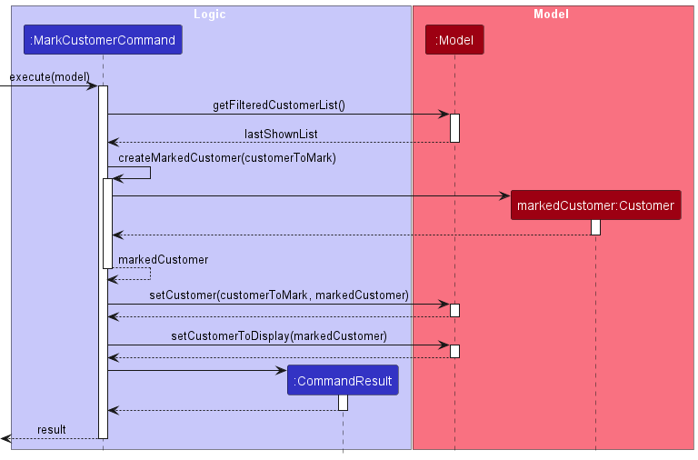

* Table of Contents
{:toc}

--------------------------------------------------------------------------------------------------------------------

## **Acknowledgements**

* {list here sources of all reused/adapted ideas, code, documentation, and third-party libraries -- include links to the original source as well}

--------------------------------------------------------------------------------------------------------------------

## **Setting up, getting started**

Refer to the guide [_Setting up and getting started_](SettingUp.md).

--------------------------------------------------------------------------------------------------------------------

## **Design**

:bulb: **Tip:** The `.puml` files used to create diagrams in this document can be found in the [diagrams](https://github.com/se-edu/addressbook-level3/tree/master/docs/diagrams/) folder. Refer to the [_PlantUML Tutorial_ at se-edu/guides](https://se-education.org/guides/tutorials/plantUml.html) to learn how to create and edit diagrams.

### Architecture

The ***Architecture Diagram*** given above explains the high-level design of the App.

Given below is a quick overview of main components and how they interact with each other.

**Main components of the architecture**

**`Main`** has two classes called [`Main`](https://github.com/se-edu/addressbook-level3/tree/master/src/main/java/seedu/address/Main.java) and [`MainApp`](https://github.com/se-edu/addressbook-level3/tree/master/src/main/java/seedu/address/MainApp.java). It is responsible for,
* At app launch: Initializes the components in the correct sequence, and connects them up with each other.
* At shut down: Shuts down the components and invokes cleanup methods where necessary.

[**`Commons`**](#common-classes) represents a collection of classes used by multiple other components.

The rest of the App consists of four components.

* [**`UI`**](#ui-component): The UI of the App.
* [**`Logic`**](#logic-component): The command executor.
* [**`Model`**](#model-component): Holds the data of the App in memory.
* [**`Storage`**](#storage-component): Reads data from, and writes data to, the hard disk.

**How the architecture components interact with each other**

The *Sequence Diagram* below shows how the components interact with each other for the scenario where the user issues the command `delete 1`.

Each of the four main components (also shown in the diagram above),

* defines its *API* in an `interface` with the same name as the Component.
* implements its functionality using a concrete `{Component Name}Manager` class (which follows the corresponding API `interface` mentioned in the previous point.

For example, the `Logic` component defines its API in the `Logic.java` interface and implements its functionality using the `LogicManager.java` class which follows the `Logic` interface. Other components interact with a given component through its interface rather than the concrete class (reason: to prevent outside component's being coupled to the implementation of a component), as illustrated in the (partial) class diagram below.

The sections below give more details of each component.

### UI component

The **API** of this component is specified in [`Ui.java`](https://github.com/se-edu/addressbook-level3/tree/master/src/main/java/seedu/address/ui/Ui.java)

The UI consists of a `MainWindow` that is made up of parts e.g.`CommandBox`, `ResultDisplay`, `CustomerListPanel`, `StatusBarFooter` etc. All these, including the `MainWindow`, inherit from the abstract `UiPart` class which captures the commonalities between classes that represent parts of the visible GUI.

The `UI` component uses the JavaFx UI framework. The layout of these UI parts are defined in matching `.fxml` files that are in the `src/main/resources/view` folder. For example, the layout of the [`MainWindow`](https://github.com/se-edu/addressbook-level3/tree/master/src/main/java/seedu/address/ui/MainWindow.java) is specified in [`MainWindow.fxml`](https://github.com/se-edu/addressbook-level3/tree/master/src/main/resources/view/MainWindow.fxml)

The `UI` component,

* executes user commands using the `Logic` component.
* listens for changes to `Model` data so that the UI can be updated with the modified data.
* keeps a reference to the `Logic` component, because the `UI` relies on the `Logic` to execute commands.
* depends on some classes in the `Model` component, as it displays `Customer` and `Order` objects residing in the `Model`.

### Logic component

**API** : [`Logic.java`](https://github.com/AY2223S2-CS2103T-T09-3/tp/blob/master/src/main/java/seedu/loyaltylift/logic/Logic.java)

Here's a (partial) class diagram of the `Logic` component:

How the `Logic` component works:
1. When `Logic` is called upon to execute a command, it uses the `AddressBookParser` class to parse the user command.
1. This results in a `Command` object (more precisely, an object of one of its subclasses e.g., `AddCustomerCommand`) which is executed by the `LogicManager`.
1. The command can communicate with the `Model` when it is executed (e.g. to add a customer).
1. The result of the command execution is encapsulated as a `CommandResult` object which is returned back from `Logic`.

The Sequence Diagram below illustrates the interactions within the `Logic` component for the `execute("deletec 1")` API call.

:information_source: **Note:** The lifeline for `DeleteCustomerCommandParser` should end at the destroy marker (X) but due to a limitation of PlantUML, the lifeline reaches the end of diagram.

Here are the other classes in `Logic` (omitted from the class diagram above) that are used for parsing a user command:

How the parsing works:
* When called upon to parse a user command, the `AddressBookParser` class creates an `XYZCommandParser` (`XYZ` is a placeholder for the specific command name e.g., `AddCustomerCommandParser`) which uses the other classes shown above to parse the user command and create a `XYZCommand` object (e.g., `AddCustomerCommand`) which the `AddressBookParser` returns back as a `Command` object.
* All `XYZCommandParser` classes (e.g., `AddCustomerCommandParser`, `DeleteCustomerCommandParser`, ...) inherit from the `Parser` interface so that they can be treated similarly where possible e.g, during testing.

### Model component
**API** : [`Model.java`](https://github.com/AY2223S2-CS2103T-T09-3/tp/blob/master/src/main/java/seedu/loyaltylift/model/Model.java)

The `Model` component,

* stores the LoyaltyLift data i.e., all `Customer` objects (which are contained in a `UniqueCustomerList` object), as well as all `Order` objects (which are contained in a `UniqueOrderList` object)
* stores the currently 'selected' `Customer` and `Order` objects (e.g., results of a search query) as a separate _filtered_ list which is exposed to outsiders as an unmodifiable `ObservableList<Customer>` and `ObservableList<Order>` respectively, that can be 'observed' e.g. the UI can be bound to this list so that the UI automatically updates when the data in the list change.
* stores a `UserPref` object that represents the user’s preferences. This is exposed to the outside as a `ReadOnlyUserPref` objects.
* does not depend on any of the other three components (as the `Model` represents data entities of the domain, they should make sense on their own without depending on other components)

### Storage component

**API** : [`Storage.java`](https://github.com/se-edu/addressbook-level3/tree/master/src/main/java/seedu/address/storage/Storage.java)

The `Storage` component,
* can save both address book data and user preference data in json format, and read them back into corresponding objects.
* inherits from both `AddressBookStorage` and `UserPrefStorage`, which means it can be treated as either one (if only the functionality of only one is needed).
* depends on some classes in the `Model` component (because the `Storage` component's job is to save/retrieve objects that belong to the `Model`)

### Common classes

Classes used by multiple components are in the `seedu.addressbook.commons` package.

--------------------------------------------------------------------------------------------------------------------

## **Implementation**

This section describes some noteworthy details on how certain features are implemented.

### Bookmark Customer 

The commands `markc` and `unmarkc` are responsible for bookmarking or un-bookmarking a customer respectively. 
Parsing of the user input is done by the `LogicManager` and `AddressBookParser` (as explained in the section of [Logic component](#logic-component)).

Using `markc` command as an example, the parsing process will create a `MarkCustomerCommand` object.
The `MarkCustomerCommand` is then executed, and its process is described in the following sequence diagram.

 
1. The list of filtered customers is retrieved from the `Model`, and the index is used to find the customer that needs to be bookmarked.
2. A new `Customer` object is created with it's `Marked` attribute to reflect that it is bookmarked.
3. `Model` is called again to replace the original customer to the newly created customer.

The sequence for `unmarkc` command is similar as the above.

### Future Enhancements

Instead of using commands to manipulate the bookmark-ed status of a customer, LoyaltyLift can allow users to use the mouse to select the bookmark icon to swap between bookmarked and not bookmarked.
As we wanted to ensure that LoyaltyLift is optimised as a CLI application, we prioritised the implementation of `markc` and `unmarkc` over the ability to select on the graphical user interface.
However, certain users may find it more convenient to select the icon or prefer the flexibility of doing both depending on the situation.

### Add/Deduct reward points feature

#### Implementation

From `Points` class, a new feature of adding and deducting from the points a customer has, was required.
A cumulative points system also had to be introduced. Adding points should increase the cumulative points a customer
has while deducting points should not affect the cumulative points of the customer.

As a result, a new attribute, `cumulative` was introduced to `Points`.
For the parsing of the `addpoints` command, I had to consider between different design choices.
The one I ultimately settled on was merely utilising `Integer.valueOf` method to parse the points inputted by the user.
Also, in the execution of `AddPointsCommand` class, the points to add would exist as an Integer object instead of a
`Points` object. The addition or subtraction of points from the `Points` class would then be as simple as adding the
points to current points and cumulative points when it is positive, and subtracting from current points when it is 
negative. This simple design would be sufficient to achieve the intended feature.
Lastly, to store the cumulative points of `Customer`, a new attribute, `cumulativePoints` was introduced to the
`JsonAdaptedCustomer`.

### Alternatives considered
There were other designs I was considering, listed below.

1. A design choice I had to make was for the `addpoints` command, originally I intended for the command users inputted
to include a modifier syntax for the user to specify if he or she wishes to add or subtract points.
For instance, the command could be `addpoints 1 mod/- pt/100` to indicate that the user wants to subtract 100 points
from the customer in the first index. I wanted to follow this implementation as many commands follow the syntax of
`[PREFIX]/` for the user to specify their command. However, I subsequently decided that this may be too inconvenient for
the user, and since it is intuitive for 100 or -100 points to exist, I decided to allow the specification of the
modifier of points to come after `pt/`
2. I also considered to have a static inner class, as encapsulation of the information of the addition or subtraction
of points, and for `AddPointsCommand` to take in a `Points.AddPoints` as an attribute. This would allow an enum
modifier to exist within the `AddPoints` inner class, allowing future extension of editing reward points by simply
including new enumeration of modifiers. This would also allow a validity check of the points to be added or deducted.
However, with the help of my teammate, I later decided that this may not be necessary as checking the validity of the
resultant `Points` after adding or subtracting is sufficient. Moreover, utilising the `Integer.valueOf` method in
`AddPointsCommandParser` would make parsing much simpler as compared to evaluating the modifier in front of points.
This simpler design would also be sufficient as we had no plans to incorporate
features other than the addition or subtraction of points.

### Customer and Order Notes

#### Implementation

A **note** is any string that is associated with a `Customer` or an `Order`.

To implement this, a new `note` field of type `Note` has been added to `Customer` and `Order`.

* `Note` is a class with a `String` field that can take any value except `null`.
* If a `Customer` or `Order` has a note, a **Note** section will be shown in their view panel
* An empty note is indicated by a blank string, in which case the **Note** section will not be shown.

There are four commands to manipulate a given customer/order's note

* `setnotec` to set or overwrite a `Customer`'s note
* `appendnotec` to add some string to the end of a `Customer`'s existing note
* `setnoteo` to set or overwrite an `Order`'s note
* `appendnoteo` to add some string to the end of an `Order`'s existing note

We settled on just a **set** and **append** command as deleting a note can be done by simply setting the note to an empty string. On the other hand, there is no clear way to edit text in a CLI application.

#### Potential Enhancements

* **Multiple Notes**

  Currently, a customer/order can have a single note. It may be useful if  they can have multiple notes instead. This would involve an alternative set of commands to add and remove notes for a given customer/order.

* **Note Tags**

  Different notes between different customers and orders may have related themes. Thus, the ability to add tags to these related notes can help the user group their notes.

  This could be done inline using a special character (e.g. `#`) within the note itself, where the system would automatically detect the tags.

  We can then provide an additional command to view all the notes with a specific tag, along with their associated customer/order.

### Sorting feature

Customers and Orders can be sorted by certain attributes. We decided to implement the sorting as a parameter for the list commands.

The sorting is done by adding a JavaFX `SortedList` to the `Model`, with the original `FilteredList` as its source. This `SortedList` is then used to display the customer and order list in place of the `FilteredList`.

The `SortedList` can be sorted by a `Comparator`.

* The `Comparator`s for each sorting option is provided as static constants by the `Customer` and `Order` class.
* To facilitate the comparators, the relevant attribute classes (e.g. `Name` and `Points`) will also implement the `Comparable` interface.

### Order Status

An order's `status` attribute represents the stage of an order, which can be one of these:
* Pending
* Paid
* Shipped
* Completed
* Cancelled

**Note:** Other than the `Cancelled` stage, an order is expected to start from `Pending` and proceed along the order as mentioned above.

For the implementation, we introduce a few classes. Firstly, `StatusValue` is an enumeration whose values are the stages mentioned above.
Next, a `StatusUpdate` class encapsulates a `StatusValue` and a date. 
Finally, a `Status` class serves as the attribute of an Order that has many `StatusUpdate`.

A `StatusUpdate` represents the information of when the `Order` transitions into the stage of `StatusValue` it has. 
Thus, an order's `Status` has an association with many `StatusUpdate` to represent the history of how an order progresses from one stage to another.

#### Alternative Approaches

We also considered implementing the status attribute as an array of dates with a size of 5. 
Each entry of this array would correspond to each possible stage of the order.

However, this design would not be extensible for including other information such as a note or comment for each stage.
Furthermore, this design assumes that the order's status can only move forward in progress and cannot revert without losing information.
E.g. An order may return from `Shipped` to `Paid` again if the shipping fails to succeed for the business owner.

With the current implemented approach, `StatusUpdate` can encapsulate other information such as the comment or note. 
Furthermore, `Status` class which has many `StatusUpdate` which does not assume the size of it or any other information.
Hence, this potentially allows subsequent `StatusUpdate` to have a stage that is before the previous entry of `StatusUpdate`.
More details are explained in **Potential Enhancements**.

#### Potential Enhancements

* **Improvement in Reverting Order Progress**

  Currently, the implementation reverts an order's status by deleting the latest `StatusUpdate`. 
  Hence, information is lost that an order was once in that state before returning back.
  Furthermore, `Status` sorts `StatusUpdate` by its `StatusValue` so that the assumption that the latest entry is the latest is always true.

  In the future, it may be useful that the information are preserved and not deleted from the system. 
  A potential implementation is by appending new `StatusUpdate` into `Status` instead of deleting the latest entry.
  However, do note that the sorting logic must be updated.

* **More Status Information**

  In the future, the user may find it useful to provide additional information when updating its order status.
  Eg. Add notes about the shipping details when the order updates from `Paid` to `Shipped`.

### \[Proposed\] Undo/redo feature

#### Proposed Implementation

The proposed undo/redo mechanism is facilitated by `VersionedAddressBook`. It extends `AddressBook` with an undo/redo history, stored internally as an `addressBookStateList` and `currentStatePointer`. Additionally, it implements the following operations:

* `VersionedAddressBook#commit()` — Saves the current address book state in its history.
* `VersionedAddressBook#undo()` — Restores the previous address book state from its history.
* `VersionedAddressBook#redo()` — Restores a previously undone address book state from its history.

These operations are exposed in the `Model` interface as `Model#commitAddressBook()`, `Model#undoAddressBook()` and `Model#redoAddressBook()` respectively.

Given below is an example usage scenario and how the undo/redo mechanism behaves at each step.

Step 1. The user launches the application for the first time. The `VersionedAddressBook` will be initialized with the initial address book state, and the `currentStatePointer` pointing to that single address book state.

Step 2. The user executes `delete 5` command to delete the 5th person in the address book. The `delete` command calls `Model#commitAddressBook()`, causing the modified state of the address book after the `delete 5` command executes to be saved in the `addressBookStateList`, and the `currentStatePointer` is shifted to the newly inserted address book state.

Step 3. The user executes `add n/David …​` to add a new person. The `add` command also calls `Model#commitAddressBook()`, causing another modified address book state to be saved into the `addressBookStateList`.

:information_source: **Note:** If a command fails its execution, it will not call `Model#commitAddressBook()`, so the address book state will not be saved into the `addressBookStateList`.

Step 4. The user now decides that adding the person was a mistake, and decides to undo that action by executing the `undo` command. The `undo` command will call `Model#undoAddressBook()`, which will shift the `currentStatePointer` once to the left, pointing it to the previous address book state, and restores the address book to that state.

:information_source: **Note:** If the `currentStatePointer` is at index 0, pointing to the initial AddressBook state, then there are no previous AddressBook states to restore. The `undo` command uses `Model#canUndoAddressBook()` to check if this is the case. If so, it will return an error to the user rather
than attempting to perform the undo.

The following sequence diagram shows how the undo operation works:

:information_source: **Note:** The lifeline for `UndoCommand` should end at the destroy marker (X) but due to a limitation of PlantUML, the lifeline reaches the end of diagram.

The `redo` command does the opposite — it calls `Model#redoAddressBook()`, which shifts the `currentStatePointer` once to the right, pointing to the previously undone state, and restores the address book to that state.

:information_source: **Note:** If the `currentStatePointer` is at index `addressBookStateList.size() - 1`, pointing to the latest address book state, then there are no undone AddressBook states to restore. The `redo` command uses `Model#canRedoAddressBook()` to check if this is the case. If so, it will return an error to the user rather than attempting to perform the redo.

Step 5. The user then decides to execute the command `list`. Commands that do not modify the address book, such as `list`, will usually not call `Model#commitAddressBook()`, `Model#undoAddressBook()` or `Model#redoAddressBook()`. Thus, the `addressBookStateList` remains unchanged.

Step 6. The user executes `clear`, which calls `Model#commitAddressBook()`. Since the `currentStatePointer` is not pointing at the end of the `addressBookStateList`, all address book states after the `currentStatePointer` will be purged. Reason: It no longer makes sense to redo the `add n/David …​` command. This is the behavior that most modern desktop applications follow.

The following activity diagram summarizes what happens when a user executes a new command:

#### Design considerations:

**Aspect: How undo & redo executes:**

* **Alternative 1 (current choice):** Saves the entire address book.
  * Pros: Easy to implement.
  * Cons: May have performance issues in terms of memory usage.

* **Alternative 2:** Individual command knows how to undo/redo by
  itself.
  * Pros: Will use less memory (e.g. for `delete`, just save the person being deleted).
  * Cons: We must ensure that the implementation of each individual command are correct.

_{more aspects and alternatives to be added}_

### \[Proposed\] Data archiving

_{Explain here how the data archiving feature will be implemented}_

--------------------------------------------------------------------------------------------------------------------

## **Design Tweaks**

### Enabling Customers with Duplicate Names to be Created

#### Current Situation / Problem

It is a common occurrence for 2 customers to have the same full name. 
However, an attempt to create a 2nd customer with the same name will fail as the user will face an error.

The error occurs because LoyaltyLift does not allow 2 customers with the same name to exist. 
In [`Customer.java`](https://github.com/AY2223S2-CS2103T-T09-3/tp/blob/master/src/main/java/seedu/loyaltylift/model/customer/Customer.java), `Customer::isSameCustomer` is responsible for determining if 2 customers have the same identity, and it returns true if they have the same name.

#### Possible Tweaks

Ideally, a customer can be uniquely identified by a government-issued identification number (e.g. NRIC for Singaporeans). 
However, this information is most likely unavailable to the small business owner; hence is not a feasible solution.

Therefore, we propose 3 possible tweaks or solutions.

1. **Use phone number to uniquely identify a customer**

   Instead of using the customer's name, their phone number is a better unique identifier. 
   With this solution, `Customer::isSameCustomer` will return true if 2 customers' phone numbers are equal. 
   
   **Pros**: There is a much lower probability of conflicts in the customer's phone number. One of the few possible occurrences is when a customer changes phone number, and another customer obtains that customer's previous phone number.

   **Cons**: However, a customer may not want to be contacted through phone but through email instead. Hence, the business owner will not be able to create a customer in this situation.

2. **Combining multiple attributes to uniquely identify a customer**

   Building upon the idea of using phone number as a unique identifier, we can instead use a combination of attributes as a unique identifier.
   Combining the customer's name, phone number and home address is possible. 
   With this combination, `Customer::isSameCustomer` will return true if 2 customers' names, phone numbers and home addresses are all equal.

   **Pros**: More robustly uniquely identify a customer in the absence of government-issued identification number.

   **Cons**: It is more error-prone as a customer's information, such as his phone number and address can change over time. More attributes must be updated compared to just using a single attribute as a unique identifier.

3. **Use a hidden identification number**

   Instead of using the customer's name, a customer can be uniquely identified with a hidden, randomly generated unique identifier.
   On creating every customer object, LoyaltyLift will allocate a new unique identifier number to the customer.
   `Customer::isSameCustomer` will return true if 2 customers' hidden unique identifier are the same.

   **Pros**: This tweak removes the dependency on the customer's personal information. Randomly generated unique identifier are quick to generate and have a very low chance of generating the same unique identifier.

   **Cons**: Duplicated customers may be created in the application. Without any dependency, this increases the possibility for a single real customer to exist as 2 customers in LoyaltyLift. If the business owner is not careful or is unaware that the customer already exists in LoyaltyLift, he may accidentally create the same customer again. With a unique identifier such as the phone number or customer's name, the user will face an error when adding a 2nd customer with the same personal information. This indicates that the business owner may be making a mistake because the customer already exists in LoyaltyLift. 

#### Extra Remarks

While the above solutions are mostly feasible, we can also explore the idea of giving the flexibility to the business owner to decide the unique identifier.
Using a phone number as the default unique identifier, most business owners may be satisfied and only face a few issues. This is because business owners can request that all customers share their phone numbers.

However, future implementations can allow the business owner to configure LoyaltyLift to use an email address or a combination of phone number and email address as the unique identifier instead. 
More experience users may wish for the freedom to configure this option or some users may require this feature to comply with regulations around sensitive customer data.

--------------------------------------------------------------------------------------------------------------------

## **Documentation, logging, testing, configuration, dev-ops**

* [Documentation guide](Documentation.md)
* [Testing guide](Testing.md)
* [Logging guide](Logging.md)
* [Configuration guide](Configuration.md)
* [DevOps guide](DevOps.md)

--------------------------------------------------------------------------------------------------------------------

## **Appendix: Requirements**

### Product scope

**Target user profile**:
* small business owner that has a need to manage a sizeable number of customers and orders
* increase customer loyalty and retention rate
* engage with their customers and build long-term relationships with customers by providing incentives
* prefer desktop apps over other types
* can type fast
* prefers typing to mouse interactions
* is reasonably comfortable using CLI apps

**Value proposition**:
Help small business owners manage customers and their orders to boost customer satisfaction and retention rate, ultimately growing their business.

### User stories

Priorities: High (must have) - `* * *`, Medium (nice to have) - `* *`, Low (unlikely to have) - `*`

| Priority | As a …​                                        | I can …​                                                                                                    | So that I can…​                                                                                     |
|----------|------------------------------------------------|-------------------------------------------------------------------------------------------------------------|-----------------------------------------------------------------------------------------------------|
| `* * *`  | small business owner                           | create, view, update and delete basic profile information of my customers                                   | track and view who are my current customers                                                         |
| `* * *`  | small business owner                           | create, view, update and delete basic information of my customers' orders                                   | track and view what are my customers' orders                                                        |
| `* * *`  | small business owner                           | assign an order to a specific customer                                                                      | I can track all the orders under a specific customer                                                |
| `* * *`  | small business owner                           | advance & revert status of an order (eg. Pending, Paid, Shipped, Completed, Cancelled)                      | track the progress of my customer's order                                                           |
| `* * *`  | forgetful small business owner                 | bookmark customers                                                                                          | remind myself to communicate with some customers                                                    |
| `* * *`  | customer-focused small business owner          | track current and cumulated reward points associated to my customers                                        | determine who I should reward as part of the reward system                                          |
| `* * *`  | customer-focused small business owner          | add or deduct reward points from a customer                                                                 | claim rewards for my customers                                                                      |
| `* * *`  | small business owner                           | view or search my customers’ previous orders                                                                | easily navigate to their previous orders to view relevant information                               |
| `* * *`  | small business owner                           | save the customers and orders list after every action                                                       | avoid remembering information of my customers and orders                                            |
| `* * *`  | small business owner                           | assign a customer as an enterprise or an individual                                                         | include companies in my list of customers                                                           |
| `* * *`  | attentive business owner                       | set or append note for a customer                                                                           | take note of details such as preferences of my customers                                            |
| `* * *`  | attentive business owner                       | set or append note for an order                                                                             | take note of details such as special requests of my orders                                          |
| `* *`    | customer-focused small business owner          | sort customers by their reward points                                                                       | determine who are my loyal customers                                                                |
| `* *`    | customer-focused small business owner          | sort the order list by status                                                                               | be on track with customers' orders                                                                  |
| `* *`    | small business owner                           | filter between individual and enterprise customers                                                          | view customers of a specific type when necessary                                                    |
| `* *`    | small business owner                           | filter order based on status                                                                                | view orders that require specific attention                                                         |
| `* *`    | small business owner                           | filter customers that are bookmarked                                                                        | identify customers that requires attention                                                          |
| `* *`    | small business owner                           | view an order progress or history for each order                                                            | refer to it for future reference                                                                    |
| `* *`    | small business owner                           | search for customers using a keyword                                                                        | easily find specific customers                                                                      |
| `* *`    | small business owner                           | search for orders using a keyword                                                                           | easily find specific orders                                                                         |
| `* *`    | small business owner                           | clear my saved data                                                                                         | reset the application's state                                                                       |
| `* *`    | analytical small business owner                | view basic statistics of my customer base                                                                   | understand the demographics of my customers better                                                  |
| `* *`    | analytical small business owner                | view an overall history tab to have a high level view of the orders I have completed on any particular date | see what orders are popular or unpopular to decide on goods to sell                                 |
| `* *`    | customer-focused small business owner          | see how long an order has been unprocessed                                                                  | prevent customers from waiting for too long                                                         |
| `*`      | attentive business owner                       | create, view and delete multiple notes for a customer                                                       | customise notes for each customer                                                                   |
| `*`      | attentive business owner                       | create, view and delete multiple notes for an order                                                         | customise notes for each order                                                                      |
| `*`      | small business owner                           | include tags in my customer notes                                                                           | view notes from multiple customers with a similar theme                                             |
| `*`      | attentive small business owner                 | view what were my customers’ previous preferences for my product                                            | can easily communicate with the customer about their previous preferences to provide a good service |
| `*`      | small business owner who wants to reduce costs | group orders with delivery addresses close to each other                                                    | allocate resources efficiently for order deliveries                                                 |
| `*`      | small business owner                           | assign individuals to an enterprise                                                                         | group individuals working in the enterprise                                                         |
| `*`      | customer-focused business owner                | set the reward points threshold for each tier                                                               | customise tiers to decide who are my loyal customers                                                |
| `*`      | customer-focused small business owner          | create, view, update and delete reward prizes with its availability and points                              | know what rewards I have prepared to give away to loyal customers                                   |

### Use cases

For all use cases below, the **System** is `LoyaltyLift (LL)` and the **Actor** is the `user`, unless specified otherwise.

#### Use case: UC C1 - List Customers

**MSS**

1.  User requests list of customers.
2.  LL displays list of customers.

    Use case ends.

**Extensions**

* 2a. Customer list is empty.

  Use case ends.

#### Use case: UC C2 - View Customer

**MSS**

1.  User gets <u>list of customers (UC C1)</u>.
2.  User requests to view a customer.
3.  LL displays the customer information.

    Use case ends.

**Extensions**

* 2a. Requested customer does not exist.

    * 2a1. LL shows an error message.

      Use case resumes from step 1.

#### Use case: UC C3 - Delete Customer

**MSS**

1.  User gets <u>list of customers (UC C1)</u>.
2.  User requests to delete a customer.
3.  LL deletes the customer.

    Use case ends.

**Extensions**

* 2a. Requested customer does not exist.

    * 2a1. LL shows an error message.

      Use case resumes from step 1.

#### Use case: UC C4 - Edit Customer

**MSS**

1.  User <u>gets list of customers (UC C1)</u>.
2.  User enters new data for a customer.
3.  LL updates the customer and displays the customer information.

    Use case ends.

**Extensions**

* 2a. Requested customer does not exist.

    * 2a1. LL shows an error message.

      Use case resumes from step 1.

* 2b. LL detects invalid input data.

    * 2b1. LL shows an error message.

      Use case resumes from step 1.

#### Use case: UC C5 - Bookmark or Unbookmark Customer

**MSS**

1.  User gets <u>list of customers (UC C1)</u>.
2.  User requests to bookmark or unbookmark a customer.
3.  LL bookmarks or unbookmarks the customer.

    Use case ends.

**Extensions**

* 2a. Requested customer does not exist.

    * 2a1. LL shows an error message.

      Use case resumes from step 1.

#### Use case: UC C6 - Set/Append Customer Note

**MSS**

1.  User <u>gets list of customers (UC C1)</u>.
2.  User enters note for a customer.
3.  LL adds/appends note to the customer and displays the customer information.

    Use case ends.

**Extensions**

* 2a. Requested customer does not exist.

    * 2a1. LL shows an error message.

      Use case resumes from step 1.

#### Use case: UC C7 - Set/Add Customer Points

**MSS**

1.  User <u>gets list of customers (UC C1)</u>.
2.  User enters customer points.
3.  LL updates the customer's points and displays the customer.

    Use case ends.

**Extensions**

* 2a. Requested customer does not exist.

    * 2a1. LL shows an error message.

      Use case resumes from step 1.

* 2b. LL detects invalid input data.

    * 2b1. LL shows an error message.

      Use case resumes from step 1.

* 3a. Update results in invalid value.

    * 3a1. LL shows an error message.

      Use case resumes from step 1.

#### Use case: UC O1 - List Orders

**MSS**

1.  User requests list of orders.
2.  LL displays list of orders.

    Use case ends.

**Extensions**

* 2a. Order list is empty.

  Use case ends.

#### Use case: UC O2 - Create Order

**MSS**

1.  User gets <u>list of customers (UC O1)</u>.
2.  User enters customer id and new order data.
3.  LL creates the order and assigns the order to the customer.
4.  LL displays the order information.

    Use case ends.

**Extensions**

* 2a. Requested customer does not exist.

    * 2a1. LL shows an error message.

      Use case resumes from step 1.

* 2b. LL detects invalid input data.

    * 2b1. LL shows an error message.

      Use case resumes from step 1.

#### Use case: UC O3 - View Order

**MSS**

1.  User gets <u>list of orders (UC O1)</u>.
2.  User requests to view an order.
3.  LL displays the order information.

    Use case ends.

**Extensions**

* 2a. Requested order does not exist.

    * 2a1. LL shows an error message.

      Use case resumes from step 1.

#### Use case: UC O4 - Delete Order

**MSS**

1.  User gets <u>list of orders (UC O1)</u>.
2.  User requests to delete an order.
3.  LL deletes the order.

    Use case ends.

**Extensions**

* 2a. Requested order does not exist.

    * 2a1. LL shows an error message.

      Use case resumes from step 1.

#### Use case: UC O5 - Edit Order

**MSS**

1.  User <u>gets list of orders (UC O1)</u>.
2.  User enters new data for an order.
3.  LL updates the order and displays the order information.

    Use case ends.

**Extensions**

* 2a. Requested order does not exist.

    * 2a1. LL shows an error message.

      Use case resumes from step 1.

* 2b. LL detects invalid input data.

    * 2b1. LL shows an error message.

      Use case resumes from step 1.

#### Use case: UC O6 - Advance/Revert/Cancel Order Status

**MSS**

1.  User <u>gets list of orders (UC O1)</u>.
2.  User requests to advance/revert/cancel an order's status.
3.  LL updates the order's status and displays the order information.

    Use case ends.

**Extensions**

* 2a. Requested order does not exist.

    * 2a1. LL shows an error message.

      Use case resumes from step 1.

* 2b. Order status cannot be advanced/reverted/cancelled.

    * 2b1. LL shows an error message.

      Use case resumes from step 1.

#### Use case: UC O7 - Set/Append Order Note

**MSS**

1.  User <u>gets list of orders (UC O1)</u>.
2.  User enters note for an order.
3.  LL adds/appends note to the order and displays the order information.

    Use case ends.

**Extensions**

* 2a. Requested order does not exist.

    * 2a1. LL shows an error message.

      Use case resumes from step 1.

### Non-Functional Requirements

1.  Should work on any _mainstream OS_ as long as it has Java `11` or above installed.
2.  Should be able to hold up to 1000 persons without a noticeable sluggishness in performance for typical usage.
3.  A user with above average typing speed for regular English text (i.e. not code, not system admin commands) should be able to accomplish most of the tasks faster using commands than using the mouse.

*{More to be added}*

### Glossary

* **Mainstream OS**: Windows, Linux, Unix, OS-X
* **Small business**: product-selling business that has much fewer employees and lower revenue than a regular-sized business.
* **Enterprise customers**: companies that order a large amount of products, much more than individual customers

--------------------------------------------------------------------------------------------------------------------

## **Appendix: Instructions for manual testing**

Given below are instructions to test the app manually.

:information_source: **Note:** These instructions only provide a starting point for testers to work on;
testers are expected to do more *exploratory* testing.

### Launch and shutdown

1. Initial launch

   1. Download the jar file and copy into an empty folder

   1. Double-click the jar file Expected: Shows the GUI with a set of sample contacts. The window size may not be optimum.

1. Saving window preferences

   1. Resize the window to an optimum size. Move the window to a different location. Close the window.

   1. Re-launch the app by double-clicking the jar file. 
       Expected: The most recent window size and location is retained.

1. _{ more test cases …​ }_

### Deleting a person

1. Deleting a person while all persons are being shown

   1. Prerequisites: List all persons using the `list` command. Multiple persons in the list.

   1. Test case: `delete 1` 
      Expected: First contact is deleted from the list. Details of the deleted contact shown in the status message. Timestamp in the status bar is updated.

   1. Test case: `delete 0` 
      Expected: No person is deleted. Error details shown in the status message. Status bar remains the same.

   1. Other incorrect delete commands to try: `delete`, `delete x`, `...` (where x is larger than the list size) 
      Expected: Similar to previous.

1. _{ more test cases …​ }_

### Saving data

1. Dealing with missing/corrupted data files

   1. _{explain how to simulate a missing/corrupted file, and the expected behavior}_

1. _{ more test cases …​ }_

--------------------------------------------------------------------------------------------------------------------

## **Appendix: Planned Enhancements**

### Allow Customers to have similar Orders

Currently, a customer cannot have two orders with the same product name, quantity, and address on the same day.
This is because the orders will be considered as duplicates, as defined by `Order::isSameOrder`.

To improve this, we plan to assign a unique ID for each order such that two orders are considered duplicates if they have the same ID.

This ID can initially be randomly generated, but we then allow the user to define their own format as required by their business (e.g. some users may want to incorporate the order's created date into the identifier).
