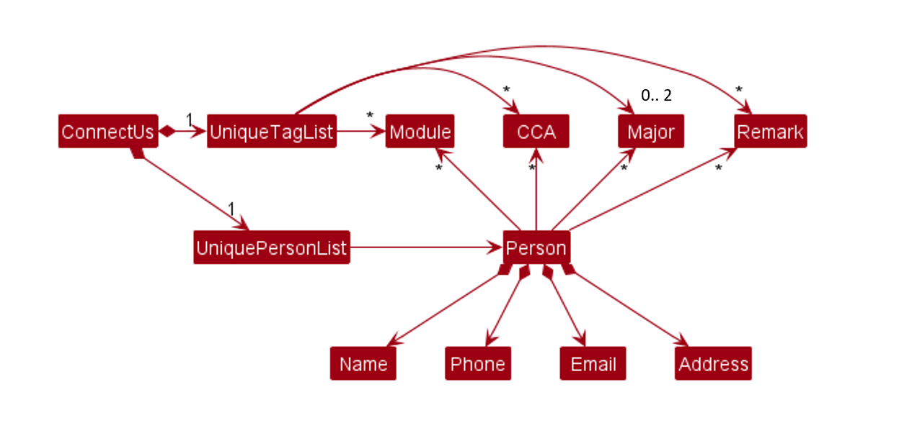
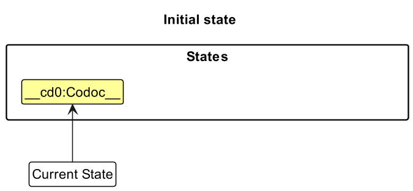
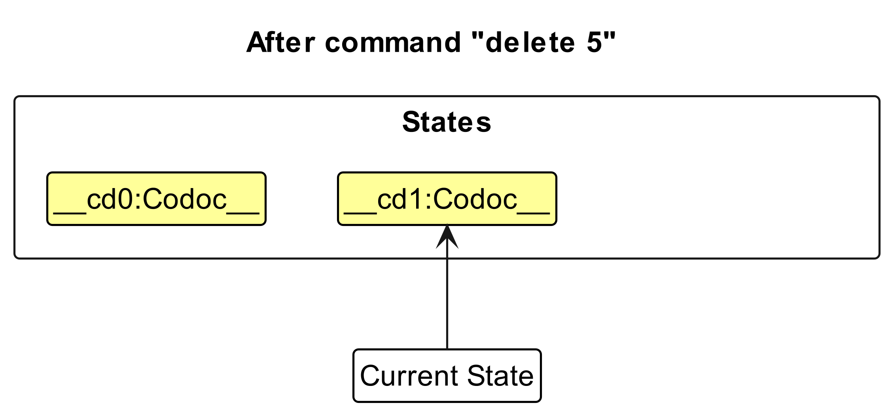
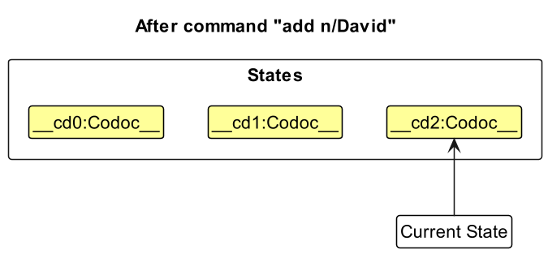
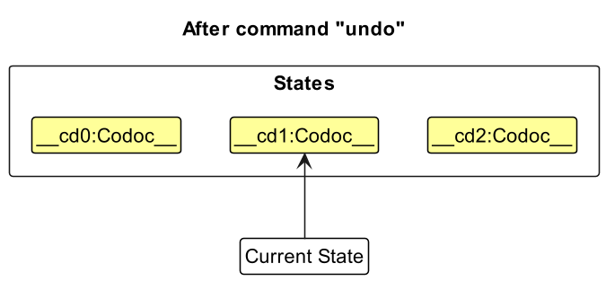
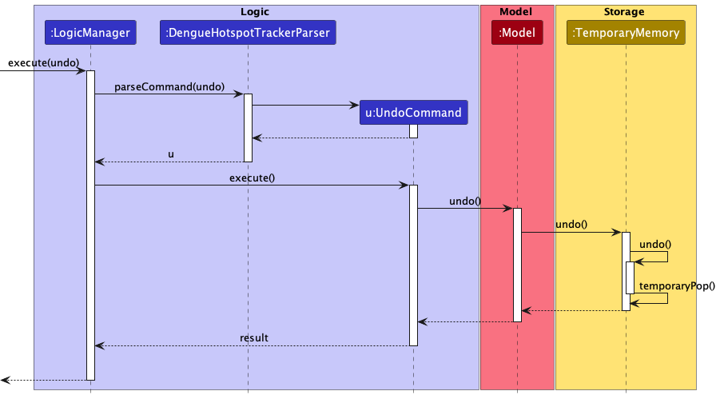
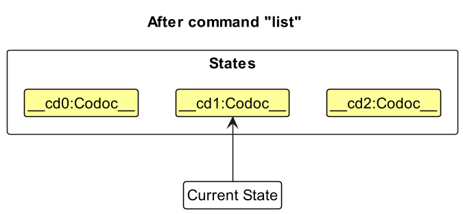
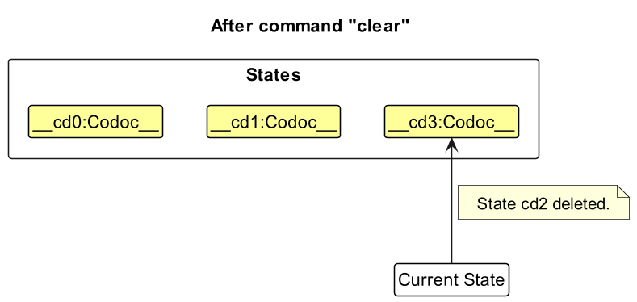
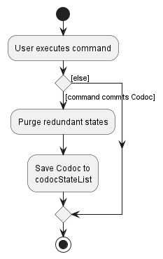

* Table of Contents
{:toc}

--------------------------------------------------------------------------------------------------------------------

## **Acknowledgements**

* This project is based on the AddressBook-Level3 project created by the [SE-EDU initiative](https://se-education.org).

--------------------------------------------------------------------------------------------------------------------

## **Setting up, getting started**

Refer to the guide [_Setting up and getting started_](SettingUp.md).

--------------------------------------------------------------------------------------------------------------------

## **Design**

:bulb: **Tip:** The `.puml` files used to create diagrams in this document can be found in the [diagrams](https://github.com/se-edu/addressbook-level3/tree/master/docs/diagrams/) folder. Refer to the [_PlantUML Tutorial_ at se-edu/guides](https://se-education.org/guides/tutorials/plantUml.html) to learn how to create and edit diagrams.

### Architecture

The ***Architecture Diagram*** given above explains the high-level design of the App.

Given below is a quick overview of main components and how they interact with each other.

**Main components of the architecture**

**`Main`** has two classes called [`Main`](https://github.com/AY2223S2-CS2103T-T12-4/tp/blob/master/src/main/java/seedu/address/Main.java) and [`MainApp`](https://github.com/AY2223S2-CS2103T-T12-4/tp/blob/master/src/main/java/seedu/address/MainApp.java). It is responsible for,
* At app launch: Initializes the components in the correct sequence, and connects them up with each other.
* At shut down: Shuts down the components and invokes cleanup methods where necessary.

[**`Commons`**](#common-classes) represents a collection of classes used by multiple other components.

The rest of the App consists of four components.

* [**`UI`**](#ui-component): The UI of the App.
* [**`Logic`**](#logic-component): The command executor.
* [**`Model`**](#model-component): Holds the data of the App in memory.
* [**`Storage`**](#storage-component): Reads data from, and writes data to, the hard disk.

**How the architecture components interact with each other**

The *Sequence Diagram* below shows how the components interact with each other for the scenario where the user issues the command `delete 1`.

Each of the four main components (also shown in the diagram above),

* defines its *API* in an `interface` with the same name as the Component.
* implements its functionality using a concrete `{Component Name}Manager` class (which follows the corresponding API `interface` mentioned in the previous point.

For example, the `Logic` component defines its API in the `Logic.java` interface and implements its functionality using the `LogicManager.java` class which follows the `Logic` interface. Other components interact with a given component through its interface rather than the concrete class (reason: to prevent outside component's being coupled to the implementation of a component), as illustrated in the (partial) class diagram below.

The sections below give more details of each component.

### UI component

The **API** of this component is specified in [`Ui.java`](https://github.com/AY2223S2-CS2103T-T12-4/tp/blob/master/src/main/java/seedu/address/ui/Ui.java)

The UI consists of a `MainWindow` that is made up of parts e.g.`CommandBox`, `ResultDisplay`, `PersonListPanel`, `StatusBarFooter` etc. All these, including the `MainWindow`, inherit from the abstract `UiPart` class which captures the commonalities between classes that represent parts of the visible GUI.

The `UI` component uses the JavaFx UI framework. The layout of these UI parts are defined in matching `.fxml` files that are in the `src/main/resources/view` folder. For example, the layout of the [`MainWindow`](https://github.com/se-edu/addressbook-level3/tree/master/src/main/java/seedu/address/ui/MainWindow.java) is specified in [`MainWindow.fxml`](https://github.com/se-edu/addressbook-level3/tree/master/src/main/resources/view/MainWindow.fxml)

The `UI` component,

* executes user commands using the `Logic` component.
* listens for changes to `Model` data so that the UI can be updated with the modified data.
* keeps a reference to the `Logic` component, because the `UI` relies on the `Logic` to execute commands.
* depends on some classes in the `Model` component, as it displays `Person` object residing in the `Model`.

### Logic component

**API** : [`Logic.java`](https://github.com/AY2223S2-CS2103T-T12-4/tp/blob/master/src/main/java/seedu/address/logic/Logic.java)

Here's a (partial) class diagram of the `Logic` component:

How the `Logic` component works:
1. When `Logic` is called upon to execute a command, it uses the `AddressBookParser` class to parse the user command.
1. This results in a `Command` object (more precisely, an object of one of its subclasses e.g., `AddCommand`) which is executed by the `LogicManager`.
1. The command can communicate with the `Model` when it is executed (e.g. to add a person).
1. The result of the command execution is encapsulated as a `CommandResult` object which is returned back from `Logic`.

The Sequence Diagram below illustrates the interactions within the `Logic` component for the `execute("delete 1")` API call.

:information_source: **Note:** The lifeline for `DeleteCommandParser` should end at the destroy marker (X) but due to a limitation of PlantUML, the lifeline reaches the end of diagram.

Here are the other classes in `Logic` (omitted from the class diagram above) that are used for parsing a user command:

How the parsing works:
* When called upon to parse a user command, the `AddressBookParser` class creates an `XYZCommandParser` (`XYZ` is a placeholder for the specific command name e.g., `AddCommandParser`) which uses the other classes shown above to parse the user command and create a `XYZCommand` object (e.g., `AddCommand`) which the `AddressBookParser` returns back as a `Command` object.
* All `XYZCommandParser` classes (e.g., `AddCommandParser`, `DeleteCommandParser`, ...) inherit from the `Parser` interface so that they can be treated similarly where possible e.g, during testing.

### Model component
**API** : [`Model.java`](https://github.com/AY2223S2-CS2103T-T12-4/tp/blob/master/src/main/java/seedu/address/model/Model.java)

The `Model` component,

* stores the address book data i.e., all `Person` objects (which are contained in a `UniquePersonList` object).
* stores the currently 'selected' `Person` objects (e.g., results of a search query) as a separate _filtered_ list which is exposed to outsiders as an unmodifiable `ObservableList<Person>` that can be 'observed' e.g. the UI can be bound to this list so that the UI automatically updates when the data in the list change.
* stores a `UserPref` object that represents the user’s preferences. This is exposed to the outside as a `ReadOnlyUserPref` objects.
* does not depend on any of the other three components (as the `Model` represents data entities of the domain, they should make sense on their own without depending on other components)

:information_source: **Note:** An alternative (arguably, a more OOP) model is given below. It has a `Tag` list in the `AddressBook`, which `Person` references. This allows `AddressBook` to only require one `Tag` object per unique tag, instead of each `Person` needing their own `Tag` objects. 

### Storage component

**API** : [`Storage.java`](https://github.com/AY2223S2-CS2103T-T12-4/tp/blob/master/src/main/java/seedu/address/storage/Storage.java)

The `Storage` component,
* can save both address book data and user preference data in json format, and read them back into corresponding objects.
* inherits from both `AddressBookStorage` and `UserPrefStorage`, which means it can be treated as either one (if only the functionality of only one is needed).
* depends on some classes in the `Model` component (because the `Storage` component's job is to save/retrieve objects that belong to the `Model`)

### Common classes

Classes used by multiple components are in the `seedu.addressbook.commons` package.

--------------------------------------------------------------------------------------------------------------------

## **Implementation**

This section describes some noteworthy details on how certain features are implemented.

### Undo/redo feature

This feature was implemented as proposed in [AddressBook-Level3](https://se-education.org/addressbook-level3/DeveloperGuide.html#proposed-undoredo-feature) 

The proposed undo/redo mechanism is facilitated by `VersionedSocket`. It extends `AddressBook` with an undo/redo history, stored internally as an `socketStateList` and `currentStatePointer`. Additionally, it implements the following operations:

* `VersionedSocket#commit()` — Saves the current SOCket state in its history.
* `VersionedSocket#undo()` — Restores the previous SOCket state from its history.
* `VersionedSocket#redo()` — Restores a previously undone SOCket state from its history.

These operations are exposed in the `Model` interface as `Model#commitSocket()`, `Model#undoSocket()` and `Model#redoSocket()` respectively.

Given below is an example usage scenario and how the undo/redo mechanism behaves at each step.

Step 1. The user launches the application for the first time. The `VersionedSocket` will be initialized with the initial SOCket state, and the `currentStatePointer` pointing to that single SOCket state.

Step 2. The user executes `delete 5` command to delete the 5th person in SOCket. The `delete` command calls `Model#commitSocket()`, causing the modified state of SOCket after the `delete 5` command executes to be saved in the `socketStateList`, and the `currentStatePointer` is shifted to the newly inserted SOCket state.

Step 3. The user executes `add n/David …​` to add a new person. The `add` command also calls `Model#commitSocket()`, causing another modified SOCket state to be saved into the `socketStateList`.

:information_source: **Note:** If a command fails its execution, it will not call `Model#commitSocket()`, so the SOCket state will not be saved into the `socketStateList`.

Step 4. The user now decides that adding the person was a mistake, and decides to undo that action by executing the `undo` command. The `undo` command will call `Model#undoSocket()`, which will shift the `currentStatePointer` once to the left, pointing it to the previous SOCket state, and restores SOCket to that state.

:information_source: **Note:** If the `currentStatePointer` is at index 0, pointing to the initial SOCket state, then there are no previous SOCket states to restore. The `undo` command uses `Model#canUndoSocket()` to check if this is the case. If so, it will return an error to the user rather
than attempting to perform the undo.

The following sequence diagram shows how the undo operation works:

:information_source: **Note:** The lifeline for `UndoCommand` should end at the destroy marker (X) but due to a limitation of PlantUML, the lifeline reaches the end of diagram.

The `redo` command does the opposite — it calls `Model#redoSocket()`, which shifts the `currentStatePointer` once to the right, pointing to the previously undone state, and restores SOCket to that state.

:information_source: **Note:** If the `currentStatePointer` is at index `socketStateList.size() - 1`, pointing to the latest SOCket state, then there are no undone SOCket states to restore. The `redo` command uses `Model#canRedoSocket()` to check if this is the case. If so, it will return an error to the user rather than attempting to perform the redo.

Step 5. The user then decides to execute the command `list`. Commands that do not modify the address book, such as `list`, will usually not call `Model#commitSocket()`, `Model#undoSocket()` or `Model#redoSocket()`. Thus, the `socketStateList` remains unchanged.

Step 6. The user executes `clear`, which calls `Model#commitSocket()`. Since the `currentStatePointer` is not pointing at the end of the `socketStateList`, all SOCket states after the `currentStatePointer` will be purged. Reason: It no longer makes sense to redo the `add n/David …​` command. This is the behavior that most modern desktop applications follow.

The following activity diagram summarizes what happens when a user executes a new command:

#### Design considerations:

**Aspect: How undo & redo executes:**

* **Alternative 1 (current choice):** Saves the entire SOCket.
  * Pros: Easy to implement.
  * Cons: May have performance issues in terms of memory usage.

* **Alternative 2:** Individual command knows how to undo/redo by
  itself.
  * Pros: Will use less memory (e.g. for `delete`, just save the person being deleted).
  * Cons: We must ensure that the implementation of each individual command are correct.

### \[Proposed\] Data archiving

_{Explain here how the data archiving feature will be implemented}_

--------------------------------------------------------------------------------------------------------------------

## **Documentation, logging, testing, configuration, dev-ops**

* [Documentation guide](Documentation.md)
* [Testing guide](Testing.md)
* [Logging guide](Logging.md)
* [Configuration guide](Configuration.md)
* [DevOps guide](DevOps.md)

--------------------------------------------------------------------------------------------------------------------

## **Appendix: Requirements**

### Product scope

**Target user profile**:

* has a need to manage a significant number of contacts (peers, professors in NUS Computing)
* has a need to group and manage groups of contacts
* has a need to view the skills and proficiencies of contacts (programming languages, modules)
* has a need to access the GitHub profiles/repositories of contacts
* has a need to track deadlines and responsibilities associated with contacts
* prefer desktop apps over other types
* can type fast
* prefers typing to mouse interactions
* is reasonably comfortable using CLI apps

**Value proposition**: manage contacts faster than a typical mouse/GUI driven app, store information relevant to NUS Computing students (GitHub profile, repository, programming language proficiencies, modules taken), quickly find contacts that satisfy certain criteria (taken a particular module, in a group)

### User stories

Priorities: High (must have) - `* * *`, Medium (nice to have) - `* *`, Low (unlikely to have) - `*`

| Priority | As a …​                                                          | I can…​                                                    | So that I can…​                                                                           |
|----------|------------------------------------------------------------------|------------------------------------------------------------|-------------------------------------------------------------------------------------------|
| `* * *`  | new user                                                         | see usage instructions                                     | refer to instructions when I forget how to use the App                                    |
| `* * *`  | user                                                             | add a new person                                           |                                                                                           |
| `* * *`  | user                                                             | delete a person                                            | remove entries that I no longer need                                                      |
| `* * *`  | user                                                             | find a person by name                                      | locate details of persons without having to go through the entire list                    |
| `* * *`  | student with many friends                                        | save my friend's details                                   | easily contact them                                                                       |
| `* * *`  | student who likes to ask questions                               | save my professors' details                                | easily contact them to ask questions                                                      |
| `* * *`  | student with fast typing speed                                   | use command based inputs to search for contacts            | quickly pull out contacts without needing to spend time moving my mouse                   |
| `* *`    | user                                                             | hide private contact details                               | minimize the chance of someone else seeing them by accident                               |
| `* *`    | student involved in project work                                 | search contacts belonging to a certain group               | contact my groupmates easily                                                              |
| `* *`    | student with many assignments                                    | tag deadlines and responsibilities to my contacts          | easily keep track of which tasks are more urgent and who is taking care of it             |
| `* *`    | organised user                                                   | group contacts into different groups                       | manage my contacts easily                                                                 |
| `* *`    | software engineering student with many SE projects               | access the github repositories of my peers                 | easily keep track of the github repos that I'm involved and interested in                 |
| `* *`    | student interested in hackathons                                 | find students based on skills                              | form groups with them                                                                     |
| `* *`    | software engineering student                                     | find repositories of group projects I am involved in       | easily access team repositories                                                           |
| `* *`    | student who is organised                                         | sort all my peers' contact information                     | have only one platform where I know my contacts are organized                             |
| `* *`    | software engineering student                                     | tag contacts with their skills                             | know what skills they have and can easily find those with a particular skill              |
| `* *`    | advanced user                                                    | use the shortcut keys                                      | get things done more effectively                                                          |
| `* *`    | busy software engineering student                                | create shortcuts to long commands                          | not type out long commands repeatedly to save time                                        |
| `* *`    | student constantly getting into new projects with other memebers | quickly remove tags of specific groups and delete contacts | not be flooded with too much irrelevant contacts which can cause accidental wrong contact |
| `* *`    | software engineering student with many peers                     | save and access my peers' github information               | easily access their profiles and view their repositories                                  |

### Use cases

(For all use cases below, the **System** is the `SOCket` and the **Actor** is the `user`, unless specified otherwise)

**Use case: UC01 - Add a contact**

**MSS:**

1.  User requests to add a contact.
2.  SOCket adds the contact.

    Use case ends.

**Extensions:**

* 1a. There are no details provided.

    * 1a1. SOCket shows an error message.

      Use case resumes at step 1.

* 1b. There is no name provided.

    * 1b1. SOCket shows an error message.

      Use case resumes at step 1.

**Use case: UC02 - Edit a contact**

**MSS:**

1.  User requests to list contacts.
2.  SOCket shows a list of contacts.
3.  User requests to edit a specific contact's details in the list.
4.  SOCket edits the contact's details.

**Extensions:**

* 2a. The list is empty.

  Use case ends.

* 3a. The given index is invalid.

    * 3a1. SOCket shows an error message.

      Use case resumes at step 2.

* 3b. There are no details provided.

    * 3b1. SOCket shows an error message.

      Use case resumes at step 2.

* 3c. There are no tags provided.

    * 3b1. SOCket removes all tags associated with the contact.

      Use case ends.

* 3d. There are tag(s) provided.

    * 3b1. SOCket removes existing tags associated with the contact and adds the tag(s) provided.

      Use case ends.

**Use case: UC03 Delete a contact**

**MSS:**

1.  User requests to list contacts.
2.  SOCket shows a list of contacts.
3.  User requests to delete a specific contact in the list.
4.  SOCket deletes the contact.

    Use case ends.

**Extensions:**

* 2a. The list is empty.

  Use case ends.

* 3a. The given index is invalid.

    * 3a1. SOCket shows an error message.

      Use case resumes at step 2.

**Use case: UC04 Sort contacts**

**MSS:**

1.  User requests to list contact.
2.  SOCket shows a list of contacts.
3.  User requests to sort the list by a category.
4.  SOCket sorts alphanumerically by that category and shows the sorted list of contacts.

    Use case ends.

**Extensions:**

* 2a. The list is empty.

  Use case ends.

* 3a. The given category is invalid.

  * 3a1. SOCket shows an error message. 
  
    Use case resumes from step 2.

* 3b. No category is given.

    * 3b1. SOCket sorts the list by name and shows the sorted list of contacts.
  
* 3b. No category is given.

  * 3b1. SOCket sorts the list by name and shows the sorted list of contacts.
    
     Use case ends.

**Use case: UC05 Find contact(s)**

**MSS:**

1.  User request to find a contact with the given keywords in their respective fields.
2.  SOCket shows a list of contacts that contains any of the given keyword in their respective fields.

    Use case ends.

**Extensions:**

* 1a. No contact matches any of the given keywords in their respective fields.

    * 1a1. SOCket shows an empty list of contacts. 
      
      Use case ends.

* 1b. No keywords are given for all fields.

    * 1b1. SOCket shows an empty list of contacts.

      Use case ends.

**Use case: UC06 Clear contacts/tag**

**MSS:**

1. User chooses to clear off group of contacts.
2. SOCket requests for confirmation to delete the contacts.
3. User confirms.
4. SOcket deletes all the contacts.

Use case ends.

**Extensions:**

* 1a. All the given tags are present in SOCket.

  * 1a1. SOCket request to delete all the contacts under the tags.

* 1b. Some given tags are not present in SOCket.

  * 1b1. SOCket shows an error message, listing all the wrong tags.

  * 1b2. SOCket request to delete all the contacts under the correct tags.
    
    Use case resumes at step 2.

* 1c. All the given tag are not present in SOCket.

    * 1c1. SOCket shows an error message, listing all the wrong tags.
  
    * 1c2. SOCket requests for correct tags. 
  
      Steps 1c1-1c2 are repeated until a tag is entered correctly.

      Use case resumes at step 2.

* 1d. No tag is provided.

    * 1d1. SOCket request to delete all the contacts.

      Use case resumes at step 2.
  
* *a. At any time, User choose to cancel the operation.

    * *a1. SOCKet stops the operation.

      Use case ends.

**Use case: UC07 List contacts**

**MSS:**

1. User requests to list contacts.
2. SOCket shows a list of contacts.
3. User requests to list contacts by tag.
4. SOCket shows a list of contacts with given tag.

   Use case ends.

**Extensions:**

* 3a. The given tag is invalid.

    * 3a1. SOCket shows an error message.

      Use case resumes at step 2.

* 3b. No category is given.

  * 3b1. SOCket sorts the list by name and shows the sorted list of contacts.
    
     Use case ends.

**Use case: UC08 Access Help page**

**MSS:**

1. User requests for help.
2. SOCket shows the help page.

   Use case ends.

**Use case: UC09 - Exit SOCket**

**MSS:**

1.  User requests to exit SOCket.
2.  SOCket exits.

    Use case ends.

**Use case: UC10 Hide contact details**

**MSS:**

1. User requests to list contact.
2. SOCket shows a list of contacts.
3. User requests to hide a category of a specific contact.
4. SOCket hides the specific category of that user.

   Use case ends.

**Extensions:**

* 2a. The list is empty.

  Use case ends.

* 3a. The given category is invalid.

    * 3a1. SOCket shows an error message.

      Use case resumes at step 2.

* 3b. The contact does not have that category.

    * 3b1. SOCket shows an error message.

      Use case resumes at step 2.

      Use case ends.

**Use case: UC11 Using shortcut command**

**MSS:**

1.  User binds a command to a given keyword of their choice.
2.  SOCket shows a message to confirm shortcut key created.
3.  User types the keyword bound to the command.
4.  SOCket will execute the command.
    Use case ends.

**Extensions:**

*  3a. Command bounded to the keyword is not valid.

    * 3a1. SOCket shows an error message.

      Use case ends.

**Use case: UC12 Access peer GitHub information**

**MSS:**

1.  User requests to list contact.
2.  SOCket shows a list of contacts.
3.  User requests to view a specific contact's github information.
4.  SOCket opens the contact's github profile in a browser.

    Use case ends.

**Extensions:**

* 2a. The list is empty.

  Use case ends.

* 3a. The contact does not have github information.
    
   Use case resumes at step 2.

**Use case: UC13 Undo recent changes**

**MSS:**

1. User requests to undo changes.
2. SOCket undoes changes.

   Use case ends.

**Extensions:**

* 1a. No changes exist.

    * 1a1. SOCket shows an error message.

      Use case ends.

**Use case: UC14 Redo recent undone changes**

**MSS:**

1. User requests to restore recent undone changes.
2. SOCket restores undone changes.

   Use case ends.

**Extensions:**

* 1a. No undone changes exist.

    * 1a1. SOCket shows an error message.

      Use case ends.

**Use case: UC15 Tagging a contact**

**MSS:**

1.  User <ins>find contact(s) (UC05)</ins> they wish to tag.
2.  User tags the list of contacts currently shown with a tag name.
3.  SOCket tags all contacts in the list currently shown, displays all contacts with the given tag name to the user.

    Use case ends.

**Use case: UC16 Set deadlines & responsibilities**

**MSS:**

1. User has a team project and creates a event.
2. SOCket creates the event.
3. User request to groups all the team members contact under the event created.
4. SOCket groups the contacts together.
5. User enters a deadline date to each milestone of the project.
6. SOCket allocates the date to respective milestone.
7. User chooses to give role to each team members.
8. SOCket assigned the given roles to respective team members.

   Use case ends.

**Extensions:**

* 5a. SOCket detects a syntax error in the entered date.

    * 5a1. SOCket shows an error message.
  
      Use case resume at step 6 when the date entered is correct.

   Use case resumes at step 2.

*{More to be added}*

### Non-Functional Requirements

1.  Should work on any _mainstream OS_ as long as it has Java `11` or above installed.
2.  Should work on 64-bit environments.
3.  Should be able to hold up to 1000 persons without a noticeable sluggishness in performance for typical usage.
4.  A user with above average typing speed for regular English text (i.e. not code, not system admin commands) should be able to accomplish most of the tasks faster using commands than using the mouse.

*{More to be added}*

### Glossary

* **Mainstream OS**: Windows, Linux, Unix, OS-X
* **Private contact detail**: A contact detail that is not meant to be shared with others
* **GitHub profiles/repositories**: GitHub username e.g. `chia-yh` or repository path e.g. `AY2223S2-CS2103T-T12-4/tp`

--------------------------------------------------------------------------------------------------------------------

## **Appendix: Instructions for manual testing**

Given below are instructions to test the app manually.

:information_source: **Note:** These instructions only provide a starting point for testers to work on;
testers are expected to do more *exploratory* testing.

### Launch and shutdown

1. Initial launch

   1. Download the jar file and copy into an empty folder

   1. Double-click the jar file Expected: Shows the GUI with a set of sample contacts. The window size may not be optimum.

1. Saving window preferences

   1. Resize the window to an optimum size. Move the window to a different location. Close the window.

   1. Re-launch the app by double-clicking the jar file. 
       Expected: The most recent window size and location is retained.

1. _{ more test cases …​ }_

### Deleting a person

1. Deleting a person while all persons are being shown

   1. Prerequisites: List all persons using the `list` command. Multiple persons in the list.

   1. Test case: `delete 1` 
      Expected: First contact is deleted from the list. Details of the deleted contact shown in the status message. Timestamp in the status bar is updated.

   1. Test case: `delete 0` 
      Expected: No person is deleted. Error details shown in the status message. Status bar remains the same.

   1. Other incorrect delete commands to try: `delete`, `delete x`, `...` (where x is larger than the list size) 
      Expected: Similar to previous.

1. _{ more test cases …​ }_

### Saving data

1. Dealing with missing/corrupted data files

   1. _{explain how to simulate a missing/corrupted file, and the expected behavior}_

1. _{ more test cases …​ }_
