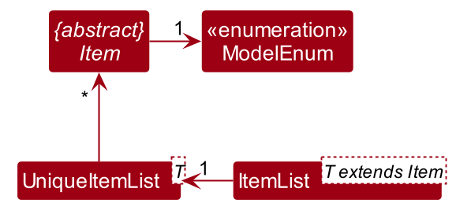
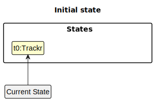
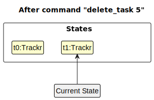
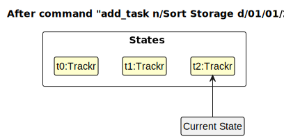
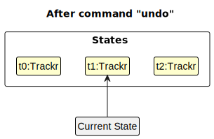
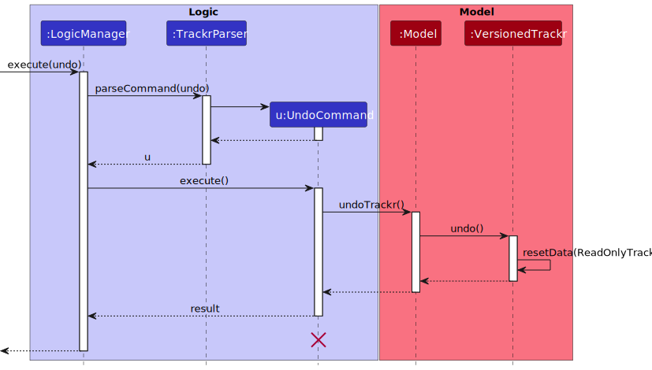
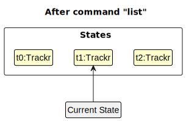
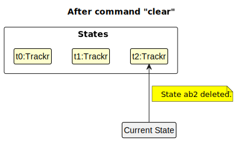
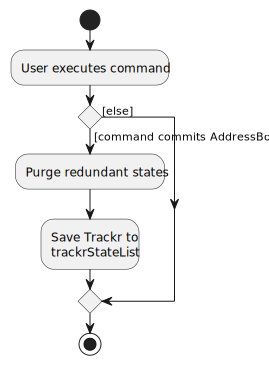

* Table of Contents
{:toc}

--------------------------------------------------------------------------------------------------------------------

## **Acknowledgements**

* This project is based on the AddressBook-Level3 project created by the [SE-EDU initiative](https://se-education.org).
* If you would like to contribute code to the parent project (AddressBook-Level3), see [se-education.org](https://se-education.org#https://se-education.org/#contributing) for more info.

--------------------------------------------------------------------------------------------------------------------

## **Setting up, getting started**

Refer to the guide [_Setting up and getting started_](SettingUp.md).

--------------------------------------------------------------------------------------------------------------------

## **Design**

:bulb: **Tip:** The `.puml` files used to create diagrams in this document can be found in the [diagrams](https://github.com/se-edu/addressbook-level3/tree/master/docs/diagrams/) folder. Refer to the [_PlantUML Tutorial_ at se-edu/guides](https://se-education.org/guides/tutorials/plantUml.html) to learn how to create and edit diagrams.

### Architecture

The ***Architecture Diagram*** given above explains the high-level design of the App.

Given below is a quick overview of main components and how they interact with each other.

**Main components of the architecture**

**`Main`** has two classes called [`Main`](https://github.com/se-edu/addressbook-level3/tree/master/src/main/java/seedu/address/Main.java) and [`MainApp`](https://github.com/se-edu/addressbook-level3/tree/master/src/main/java/seedu/address/MainApp.java). It is responsible for,
* At app launch: Initializes the components in the correct sequence, and connects them up with each other.
* At shut down: Shuts down the components and invokes cleanup methods where necessary.

[**`Commons`**](#common-classes) represents a collection of classes used by multiple other components.

The rest of the App consists of four components.

* [**`UI`**](#ui-component): The UI of the App.
* [**`Logic`**](#logic-component): The command executor.
* [**`Model`**](#model-component): Holds the data of the App in memory.
* [**`Storage`**](#storage-component): Reads data from, and writes data to, the hard disk.

**How the architecture components interact with each other**

The *Sequence Diagram* below shows how the components interact with each other for the scenario where the user issues the command `delete 1`.

Each of the four main components (also shown in the diagram above),

* defines its *API* in an `interface` with the same name as the Component.
* implements its functionality using a concrete `{Component Name}Manager` class (which follows the corresponding API `interface` mentioned in the previous point.

For example, the `Logic` component defines its API in the `Logic.java` interface and implements its functionality using the `LogicManager.java` class which follows the `Logic` interface. Other components interact with a given component through its interface rather than the concrete class (reason: to prevent outside component's being coupled to the implementation of a component), as illustrated in the (partial) class diagram below.

The sections below give more details of each component.

### UI component

The **API** of this component is specified in [`Ui.java`](https://github.com/AY2223S2-CS2103T-W15-2/tp/blob/master/src/main/java/trackr/ui/Ui.java)

The UI consists of a `MainWindow` that is made up of parts e.g.`CommandBox`, `ResultDisplay`, `TabPanel`, `StatusBarFooter` etc. All these, including the `MainWindow`, inherit from the abstract `UiPart` class which captures the commonalities between classes that represent parts of the visible GUI.

The `UI` component uses the JavaFX UI framework. The layout of these UI parts are defined in matching `.fxml` files that are in the `src/main/resources/view` folder. For example, the layout of the [`MainWindow`](https://github.com/AY2223S2-CS2103T-W15-2/tp/blob/master/src/main/java/trackr/ui/MainWindow.java) is specified in [`MainWindow.fxml`](https://github.com/AY2223S2-CS2103T-W15-2/tp/blob/master/src/main/resources/view/MainWindow.fxml)

The `UI` component,

* executes user commands using the `Logic` component.
* listens for changes to `Model` data so that the UI can be updated with the modified data.
* keeps a reference to the `Logic` component, because the `UI` relies on the `Logic` to execute commands.
* depends on some classes in the `Model` component, as it displays `Order`, `Task` or `Menu` object residing in the `Model`.

### Logic component

**API** : [`Logic.java`](https://github.com/se-edu/addressbook-level3/tree/master/src/main/java/seedu/address/logic/Logic.java)

Here's a (partial) class diagram of the `Logic` component:

How the `Logic` component works:
1. When `Logic` is called upon to execute a command, it uses the `AddressBookParser` class to parse the user command.
1. This results in a `Command` object (more precisely, an object of one of its subclasses e.g., `AddCommand`) which is executed by the `LogicManager`.
1. The command can communicate with the `Model` when it is executed (e.g. to add a person).
1. The result of the command execution is encapsulated as a `CommandResult` object which is returned back from `Logic`.

The Sequence Diagram below illustrates the interactions within the `Logic` component for the `execute("delete 1")` API call.

:information_source: **Note:** The lifeline for `DeleteCommandParser` should end at the destroy marker (X) but due to a limitation of PlantUML, the lifeline reaches the end of diagram.

Here are the other classes in `Logic` (omitted from the class diagram above) that are used for parsing a user command:

How the parsing works:
* When called upon to parse a user command, the `AddressBookParser` class creates an `XYZCommandParser` (`XYZ` is a placeholder for the specific command name e.g., `AddCommandParser`) which uses the other classes shown above to parse the user command and create a `XYZCommand` object (e.g., `AddCommand`) which the `AddressBookParser` returns back as a `Command` object.
* All `XYZCommandParser` classes (e.g., `AddCommandParser`, `DeleteCommandParser`, ...) inherit from the `Parser` interface so that they can be treated similarly where possible e.g, during testing.

### Model component
**API** : [`Model.java`](https://github.com/AY2223S2-CS2103T-W15-2/tp/blob/master/src/main/java/trackr/model/Model.java)

The `Model` component,

* `XYZ` is a placeholder for the specific object (e.g., `Supplier`, `Task`), which are all `Item` objects.
* stores trackr data i.e., all `XYZ` objects (contained in respective `UniqueXYZList` object).
* stores currently 'selected' `XYZ` objects (e.g., results of search query) as a separate _filtered_ list which is exposed to outsiders as an unmodifiable `ObservableList<XYZ>` that can be viewed (e.g. UI bound to this list so that the UI automatically updates when the data in the list changes).
* stores a `UserPref` object that represents the user’s preferences. This is exposed to the outside as a `ReadOnlyUserPref` objects.
* does not depend on any of the other three components (as the `Model` represents data entities of the domain, they should make sense on their own without depending on other components).

Here is the `Item` class that is what all model objects depend on.

Each `ItemList` contains a `UniqueItemList` that stores a list of unique `Items`, which are defined by a model definiton (e.g., `Supplier` or `Task` from `ModelEnum`).

This is the class representation for the `Supplier` and `Customer` class.

Here is how `Supplier` and `Customer` works:

* `Supplier` and `Customer` inherit off `Person` class, which depends on the `Item` class.
* Each `Person` contains their name, phone number, deadline, email and tags. (e.g., `PersonAddress` represents the address)
* The `Supplier` and `Customer` object have their corresponding `List` and `UniqueList` that stores their information.

This is the class representation for the `Task` class.

Here is how `Task` works:

* Each `Task` contains their description, deadline and status (e.g., `TaskName` for task name).
* Each of the attributes inherit off the corresponding `common` classes (e.g., `TaskName` inherit off `Name`).
* The `Task` object have its `List` and `UniqueList`.

:information_source: **Note:** An alternative (arguably, a more OOP) model is given below. It has a `Tag` list in the `AddressBook`, which `Person` references. This allows `AddressBook` to only require one `Tag` object per unique tag, instead of each `Person` needing their own `Tag` objects. 

### Storage component

**API** : [`Storage.java`](https://github.com/AY2223S2-CS2103T-W15-2/tp/blob/master/src/main/java/trackr/storage/Storage.java)

The `Storage` component,
* can save both trackr data and user preference data in json format, and read them back into corresponding objects.
* inherits from both `TrackrStorage` and `UserPrefStorage`, which means it can be treated as either one (if only the functionality of only one is needed).
* depends on some classes in the `Model` component (because the `Storage` component's job is to save/retrieve objects that belong to the `Model`)

### Common classes

Classes used by multiple components are in the `trackr.commons` package.

--------------------------------------------------------------------------------------------------------------------

## **Implementation**

This section describes some noteworthy details on how certain features are implemented.

### Edit feature

Edit supplier, edit order and edit task features are implemented using the same edit mechanism as described in this section.

The edit mechanism follows a workflow similar to the Logic component.

Given below is an example usage scenario and how the edit mechanism behaves at each step.

Step 1. The user keys in the edit XYZ command. The MainWindow will call upon `LogicManager#execute()` to execute this command.

Step 2. LogicManager will use the `EditXYZCommandParser#parse()` to parse the given command.

Step 3. If the given command is invalid (missing fields, invalid command format, etc.), the parser will throw a `ParseException` which will be caught by `MainWindow` which will in turn display the error message.
Otherwise, Step 4 will take place.

Step 4. An `EditXYZCommand` will be returned by EditXYZCommandParser to the LogicManager. The `EditXYZCommand#execute()` will then be called.

Step 5. `EditXYZCommand#execute()` will first retrieve that latest filtered XYZ list from the model and check if the index given is valid.

Step 6. If the given index is out of bounds (i.e., a negative number or number is more than number of items in the list), a `CommandException` will be thrown which will be caught by `MainWindow`. An error message will then be displayed.
Otherwise, Step 7 will take place.

Step 7. Item at given index will be retrieved. A copy of the item will be made and edited accordingly.

Step 8. If nothing is edited or edited item is the same as another existing item in the list, a `CommandException` will be thrown. An error message will then be displayed.
Otherwise, Step 9 will take place.

Step 9. The edited item is saved to the filtered list and `EditXYZCommand#execute()` will return the `CommandResult`

Step 10. Changes made are saved to local data and success message is shown.

### \[Proposed\] Undo/redo feature

#### Proposed Implementation

The proposed undo/redo mechanism is facilitated by `VersionedTrackr`. It extends `Trackr` with an undo/redo history, stored internally as a `trackrStateList` and `currentStatePointer`. Additionally, it implements the following operations:

* `VersionedTrackr#commit()` — Saves the current trackr state in its history.
* `VersionedTrackr#undo()` — Restores the previous trackr state from its history.
* `VersionedTrackr#redo()` — Restores a previously undone trackr state from its history.

These operations are exposed in the `Model` interface as `Model#commitTrackr()`, `Model#undoTrackr()` and `Model#redoTrackr()` respectively.

Given below is an example usage scenario and how the undo/redo mechanism behaves at each step.

Step 1. The user launches the application for the first time. The `VersionedTrackr` will be initialized with the initial trackr state, and the `currentStatePointer` pointing to that single trackr state.

Step 2. The user executes `delete_task 5` command to delete the 5th task in the trackr. The `delete_task` command calls `Model#commitTrackr()`, causing the modified state of the trackr after the `delete_task 5` command executes to be saved in the `trackrStateList`, and the `currentStatePointer` is shifted to the newly inserted trackr state.

Step 3. The user executes `add_task n/Sort Storage …​` to add a new task. The `add_task` command also calls `Model#commitTrackr()`, causing another modified trackr state to be saved into the `trackrStateList`.

:information_source: **Note:** If a command fails its execution, it will not call `Model#commitTrackr()`, so the trackr state will not be saved into the `trackrStateList`.

Step 4. The user now decides that adding the task was a mistake, and decides to undo that action by executing the `undo` command. The `undo` command will call `Model#undoTrackr()`, which will shift the `currentStatePointer` once to the left, pointing it to the previous trackr state, and restores the trackr to that state.

:information_source: **Note:** If the `currentStatePointer` is at index 0, pointing to the initial Trackr state, then there are no previous Trackr states to restore. The `undo` command uses `Model#canUndoTrackr()` to check if this is the case. If so, it will return an error to the user rather
than attempting to perform the undo.

The following sequence diagram shows how the undo operation works:

:information_source: **Note:** The lifeline for `UndoCommand` should end at the destroy marker (X) but due to a limitation of PlantUML, the lifeline reaches the end of diagram.

The `redo` command does the opposite — it calls `Model#redoTrackr()`, which shifts the `currentStatePointer` once to the right, pointing to the previously undone state, and restores the trackr to that state.

:information_source: **Note:** If the `currentStatePointer` is at index `trackrStateList.size() - 1`, pointing to the latest trackr state, then there are no undone Trackr states to restore. The `redo` command uses `Model#canRedoTrackr()` to check if this is the case. If so, it will return an error to the user rather than attempting to perform the redo.

Step 5. The user then decides to execute the command `list_task`. Commands that do not modify the trackr, such as `list_task`, will usually not call `Model#commitTrackr()`, `Model#undoTrackr()` or `Model#redoTrackr()`. Thus, the `trackrStateList` remains unchanged.

Step 6. The user executes `clear`, which calls `Model#commitTrackr()`. Since the `currentStatePointer` is not pointing at the end of the `trackrStateList`, all trackr states after the `currentStatePointer` will be purged. Reason: It no longer makes sense to redo the `add_task n/Sort Storage …​` command. This is the behavior that most modern desktop applications follow.

The following activity diagram summarizes what happens when a user executes a new command:

#### Design considerations:

**Aspect: How undo & redo executes:**

* **Alternative 1 (current choice):** Saves the entire address book.
  * Pros: Easy to implement.
  * Cons: May have performance issues in terms of memory usage.

* **Alternative 2:** Individual command knows how to undo/redo by
  itself.
  * Pros: Will use less memory (e.g. for `delete`, just save the person being deleted).
  * Cons: We must ensure that the implementation of each individual command are correct.

_{more aspects and alternatives to be added}_

### \[Proposed\] Data archiving

_{Explain here how the data archiving feature will be implemented}_

--------------------------------------------------------------------------------------------------------------------

## **Documentation, logging, testing, configuration, dev-ops**

* [Documentation guide](Documentation.md)
* [Testing guide](Testing.md)
* [Logging guide](Logging.md)
* [Configuration guide](Configuration.md)
* [DevOps guide](DevOps.md)

--------------------------------------------------------------------------------------------------------------------

## **Appendix: Requirements**

### Product scope

**Target user profile**:

* Tech-savvy small businesses owners who:
  * lists their products online or on their own website
  * perform transactions manually without a Point-of-Sale (POS) system
  * Lack manpower/ time to track orders and contacts manually
  * Has < 5 employees
  * Has < 200 customers per month
  * Has a need to manage a significant number of contacts
* Prefer desktop apps over other types
* Can type fast
* Prefers typing to mouse interactions
* Is reasonably comfortable using _CLI_ apps

**Value proposition**:

Our application:
* allows for consolidation of orders, contacts & tasks information which makes it easier to manage them. (no real-time automation)
* serves as a user-friendly alternative to free applications such as Microsoft Excel which may not be catered to their needs and requires tedious formatting. (no support for custom format of interface)
* enables faster contact management compared to a typical mouse/_GUI_ driven app

### User stories

Priorities: High (must have) - `* * *`, Medium (nice to have) - `* *`, Low (unlikely to have) - `*`

| Priority | As a / an …​                                                            | I want to …​                                                                          | So that I can…​                                              |
|----------|-------------------------------------------------------------------------|---------------------------------------------------------------------------------------|--------------------------------------------------------------|
| `* * *`  | new user                                                                | see instructions on how to use the app                                                | refer to the instructions when learning how to use the app   |
| `* * *`  | business owner who deals with a large number of suppliers and customers | store their contact information in the application                                    | easily find them in a single place                           |
| `* * *`  | small business owner                                                    | add orders into my _order_ list                                                       | efficiently keep track of my orders                          |
| `* * *`  | small business owner who has lots of deadlines to meet                  | add _tasks_, such as ordering ingredients                                             | keep track of my to-do list                                  |
| `* * *`  | familiar user                                                           | delete existing _supplier_ information                                                | ensure that the supplier contacts keyed in are correct       |
| `* * *`  | familiar user                                                           | delete existing orders from my order list                                             | clear my order list of orders that are not required anymore  |
| `* * *`  | familiar user                                                           | delete existing tasks from my task list                                               | remove tasks that I no longer need to complete               |
| `* * *`  | small business owner                                                    | add an new Item to my menu                                                            | keep reference to items that I am selling.                   |
| `* * *`  | small business owner                                                    | note selling price and cost price of my items                                         | don't have to keep a mental note of profit per item.         |
| `* * *`  | small business owner                                                    | have a catalog items that I am selling                                                | quickly create orders.                                       |
| `* *`    | business with many orders                                               | have an overview of my Profit-and-Loss.                                               |
| `* *`    | familiar user                                                           | edit existing supplier information                                                    | keep my records accurate and up-to-date                      |
| `* *`    | familiar user                                                           | edit existing information about orders                                                | keep my order details accurate and up-to-date                |
| `* *`    | familiar user                                                           | edit existing task information                                                        | easily correct any wrong information keyed in                |
| `* *`    | business owner who has suppliers that supply different products         | _tag_ the supplier with their product type                                            | have a clearer view of ‘who supplies what’ at a glance       |
| `* *`    | business owner who delivers orders                                      | mark orders as delivered (_Status_ of orders) and keep track of the delivery details  | have a record of everything                                  |
| `* *`    | business owner on a time crunch                                         | mark tasks as Done or Not Done (Task status)                                          | keep track of my deadlines and plan my time well             |
| `* *`    | forgetful business owner                                                | look for supplier information using keywords like name, phone number or email         | quickly obtain the details of the contact when I forget them |
| `* *`    | forgetful business owner                                                | look for task information using keywords like task name, task status or task deadline | quickly obtain the details of the task when I forget them    |
| `*`      | expert user                                                             | sort my orders by the order of earliest deadline to latest deadline                   | easily see which orders are due first                        |
| `*`      | expert user                                                             | sort my tasks by the order of earliest deadline to latest deadline                    | easily see which tasks are due first                         |

*{More to be added}*

### Use cases

(For all use cases below, the **System** is the `Trackr` and the **Actor** is the `Small Business Owner`)

**Use case: Add a new task**

MSS

1. Actor requests to add a new task.
2. Actor enters an add task command with the required information.
3. Trackr saves the new task to the system.

   Use case ends.

**Extensions**

* 2a. The Actor does not enter all required information.
  Trackr shows an error message.

  Use case ends without adding any task.

**Use case: Add a new supplier**

MSS

1. Actor requests to add a new supplier information.
2. Actor enters an add supplier command with the required information.
3. Trackr saves the new supplier to the system.

   Use case ends.

**Extensions**

* 2a. The Actor does not enter all required information.
Trackr shows an error message.

  Use case ends without adding any supplier.

**Use case: Add a new order**

MSS

1. Actor requests to add a new order.
2. Actor enters an add order command with the required information.
3. Trackr saves the new order to the system.

    Use case ends.

**Extensions**

* 2a. The Actor does not enter all required information.
Trackr shows an error message.

    Use case ends without adding any order.

**Use case: Create a new menu item**

MSS

1. Actor requests to create a new menu item.
2. Actor enters an add menu item command with the required information.
3. Trackr saves the new meni item to the system.

    Use case ends.

**Extension**
* 2a. The Actor does not enter all required information.
Trackr shows an error message.

    Use case ends without adding any new menu item.

**Use case: Delete an order**

**MSS**

1.  Actor requests to list orders
2.  Trackr shows a list of orders
3.  Actor requests to delete a specific order in the list
4.  Trackr deletes the order

    Use case ends.

**Extensions**

* 2a. The list is empty.

  Use case ends.

* 3a. The given index is invalid.

    * 3a1. Trackr shows an error message.

      Use case resumes at step 2.

**Use case: Delete a task in list**

**MSS**

1.  Actor requests to list todos
2.  Trackr shows a list of todos
3.  Actor requests to delete a specific todo in the list
4.  Trackr deletes the order

    Use case ends.

**Extensions**

* 2a. The list is empty.

  Use case ends.

* 3a. The given index is invalid.

    * 3a1. Trackr shows an error message.

      Use case resumes at step 2.

**Use case: Delete a supplier**

**MSS**

1.  Actor requests to list suppliers
2.  Trackr shows a list of suppliers
3.  Actor requests to delete a specific supplier in the list
4.  Trackr deletes the person

    Use case ends.

**Extensions**

* 2a. The list is empty.

  Use case ends.

* 3a. The given index is invalid.

    * 3a1. Trackr shows an error message.

      Use case resumes at step 2.

**Use case: Edit an order**

MSS

1. Actor requests to list orders
2. Trackr shows a list of orders
3. Actor enters an edit order command with the index of the order and the updated information
4. Trackr updates the order details with the new information

    Use case ends.

**Extensions**

* 2a. The list is empty.
Use case ends.
* 3a. The Actor enters an invalid index.
Trackr displays an error message.

    Use case ends.

**Use case: Edit a supplier information**

MSS

1. Actor requests to list suppliers.
2. Trackr shows a list of suppliers.
3. Actor enters an edit supplier command with the index of the supplier and the updated information.
4. Trackr updates the supplier details with the new information.

   Use case ends.

**Extensions**

* 2a. The list is empty.

    Use case ends.
* 3a. The Actor enters an invalid index.
Trackr displays an error message.

    Use case ends.

**Use case: Edit a task information**

MSS

1. Actor requests to list tasks.
2. Trackr shows a list of tasks.
3. Actor enters an edit task command with the index of the task and the updated information.
4. Trackr updates the task details with the new information.

   Use case ends.

**Extensions**

* 2a. The list is empty.

  Use case ends.

* 3a. The Actor enters an invalid index.
  Trackr displays an error message.

  Use case ends.

**Use case: Edit a menu item**

MSS

1. Actor requests to list menu items.
2. Trackr shows a list of menu items.
3. Actor enters an edit menu item command with the index of the task and the updated information.
4. Trackr updates the menu details with the new information.

    Use case ends.

**Extensions**

* 2a. The list is empty.
  Use case ends.

* 3a. The Actor enters an invalid index.
  Trackr displays an error message.

  Use case ends.

**Use case: Finding a task**

MSS

1. Actor requests to find an order.
2. Actor enters the command with the desired search criteria.
3. Trackr searches for orders that match the given criteria.
4. Trackr displays a list of orders that match the criteria.

   Use case ends.

**Extensions**

* 2a. The Actor does not enter any search criteria.
  Trackr displays an error message.
  Use case ends.

* 4a. No order matches the given search criteria.
  Trackr displays a message indicating no matching order is found.

  Use case ends.

**Use case: Finding a contact**

MSS

1. Actor requests to find a contact.
2. Home bakery owner enters the command with the desired search criteria.
3. Trackr searches for contacts that match the given criteria.
4. Trackr displays a list of contacts that match the criteria.

   Use case ends.

**Extensions**

* 2a. The Actor does not enter any search criteria.
  Trackr displays an error message.

  Use case ends.

* 4a. No contacts matches the given search criteria.
  Trackr displays a message indicating no matching contact is found.

  Use case ends.

**Use case: Finding a task**

MSS

1. Actor requests to find a task.
2. Actor enters the command with the desired search criteria.
3. Trackr searches for tasks that match the given criteria.
4. Trackr displays a list of tasks that match the criteria.

    Use case ends.

**Extensions**

* 2a. The Actor does not enter any search criteria.
Trackr displays an error message.
Use case ends.

* 4a. No task matches the given search criteria.
Trackr displays a message indicating no matching task is found.

  Use case ends.

**Use case: Switch to another tab**

MSS

1. Actor requests to switch to another tab.
2. Actor enters the tab command with the target tab.
3. Trackr switches to the target tab.

    Use case ends.

**Extensions**

* 2a. The Actor enters an invalid target tab.
Trackr displays an error message.

    Use case ends.

*{More to be added}*

### Non-Functional Requirements

1.  Should work on any _mainstream OS_ as long as it has Java `11` or above installed.
1.  Should be able to hold up to 1000 supplier contacts without a noticeable sluggishness in performance for typical usage.
1.  Should be able to hold up to 1000 order details without a noticeable sluggishness in performance for typical usage.
1.  Should be able to hold up to 1000 tasks without a noticeable sluggishness in performance for typical usage.
1.  A user with above average typing speed for regular English text (i.e. not code, not system admin commands) should be able to accomplish most of the tasks faster using commands than using the mouse.

*{More to be added}*

### Glossary

* **Mainstream OS**: Windows, Linux, Unix, OS-X
* **CLI**: Command-Line Interface
* **GUI**: Graphical User Interface
* **Supplier**: Supplier refers to someone whom the user seasonally or frequently orders goods from
* **Customer**: Customer refers to someone whom the user receives an order from
* **Order**: Order refers to the customers' orders the user accepts
* **Task**: Task refers to any to-dos the user may have, it need not be related to suppliers or orders (For instance, it can be about tidying inventory)
* **Menu Item**: Menu Item refers to any inventory/ stock that the user is selling to customers.
* **Tag**: Tags are associated with suppliers, users can tag the supplier with any keyword they want, number of tags are not restricted
* **Status**: Statuses are associated with tasks and orders, one entry of task/order can only have one status and the type of status that can be added is restricted

--------------------------------------------------------------------------------------------------------------------

## **Appendix: Instructions for manual testing**

Given below are instructions to test the app manually.

:information_source: **Note:** These instructions only provide a starting point for testers to work on;
testers are expected to do more *exploratory* testing.

### Launch and shutdown

1. Initial launch

   1. Download the jar file and copy into an empty folder

   1. Double-click the jar file Expected: Shows the GUI with a set of sample contacts. The window size may not be optimum.

1. Saving window preferences

   1. Resize the window to an optimum size. Move the window to a different location. Close the window.

   1. Re-launch the app by double-clicking the jar file. 
       Expected: The most recent window size and location is retained.

1. _{ more test cases …​ }_

### Deleting a person

1. Deleting a person while all persons are being shown

   1. Prerequisites: List all persons using the `list` command. Multiple persons in the list.

   1. Test case: `delete 1` 
      Expected: First contact is deleted from the list. Details of the deleted contact shown in the status message. Timestamp in the status bar is updated.

   1. Test case: `delete 0` 
      Expected: No person is deleted. Error details shown in the status message. Status bar remains the same.

   1. Other incorrect delete commands to try: `delete`, `delete x`, `...` (where x is larger than the list size) 
      Expected: Similar to previous.

1. _{ more test cases …​ }_

### Saving data

1. Dealing with missing/corrupted data files

   1. _{explain how to simulate a missing/corrupted file, and the expected behavior}_

1. _{ more test cases …​ }_
