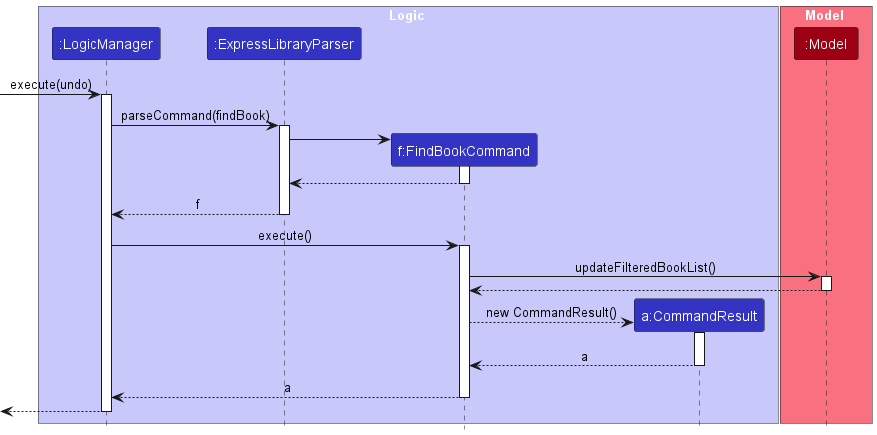

* Table of Contents
{:toc}

--------------------------------------------------------------------------------------------------------------------

## **Acknowledgements**

* This project is based on the AddressBook-Level3 project created by the [_SE-EDU initiative_](https://se-education.org).

--------------------------------------------------------------------------------------------------------------------

## **Introduction**

* This Developer Guide documents the architecture and design of ExpressLibrary, along with some advanced information about the implementation details of ExpressLibrary’s features.

* The Developer Guide is written to aid present and future librarians, who may be technically gifted, in extending ExpressLibrary features by providing them the necessary knowledge on how ExpressLibrary works.

--------------------------------------------------------------------------------------------------------------------

## **Setting up, getting started**

Refer to the guide [_Setting up and getting started_](SettingUp.md).

--------------------------------------------------------------------------------------------------------------------

## **Design**

:bulb: **Tip:** The `.puml` files used to create diagrams in this document can be found in the [diagrams](https://github.com/AY2223S2-CS2103T-T12-3/tp/tree/master/docs/diagrams/) folder. Refer to the [_PlantUML Tutorial_ at se-edu/guides](https://se-education.org/guides/tutorials/plantUml.html) to learn how to create and edit diagrams.

### Architecture

The ***Architecture Diagram*** given above explains the high-level design of the App.

Given below is a quick overview of main components and how they interact with each other.

**Main components of the architecture**

**`Main`** has two classes called [`Main`](https://github.com/AY2223S2-CS2103T-T12-3/tp/tree/master/src/main/java/expresslibrary/Main.java) and [`MainApp`](https://github.com/AY2223S2-CS2103T-T12-3/tp/tree/master/src/main/java/expresslibrary/MainApp.java). It is responsible for,

* At app launch: Initializes the components in the correct sequence, and connects them up with each other.
* At shut down: Shuts down the components and invokes cleanup methods where necessary.

[**`Commons`**](#common-classes) represents a collection of classes used by multiple other components.

The rest of the App consists of four components.

* [**`UI`**](#ui-component): The UI of the App.
* [**`Logic`**](#logic-component): The command executor.
* [**`Model`**](#model-component): Holds the data of the App in memory.
* [**`Storage`**](#storage-component): Reads data from, and writes data to, the hard disk.

**How the architecture components interact with each other**

The _Sequence Diagram_ below shows how the components interact with each other for the scenario where the user issues the command `deletePerson 1`.

Each of the four main components (also shown in the diagram above),

* defines its _API_ in an `interface` with the same name as the Component.
* implements its functionality using a concrete `{Component Name}Manager` class (which follows the corresponding API `interface` mentioned in the previous point.

For example, the `Logic` component defines its API in the `Logic.java` interface and implements its functionality using the `LogicManager.java` class which follows the `Logic` interface. Other components interact with a given component through its interface rather than the concrete class (reason: to prevent outside component's being coupled to the implementation of a component), as illustrated in the (partial) class diagram below.

The sections below give more details of each component.

### UI component

The **API** of this component is specified in [`Ui.java`](https://github.com/AY2223S2-CS2103T-T12-3/tp/tree/master/src/main/java/expresslibrary/ui/Ui.java)

The UI consists of a `MainWindow` that is made up of parts e.g.`CommandBox`, `ResultDisplay`, `PersonListPanel`, `BookListPanel`, `StatusBarFooter` etc. All these, including the `MainWindow`, inherit from the abstract `UiPart` class which captures the commonalities between classes that represent parts of the visible GUI.

The `UI` component uses the JavaFx UI framework. The layout of these UI parts are defined in matching `.fxml` files that are in the `src/main/resources/view` folder. For example, the layout of the [`MainWindow`](https://github.com/AY2223S2-CS2103T-T12-3/tp/tree/master/src/main/java/expresslibrary/ui/MainWindow.java) is specified in [`MainWindow.fxml`](https://github.com/AY2223S2-CS2103T-T12-3/tp/tree/master/src/main/resources/view/MainWindow.fxml)

The `UI` component,

* executes user commands using the `Logic` component.
* listens for changes to `Model` data so that the UI can be updated with the modified data.
* keeps a reference to the `Logic` component, because the `UI` relies on the `Logic` to execute commands.
* depends on some classes in the `Model` component, as it displays `Person` or `Book` object residing in the `Model`.

### Logic component

**API** : [`Logic.java`](https://github.com/AY2223S2-CS2103T-T12-3/tp/tree/master/src/main/java/expresslibrary/logic/Logic.java)

Here's a (partial) class diagram of the `Logic` component:

How the `Logic` component works:

1. When `Logic` is called upon to execute a command, it uses the `ExpressLibraryParser` class to parse the user command.
1. This results in a `Command` object (more precisely, an object of one of its subclasses e.g., `AddCommand`) which is executed by the `LogicManager`.
1. This results in a `Command` object (more precisely, an object of one of its subclasses e.g., `AddPersonCommand`) which is executed by the `LogicManager`.
1. The result of the command execution is encapsulated as a `CommandResult` object which is returned back from `Logic`.

The Sequence Diagram below illustrates the interactions within the `Logic` component for the `execute("deletePerson 1")` API call.

:information_source: **Note:** The lifeline for `DeleteCommandParser` should end at the destroy marker (X) but due to a limitation of PlantUML, the lifeline reaches the end of diagram.

Here are the other classes in `Logic` (omitted from the class diagram above) that are used for parsing a user command:

How the parsing works:

* When called upon to parse a user command, the `ExpressLibraryParser` class creates an `XYZCommandParser` (`XYZ` is a placeholder for the specific command name e.g., `AddPersonCommandParser`) which uses the other classes shown above to parse the user command and create a `XYZCommand` object (e.g., `AddPersonCommand`) which the `ExpressLibraryParser` returns back as a `Command` object.
* All `XYZCommandParser` classes (e.g., `AddPersonCommandParser`, `DeletePersonCommandParser`, ...) inherit from the `Parser` interface so that they can be treated similarly where possible e.g, during testing.

### Model component

**API** : [`Model.java`](https://github.com/AY2223S2-CS2103T-T12-3/tp/tree/master/src/main/java/expresslibrary/model/Model.java)

The `Model` component,

* stores the ExpressLibrary data i.e., all `Person` objects (which are contained in a `UniquePersonList` object) and all `Book` objects (which are contained in a `UniqueBookList`).
* stores the currently 'selected' `Person` objects (e.g., results of a search query) as a separate _filtered_ list which is exposed to outsiders as an unmodifiable `ObservableList<Person>` that can be 'observed' e.g. the UI can be bound to this list so that the UI automatically updates when the data in the list change. Similar process for `Book` objects as well.
* stores a `UserPref` object that represents the user’s preferences. This is exposed to the outside as a `ReadOnlyUserPref` objects.
* does not depend on any of the other three components (as the `Model` represents data entities of the domain, they should make sense on their own without depending on other components)

:information_source: **Note:** An alternative (arguably, a more OOP) model is given below. It has a `Tag` list in the `ExpressLibrary`, which `Person` references. This allows `ExpressLibrary` to only require one `Tag` object per unique tag, instead of each `Person` needing their own `Tag` objects. 

### Storage component

**API** : [`Storage.java`](https://github.com/AY2223S2-CS2103T-T12-3/tp/tree/master/src/main/java/expresslibrary/storage/Storage.java)

The `Storage` component,

* can save both express library data and user preference data in json format, and read them back into corresponding objects.
* inherits from both `ExpressLibraryStorage` and `UserPrefStorage`, which means it can be treated as either one (if only the functionality of only one is needed).
* depends on some classes in the `Model` component (because the `Storage` component's job is to save/retrieve objects that belong to the `Model`).

### Common classes

Classes used by multiple components are in the `expresslibrary.commons` package.

--------------------------------------------------------------------------------------------------------------------

## **Implementation**

This section describes some noteworthy details on how certain features are implemented.

### Borrow/return feature

#### Implementation

The borrow feature will allow the user to mark a book as borrowed by a person.
Similarly, the return feature will allow the user to mark a book as returned to the ExpressLibrary by a person.

It implements the following commands:

* `borrow PERSON_INDEX b/BOOK_INDEX d/DUE_DATE`
* `return PERSON_INDEX b/BOOK_INDEX`

Given below is an example usage scenario of the borrow command:

The user executes `borrow 1 b/2 d/23/11/2023` command to lend the 2nd book in the book list to the 1st person in the Person list.

The `BorrowCommand` class will first retrieve the `Person` object and `Book` object from the given indexes and create a copy of them (since they are immutable) called `editedPerson` and `bookToBorrow`.

Then, it calls `borrowBook` on `editedPerson` and passes in the `Book` object `bookToBorrow`. This will add the book to the person's `Set` of `books` field. Similarly, the class also calls `loanBookTo` on `bookToBorrow` to update the book's fields with the borrower, the borrow date (current date) and the due date details.

Given below is an example usage scenario of the return command:

The user executes `return 2 b/1` command to return the 1st book in the book list from the 2nd person in the person list.

The `ReturnCommand` class will first retrieve the `Person` object and `Book` object from the given indexes and create a copy of them (since they are immutable) called `editedPerson` and `bookToReturn`.

Then, it calls `returnBook` on `editedPerson` and passes in the `Book` object `bookToReturn`. This will remove the book from the Person's `Set` of books field. Similarly, the class also calls `returnBook` on `bookToReturn` to update and remove the person from the book's borrower field as well as clear the borrow and due dates.

### Find book feature

#### Implementation

Given below is an example usage scenario and how the `findBook` command progresses from step to step.

Step 1. The user launches the app and enters `findBook The` command to look for any books with the keyword `The` in its title (non case-sensitive). `MainWindow#executeCommand()` is called, which passes the control over to the Logic component by calling `LogicManager#execute()`.

Step 2. `ExpressLibraryParser#parseCommand` is called to parse the given `findBook` command text, which calls `FindBookCommandParser#parse` to further parse `findBook` command text. This ultimately produces a `FindBookCommand` object. The logic manager then calls `FindBookCommand#execute` on the new object which passes control to the `Model` component.

Step 3. `FindBookCommand#execute` will call `Model#updateFilteredBookList` to update the `FilteredList` of books which is then reflected in the UI because `BookListPanel#BookListPanel()` constructor sets `BookListPanel.fxml` to be constantly viewing the book list. The `Model` component then passes control back to the Logic component.

Step 4. `FindBookCommand#execute` returns a `CommandResult` object to the `LogicManager#execute`, which then passes control back to the UI component.

Step 5. `MainWindow#executeCommand` then uses the `CommandResult` to display feedback to the user on the UI which states: “{Number of books that match keyword} books found!”

The following sequence diagram shows how the `findBook` operation works:

--------------------------------------------------------------------------------------------------------------------

## **Documentation, logging, testing, configuration, dev-ops**

* [Documentation guide](Documentation.md)
* [Testing guide](Testing.md)
* [Logging guide](Logging.md)
* [Configuration guide](Configuration.md)
* [DevOps guide](DevOps.md)

--------------------------------------------------------------------------------------------------------------------

## **Appendix: Requirements**

### Product scope

**Target user profile**:

* Has a need to manage a significant number of books and library users.
* Has a need to quickly access a particular book or person.
* Has a need to track if due dates of books borrowed are approaching/expired.
* Can type fast.
* Prefers typing to mouse interactions.
* Is reasonably comfortable using CLI apps.

**Value proposition**: Manage users and books faster, quickly find users or books faster than a typical mouse/GUI driven app.

### User stories

Priorities: High (must have) - `* * *`, Medium (nice to have) - `* *`, Low (unlikely to have) - `*`

| Priority | As a …​       | I want to …​                                      | So that I can…​                                                    |
|----------|---------------|---------------------------------------------------|--------------------------------------------------------------------|
| `* * *`  | librarian          | add a new book that has not been added in the app | track the status of the new book
| `* * *`  | librarian          | edit the details of a specific book               | track any changes to the book                         |
| `* * *`  | librarian           | delete a book                                     | not track it if the book is no longer in the library                            |
| `* * *`  | librarian          | have the data automatically saved in hard drive    | refer to the data in the future                                    |
| `* *`    | librarian           | be able to keep a record of all the people who have borrowed books | better manage the library                                          |
| `* *`    | librarian           | add the book to the contact details of the person who borrowed them | rent the book out while keeping track of the book and the due date |
| `* *`    | librarian           | remove a book from a patron if the patron has returned the book | allow the book to be borrowed by other patrons                    |
| `*`      | advanced librarian  | edit the data file                                | adjust the data to suit my needs                                   |

### Use cases

(For all use cases below, the **System** is the `ExpressLibrary` and the **Actor** is the `user`, unless specified otherwise)

**Use case: Delete a person**

**MSS**

1. User requests to list persons.
2. ExpressLibrary shows a list of persons.
3. User requests to delete a specific person in the list.
4. ExpressLibrary deletes the person.

    Use case ends.

**Use case: Book is borrowed by a person**

**MSS**

1. User requests to list persons.
2. ExpressLibrary shows a list of persons.
3. User requests to add a book to a specific person in the list.
4. ExpressLibrary adds a book field to the person.

    Use case ends.

**Extensions**

* 2a. The list is empty.

  Use case ends.

* 3a. The given index is invalid.
  * 3a1. ExpressLibrary shows an error message.

      Use case resumes at step 2.

### Non-Functional Requirements

1. Should work on any _mainstream OS_ as long as it has Java `11` or above installed.
2. Should be able to hold up to 1000 persons and books without a noticeable sluggishness in performance for typical usage.
3. A user with above average typing speed for regular English text (i.e. not code, not system admin commands) should be able to accomplish most of the tasks faster using commands than using the mouse.
4. Should be able to load the application within 2 seconds.

### Glossary

* **Mainstream OS**: Windows, Linux, Unix, OS-X
* **ISBN**: International Standard Book Number which is a commercial book identifier that is intended to be unique. Consists of 10 to 13 digits.

--------------------------------------------------------------------------------------------------------------------

## **Appendix: Instructions for manual testing**

Given below are instructions to test the app manually.

:information_source: **Note:** These instructions only provide a starting point for testers to work on;
testers are expected to do more _exploratory_ testing.

### Launch and shutdown

* Initial launch

   1. Download the jar file and copy into an empty folder.

   1. Double-click the jar file.  
      Expected: Shows the GUI with a set of sample people and books.

* Saving window preferences

   1. Resize the window to an optimum size. Move the window to a different location. Close the window.

   1. Re-launch the app by double-clicking the jar file.  
       Expected: The most recent window size and location is retained.

### Adding a book

* Adding a book while all books are being shown.

    1. Test case: `addBook t/Diary of a Wimpy kid a/Jeff Kinney i/9780810993136` 
       Expected: A book and its details is added into the book list.

    1. Test case: `addBook 0` 
       Expected: No book is added. Error details shown in the status message. Status bar remains the same.

    1. Other incorrect delete commands to try: `addBook`, `addBook 5`, `...` 
       Expected: Similar to previous.

### Deleting a book

* Deleting a book while all books are being shown.

    1. Prerequisites: List all books using the `listBook` command. Multiple books in the list.

    1. Test case: `deleteBook 1` 
       Expected: First book is deleted from the list. Details of the deleted book shown in the status message. Timestamp in the status bar is updated.

    1. Test case: `deleteBook 0` 
       Expected: No book is deleted. Error details shown in the status message. Status bar remains the same.

    1. Other incorrect delete commands to try: `deleteBook`, `deleteBook x`, `...` (where x is larger than the list size) 
       Expected: Similar to previous.

### Editing a book

* Editing a book while all books are being shown.

    1. Prerequisites: List all books using the `listBook` command. Multiple books in the list.

    1. Test case: `editBook 1 t/Diary of a Wimpy kid a/Jeff Kinney i/9780810993136` 
       Expected: First book is edited. Details of the book are changed according to the input.

    1. Test case: `editBook 0` 
       Expected: No book is deleted. Error details shown in the status message. Status bar remains the same.

    1. Other incorrect delete commands to try: `editBook`, `editBook 3`, `...` 
       Expected: Similar to previous.

### Deleting a person

1. Deleting a person while all persons are being shown.

   1. Prerequisites: List all persons using the `listPerson` command. Multiple persons in the list.

   1. Test case: `deletePerson 1` 
      Expected: First contact is deleted from the list. Details of the deleted contact shown in the status message. Timestamp in the status bar is updated.

   1. Test case: `deletePerson 0` 
      Expected: No person is deleted. Error details shown in the status message. Status bar remains the same.

   1. Other incorrect delete commands to try: `deletePerson`, `deletePerson x`, `...` (where `x` is larger than the list size) 
      Expected: Similar to previous.

### Saving data

1. Dealing with missing data files.
   1. Delete `[JAR file location]/data/expresslibrary-{version_num}.json` if it exists.

   Expected: Launch ExpressLibrary and you should be able to see sample data with people and books.

2. Dealing with corrupted data files.

   1. Prerequisites: `expresslibrary-{version_num}.json` should exist in `[JAR file location]/data`. If it does not exist, launch ExpressLibrary and use any command that will change the data of the ExpressLibrary (e.g. `addBook`, `borrow`, etc.) and the `expresslibrary-{version_num}.json` file will be automatically generated.

   1. To simulate a corrupted file, go to `[JAR file location]/data/expresslibrary-{version_num}.json` and make changes so that the file would be invalid (e.g. remove a comma/bracket).

   Expected: Launch ExpressLibrary and you should see that ExpressLibrary will be empty.

:information_source: **Note:** Advanced users of ExpressLibrary are welcome to manually edit the data file if they wish to do so. Please refer to [_How data is saved_](https://ay2223s2-cs2103t-t12-3.github.io/tp/UserGuide.html#how-data-is-saved).

--------------------------------------------------------------------------------------------------------------------

## **Appendix: Planned Enhancements**

Given below are some of the planned enhancements to ExpressLibrary current features.

1. Currently all ExpressLibrary fields do not have any character limit, resulting in extreme inputs being truncated in the GUI. We plan to set an appropriate character limit for each field in order to counteract this and wrap the fields if the GUI cannot fit the fields in one line.

2. Currently each person can borrow an unlimited books, we plan to fix this by limiting the number of books a person can borrow in a future update.

3. Currently, ExpressLibrary assumes that there is only one copy of each book in the library which is obviously quite unrealistic. We plan to solve this by creating a BookInstance class in the future to account for different copies of the same book in the library.

4. Email addresses are only validated based on regex (specifically RFC5322 standard) and not whether it is actually a valid email. We plan to use internationalised domain names in a future update in order to truly validate an email address.

--------------------------------------------------------------------------------------------------------------------
