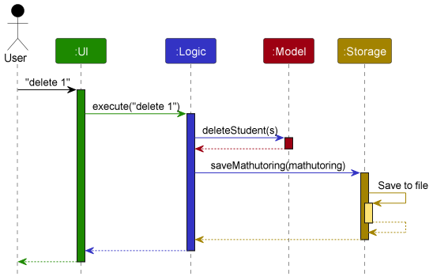
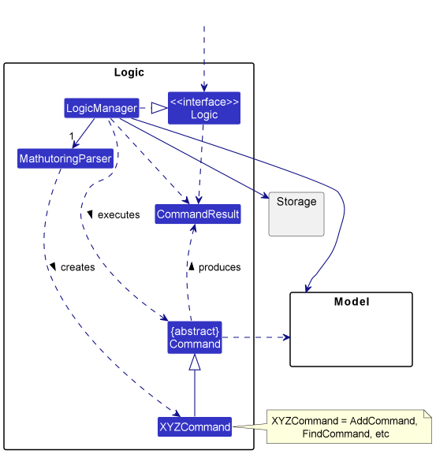
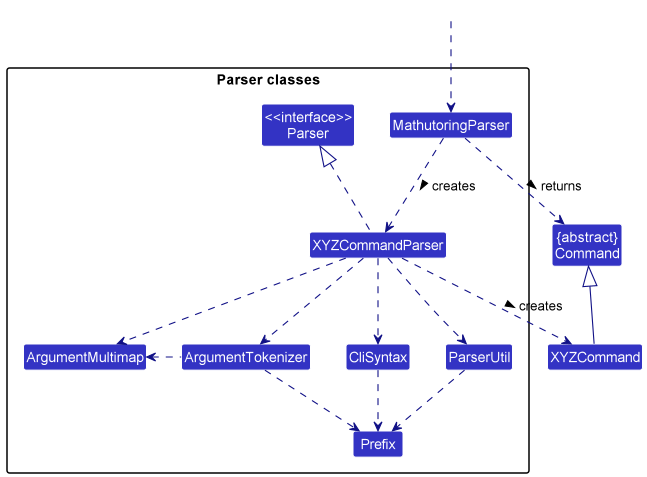
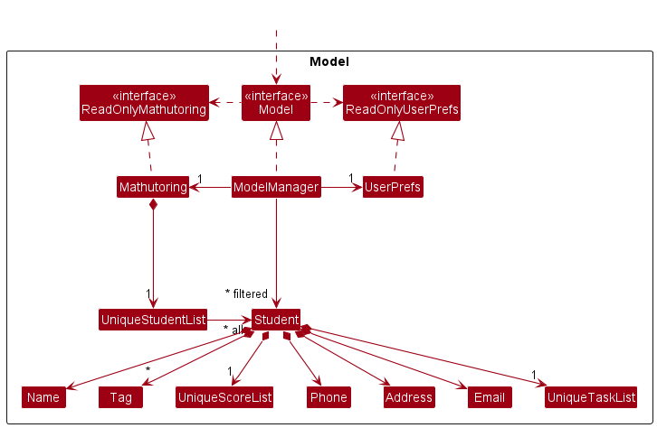
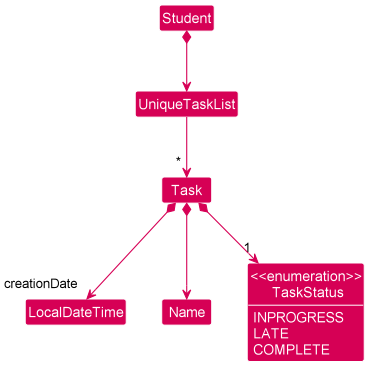
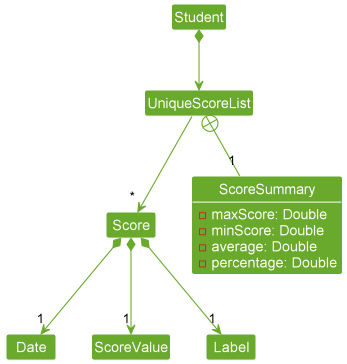
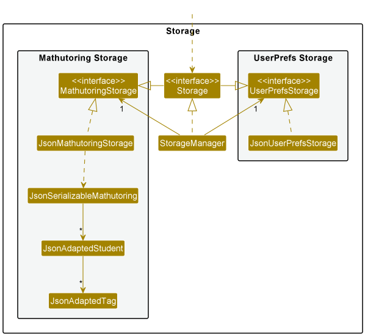

## Table of Contents
* **[Acknowledgements](#acknowledgements)**
* **[Setting up, getting started](#setting-up-getting-started)**
* **[Design](#design)**
    * **[Architecture](#architecture)**
    * **[UI component](#ui-component)**
    * **[Logic component](#logic-component)**
    * **[Model component](#model-component)**
        * [Task Model](#task-model)
        * [Score Model](#score-model)
    * **[Storage component](#storage-component)**
    * **[Common classes](#common-classes)**
* **[Appendix: Requirements](#appendix-requirements)**
    * **[Product scope](#product-scope)**
    * **[User stories](#user-stories)**
    * **[User cases](#use-cases)**
    * **[Non-Functional Requirements](#non-functional-requirements)**
    * **[Glossary](#glossary)**
* **[Appendix: Instructions for manual testing](#appendix-instructions-for-manual-testing)**
* **[Appendix: Effort](#appendix-effort)**
* **[Appendix: Planned Enhancements](#appendix-planned-enhancements)**

--------------------------------------------------------------------------------------------------------------------

## **Acknowledgements**

* This project is based on the AddressBook-Level3 project created by the [SE-EDU initiative](https://se-education.org).
* Libraries used: [JavaFX](https://openjfx.io/), [Jackson](https://github.com/FasterXML/jackson), [JUnit5](https://github.com/junit-team/junit5), [Mockito](https://site.mockito.org/), [Apache PDFBox](https://pdfbox.apache.org/)

--------------------------------------------------------------------------------------------------------------------

## **Setting up, getting started**

Refer to the guide [_Setting up and getting started_](SettingUp.md).

--------------------------------------------------------------------------------------------------------------------

## **Design**

### Architecture


The ***Architecture Diagram*** given above explains the high-level design of the MATHUTORING.

Given below is a quick overview of main components and how they interact with each other.

**Main components of the architecture**

**`Main`** has two classes called [`Main`](https://github.com/AY2223S2-CS2103-W17-1/tp/blob/master/src/main/java/seedu/address/Main.java) and [`MainApp`](https://github.com/AY2223S2-CS2103-W17-1/tp/blob/master/src/main/java/seedu/address/MainApp.java). It is responsible for,
* At app launch: Initializes the components in the correct sequence, and connects them up with each other.
* At shut down: Shuts down the components and invokes cleanup methods where necessary.

[**`Commons`**](#common-classes) represents a collection of classes used by multiple other components.

The rest of the App consists of four components.

* [**`UI`**](#ui-component): The UI of the App.
* [**`Logic`**](#logic-component): The command executor.
* [**`Model`**](#model-component): Holds the data of the App in memory.
* [**`Storage`**](#storage-component): Reads data from, and writes data to, the hard disk.


**How the architecture components interact with each other**

The *Sequence Diagram* below shows how the components interact with each other for the scenario where the user issues the command `delete 1`.



Each of the four main components (also shown in the diagram above),

* defines its *API* in an `interface` with the same name as the Component.
* implements its functionality using a concrete `{Component Name} Manager` class (which follows the corresponding API `interface` mentioned in the previous point.

For example, the `Logic` component defines its API in the `Logic.java` interface and implements its functionality using the `LogicManager.java` class which follows the `Logic` interface. Other components interact with a given component through its interface rather than the concrete class (reason: to prevent outside component's being coupled to the implementation of a component), as illustrated in the (partial) class diagram below.


The sections below give more details of each component.

### UI component

**API** : [`Ui.java`](https://github.com/AY2223S2-CS2103-W17-1/tp/blob/master/src/main/java/seedu/address/ui/Ui.java)

The UI consists of a MainWindow that is made up of different parts.
For instance, `CommandBox`, `ResultDisplay`, `StudentListPanel`, `ScoreListPanel`,
`TaskListPanel`, `StatusBarFooter` etc. All theses, including the MainWindow,
inherit from the abstract UiPart class which captures the commonalities between
classes that represent parts of visible GUI.

The UI component uses the JavaFx UI framework. The layout of these UI
parts are defined in matching `.fxml` files that are in the `src/main/resources/view`
folder. For example, the layout of the `MainWindow` is specified in `MainWindow.fxml`.

The UI component,
* executes user commands using the `Logic` component.
* listens for changes to `Model` data so that the UI can be
updated with the modified data.
* keeps a reference to the `Logic` component, because the UI relies on the `Logic`
to execute the commands.
* depends on some classes in the `Model` component, as it displays `Student` object
residing in the `Model`.

### Logic component

**API** : [`Logic.java`](https://github.com/AY2223S2-CS2103-W17-1/tp/blob/master/src/main/java/seedu/address/logic/Logic.java)

Here's a (partial) class diagram of the `Logic` component:



How the `Logic` component works:
1. When `Logic` is called upon to execute a command, it uses the `MathutoringParser` class to parse the user command.
2. This results in a `Command` object (more precisely, an object of one of its subclasses e.g., `AddCommand`) which is executed by the `LogicManager`.
3. The command can communicate with the `Model` when it is executed (e.g. to add a student).
4. The result of the command execution is encapsulated as a `CommandResult` object which is returned back from `Logic`.

The Sequence Diagram below illustrates the interactions within the `Logic` component for the `execute("delete 1")` API call.


<div markdown="span" class="alert alert-info">

**Note:** The lifeline for `DeleteCommandParser` should end at the destroy marker (X) but due to a limitation of PlantUML, the lifeline reaches the end of diagram.
</div>

Here are the other classes in `Logic` (omitted from the class diagram above) that are used for parsing a user command:



How the parsing works:
* When called upon to parse a user command, the `MathutoringParser` class creates an `XYZCommandParser` (`XYZ` is a placeholder for the specific command name e.g., `AddCommandParser`) which uses the other classes shown above to parse the user command and create a `XYZCommand` object (e.g., `AddCommand`) which the `MathutoringParser` returns back as a `Command` object.
* All `XYZCommandParser` classes (e.g., `AddCommandParser`, `DeleteCommandParser`, ...) inherit from the `Parser` interface so that they can be treated similarly where possible e.g, during testing.

### Model component

**API** : [`Model.java`](https://github.com/AY2223S2-CS2103-W17-1/tp/blob/master/src/main/java/seedu/address/model/Model.java)




The `Model` component,

* stores the mathutoring data i.e., all `Student` objects (which are contained in a `UniqueStudentList` object).
* stores the currently 'selected' `Student` objects (e.g., results of a search query) as a separate _filtered_ list which is exposed to outsiders as an unmodifiable `ObservableList<Student>` that can be 'observed' e.g. the UI can be bound to this list so that the UI automatically updates when the data in the list change.
* stores a `UserPref` object that represents the user’s preferences. This is exposed to the outside as a `ReadOnlyUserPref` objects.
* does not depend on any of the other three components (as the `Model` represents data entities of the domain, they should make sense on their own without depending on other components)

<div markdown="span" class="alert alert-info">

**Note:** An alternative (arguably, a more OOP) model is given below. It has a `Tag` list in the `Mathutoring`, which `Student` references. This allows `Mathutoring` to only require one `Tag` object per unique tag, instead of each `Student` needing their own `Tag` objects.<br>

</div>

#### Task model
**API** : [`Task.java`](https://github.com/AY2223S2-CS2103-W17-1/tp/blob/master/src/main/java/seedu/address/model/task/Task.java)



* A `Student` has a `TaskList` object which holds all their `Task` objects.
* Each `Task` object has a `TaskStatus` assigned to it and can be any of `INPROGRESS`, `LATE` or `COMPLETE`.
* The `creationDate` will be hidden from the user and only be used for sorting the `TaskList`.

#### Score model
**API** : [`Score.java`](https://github.com/AY2223S2-CS2103-W17-1/tp/blob/master/src/main/java/seedu/address/model/task/Task.java)



* A `Student` has a `UniqueScoreList` object which holds all their `Score` objects.
* `UniqueScoreList` is a separate filtered list with recent score at front which is exposed to outsiders as an unmodifiable ObservableList<Student> that can be 'observed' e.g. the UI can be bound to this list so that the UI automatically updates when the data in the list change.

### Storage component

**API** : [`Storage.java`](https://github.com/AY2223S2-CS2103-W17-1/tp/blob/master/src/main/java/seedu/address/storage/Storage.java)



The `Storage` component,
* can save both mathutoring data and user preference data in json format, and read them back into corresponding objects.
* inherits from both `MathutoringStorage` and `UserPrefStorage`, which means it can be treated as either one (if only the functionality of only one is needed).
* depends on some classes in the `Model` component (because the `Storage` component's job is to save/retrieve objects that belong to the `Model`)

### Common classes

Classes used by multiple components are in the `seedu.address.commons` package.

--------------------------------------------------------------------------------------------------------------------

## **Implementation**

This section describes some noteworthy details on how certain features are implemented.

### \[Proposed\] Undo/redo feature

#### Proposed Implementation

#### Design considerations:

_{more aspects and alternatives to be added}_

### \[Proposed\] Data archiving

_{Explain here how the data archiving feature will be implemented}_


--------------------------------------------------------------------------------------------------------------------

## **Documentation, logging, testing, configuration, dev-ops**

* [Documentation guide](Documentation.md)
* [Testing guide](Testing.md)
* [Logging guide](Logging.md)
* [Configuration guide](Configuration.md)
* [DevOps guide](DevOps.md)

--------------------------------------------------------------------------------------------------------------------

## **Appendix: Requirements**

### Product scope

**Target user profile**:

* Private math tuition teachers
* Has a need to manage a number of students' contacts and performance
* Prefer desktop apps over other types
* Prefers typing to mouse interactions
* Is reasonably comfortable using CLI apps

**Value proposition**:

Tutors tend to use multiple applications to keep track of their student's contact details and performance. MATHUTORING comes into a centralised desktop application with a contact management system to track students' contact details and performance by keeping student contact details, tasks, and scores which subsequently allows the tutors to plan their lesson plan for future lessons and overall view of their schedule for ease of planning.


### User stories

Priorities: High (must have) - `* * *`, Medium (nice to have) - `* *`, Low (unlikely to have) - `*`

| Priority | As a …​ | I want to …​                                                | So that I can…​                                                                          |
|----------|---------|-------------------------------------------------------------|------------------------------------------------------------------------------------------|
| `* * *`  | user    | see a list of my students                                   | know who my students are and how many students I have                                    |
| `* * *`  | user    | purge all current data                                      | get rid of sample/experimental data I used for exploring the app                        |
| `* * *`  | user    | create my student contacts                                  | add new students into my contact list                                                    |
| `* * *`  | user    | edit my student contacts                                    | my contact list is more extensive/flexible                                              |
| `* * *`  | user    | delete my student contacts                                  | remove contacts of students that I don't teach anymore                                  |
| `* * *`  | user    | use the help section                                        | learn the available commands in the application                                          |
| `* * *`  | user    | import my data                                              | backup data and open in another device                                                  |
| `* * *`  | user    | export my data                                              | load data into a new device                                                              |
| `* * *`  | user    | add / delete / mark student’s tasking(s)                    | keep track of the task(s) that assign to a student and identify what taskings are done/in progress/overdue |
| `* * *`  | user    | add / delete student’s score(s)                             | record down the student's score(s)                                                      |
| `* * *`  | user    | check the student’s taskings                                | understand how good the student is doing                                                |
| `* * *`  | user    | check the student’s score(s)                                | understand the student's performance in school                                          |
| `* * `   | user    | filter my student contacts                                  | easily find a group of students based on the tag given
                   |
| `* * `   | user    | generate a progress chart                                   | keep track of the student's progress                                                    |
| `* * `   | user    | extract students' progress report                           | show the parents their kids' performance                                                |

### Use cases

(For all use cases below, the **System** is the `MATHUTORING` and the **Actor** is the `Tutor`, unless specified otherwise)

**Use case: Delete a student**

**MSS**

1.  Tutor requests to list students.
2.  MATHUTORING shows a list of students.
3.  Tutor requests to delete a specific student in the list.
4.  MATHUTORING deletes the student.

    Use case ends.

**Extensions**

* 2a. The list is empty.

  Use case ends.

* 3a. The given index is invalid.

    * 3a1. MATHUTORING shows an error message.

      Use case resumes at step 2.

* 3b. The given command argument(s) are invalid.
    * 3b1. MATHUTORING shows an error message.

      Use case resumes at step 2.

**Use case: Update a student**

**MSS**

1.  Tutor requests to list students.
2.  MATHUTORING shows a list of students.
3.  Tutor requests to edit a specific student in the list.
4.  MATHUTORING edits the student.

    Use case ends.

**Extensions**

* 2a. The list is empty.

  Use case ends.

* 3a. The given index is invalid.

    * 3a1. MATHUTORING shows an error message.

      Use case resumes at step 2.

* 3b. The given command argument(s) are invalid.

    * 3b1. MATHUTORING shows an error message.

      Use case resumes at step 2.

**Use case: Delete a task**

**MSS**

*{More to be added}*

**Extensions**

*{More to be added}*

**Use case: Update a task**

**MSS**

*{More to be added}*

**Extensions**

*{More to be added}*

**MSS**

*{More to be added}*

**Extensions**

*{More to be added}*

**Use case: Add a score**

**MSS**

1. Tutor requests to add a score.
2. MATHUTORING creates the score with score label, score value and score date.
3. MATHUTORING stores the score to the score list storage.

    Use case ends.

**Extensions**

* 1a. MATHUTORING detects that the score label, score value or score date is missing.

    * 1a1. MATHUTORING informs the tutor that there is missing element.

      Use case resumes at step 2.

* 1b. MATHUTORING detects that score label, score value or score date has an invalid format.

  * 1b1. MATHUTORING informs the tutor that the form of new score is invalid.

    Use case ends.

* 1c. MATHUTORING detects that the score has already exited.

    * 1c1. MATHUTORING informs the tutor that the score has already exited.

      Use case ends.

**Use case: Delete a score**

**MSS**

1. Tutor requests to list students.
2. MATHUTORING shows a list of students.
3. Tutor requests to check specific student.
4. MATHUTORING shows a list of scores for that student.
5. Tutor requests to delete a specific score of a specific student.
6. MATHUTORING deletes the score.

   Use case ends.

**Extensions**

* 2a. The list is empty.

  Use case ends.

* 3a. The given student's index is invalid.

    * 3a1. MATHUTORING informs the tutor that the index is invalid.

      Use case resumes at step 2.

* 4a. The score list is empty.

  Use case ends.

* 5a. The given student's index is invalid.

    * 5a1. MATHUTORING informs the tutor that the index is invalid.

      Use case resumes at step 1.

* 5b. The given score's index is invalid.

    * 5b1.  MATHUTORING informs the tutor that the index is invalid.

      Use case resumes at step 3.

**Use case: Export a student's progress**

**MSS**

1. Tutor requests to export a student's progress.
2. MATHUTORING shows an export progress window.
3. Tutor requests to save the student's progress.
4. MATHUTORING shows a browse files window.
5. Tutor requests the directory and file name of the student's progress file.
6. MATHUTORING saves the file.

    Use case ends.

**Extensions**

* 5a. The given file name is invalid.

  * 5a1. File manager informs the tutor that the file name is invalid.

    Use case resumes at step 5.

* 5b. A file with the exact same name and type exists and is currently being opened.

  * 5b1. MATHUTORING informs the tutor that the file cannot be saved because the file with the same name exists and is
  currently being opened.

    Use case resumes at step 5.

**Use case: Import application data via CLI**

**MSS**

1. Tutor requests to import application data.
2. MATHUTORING loads the data into the application.

    Use case ends.

**Extensions**
* 1a. MATHUTORING detects a command format error.

  Use case resumes at step 1.

* 1b. MATHUTORING detects the file does not follow the parsing format.

  Use case resumes at step 1.

**Use case: Import application data via GUI**

**MSS**

1. Tutor requests to import application data.
2. MATHUTORING opens Import GUI window.
3. Tutor request to upload file.
4. MATHUTORING opens the OS file explorer.
5. Tutor selects a directory to upload the data.
6. MATHUTORING saves the file.
7. MATHUTORING loads the data into the application.

    Use case ends.

**Extensions**
* 6a. MATHUTORING detects the file does not follow the parsing format.

  Use case resumes at step 3.

**Use case: Export application data via CLI**

**MSS**

1. Tutor requests to export application data.
2. MATHUTORING saves the file.

    Use case ends.

**Extensions**
* 1a. MATHUTORING detects a command format error.

  Use case resumes at step 1.

**Use case: Export application data via GUI**

**MSS**

1. Tutor requests to export application data.
2. MATHUTORING opens the OS file explorer.
3. Tutor selects a directory to save the data.
4. MATHUTORING saves the file.

    Use case ends.

**Extensions**
* 2a. File explorer closed by Tutor by mistake.

  Use case resumes at step 1.

* 2b. File explorer closed by Tutor.

  Use case ends.

**Use case: Export student's progress via CLI**

**MSS**

1. Tutor requests to export student's progress.
2. MATHUTORING saves the file.

   Use case ends.

**Extensions**
* 1a. MATHUTORING detects a command format error.

  Use case resumes at step 1.

* 1b. MATHUTORING detects that a file with the exact same name and type exists in the selected directory and is currently being opened.

    Use case ends.

**Use case: Export student's progress via GUI**

**MSS**

1. Tutor requests to export student's progress.
2. MATHUTORING shows an export progress window.
3. MATHUTORING opens the OS file explorer.
4. Tutor selects a directory and specifies the file name to save the PDF file.
5. MATHUTORING saves the file.

   Use case ends.

**Extensions**
* 2a. Export progress window closed by Tutor by mistake.
    
  Use case ends.

* 2b. Export progress window closed by Tutor by mistake.

  Use case ends.

* 3a. File explorer closed by Tutor by mistake.

  Use case resumes at step 2.

* 3b. File explorer closed by Tutor.

  Use case resumes at step 2.

* 4a. File name specified is invalid.

  * 4a1. File explorer informs the tutor that the file name is invalid.
      
    Use case resumes at step 2.

* 4b. A file with the exact same name and type exists in the selected directory and is currently being opened.
  
  * 4b1. MATHUTORING informs the tutor that the file cannot be saved due to a file with the same name and type in the same directory is being opened. 
  
    Use case ends.

### Non-Functional Requirements

1.  Should work on any _mainstream OS_ as long as it has Java `11` or above installed.
2.  Should be able to hold up to 1000 students' information without a noticeable sluggishness in performance for typical usage.
3.  A user with above average typing speed for regular English text (i.e. not code, not system admin commands) should be able to accomplish most of the tasks faster using commands than using the mouse.
4.  The application should work on both 32-bit and 64-bit environments.
5.  The application should respond within 3 seconds.
6.  The user interface should be intuitive enough for users who are not IT-savvy.
7.  The product is free of charge.

### Glossary

* **Mainstream OS**: Windows, Linux, Unix, OS-X
* **Tutors**: Private math tuition teachers that will be using the application
* **Students' progress**: For our current version, the progress of a student is tracked through
the number of tasks the student has completed
* **Students' performance**: For our current version, the performance of a student is tracked through a view
of the student's scores. In future implementation, a student's performance will be shown in a line chart

--------------------------------------------------------------------------------------------------------------------

## **Appendix: Instructions for manual testing**

Given below are instructions to test the app manually.

<div markdown="span" class="alert alert-info">:information_source: **Note:** These instructions only provide a starting point for testers to work on;
testers are expected to do more *exploratory* testing.

</div>

### Launch and shutdown

1. Initial launch 

   1. Download the jar file and copy into an empty folder 
   2. Double-click the jar file <br>
   Expected: Shows the GUI with a set of sample students. The window size may not be optimum.

2. Saving window preferences 

   1. Resize the window to an optimum size. Move the window to a different location. Close the window. 
   2. Re-launch the app by double-clicking the jar file.<br>
   Expected: The most recent window size and location is retained.

3. Typing `exit` into the command box
   1. Type `exit` in the command box.<br>
   Expected: The application window closes

### Deleting a student

1. Deleting a student while all students are being shown

    1. Prerequisites: List all students using the `list` command. Multiple students in the list.

    1. Test case: `delete 1`<br>
    Expected: First student is deleted from the list. Details of the deleted student shown in the status message. If the deleted student was being checked 
    using the `check` command, the task list and score list of the student will be cleared.

    1. Test case: `delete 0`<br>
    Expected: No student is deleted. Error details shown in the status message.

    1. Other incorrect delete commands to try: `delete`, `delete x`, `...` (where x is larger than the list size)<br>
    Expected: Similar to previous.

1. Deleting a student being checked
    2. Prerequisites: Check a student using `check` command.

    3. Test case: `delete x` (where x is the index of the student being checked)<br>
    Expected: The student is deleted from the list. Details of the deleted student shown in the status message. The task list and score list shown
    will be cleared.


### Saving data

--------------------------------------------------------------------------------------------------------------------

## **Appendix: Effort**
   
### Difficulty level
   
### Challenges faced
  
### Effort required

### Achievements

--------------------------------------------------------------------------------------------------------------------

## **Appendix: Planned Enhancements**

### Solutions proposed for known feature flaws

Listed are some feature flaws that were found in the current implementation of MATHUTORING. To improve the features of
future implementations, some solutions have been provided.

#### 1. Students with the same name are not allowed

The reason why we do not allow any student to have the same name is to avoid potential confusion. Although the user will
still be able to distinguish them by checking their personal information (e.g. their email, their address etc.), it would
be more straight forward to see a difference in name, i.e. Jason 1 and Jason 2. <br>
Nevertheless, we should consider to allow student to have the same name.

**Solution proposed:**

* Instead of not allowing students to have the same name, we do not allow any students to have both the same name and the
  same email.


#### 2. Numeric student names are allowed

Currently, student names can be numeric. i.e. student name can be "1". After some research we found out that most countries in the world do not allow for purely numeric name.

**Solution proposed:**

* Alter the behavior to only accept alphanumeric or alphabetic names
* Change the name regex to `[\\p{Alnum}]*[a-zA-Z][\\p{Alnum} ]*`


#### 3. Window does not reopen after it is minimized

After help/export/import window is minimized, clicking help/export/import on the top menu will not automatically show 
the window again.

**Solution proposed:**

* Similarly to how ```getRoot().isShowing()``` is used to check if the window is shown, there is also a function called 
```getRoot().isIconified()``` to check whether the window is minimised (returns ```true``` if minimised). 
We can then return ```getRoot().setIconified(false)``` to restore the window to its previous state.


#### 4. Exams are not allowed to be on the same date

The aim of the score list is to keep track of a student's recent performance trend (especially the chart). 
If the majority of the exams are conducted on the same date, it defeats our purpose of having the score records.<br>
However, it is a reasonable assumption that more than one exam is conducted on the same date.

**Solution proposed:**

* Allow at most five exams on the same date.


#### 5. Score table being cut after resizing the application window

This problem might happen after user resizes the application window, which can result in the horizontal scroll bar covering
part of the displayed score table.<br>
**Suggestion to be able to view the entire table:** Try to enlarge the window size, or click on the table and scroll up and down.

**Solution proposed:**

* Although the entire table should be able to be seen by the user after following the above suggestion, it may still hinder the user.
* The main reason the table is cut is due to the usage of JavaFX TableView. By default, it comes with a scrollbar and is relatively hard to customize.
* To resolve the feature flaw, JavaFX label will be used to construct the table with CSS instead of using the JavaFX TableView.


#### 6. Edit the tags will overwrite the whole list of tags

* Currently, if the user wants to add tags to students in the list, they can only use `edit` command and will need to input all existing tags along with the new tag.
* Also, if the user wants to edit a specific tag, they will also be required to input all existing tags along with the one they want to edit.
* There are currently no delete operations for tags. 
* Without these operations, it is very hard to manage tags since the only way to do it is by using the `edit` command which is deteriorates the user experience.

**Solution proposed:**

* To solve this issue, at least two more commands can be created which are `addtag` and `deletetag`.
* With these new commands, the user will no longer be required to input the existing tags when adding a new tag.
