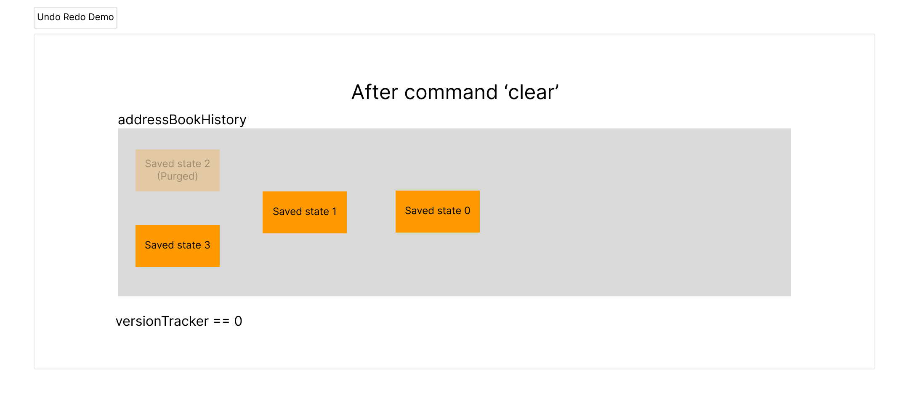
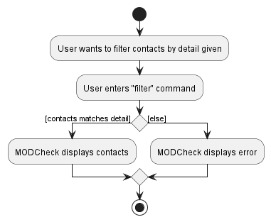
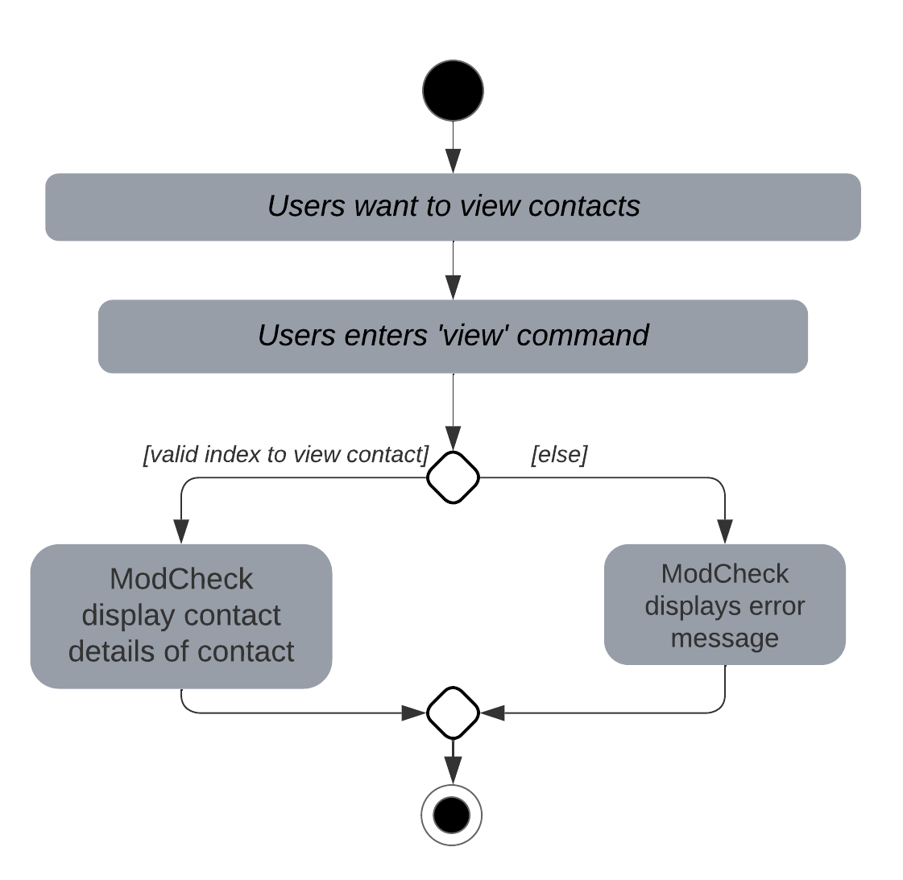
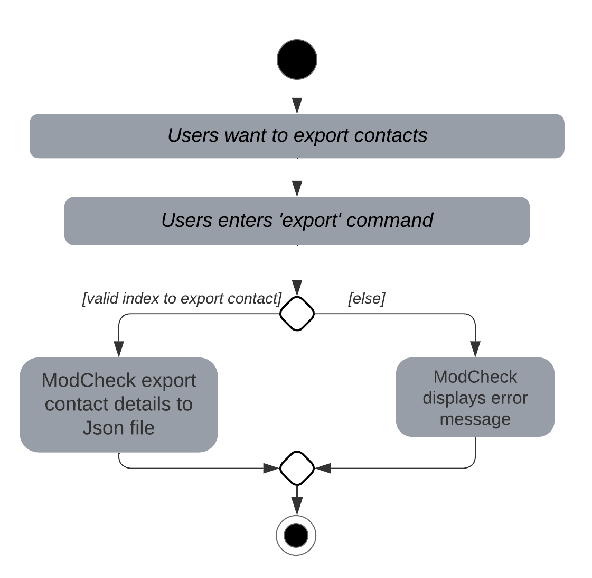

* Table of Contents
{:toc}

--------------------------------------------------------------------------------------------------------------------

## **Acknowledgements**

* {list here sources of all reused/adapted ideas, code, documentation, and third-party libraries -- include links to the original source as well}

--------------------------------------------------------------------------------------------------------------------

## **Setting up, getting started**

Refer to the guide [_Setting up and getting started_](SettingUp.md).

--------------------------------------------------------------------------------------------------------------------

## **Design**

:bulb: **Tip:** The `.puml` files used to create diagrams in this document can be found in the [diagrams](https://github.com/se-edu/addressbook-level3/tree/master/docs/diagrams/) folder. Refer to the [_PlantUML Tutorial_ at se-edu/guides](https://se-education.org/guides/tutorials/plantUml.html) to learn how to create and edit diagrams.

### Architecture

The ***Architecture Diagram*** given above explains the high-level design of the App.

Given below is a quick overview of main components and how they interact with each other.

**Main components of the architecture**

**`Main`** has two classes called [`Main`](https://github.com/se-edu/addressbook-level3/tree/master/src/main/java/seedu/address/Main.java) and [`MainApp`](https://github.com/se-edu/addressbook-level3/tree/master/src/main/java/seedu/address/MainApp.java). It is responsible for,
* At app launch: Initializes the components in the correct sequence, and connects them up with each other.
* At shut down: Shuts down the components and invokes cleanup methods where necessary.

[**`Commons`**](#common-classes) represents a collection of classes used by multiple other components.

The rest of the App consists of four components.

* [**`UI`**](#ui-component): The UI of the App.
* [**`Logic`**](#logic-component): The command executor.
* [**`Model`**](#model-component): Holds the data of the App in memory.
* [**`Storage`**](#storage-component): Reads data from, and writes data to, the hard disk.

**How the architecture components interact with each other**

The *Sequence Diagram* below shows how the components interact with each other for the scenario where the user issues the command `delete 1`.

Each of the four main components (also shown in the diagram above),

* defines its *API* in an `interface` with the same name as the Component.
* implements its functionality using a concrete `{Component Name}Manager` class (which follows the corresponding API `interface` mentioned in the previous point.

For example, the `Logic` component defines its API in the `Logic.java` interface and implements its functionality using the `LogicManager.java` class which follows the `Logic` interface. Other components interact with a given component through its interface rather than the concrete class (reason: to prevent outside component's being coupled to the implementation of a component), as illustrated in the (partial) class diagram below.

The sections below give more details of each component.

### UI component

The **API** of this component is specified in [`Ui.java`](https://github.com/se-edu/addressbook-level3/tree/master/src/main/java/seedu/address/ui/Ui.java)

The UI consists of a `MainWindow` that is made up of parts e.g.`CommandBox`, `ResultDisplay`, `PersonListPanel`, `StatusBarFooter` etc.

The UI also consists of a `LoginWindow` that is made up of parts e.g. `WelcomeSection`,`LoadingSection`,`CreatePasswordSection` etc.

The `UI` component uses the JavaFx UI framework. The layout of these UI parts are defined in matching `.fxml` files that are in the `src/main/resources/view` folder. For example, the layout of the [`MainWindow`](https://github.com/se-edu/addressbook-level3/tree/master/src/main/java/seedu/address/ui/MainWindow.java) is specified in [`MainWindow.fxml`](https://github.com/se-edu/addressbook-level3/tree/master/src/main/resources/view/MainWindow.fxml)

All these, including the `MainWindow` and `LoginWindow`, inherit from the abstract `UiPart` class which captures the commonalities between classes that represent parts of the visible GUI.

The `UI` component,

* executes user commands using the `Logic` component.
* listens for changes to `Model` data so that the UI can be updated with the modified data.
* keeps a reference to the `Logic` component, because the `UI` relies on the `Logic` to execute commands.
* depends on some classes in the `Model` component, as it displays `Person` object residing in the `Model`.

### Logic component

**API** : [`Logic.java`](https://github.com/se-edu/addressbook-level3/tree/master/src/main/java/seedu/address/logic/Logic.java)

Here's a (partial) class diagram of the `Logic` component:

How the `Logic` component works:
1. When `Logic` is called upon to execute a command, it uses the `AddressBookParser` class to parse the user command.
1. This results in a `Command` object (more precisely, an object of one of its subclasses e.g., `AddCommand`) which is executed by the `LogicManager`.
1. The command can communicate with the `Model` when it is executed (e.g. to add a person).
1. The result of the command execution is encapsulated as a `CommandResult` object which is returned back from `Logic`.

The Sequence Diagram below illustrates the interactions within the `Logic` component for the `execute("delete 1")` API call.

:information_source: **Note:** The lifeline for `DeleteCommandParser` should end at the destroy marker (X) but due to a limitation of PlantUML, the lifeline reaches the end of diagram.

Here are the other classes in `Logic` (omitted from the class diagram above) that are used for parsing a user command:

How the parsing works:
* When called upon to parse a user command, the `AddressBookParser` class creates an `XYZCommandParser` (`XYZ` is a placeholder for the specific command name e.g., `AddCommandParser`) which uses the other classes shown above to parse the user command and create a `XYZCommand` object (e.g., `AddCommand`) which the `AddressBookParser` returns back as a `Command` object.
* All `XYZCommandParser` classes (e.g., `AddCommandParser`, `DeleteCommandParser`, ...) inherit from the `Parser` interface so that they can be treated similarly where possible e.g, during testing.

### Model component
**API** : [`Model.java`](https://github.com/se-edu/addressbook-level3/tree/master/src/main/java/seedu/address/model/Model.java)

The `Model` component,

* stores the address book data i.e., all `Person` objects (which are contained in a `UniquePersonList` object).
* stores the currently 'selected' `Person` objects (e.g., results of a search query) as a separate _filtered_ list which is exposed to outsiders as an unmodifiable `ObservableList<Person>` that can be 'observed' e.g. the UI can be bound to this list so that the UI automatically updates when the data in the list change.
* stores a `UserPref` object that represents the user’s preferences. This is exposed to the outside as a `ReadOnlyUserPref` objects.
* stores a `UserData` object that represents the user's personal data. This is exposed to the outside as a `ReadOnlyUserData` objects.
* does not depend on any of the other three components (as the `Model` represents data entities of the domain, they should make sense on their own without depending on other components)

:information_source: **Note:** An alternative (arguably, a more OOP) model is given below. It has a `Tag` list in the `AddressBook`, which `Person` references. This allows `AddressBook` to only require one `Tag` object per unique tag, instead of each `Person` needing their own `Tag` objects. 

### Storage component

**API** : [`Storage.java`](https://github.com/se-edu/addressbook-level3/tree/master/src/main/java/seedu/address/storage/Storage.java)

The `Storage` component,
* can save both address book data and user preference data in json format, and read them back into corresponding objects.
* can also save the user's personal data in json format, and read them back into corresponding objects
* inherits from `AddressBookStorage`,`UserPrefStorage` and `UserDataStorage`, which means it can be treated as either one (if only the functionality of only one is needed).
* depends on some classes in the `Model` component (because the `Storage` component's job is to save/retrieve objects that belong to the `Model`)

### Common classes

Classes used by multiple components are in the `seedu.addressbook.commons` package.

--------------------------------------------------------------------------------------------------------------------

## **Implementation**

This section describes some noteworthy details on how certain features are implemented.

### Undo/redo feature

#### Implementation

The undo/redo mechanism is facilitated by `UndoManager` and an `Undoable` interface. The `UndoManager` is 
responsible for saving the version history of a ModelManager. The `Undoable` interface is implemented by a 
`Model` to indicate that it has support for undo and redo functionality. 

The `Undoable` interface requires the implementation of the following functions:
* `Undoable#hasUndoableCommand()`: To allow the user of the `Undoable` object to check if a command exists that can 
  be undone
* `Undoable#hasRedoableCommand()`: To allow the user of the `Undoable` object to check if a command exists that can
  be redone
* `Undoable#executeUndo()`: To allow the user of the `Undoable` object to undo to a previous saved state
* `Undoable#executeRedo()`: To allow the user of the `Undoable` object to redo to a later saved state

The `ModelManager` object implements the `Undoable` interface. It has an `UndoManager` object to manage the 
implementation in the various required undo and redo functionality. The `UndoManager` object is responsible for 
saving previous versions of `AddressBook`, keeping track of which version is currently shown to the user, and 
yielding saved versions of `AddressBook` objects whenever requested.

Given below is an example usage scenario and how the undo/redo mechanism behaves at each step.

Step 1. The user launches the application for the first time. The `UndoManager` will be initialized with 
`addressBookHistory` containing only the current addressBook state. The `versionTracker` variable is initialized to 
0, indicating 0 undos have been executed so far, and the version of ModCheck shown is the most recent version.

Step 2. The user executes `delete 5` command to delete the 5th person in the address book. 
The `delete` command calls `UndoManager#addToHistory()`, causing the modified state of the address book after the 
`delete 5` command executes to be saved in `addressBookHistory`. The `versionTracker` variable stays at 0 as the 
addressBook state after deleting is still the most recent version.

Step 3. The user executes `add n/David …​` to add a new person. 
The `add` command also calls `UndoManager#addToHistory()`, causing another modified address book state to be saved into 
the `addressBookHistory`. Similarly, `versionTracker` remains at 0.

:information_source: **Note:** If a command fails its execution, it 
will not call `UndoManager#addToHistory()`, so the address book state will not be saved into the `addressBookHistory`.

Step 4. The user now decides that adding the person was a mistake, and decides to undo that action by executing the 
`undo` command. The `undo` command will call `UndoManager#getPreviousHistory()`. This method increases the 
`versionTracker` variable by 1. Internally, the UndoManager will find the first most recent saved history, and 
returns a copy of the addressBook representing that. 

:information_source: **Note:** If `versionHistory` is equal to the 
number of number of saved histories, there is no more saved history to undo. The `undo` command uses 
`Model#hasUndoableCommand()` to check if this is the case. If so, it will return an error to the user rather
than attempting to perform the undo.

The `redo` command does the opposite — it calls `Undoable#getNextHistory()`, which decreases the `versionTracker` by 
1, and returns a copy of the addressBook representing the state of the addressBook after redoing.

:information_source: **Note:** If the `versionTracker` is 0, pointing 
to the latest address book state, then there are no undone AddressBook states to restore. The 
`redo` command uses `Undoable#hasRedoableCommand()` to check if this is the case. If so, it will return an error to the 
user rather than attempting to perform the redo.

Step 5. The user then decides to execute the command `list`. Commands that do not modify the address book, such as 
`list`, will usually not call `UndoManager#addToHistory()`. Thus, the `addressBookHistory` remains unchanged.

 

Step 6. The user executes `clear`, which calls `UndoManager#addToHistory()`. Since the `versionTracker` is not 
0, all address book states from index 0 to one before the current version will be purged, and the versionTracker 
will be reset to 0. Reason: It no longer makes sense to redo the "untracked heads". This is the behavior that most 
modern desktop applications follow.

 

### Filtering contacts
**Purpose:** Allow users to filter contacts based on criteria given

Formats: 
1. `filter n/NAME `
2. `filter p/PHONE_NUMBER`
3. `filter e/EMAIL_ADDRESS`
4. `filter d/DESCRIPTION`
5. `filter t/TAG`

#### Implementation

The implementation of this feature requires 'FilterCommand' and 'FilterCommandParser'.                                                                                      

Below is an activity diagram that shows what happens when a user executes the `filter` command

### Viewing contacts
**Purpose:** Allow user to view contacts that are hidden by default based on index given

Formats:
1. `view <index>`
2. `view <index> <index> ...`

#### Implementation

The implementation of this feature requires `ViewCommand`, `ViewCommandParser` and `MatchNamePredicate`.

Below is an activity diagram that shows what happens when a user executes the `view` command.

### Export contacts
**Purpose:** Allow user to export contacts that are hidden by default based on index given

Formats:
1. `export <index>`
2. `export <index> <index> ...`

#### Implementation

The implementation of this feature requires `ExportCommand` and `ExportCommandParser`.

Below is an activity diagram that shows what happens when a user executes the `export` command.

--------------------------------------------------------------------------------------------------------------------

## **Documentation, logging, testing, configuration, dev-ops**

* [Documentation guide](Documentation.md)
* [Testing guide](Testing.md)
* [Logging guide](Logging.md)
* [Configuration guide](Configuration.md)
* [DevOps guide](DevOps.md)

--------------------------------------------------------------------------------------------------------------------

## **Appendix: Requirements**

### Product scope

**Target user profile**:

* students from NUS
* has a need to manage a significant number of contacts
* prefer desktop apps over other types
* can type fast
* prefers typing to mouse interactions
* is reasonably comfortable using CLI apps

**Value proposition**: manage contacts faster than a typical mouse/GUI driven app

### User stories

Priorities: High (must have) - `* * *`, Medium (nice to have) - `* *`, Low (unlikely to have) - `*`

| Priority | As a …​                    | I want to …​                                        | So that I can…​                                                        |
|----------|----------------------------|-----------------------------------------------------|------------------------------------------------------------------------|
| `* * *`  | Student                    | see usage instructions                              | refer to instructions when I forget how to use the App                 |
| `* * *`  | Student                    | add a new contact                                   |                                                                        |
| `* * *`  | Student                    | delete a contact                                    | remove a contact that I no longer need                                 |
| `* * *`  | Student                    | view a person's contact details                     | contact the person(TA/Professor) to seek help for my tutorials         |
| `* * *`  | Student                    | find a contact by name                              | locate details of persons without having to go through the entire list |
| `* * *`  | Student                    | filter my contacts by tag                           | find my contacts that is related to the tag quickly                    |
| `* * *`  | Student                    | edit a contact                                      | update the contact details of my contacts when they change             |
| `* * *`  | Student                    | assign modules to my contacts                       | know which of my contacts are in charge of which modules               |
| `* * *`  | Student                    | filter my contacts by module                        | find all the relevant contacts of a module I am taking                 |
| `* *`    | Student                    | undo my last command                                | reverse my actions if i made a wrong change to ModCheck                |
| `* *`    | Student                    | be able to set certain fields as 'unknown'          | add contacts that I may not know all the details of                    |
| `* *`    | Student                    | hide private contact details                        | minimize chance of someone else seeing them by accident                |
| `* *`    | Student                    | delete all contacts                                 | remove all contacts for a fresh start                                  |
| `*`      | Student with many contacts | sort contacts by name                               | locate a contact easily                                                |
| `*`      | Student                    | use the arrow keys to re-enter my previous commands | enter recently used commands much faster                               |
| `*`      | Student                    | export selected contacts                            | transfer those contacts easily                                         |
*{More to be added}*

### Use cases

(For all use cases below, the **System** is the `ModCheck` and the **Actor** is the `Student`, unless specified otherwise)

**Use case: Add a person**

**MSS**

1. Student requests to add person. 
2. Student enter the required details and submits.
3. ModCheck creates a new person.

    Use case ends.

**Extensions**

* 2a. Person already exists in ModCheck
    * 2a1. ModCheck shows an error message.
    Use case continues at step 2.
* 2b. Input does not follow the required format
    * 2b1. ModCheck shows an error message.
    Use case continues at step 2.
* 2c. Input consists of missing details
    * 2c1. ModCheck shows an error message.
* 2d. Input contains incorrect details
    * 2d1. ModCheck shows an error message.

#### Use case: Delete a single person by Index

**MSS**

1.  Student requests to list persons
2.  ModCheck shows a list of persons
3.  Student requests to delete a specific person in the list
4.  ModCheck deletes the person

    Use case ends.

**Extensions**

* 2a. The list is empty.

  Use case ends.

* 3a. The given index is invalid.

    * 3a1. ModCheck shows an error message.

      Use case resumes at step 2.

#### Use case: Delete multiple persons by multiple indexes

**MSS**

1.  Student requests to list persons
2.  ModCheck shows a list of persons
3.  Student requests to delete multiple persons in the list
4.  ModCheck deletes the persons

    Use case ends.

**Extensions**

* 2a. The list is empty.

  Use case ends.

* 3a. One of the given indexes is invalid.

    * 3a1. ModCheck shows an error message.

      Use case resumes at step 2.

#### Use case: Delete single person by name

**MSS**

1.  Student requests to list persons
2.  ModCheck shows a list of persons
3.  Student requests to delete person in the list by their name.
4.  ModCheck deletes the person

    Use case ends.

**Extensions**

* 2a. The list is empty.

  Use case ends.

* 3a. There is no person with the specified name.

    * 3a1. ModCheck shows an error message.

      Use case resumes at step 2.

* 3b. There are multiple persons with the same name.

    * 3b1. ModCheck shows an error message with a list of persons with the same name.

      Use case ends.

#### Use case: Filter contacts 

**MSS**

1. Student requests to filter contacts with the required details
2. ModCheck shows a list of persons based on details given
    
    Use case ends.

**Extensions**

* 2a. There are no contacts that matches the details given

    * 2a1. ModCheck shows an error message.
        
        Use case ends.

#### Use case: Export contacts

**MSS**

1. Student requests to export selected contact
2. ModCheck shows a list of persons selected
3. ModChecks exports selected contacts

   Use case ends.

**Extensions**

* 1a. Student requests to export multiple contacts 
  * Use case resumes at step 2.
  
* 1b. Student provide invalid request to export contacts
  * 1b1. ModCheck shows an error message.
  * Use case ends.

#### Use case: View a person's contact details

**MSS**

1.  Student requests to list contacts.
2.  ModCheck shows a list of contacts.
3.  Student requests to view a specific contact in the list.
4.  ModCheck displays the person's contact details.

    Use case ends.

**Extensions**

* 2a. The list is empty.

  Use case ends.

* 3a. The given index is invalid.

    * 3a1. ModCheck shows an error message.

      Use case ends.
  
* 3b.  User requests to view multiple people in the list.

    * 3b1. ModCheck validates indexes given is correct. 
    * 3b2. ModCheck displays all person's contact details. 

      Use case ends.
  
      * 3b1a. ModCheck validates indexes given is incorrect.
      * 3b1b. ModChecks shows an error message. 
  
        Use case ends.

#### Use case: Edit a contact by index

**MSS**

1. Student requests to list contacts.
2. ModCheck shows a list of contacts.
3. Student requests to edit a contact supplying new values for certain fields 
4. ModCheck finds the relevant contact by index and edits it

    Use case ends.

**Extensions**

* 2a. The list is empty.

  Use case ends.

* 3a The new value for the specified field is invalid
    * 3a1. ModCheck informs student that the given value for the specified field is invalid

      Use case resumes at step 2.

* 4a. The given index is invalid.

    * 4a1. ModCheck shows an error message.

      Use case resumes at step 2.

#### Use case: Edit a contact by name

**MSS**

1. Student requests to list contacts.
2. ModCheck shows a list of contacts.
3. Student requests to edit a contact supplying new values for certain fields
4. ModCheck finds the relevant contact by name and edits it

   Use case ends.

**Extensions**

* 2a. The list is empty.

  Use case ends.

* 3a The new value for the specified field is invalid
    * 3a1. ModCheck informs student that the given value for the specified field is invalid

      Use case resumes at step 2.

* 4a. The contact does not exist
    * 4a1. ModCheck informs student that contact does not exist

      Use case resumes at step 2

* 4b. There are multiple contacts with the same specified name.
    * 4b1. ModCheck informs student that there are multiple contacts with the same specified name, and returns a list of contacts with the same specified name.

      Use case ends.
  

#### Use case: Switch to light or dark mode

**MSS**

1. Student requests to change to light or dark mode based on their preferences
2. ModCheck displays the selected outcome

    Use case ends.

*{More to be added}*

### Non-Functional Requirements

1.  Should work on any _mainstream OS_ as long as it has Java `11` or above installed.
2.  Should be able to hold up to 1000 persons without a noticeable sluggishness in performance for typical usage.
3.  A student with above average typing speed for regular English text (i.e. not code, not system admin commands) should be able to accomplish most of the tasks faster using commands than using the mouse.
4.  A student should be able to learn and use commands provided by MODCheck easily within an hour of usage.
5.  Should be able to handle exceptions, errors and invalid inputs without crashing.
6.  Should be able to still work even if there is no data file present.
7.  Should be able to function offline - data file and features should work without network connection
8.  Data file should be human-readable and editable with a simple text editor

*{More to be added}*

### Glossary

* **Mainstream OS**: Windows, Linux, Unix, OS-X
* **Contact**: An entry in ModCheck describing a person, consisting of a name and fields containing contact details of 
  that person
* **Contact details**: Information regarding a person's phone number, email, office location, telegram, LinkedIn, or 
  any other information relevant for students to communicate with that person
* **Private contact detail**: A contact detail that is not meant to be shared with others
* **TA**: Teaching Assistant - people who assists Professors in conducting tutorial, labs and other classes
* **GUI**: Graphical User Interface - a system of interactive visual components for computer software
* **CLI**: Command Line Interface - a text-based user interface (UI) used to run programs, manage computer files and interact with the computer
* **Index**: A number indicating the order or position in a given list
* **Person**: Referring to TA or Professor
--------------------------------------------------------------------------------------------------------------------

## **Appendix: Instructions for manual testing**

Given below are instructions to test the app manually.

:information_source: **Note:** These instructions only provide a starting point for testers to work on;
testers are expected to do more *exploratory* testing.

### Launch and shutdown

1. Initial launch

   1. Download the jar file and copy into an empty folder

   1. Double-click the jar file Expected: Shows the GUI with a set of sample contacts. The window size may not be optimum.

1. Saving window preferences

   1. Resize the window to an optimum size. Move the window to a different location. Close the window.

   1. Re-launch the app by double-clicking the jar file. 
       Expected: The most recent window size and location is retained.

1. _{ more test cases …​ }_

### Deleting a person

1. Deleting a person while all persons are being shown

   1. Prerequisites: List all persons using the `list` command. Multiple persons in the list.

   1. Test case: `delete 1` 
      Expected: First contact is deleted from the list. Details of the deleted contact shown in the status message. Timestamp in the status bar is updated.
   
   1. Test case: `delete 1,2,3` 
      Expected: First, second and third contacts are deleted from the list if there are at least three contacts in the list. Success shown in status message.

   1. Test case: `delete Amy` 
      Expected: Amy is deleted from the list if there is only one contact named Amy. Details of the deleted contact shown in the status message. Timestamp in the status bar is updated.

   1. Test case: `delete 0` 
      Expected: No person is deleted. Error details shown in the status message. Status bar remains the same.

   1. Other incorrect delete commands to try: `delete`, `delete x`, `...` (where x is larger than the list size) 
      Expected: Similar to previous.

### Viewing a person's contact details

1. Viewing a person while all persons are being shown

    1. Prerequisites: List all persons using the `view` command. Multiple persons in the list. Contact details not hidden

       1. Test case: `view 1` 
          Expected: The contact details of the first person in the list is displayed in ModCheck.
       
       2. Test case: `view 1 3 4 ` 
          Expected: The contact details of the first, third and fourth person in the list is displayed in ModCheck.

       3. Test case: `view 0` 
          Expected: No person's contact details is displayed. Error details shown in the status message. Status bar remains the same.

       4. Other incorrect delete commands to try: `view`, `view x`, `...` (where x is larger than the list size) 
          Expected: Similar to previous.

1. _{ more test cases …​ }_

### Saving data

1. Dealing with missing/corrupted data files

   1. _{explain how to simulate a missing/corrupted file, and the expected behavior}_

1. _{ more test cases …​ }_
