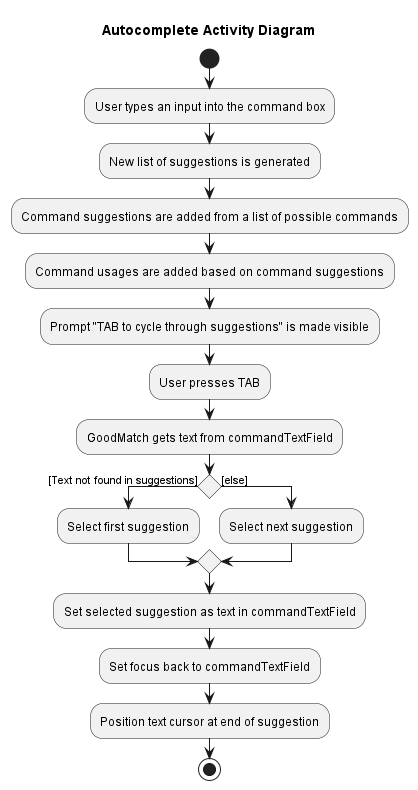

## **Overview**

GoodMatch (GM) is a **desktop app for managing applicants and job listings, optimised for use via a Command Line Interface** (CLI) while still having the benefits of a Graphical User Interface (GUI), specifically catering to HR managers in charge of tracking job listings across many platforms. If you can type fast, GM can get your applicant and job listing management tasks done faster than traditional GUI apps

---

### Table of Contents

- [Overview](#overview)
  - [Table of Contents](#table-of-contents)
  - [Purpose of this guide](#purpose-of-this-guide)
  - [How to use this guide](#how-to-use-this-guide)
  - [Legends](#legends)
- [Acknowledgements](#acknowledgements)
- [Setting up, getting started](#setting-up-getting-started)
- [Design](#design)
  - [Architecture](#architecture)
  - [UI component](#ui-component)
  - [Logic component](#logic-component)
  - [Model component](#model-component)
  - [Storage component](#storage-component)
  - [Common classes](#common-classes)
- [Implementation]()
  - [Add feature]()
- [Documentation, logging, testing, configuration, dev-ops](#documentation-logging-testing-configuration-dev-ops)
- [Appendix: Requirements](#appendix-requirements)
  - [Product scope](#product-scope)
  - [User stories](#user-stories)
  - [Use cases](#use-cases)
  - [Non-Functional Requirements](#non-functional-requirements)
  - [Glossary](#glossary)
- [Appendix: Instructions for manual testing](#appendix-instructions-for-manual-testing)
  - [Launch and shutdown](#launch-and-shutdown)
  - [Deleting a listing](#deleting-a-listing)
  - [Saving data](#saving-data)

---

### Purpose of this guide

Welcome to the developer guide for GoodMatch. This guide will provide you with the information to work on GoodMatch by helping you understand how GoodMatch is designed. The guide also includes information on the requirements of GoodMatch as well as the instructions to manually test GoodMatch on your local machines.

### How to use this guide

To make the most of this guide, start by reading it from beginning to end. We recommend that you familiarize yourself with the basic concepts before moving on to the advanced topics.

Use the interactive [table of contents](#table-of-contents) to navigate through the document quickly. Simply click on the bullet points to be taken to the relevant subsection. Follow the step-by-step instructions, screenshots, and examples to get the most out of the guide.

### Legends

💡 **Tip:** You can find additional tips about the developer guide here.

ℹ️ **Notes**: You can find additional information about the command or feature here.

❗ **Caution**: Be careful not to make this deadly mistake.

--------------------------------------------------------------------------------------------------------------------

## **Acknowledgements**

Codebase foundation by AB3.

---

## **Setting up, getting started**

Refer to the guide [_Setting up and getting started_](SettingUp.md).

--------------------------------------------------------------------------------------------------------------------

## **Design**

:bulb: **Tip:** The `.puml` files used to create diagrams in this document can be found in the [diagrams](https://github.com/AY2223S2-CS2103T-W14-3/tp/tree/master/docs/diagrams/) folder. Refer to the [_PlantUML Tutorial_ at se-edu/guides](https://se-education.org/guides/tutorials/plantUml.html) to learn how to create and edit diagrams.

### Architecture

  
  <em>Architecture Diagram for GoodMatch</em>

The ***Architecture Diagram*** given above explains the high-level design of the App.

Given below is a quick overview of main components and how they interact with each other.

**Main components of the architecture**

**`Main`** has two classes called [`Main`](https://github.com/AY2223S2-CS2103T-W14-3/tp/blob/master/src/main/java/seedu/address/Main.java) and [`MainApp`](https://github.com/AY2223S2-CS2103T-W14-3/tp/blob/master/src/main/java/seedu/address/MainApp.java). It is responsible for,
* At app launch: Initializes the components in the correct sequence, and connects them up with each other.
* At shut down: Shuts down the components and invokes cleanup methods where necessary.

[**`Commons`**](#common-classes) represents a collection of classes used by multiple other components.

The rest of the App consists of four components.

* [**`UI`**](#ui-component): The UI of the App.
* [**`Logic`**](#logic-component): The command executor.
* [**`Model`**](#model-component): Holds the data of the App in memory.
* [**`Storage`**](#storage-component): Reads data from, and writes data to, the hard disk.

**How the architecture components interact with each other**

The *Sequence Diagram* below shows how the components interact with each other for the scenario where the user issues the command `delete 1`.

  
  <em>Architecture Sequence Diagram for GoodMatch</em>

Each of the four main components (also shown in the diagram above),

* defines its *API* in an `interface` with the same name as the Component.
* implements its functionality using a concrete `{Component Name}Manager` class (which follows the corresponding API `interface` mentioned in the previous point.

For example, the `Logic` component defines its API in the `Logic.java` interface and implements its functionality using the `LogicManager.java` class which follows the `Logic` interface. Other components interact with a given component through its interface rather than the concrete class (reason: to prevent outside component's being coupled to the implementation of a component), as illustrated in the (partial) class diagram below.

  
  <em>Sequence Diagram for the Managers in GoodMatch</em>

### UI component

The **API** of this component is specified in [`Ui.java`](https://github.com/AY2223S2-CS2103T-W14-3/tp/blob/master/src/main/java/seedu/address/ui/Ui.java)

  
  <em>Structure of the UI Component</em>

The UI consists of a `MainWindow` that is made up of parts e.g.`CommandBox`, `ResultDisplay`, `ListingListPanel`, `StatusBarFooter` etc. All these, including the `MainWindow`, inherit from the abstract `UiPart` class which captures the commonalities between classes that represent parts of the visible GUI.

The `UI` component uses the JavaFx UI framework. The layout of these UI parts are defined in matching `.fxml` files that are in the `src/main/resources/view` folder. For example, the layout of the [`MainWindow`](https://github.com/AY2223S2-CS2103T-W14-3/tp/blob/master/src/main/java/seedu/address/ui/MainWindow.java) is specified in [`MainWindow.fxml`](https://github.com/AY2223S2-CS2103T-W14-3/tp/blob/master/src/main/resources/view/MainWindow.fxml)

The `UI` component,

* executes user commands using the `Logic` component.
* listens for changes to `Model` data so that the UI can be updated with the modified data.
* keeps a reference to the `Logic` component, because the `UI` relies on the `Logic` to execute commands.
* depends on some classes in the `Model` component, as it displays `Listing` object residing in the `Model`.

### Logic component

**API** : [`Logic.java`](https://github.com/AY2223S2-CS2103T-W14-3/tp/blob/master/src/main/java/seedu/address/logic/Logic.java)

Here's a (partial) class diagram of the `Logic` component:

  
  <em>Structure of the UI Component</em>

How the `Logic` component works:
1. When `Logic` is called upon to execute a command, it uses the `ListingBookParser` class to parse the user command.
1. This results in a `Command` object (more precisely, an object of one of its subclasses e.g., `AddCommand`) which is executed by the `LogicManager`.
1. The command can communicate with the `Model` when it is executed (e.g. to add a Listing).
1. The result of the command execution is encapsulated as a `CommandResult` object which is returned from `Logic`.

The Sequence Diagram below illustrates the interactions within the `Logic` component for the `execute("delete 1")` API call.

  
  <em>Interactions Inside the Logic Component for the `delete 1` Command</em>

:information_source: **Note:** The lifeline for `DeleteCommandParser` should end at the destroy marker (X) but due to a limitation of PlantUML, the lifeline reaches the end of diagram.

Here are the other classes in `Logic` (omitted from the class diagram above) that are used for parsing a user command:

  
  <em>Class diagram for the Parser classes</em>

How the parsing works:
* When called upon to parse a user command, the `ListingBookParser` class creates an `XYZCommandParser` (`XYZ` is a placeholder for the specific command name e.g., `AddCommandParser`) which uses the other classes shown above to parse the user command and create a `XYZCommand` object (e.g., `AddCommand`) which the `ListingBookParser` returns back as a `Command` object.
* All `XYZCommandParser` classes (e.g., `AddCommandParser`, `DeleteCommandParser`, ...) inherit from the `Parser` interface so that they can be treated similarly where possible e.g, during testing.

### Model component
**API** : [`Model.java`](https://github.com/AY2223S2-CS2103T-W14-3/tp/blob/master/src/main/java/seedu/address/model/Model.java)

  
  <em>Class diagram for the Model Component</em>

The `Model` component,

* stores the address book data i.e., all `Listing` objects (which are contained in a `UniqueListingList` object).
* stores the currently 'selected' `Listing` objects (e.g., results of a search query) as a separate _filtered_ list which is exposed to outsiders as an unmodifiable `ObservableList<Listing>` that can be 'observed' e.g. the UI can be bound to this list so that the UI automatically updates when the data in the list change.
* stores a `UserPref` object that represents the user’s preferences. This is exposed to the outside as a `ReadOnlyUserPref` objects.
* does not depend on any of the other three components (as the `Model` represents data entities of the domain, they should make sense on their own without depending on other components)

:information_source: **Note:** An alternative (arguably, a more OOP) model is given below. It has a `Tag` list in the `ListingBook`, which `Listing` references. This allows `ListingBook` to only require one `Tag` object per unique tag, instead of each `Listing` needing their own `Tag` objects. 

  
  <em>A better Class diagram for the Model Component</em>

### Storage component

**API** : [`Storage.java`](https://github.com/AY2223S2-CS2103T-W14-3/tp/blob/master/src/main/java/seedu/address/storage/Storage.java)

  
  <em>Class diagram for the Storage Component</em>

The `Storage` component,
* can save both listing book data and user preference data in json format, and read them back into corresponding objects.
* inherits from both `ListingBookStorage` and `UserPrefStorage`, which means it can be treated as either one (if only the functionality of only one is needed).
* depends on some classes in the `Model` component (because the `Storage` component's job is to save/retrieve objects that belong to the `Model`)

### Common classes

Classes used by multiple components are in the `seedu.address.commons` package.

--------------------------------------------------------------------------------------------------------------------

## **Implementation**

This section describes how features are implemented in GoodMatch in general. Detailed examples will be provided as well as specific details for noteworthy features.

### Overview

The basic idea for what happens when a user types a command and presses enter:
1. The CommandBox executes the command with `handleCommandEntered()` which does 2 things.
   1. Use `LogicManager` to execute the command.
      1. The `LogicManager` is in charge of parsing commands.
         1. Preliminary parsing is done by `ListingBookParser` to determine the type of command.
         2. Further parsing is done by `XYZCommandParser` if there are additional arguments to be parsed.
      2. The parsed command then communicates with the `ModelManager` to execute.
   2. Display the result from step 1.

For more detailed explanations and diagrams (sequence, partial class, and architecture diagrams) please refer to the [Design](#design) section above.

In GoodMatch, feature commands can be split into these categories:
1. Feature commands that only require a preliminary parsing.
   1. Commands like `help`, `exit`, `view`.
2. Feature commands that require further parsing which can be further categorised.
   1. Feature commands that modify ListingBook.
      1. Commands like `add`, `add_app`, `add_plat`, `delete`, `del_app`, `del_plat`, `edit`, and `edit_app`.
   2. Feature commands that do not modify ListingBook.
      1. Commands like `find` and `sort`.
3. Feature commands for special features.
   1. `undo`
   2. Autocomplete feature (no command)

Examples for the implementation of each category will be provided below.

### Add feature

The `add` command creates a new `Listing` in GoodMatch's Job Listing Management System.

  :information_source: **Note:** Command format:  
  `add t/TITLE d/DESCRIPTION [p/PLATFORM]... [a/APPLICANT]...`

When a user use the `add` command:
1. When a user tries to run an add command, the system executes several steps to add a new listing to the application. 
2. The first step is to check if all the compulsory prefixes are present in the command and if the preamble is empty. 
3. If the check passes, the system creates a new listing with attributes based on the prefixes. 
4. The system then checks if the listing already exists in the model. 
5. If the listing exists, the system throws a command exception for duplicate listing. 
6. If the listing does not exist, the system adds the listing to the model and displays a success message to the user, indicating that the add command was executed successfully. 
7. However, if the check for compulsory prefixes fails or the preamble is non-empty, the system throws a parse error for invalid command format. 
8. By following these steps, users can successfully add new listings to the application while avoiding duplicate listings and incorrect command formats.

Please refer to the activity diagram below to see what happens when the user enters an add command.

  
  <em>Activity Diagram for the `add` command</em>

#### Feature Implementation Details

1. The user will be specifying the details of the `Listing` in the add command.
2. There are a few details that a user can specify:
   1. `t/TITLE`: The job title of the listing (Compulsory).
   2. `d/DESCRIPTION`: The job description of the listing (Compulsory).
   3. `a/APPLICANT`: The applicants that applied using that job listing (Not compulsory, can input multiple).
   4. `p/PLATFORM`: The platforms that the job listing is posted on (Not compulsory, can input multiple).
3. The check for whether a `Listing` is in a `model` or not is done using the `JobTitle` of the `Listing` only.
4. A preamble is the substring between the command word and the first prefix.
   1. For example, `add something t/title d/description`.
      1. The command word is `add`.
      2. The preamble is `something`.
      3. The first prefix is `t/`.

#### Design considerations

* The `add` command is implemented using the [Logic](#logic-component) and [Model](#model-component) components as shown in the [Design](#design) section above.
* The `add` and `delete` command share almost identical UML Sequence Diagrams.
* One advantage of using this design is that it is very scalable and new commands can be added easily.
  * Add a case into the switch case statement for the new command.
  * Add a `XYZCommandParser` class into `src/main/java/seedu/address/logic/parser` to parse arguments (if any).
  * Add a `XYZCommand` class into `src/main/java/seedu/address/logic/commands` to execute the parsed command from the step above.
  * Return the command result from the `XYZCommand` mentioned in the step above.
* However, one disadvantage for using this design choice is the file directory might be very difficult to understand for newcomers because function calls are very deeply nested.

### Sort feature

The `sort` feature works by taking in a field that the user wants to sort the ListingBook by, and then sorts according to that.
GoodMatch currently supports sorting by JobTitle, JobDescription, and Number of Applicants.
When sorting `String` like JobTitle and JobDescription, Listings in the ListingBook is sorted by lexicographical order, whereas for numerical values like number of applicants, Listings are sorted by the numerical value.
Sorting is all done in ascending order.

Refer to the activity diagram below for what happens when a user runs a sort command.

> insert activity diagram here

#### Feature details

#### Design considerations

### Undo feature

The undo mechanism utilises the `prevListingBookStates` field in `ModelManager`. Additionally, it implements the following operations:

* `Model#undo()` — Restores the previous listing book state from its history.
* `Model#hasPreviousState()` — Checks if there are available listing book states in the history to undo into.

Given below is an example usage scenario and how the undo mechanism behaves at each step.

Step 1. The user launches the application for the first time. The `prevListingBookStates` will be initialized with an empty `ArrayList`.

  
  <em>Initial state of the application.</em>

Step 2. The user executes `delete 5` command to delete the 5th listing in the listing book. The `delete` command calls `Model#commitListingBook()`, causing the modified state of the listing book after the `delete 5` command executes to be saved in the `prevListingBookStates`.

  
  <em>Saving `delete` modified listing book state.</em>

Step 3. The user executes `add t/Coder d/code​` to add a new listing. The `add` command also calls `Model#commitListingBook()`, causing another modified listing book state to be saved into the `prevListingBookStates`.

  
  <em>Saving `add` modified listing book state.</em>

:information_source: **Note:** If a command fails its execution, it will not call `Model#commitListingBook()`, so the listing book state will not be saved into the `prevListingBookStates`.

Step 4. The user now decides that adding the listing was a mistake, and decides to undo that action by executing the `undo` command. The `undo` command will call `Model#undo()`, which restores the previous listing book state by setting as the `listingBook` and deleting it from `prevListingBookStates`.

  
  <em>Restoring the previous listing book state.</em>

:information_source: **Note:** If the `prevListingBookStates` is empty, then there are no previous ListingBook states to restore. The `undo` command uses `Model#hasPreviousState()` to check if undo is possible. If not, it will return an error to the user rather
than attempting to perform the undo.

The following sequence diagram shows how the undo operation works:

  
  <em>Sequence Diagram for the undo command.</em>

:information_source: **Note:** The lifeline for `UndoCommand` should end at the destroy marker (X) but due to a limitation of PlantUML, the lifeline reaches the end of diagram.

Step 5. The user then decides to execute the command `list`. Commands that do not modify the listing book, such as `list`, will usually not call `Model#commitListingBook()` or `Model#undo()`. Thus, the `prevListingBookStates` remains unchanged.

  
  <em>Commands that do not modify the listing book.</em>

The following activity diagram summarizes what happens when a user executes a new command:

  
  <em>Activity Diagram for the undo command.</em>

### Autocomplete feature

The autocomplete feature allows a user to cycle through suggested commands based on the partial command that is typed in the command box.

To use it, a user has to type a partial command, then press TAB to cycle through a list of suggested commands that was generated based on the partial command.
For example, when a user types `a` into the command box, `add`, `add_app`, and `add_plat` will be suggested and the user is able to cycle through them by pressing TAB.

When a user types a partial command:
1. Check if the user's input is already in the list of suggestions and is not equal to `add`.
2. If the check passes, no new suggestions are generated.
3. Else, a new list of suggestions is generated like so
   1. Command suggestions are added from a list of possible commands.
   2. Command usages are added based on the command suggestions from step (i).
   3. The entire list is sorted based on the length of suggestion and returned.
4. If there is at least 1 suggestion, the prompt "TAB to cycle through suggestions" will be made visible.

When a user presses TAB:
1. GoodMatch gets the text currently in the commandTextField and searches for it in a list of suggestions. 
2. If the text is not found in the list of suggestions, the first suggestion is selected. 
3. If the text is found in the list of suggestions, the next suggestion in the list is selected. 
4. The selected suggestion is then set as the text in the commandTextField.
5. The focus is set back to the commandTextField.
6. The text cursor is positioned at the end of the suggestion.

Please refer to the activity diagram below to see what happens when a user uses the autocomplete feature.

  
  <em>Activity Diagram for the autocomplete feature</em>

#### Feature Implementation details

1. commandTextField is the text input field on the GUI for users to type their inputs in.
2. Autocomplete is only done for commands at the moment and not for commonly used words.

#### Design considerations

1. This is an early version of the feature.
2. Only commands are inside the word list and since the word list is small, we can afford to find for matches directly.
3. There are plans on expanding this feature and improving on it as stated below.
   1. Apply autocomplete to commonly used words in the job search industry. 
      1. Searching for words cannot be done directly, due to slow performances issues.
      2. Searching will be implemented using Tries for faster performance.
      3. Commonly used words include "manager", "senior", "engineer"
   2. Show suggested words and allow users to click to select desired word.
      1. Better user experience for instances where user wants a long suggestion.
      2. User is able to see at a glance whether the correct suggestion is generated rather than having to cycle through everything.

---

## **Documentation, logging, testing, configuration, dev-ops**

* [Documentation guide](Documentation.md)
* [Testing guide](Testing.md)
* [Logging guide](Logging.md)
* [Configuration guide](Configuration.md)
* [DevOps guide](DevOps.md)

--------------------------------------------------------------------------------------------------------------------

## **Appendix: Requirements**

### Product scope

**Target user profile: Recruiters (Private or from small businesses)**

- Has a need to manage a significant number of job listings.
- Prefer desktop apps over other types.
- Can type fast.
- Prefers typing to mouse interactions.
- Is reasonably comfortable using CLI apps

**Value proposition**: All-in-one app that is free for managing job listings with an intuitive user experience

### User stories

Priorities: High (must have) - `* * *`, Medium (nice to have) - `* *`, Low (unlikely to have) - `*`

| No. | Priority | As a …​ | I want to …​                                                | So that…                                                                 |
|-----| --- | --- |-------------------------------------------------------------|--------------------------------------------------------------------------|
| 1   | * * * | Recruiter who receives thousands of applications each day.  | store all information about my applicants                   | I don't lose track of any applicants.                                    |
| 2   | * * * | Recruiter | post a new job posting                                      | I can start attracting applicants.                                       |
| 3   | * * * | Recruiter | update job listings                                         | it reflects the most updated information                                 |
| 4   | * * * | Recruiter | view all job listings                                       |                                                                          |
| 5   | * * * | Recruiter | delete outdated job listing                                 | the information is accurate                                              |
| 6   | * * | Recruiter | sort job listings by expiry date                            | finding most urgent job listing can be easy                              |
| 7   | * * * | Recruiter | view applicants for each job listing                        | I know who has applied for each job                                      |
| 8   | * * * | Recruiter | add applicants to job listing                               |                                                                          |
| 9   | * * * | Recruiter | remove disqualified applicant                               | the database stays clean                                                 |
| 10  | * * * | Recruiter | edit applicant details                                      | each applicant’s info is updated                                         |
| 11  | * * * | Recruiter | find job listings by title                                  |                                                                          |
| 12  | * * | Recruiter | sort job listings by the number of applicants               |                                                                          |
| 13  | * * | Recruiter | get help with how to use the program                        | I know what commands I have available                                    |
| 14  | * * * | Recruiter | come back to the program and continue from where I left off | I won't lose my progress                                                 |
| 15  | * * * | Recruiter | view platforms for each job listing                         | I can easily keep track of which platforms I have posted the job listing |
| 16  | * * * | Recruiter | add platforms to job listing                                |                                                                          |
| 17  | * * * | Recruiter | remove platforms where the listing is expired               | the database stays clean                                                 |
| 18  | * * * | Recruiter | use the app with the help of autocomplete                   | I can type very fast                                                     |

## Use cases

(For all use cases below, the **System** is the `GoodMatch` and the **Actor** is the `Recruiter` unless specified otherwise)

**Use case: Add a new job listing**

**MSS**

1. The recruiter requests to add a new job listing.
2. ListingBook adds the job listing to the list of job listings.

   Use case ends.

**Extensions**

- 2a. The placeholders used are invalid.
    - 2a1. ListingBook shows an error message.
    - Use case resumes at step 1.

- 2b. The new job title is invalid.
    - 2b1. ListingBook shows an error message.
    - Use case resumes at step 1.

- 2c. The new job description is invalid.
    - 2c1. ListingBook shows an error message.
    - Use case resumes at step 1.

- 2d. There is a duplicate listing in the listing book.
    - 2d1. ListingBook shows an error message.
    - Use case resumes at step 1.

**Use case: Delete a Listing**

**MSS**

1. Recruiter requests to list listings.
2. ListingBook shows a list of listings.
3. The recruiter requests to delete a specific listing from the list.
4. ListingBook deletes the listing.

    Use case ends.

**Extensions**

- 2a. The list is empty.

    Use case ends.

- 3a. The given index is invalid.
    - 3a1. ListingBook shows an error message.
    - Use case resumes at step 2.**

**Use case: List all job listings**

**MSS**

1. Recruiter requests to list job listings.
2. ListingBook shows a list of job listings.

    Use case ends.

**Extensions**

- 2a. The list is empty.

    Use case ends.

**Use case: Update a job listing**

**MSS**

1. Recruiter requests to update a job listing.
2. ListingBook shows a list of job listings.
3. The recruiter requests to update a specific listing from the list.
4. ListingBook updates the job listing.

    Use case ends.

**Extensions**

- 2a. The list is empty.

    Use case ends.

- 3a. The given index is invalid.
    - 3a1. ListingBook shows an error message.
    - Use case resumes at step 2.
 
- 3b. The placeholders used are invalid.
    - 3b1. ListingBook shows an error message.
    - Use case resumes at step 2.

- 3c. The new job title is invalid.
    - 3c1. ListingBook shows an error message.
    - Use case resumes at step 2.

- 3d. The new job description is invalid.
    - 3d1. ListingBook shows an error message.
    - Use case resumes at step 2.

- 3e. There is a duplicate listing in the listing book.
    - 3e1. ListingBook shows an error message.
    - Use case resumes at step 2.

**Use case: Find a job listing**

**MSS**

1. Recruiter requests to find a job listing by keyword(s).
2. ListingBook displays a list of job listings that match the keyword.

    Use case ends.

**Extensions**

- 2a. No job listings match the keyword.

    Use case ends.
- 2b. The list is empty.

    Use case ends.

**Use case: Sort job listings**

**MSS**

1. Recruiter requests to sort job listings.
2. ListingBook sorts the job listings according to the selected option.
3. ListingBook displays the sorted list of job listings.

    Use case ends.

**Extensions**

- 2a. The list is empty.

    Use case ends.

**Use case: Undo**

**MSS**
1. Recruiter requests for an undo.
2. ListingBook reverses the last command.
3. ListingBook displays reversed list of job listings.

    Use case ends.
 
**Extensions**
- 2a. Previous command does not change the ListingBook.

    Use case ends.

**Use case: Filter job listings**

**MSS**

1. Recruiter requests to filter job listings.
2. ListingBook filters the job listings according to the selected option.
3. ListingBook displays the filtered list of job listings.

    Use case ends.

**Extensions**

- 4a. No job listings match the filter criteria.

    Use case ends.
- 4b. The list is empty.

    Use case ends.

**Use case: Delete an applicant from a job listing**

**MSS**

1. Recruiter requests to delete an applicant from a job listing.
2. ListingBook remove the existing applicant from the job listing.
3. ListingBook displays the job listings with the applicant removed from the specified listing.

    Use case ends.

**Extensions**

- 1a. Specified job listing not found.

    Use case ends.
- 1b. Specified applicant not found in the job listing.

    Use case ends.
- 1c. There are two or more applicants that match the keywords.
  - 1c1. ListingBook requests user to provide a more specific keyword.
  - 1c2. User enters new request.
  - Steps 1c1-1c2 are repeated until the data entered are correct.
  - Use case resumes from step 2.

**Use case: Edit an applicant from a job listing**

**MSS**

1. Recruiter requests to edit an applicant from a job listing.
2. ListingBook changes the details of the existing applicant from the job listing.
3. ListingBook displays the job listings with the edited applicant from the specified listing.

    Use case ends.

**Extensions**

- 1a. Specified job listing not found.

    Use case ends.
- 1b. Specified applicant not found in the job listing.

    Use case ends.
- 1c. There are two or more applicants that match the keywords.
    - 1c1. ListingBook requests user to provide a more specific keyword.
    - 1c2. User enters new request.
    - Steps 1c1-1c2 are repeated until the data entered are correct.
    - Use case resumes from step 2.

**Use Case: View Listings**

**MSS**

1. Recruiter requests to view all job listings.
2. GoodMatch shows a list of all job listings.

   Use case ends.

**Extensions**

- 2a. The ListingBook is empty.

  Use case ends.

**Use Case: Add Applicant to Job Listing**

**MSS**

1. Recruiter requests to add an applicant to a specific job listing.
2. GoodMatch adds the applicant to the job listing in the ListingBook.
3. GoodMatch displays the new ListingBook with the added applicant in the previously specified listing.

   Use case ends.

**Extensions**

- 2a. The list is empty.
  - 2a1. GoodMatch shows an error message

  Use case ends.

- 2b. The given index is invalid.
    - 2b1. GoodMatch shows an error message.

    Use case ends.

**Use Case: Add Platform to Job Listing**w

**MSS**

1. Recruiter requests to add a platform to a specific job listing.
2. GoodMatch adds the platform to the job listing in the ListingBook.
3. GoodMatch displays the new ListingBook with the added platform in the previously specified listing.

   Use case ends.

**Extensions**

- 2a. The list is empty.

  Use case ends.

- 2b. The given index is invalid.
  - 2b1. GoodMatch shows an error message.
  
  Use case ends.

**Use Case: Delete Platform from Job Listing**

**MSS**

1. Recruiter requests to delete a platform from a specific job listing.
2. GoodMatch deletes the selected platform from the job listing in the ListingBook.
3. GoodMatch displays the new ListingBook with the platform removed from the previously specified listing.

   Use case ends.

**Extensions**

- 2a. The list is empty.

  Use case ends.

- 2b. The given index is invalid.
  - 2b1. GoodMatch shows an error message.
  
    Use case ends.

**Use Case: Autocomplete**

**MSS**

1. User types a partial command in the console.
2. GoodMatch builds a list of suggestions based on partial command.
3. GoodMatch prompts recruiter to press TAB to cycle through suggestions.
4. Recruiter presses TAB.
5. GoodMatch goes through the generated suggestions and auto-completes the command.

   Use case ends.

**Extensions**

- 3a. There are no possible completions for the partial command.
  - 3a1. GoodMatch does not prompt recruiter to press TAB to cycle through suggestions.

    Use case ends.

### Non-Functional Requirements

1. Should work on any *mainstream OS* as long as it has Java `11` or above installed.
2. Should be able to hold up to 1000 listings without a noticeable sluggishness in performance for typical usage.
3. A user with above-average typing speed for regular English text (i.e. not code, not system admin commands) should be able to accomplish most of the tasks faster using commands than using the mouse.
4. Should be maintainable and have a clear code structure and documentation, so new updates and bug fixes can be easily implemented.
5. Should be easy to use with clear instructions and meaningful error messages.

### Glossary

- **Mainstream OS**: Windows, Linux, Unix, OS-X
- **Private contact detail**: A contact detail that is not meant to be shared with others

--------------------------------------------------------------------------------------------------------------------

## **Appendix: Instructions for manual testing**

Given below are instructions to test the app manually.

:information_source: **Note:** These instructions only provide a starting point for testers to work on;
testers are expected to do more *exploratory* testing.

### Launch and shutdown

1. Initial launch

  1. Download the jar file and copy into an empty folder

  1. Double-click the jar file Expected: Shows the GUI with a set of sample contacts. The window size may not be optimum.

1. Saving window preferences

  1. Resize the window to an optimum size. Move the window to a different location. Close the window.

  1. Re-launch the app by double-clicking the jar file. 
     Expected: The most recent window size and location is retained.

1. _{ more test cases …​ }_

### Deleting a listing

1. Deleting a listing while all listings are being shown

  1. Prerequisites: List all listings using the `view` command. Multiple listings in the list.

  1. Test case: `delete 1` 
     Expected: First listing is deleted from the list. Details of the deleted listing shown in the status message. Timestamp in the status bar is updated.

  1. Test case: `delete 0` 
     Expected: No listing is deleted. Error details shown in the status message. Status bar remains the same.

  1. Other incorrect delete commands to try: `delete`, `delete x`, `...` (where x is larger than the list size) 
     Expected: Similar to previous.

1. _{ more test cases …​ }_

### Saving data

1. Dealing with missing/corrupted data files

  1. _{explain how to simulate a missing/corrupted file, and the expected behavior}_

1. _{ more test cases …​ }_
