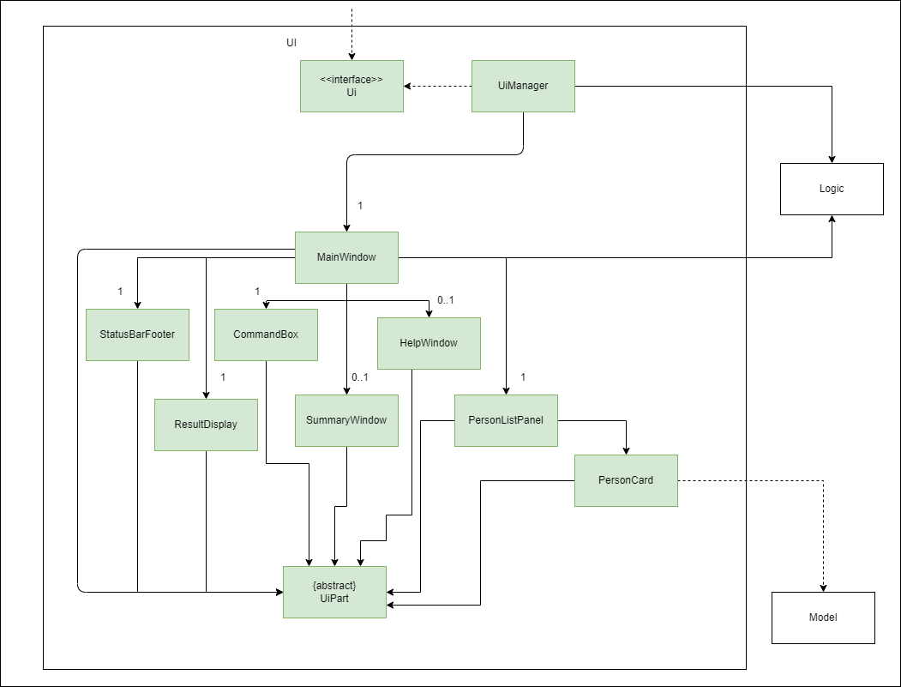
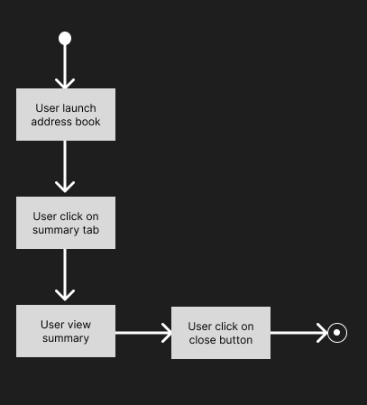
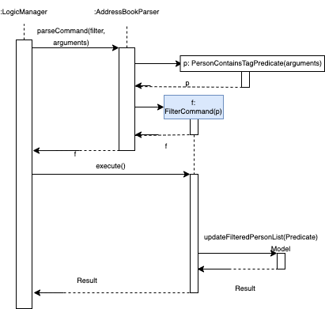

* Table of Contents
{:toc}

--------------------------------------------------------------------------------------------------------------------

## **Acknowledgements**

* {list here sources of all reused/adapted ideas, code, documentation, and third-party libraries -- include links to the original source as well}

--------------------------------------------------------------------------------------------------------------------

## **Setting up, getting started**

Refer to the guide [_Setting up and getting started_](SettingUp.md).

--------------------------------------------------------------------------------------------------------------------

## **Design**

:bulb: **Tip:** The `.puml` files used to create diagrams in this document can be found in the [diagrams](https://github.com/se-edu/addressbook-level3/tree/master/docs/diagrams/) folder. Refer to the [_PlantUML Tutorial_ at se-edu/guides](https://se-education.org/guides/tutorials/plantUml.html) to learn how to create and edit diagrams.

### Architecture

The ***Architecture Diagram*** given above explains the high-level design of the App.

Given below is a quick overview of main components and how they interact with each other.

**Main components of the architecture**

**`Main`** has two classes called [`Main`](https://github.com/se-edu/addressbook-level3/tree/master/src/main/java/seedu/address/Main.java) and [`MainApp`](https://github.com/se-edu/addressbook-level3/tree/master/src/main/java/seedu/address/MainApp.java). It is responsible for,
* At app launch: Initializes the components in the correct sequence, and connects them up with each other.
* At shut down: Shuts down the components and invokes cleanup methods where necessary.

[**`Commons`**](#common-classes) represents a collection of classes used by multiple other components.

The rest of the App consists of four components.

* [**`UI`**](#ui-component): The UI of the App.
* [**`Logic`**](#logic-component): The command executor.
* [**`Model`**](#model-component): Holds the data of the App in memory.
* [**`Storage`**](#storage-component): Reads data from, and writes data to, the hard disk.

**How the architecture components interact with each other**

The *Sequence Diagram* below shows how the components interact with each other for the scenario where the user issues the command `delete 1`.

Each of the four main components (also shown in the diagram above),

* defines its *API* in an `interface` with the same name as the Component.
* implements its functionality using a concrete `{Component Name}Manager` class (which follows the corresponding API `interface` mentioned in the previous point.

For example, the `Logic` component defines its API in the `Logic.java` interface and implements its functionality using the `LogicManager.java` class which follows the `Logic` interface. Other components interact with a given component through its interface rather than the concrete class (reason: to prevent outside component's being coupled to the implementation of a component), as illustrated in the (partial) class diagram below.

The sections below give more details of each component.

### UI component

The **API** of this component is specified in [`Ui.java`](https://github.com/se-edu/addressbook-level3/tree/master/src/main/java/seedu/address/ui/Ui.java)

The UI consists of a `MainWindow` that is made up of parts e.g.`CommandBox`, `ResultDisplay`, `PersonListPanel`, `StatusBarFooter` etc. All these, including the `MainWindow`, inherit from the abstract `UiPart` class which captures the commonalities between classes that represent parts of the visible GUI.

The `UI` component uses the JavaFx UI framework. The layout of these UI parts are defined in matching `.fxml` files that are in the `src/main/resources/view` folder. For example, the layout of the [`MainWindow`](https://github.com/se-edu/addressbook-level3/tree/master/src/main/java/seedu/address/ui/MainWindow.java) is specified in [`MainWindow.fxml`](https://github.com/se-edu/addressbook-level3/tree/master/src/main/resources/view/MainWindow.fxml)

The `UI` component,

* executes user commands using the `Logic` component.
* listens for changes to `Model` data so that the UI can be updated with the modified data.
* keeps a reference to the `Logic` component, because the `UI` relies on the `Logic` to execute commands.
* depends on some classes in the `Model` component, as it displays `Person` object residing in the `Model`.

### Logic component

**API** : [`Logic.java`](https://github.com/se-edu/addressbook-level3/tree/master/src/main/java/seedu/address/logic/Logic.java)

Here's a (partial) class diagram of the `Logic` component:

How the `Logic` component works:
1. When `Logic` is called upon to execute a command, it uses the `AddressBookParser` class to parse the user command.
1. This results in a `Command` object (more precisely, an object of one of its subclasses e.g., `AddCommand`) which is executed by the `LogicManager`.
1. The command can communicate with the `Model` when it is executed (e.g. to add a person).
1. The result of the command execution is encapsulated as a `CommandResult` object which is returned back from `Logic`.

The Sequence Diagram below illustrates the interactions within the `Logic` component for the `execute("delete 1")` API call.

:information_source: **Note:** The lifeline for `DeleteCommandParser` should end at the destroy marker (X) but due to a limitation of PlantUML, the lifeline reaches the end of diagram.

Here are the other classes in `Logic` (omitted from the class diagram above) that are used for parsing a user command:

How the parsing works:
* When called upon to parse a user command, the `AddressBookParser` class creates an `XYZCommandParser` (`XYZ` is a placeholder for the specific command name e.g., `AddCommandParser`) which uses the other classes shown above to parse the user command and create a `XYZCommand` object (e.g., `AddCommand`) which the `AddressBookParser` returns back as a `Command` object.
* All `XYZCommandParser` classes (e.g., `AddCommandParser`, `DeleteCommandParser`, ...) inherit from the `Parser` interface so that they can be treated similarly where possible e.g, during testing.

### Model component
**API** : [`Model.java`](https://github.com/se-edu/addressbook-level3/tree/master/src/main/java/seedu/address/model/Model.java)

The `Model` component,

* stores the address book data i.e., all `Person` objects (which are contained in a `UniquePersonList` object).
* stores the currently 'selected' `Person` objects (e.g., results of a search query) as a separate _filtered_ list which is exposed to outsiders as an unmodifiable `ObservableList<Person>` that can be 'observed' e.g. the UI can be bound to this list so that the UI automatically updates when the data in the list change.
* stores a `UserPref` object that represents the user’s preferences. This is exposed to the outside as a `ReadOnlyUserPref` objects.
* does not depend on any of the other three components (as the `Model` represents data entities of the domain, they should make sense on their own without depending on other components)

:information_source: **Note:** An alternative (arguably, a more OOP) model is given below. It has a `Tag` list in the `AddressBook`, which `Person` references. This allows `AddressBook` to only require one `Tag` object per unique tag, instead of each `Person` needing their own `Tag` objects. 

### Storage component

**API** : [`Storage.java`](https://github.com/se-edu/addressbook-level3/tree/master/src/main/java/seedu/address/storage/Storage.java)

The `Storage` component,
* can save both address book data and user preference data in json format, and read them back into corresponding objects.
* inherits from both `AddressBookStorage` and `UserPrefStorage`, which means it can be treated as either one (if only the functionality of only one is needed).
* depends on some classes in the `Model` component (because the `Storage` component's job is to save/retrieve objects that belong to the `Model`)

### Common classes

Classes used by multiple components are in the `seedu.addressbook.commons` package.

--------------------------------------------------------------------------------------------------------------------

## **Implementation**

This section describes some noteworthy details on how certain features are implemented.

### \[Proposed\] Undo/redo feature

#### Proposed Implementation

The proposed undo/redo mechanism is facilitated by `VersionedAddressBook`. It extends `AddressBook` with an undo/redo history, stored internally as an `addressBookStateList` and `currentStatePointer`. Additionally, it implements the following operations:

* `VersionedAddressBook#commit()` — Saves the current address book state in its history.
* `VersionedAddressBook#undo()` — Restores the previous address book state from its history.
* `VersionedAddressBook#redo()` — Restores a previously undone address book state from its history.

These operations are exposed in the `Model` interface as `Model#commitAddressBook()`, `Model#undoAddressBook()` and `Model#redoAddressBook()` respectively.

Given below is an example usage scenario and how the undo/redo mechanism behaves at each step.

Step 1. The user launches the application for the first time. The `VersionedAddressBook` will be initialized with the initial address book state, and the `currentStatePointer` pointing to that single address book state.

Step 2. The user executes `delete 5` command to delete the 5th person in the address book. The `delete` command calls `Model#commitAddressBook()`, causing the modified state of the address book after the `delete 5` command executes to be saved in the `addressBookStateList`, and the `currentStatePointer` is shifted to the newly inserted address book state.

Step 3. The user executes `add n/David …​` to add a new person. The `add` command also calls `Model#commitAddressBook()`, causing another modified address book state to be saved into the `addressBookStateList`.

:information_source: **Note:** If a command fails its execution, it will not call `Model#commitAddressBook()`, so the address book state will not be saved into the `addressBookStateList`.

Step 4. The user now decides that adding the person was a mistake, and decides to undo that action by executing the `undo` command. The `undo` command will call `Model#undoAddressBook()`, which will shift the `currentStatePointer` once to the left, pointing it to the previous address book state, and restores the address book to that state.

:information_source: **Note:** If the `currentStatePointer` is at index 0, pointing to the initial AddressBook state, then there are no previous AddressBook states to restore. The `undo` command uses `Model#canUndoAddressBook()` to check if this is the case. If so, it will return an error to the user rather
than attempting to perform the undo.

The following sequence diagram shows how the undo operation works:

:information_source: **Note:** The lifeline for `UndoCommand` should end at the destroy marker (X) but due to a limitation of PlantUML, the lifeline reaches the end of diagram.

The `redo` command does the opposite — it calls `Model#redoAddressBook()`, which shifts the `currentStatePointer` once to the right, pointing to the previously undone state, and restores the address book to that state.

:information_source: **Note:** If the `currentStatePointer` is at index `addressBookStateList.size() - 1`, pointing to the latest address book state, then there are no undone AddressBook states to restore. The `redo` command uses `Model#canRedoAddressBook()` to check if this is the case. If so, it will return an error to the user rather than attempting to perform the redo.

Step 5. The user then decides to execute the command `list`. Commands that do not modify the address book, such as `list`, will usually not call `Model#commitAddressBook()`, `Model#undoAddressBook()` or `Model#redoAddressBook()`. Thus, the `addressBookStateList` remains unchanged.

Step 6. The user executes `clear`, which calls `Model#commitAddressBook()`. Since the `currentStatePointer` is not pointing at the end of the `addressBookStateList`, all address book states after the `currentStatePointer` will be purged. Reason: It no longer makes sense to redo the `add n/David …​` command. This is the behavior that most modern desktop applications follow.

The following activity diagram summarizes what happens when a user executes a new command:

#### Design considerations:

**Aspect: How undo & redo executes:**

* **Alternative 1 (current choice):** Saves the entire address book.
  * Pros: Easy to implement.
  * Cons: May have performance issues in terms of memory usage.

* **Alternative 2:** Individual command knows how to undo/redo by
  itself.
  * Pros: Will use less memory (e.g. for `delete`, just save the person being deleted).
  * Cons: We must ensure that the implementation of each individual command are correct.

_{more aspects and alternatives to be added}_

### Data Summary feature

#### Implementation

It extends `AddressBook`. Data summary includes contact count, number of tags,...

Given below is an example usage scenario and how the data summary mechanism behaves at each step.

Step 1. The user launches the application for the first time.

Step 2. The user populate the address book with commands such as add, edit, delete.

Step 3. The user click on the summary tab.

Step 4. The user now sees a summary of his/her data.

Step 5. The user then decides to close the tab, he/she clicks on the close button.

The following activity diagram summarizes what happens when a user executes a new command:

#### Why this implementation:
Keeping a summary in a new tab makes the UI much neater, rather than displaying a summary in the main page.
This also allows user to access their summary easily as the summary tab will be fixed at the top of the page.

#### Design considerations:

**Aspect: How data summary display executes:**

* **Alternative 1 (current choice):** Display in a separate tab.
    * Pros: Convenience for the user.
    * Cons: Slight revamp of UI is needed.

* **Alternative 2:** Display in the main page.

    * Pros: Ease to implement.
    * Cons: Information will be cramped together.

_{more aspects and alternatives to be added}_

### Filter by tag feature

#### Implementation
The proposed feature will allow users to filter persons by the tags they possess.
It is implemented similar to the `FindCommand`, extending `CommandParser` with a new command to parse.

Given below is an example usage scenario and how the `Filter` mechanism behaves at each step.

Step 1. User inputs command `filter`, followed by a list of arguments representing the tag names
example `carInsurance`

Step 2. The command "filter" will be parsed, creating a Filter command which is executable.

Step 3. On execution of the filter command, the filter checks and returns a list of all persons which match exactly the tags specified

Step 4. For example, `filter car insurance` returns a list of persons which have both `car` and `insurance` as tags, any person with only one of the two tags will not be included

The following sequence diagram shows how the filter operation works:

#### Design considerations:

1. Users would like to be able to filter which category of leads they would like to view
2. Users would like to be able to specify multiple tags to narrow down their search on relevant contacts
3. Users would also be able to edit their clients/persons category

**Aspect: How filter decides on output:**

* **Alternative 1 (current choice):** Only output persons which contain all tags.
    * Pros: Allow user to narrow down search quicker.
    * Cons: Lesser contacts are displayed to user.

* **Alternative 2:** Output persons which have at least 1 of the specified tags.

    * Pros: Broad search of all tags.
    * Cons: Too much information, might be harder to narrow down search.

#### Why this implementation
We would like users to be able to narrow down search by filtering more and more categories,
hence we allow multiple arguments input and require that all arguments are satisfied. Depending on customer feedback,
we may change to the other alternative of a broad search, where we output all contacts that contain any of the specified tags.

### Sort feature

#### Implementation
The proposed feature will allow users to sort their contacts in multiple ways according to fields:
1. Name `name`
2. Potential Sale Value `size`
3. Past Transaction Count `trans`
4. Priority `priority`

The feature allows users to sort contacts according to one of the above fields at a time, in 2 directions:
1. Ascending `asc`
2. Descending `desc`

Note that the sort feature updates the original contact list to be sorted accordingly.

Given below is an example usage scenario and how the `Sort` mechanism behaves at each step.

Step 1. User inputs command `sort FIELD DIRECTION` example `sort size asc`

Step 2. The respective sort command will be parsed, taking into account the FIELD and DIRECTION to sort by
* The sort command parser takes in the arguments and is case-insensitive
* meaning `SOrt PRIORITY DeSc` for example is equivalent to `sort priority desc`

Step 3. After which the parser creates the respective sort command which is executable.

Step 4. On execution of the sort command, the database of contacts is sorted accordingly using the Java `Collections` library and the new list is displayed.

The following sequence diagram shows how the filter operation works:
 #TODO

_Notes:_
_In our example, `sort size asc` sorts the list of contacts by ascending potential business size,
which means that contacts with smaller potential business will appear near the top.
This could prove useful for our target users - Salesmen - where they would like to focus more attention on clients who potentially bring in more business.
The sort feature allows them to quickly view their contacts by business size accordingly._

#### Design considerations

1. Users would like to be able to sort by:
   1. the potential size of leads/business
      1. ascending order - to allow salesman to focus on improving weak leads
      2. descending order - to allow salesman to focus on capitalising on the best opportunities
   2. Name - for admin purposes
   3. Past transaction count
      1. History: Being able to keep track of transaction counts allows the salesman to see who are his most loyal or familiar clients.
   4. Priority
      1. Having specified the priority of which to take action, sorting by highest priority quickly lets the salesman see his most important clients.
2. Users would also be able to edit their clients/persons details
   1. This would be achievable with the [`edit` feature](#edit) 

#### Why this implementation

--------------------------------------------------------------------------------------------------------------------

## **Documentation, logging, testing, configuration, dev-ops**

* [Documentation guide](Documentation.md)
* [Testing guide](Testing.md)
* [Logging guide](Logging.md)
* [Configuration guide](Configuration.md)
* [DevOps guide](DevOps.md)

--------------------------------------------------------------------------------------------------------------------

## **Appendix: Requirements**

### Product scope

Evolve AB3 into a lightweight CRM / Contact manager for a company's sales department.
#### The AB3 Evolution: NextBigFish (NBF) 
is a desktop app tailored for the needs of sales-people, supporting the management of contacts, leads or clients ** 
and optimized for use via a Command Line Interface (CLI) while still having the benefits of a Graphical User Interface (GUI). 
If you can type fast, NBF can get your client and lead management tasks done faster than traditional GUI apps. 
NBF allows client contacts to hold data on their potential business size and counts of past transactions and aids users in categorising them using tags.
On top of that, NBF also provides a summary page to allow users to quickly get an overview of their performance each season, detailing relevant statistics.

**Target user profile**:

* has a need to manage a significant number of business contacts
* has clients, for example, a salesman or an agent
* has a need to keep track of leads from clients
* has a need to learn statistics of leads
* needs to prioritise leads
* prefer desktop apps over other types
* can type fast
* prefers typing to mouse interactions
* is reasonably comfortable using CLI apps

**Value proposition**: Managing and keeping track of leads by salesmen contacts faster than a typical mouse/GUI driven app.

### User stories

Priorities: High (must have) - `* * *`, Medium (nice to have) - `* *`, Low (unlikely to have) - `*`

| Priority |         As a …        |                             I want to …                            |                                So that I can…                                |   |
|:--------:|:---------------------:|:------------------------------------------------------------------:|:----------------------------------------------------------------------------:|---|
| * * *    | As a user             | I can add a contact                                                |                                                                              |   |
| * * *    | As a user             | I can delete a contact                                             |                                                                              |   |
| * * *    | As a salesman         | I can easily retrieve my client’s phone number and email           | Allows salesmen to efficiently find out ways to contact the client           |   |
| * * *    | As a salesman         | I can sort my clients by potential business size                   | Allows salesmen to prioritize time to get more revenue                       |   |
| * *      | As a salesman         | I can easily retrieve clients’ namecard                            | Easily download a copy of their digital namecard through a QR code           |   |
| *        | As an insurance agent | I can keep track of what products I have (relevant to the contact) | I can send pamphlets to customers                                            |   |
| * *      | As a salesman         | I can mark a contact as a lead                                     | Allows salesmen to keep track of his own leads across many potential clients |   |
| * *      | As a salesman         | I can rate the value of my leads                                   | Allows salesmen to prioritize time to get more revenue                       |   |
| * *      | As a salesman         | I can mark my leads as requiring follow up action                  | I don’t forget to follow up with important clients                           |   |
| * *      | As a salesman         | I can add a deadline to my next follow up action                   | I can keep the customer updated                                              |   |
| * *      | As a salesman         | I can sort the leads by follow up deadline                         | I know which clients require my immediate attention                          |   |
| * *      | As a salesman         | I can sort the leads by value                                      | Prioritize higher value clients                                              |   |
| *        | As a salesman         | I can add the different stages of my sales flow                    | I can see which stage I am at and what action I require                      |   |
| * * *    | As a user             | I can see all the contacts I have                                  |                                                                              |   |
| * *      | As a user             | I can see the count of my contacts                                 |                                                                              |   |
| * *      | As a user             | I can see a display of what's my most urgent items for the day     | I can see my next action for the day                                         |   |
| * *      | As a user             | I can see my total revenue size from all potential leads           |                                                                              |   |
| * *      | As a user             | I can see if I am often missing deadlines                          | Allows me to keep track of my discipline                                     |   |
| * *      | As a salesman         | I can keep track of how much sales I have a made                   |                                                                              |   |
| * *      | As a salesman         | I can display how much sales I have made                           |                                                                              |   |
| * *      | As a salesman         | I can keep track of how much potential sales I have made           |                                                                              |   |
| * *      | As a new user         | I can see the app populated with sample data                       | I can easily see how the app will look like when it is in use                |   |
| * *      | As a new user         | I can purge all current data                                       | I can get rid of sample’s data                                               |   |
| * * *    | As a salesman         | I can tag my contacts                                              | I can group them easily                                                      |   |
| *        | As a salesman         | I can schedule meeting with clients/lead                           | I can plan my day easily                                                     |   |
| *        | As a user             | I can view the schedule                                            |                                                                              |   |
| *        | As a salesman         | I can get reminder when deadline/meeting date is coming up         |                                                                              |   |
| *        | As a user             | I can update the contact details/deadline/meeting date             | I can edit when I made a mistake                                             |   |
| * *      | As a user             | I can get help(in-App guidance) from the app                       | I know how to perform certain tasks                                          |   |
| * *      | As a salesman         | I can write notes on the clients                                   | I can remember certain things about the clients                              |   |

*{More to be added}*

### Use cases

(For all use cases below, the **System** is the `NextBigFish` and the **Actor** is the `user`, unless specified otherwise)

**Use case: Add a person**

**Main Success Scenario (MSS)**

1.  User requests to add a person to the list.
2.  NextBigFish adds the person and shows confirmation message.
    Use case ends.

**Extensions**

* 2a. Person to be added in already in the list.

    * 2a1. NextBigFish shows an error message.

      Use case ends.

**Use case: Delete a person**

**MSS**

1.  User requests to list persons.
2.  NextBigFish shows a list of persons.
3.  User requests to delete a specific person in the list.
4.  NextBigFish deletes the person.

    Use case ends.

**Extensions**

* 2a. The list is empty.

  Use case ends.

* 3a. The given index is invalid.

    * 3a1. NextBigFish shows an error message.

      Use case resumes at step 2.

**Use case: Edit a person**

**MSS**

1.  User requests to list persons.
2.  NextBigFish shows a list of persons.
3.  User requests to edit a specific person in the list and provides the updated information.
4.  NextBigFish edits the person.

    Use case ends.

**Extensions**

* 2a. The list is empty.

  Use case ends.

* 2b. Updated information is the same as the before information.

    * 2b1. NextBigFish shows an error message.

    Use case ends.

* 2c. Missing field in updated information.

    * 2c1. NextBigFish displays error message.

    Use case ends.

* 3a. The given index is invalid.

    * 3a1. NextBigFish shows an error message.

      Use case resumes at step 2.

**Use case: Filter people by tag names**

**MSS**

1.  User requests to filter people by tags.
2.  NextBigFish shows a list of persons who possess all the tags.

Use case ends.

**Extensions**

* 2a. The list is empty.

  Use case ends.

**Use case: Opening Summary Window**

**MSS**

1. User requests for summary window to be opened.
2. NextBigFish opens the summary window.
3. User view his/her data summary.
4. User close the summary window.

    Use case ends.

**Use case: Incrementing/Decrementing Transaction Count**

**MSS**

1. User requests to list persons.
2. NextBigFish shows a list of persons.
3. User requests to increment the transaction count of a particular person in the list
4. NextBigFish calculates the resultant transaction count after increment/decrement
and edits the person.
5. NextBigFish displays the updated list of persons.

    Use case ends.

**Extensions**

* 2a. The list is empty.

  Use case ends.

* 2b. Resultant transaction count exceeds or falls below the valid range

    * 2b1. NextBigFish shows an error message.

  Use case ends.

* 2c. Missing field in updated information.

    * 2c1. NextBigFish displays error message.

  Use case ends.

* 3a. The given index is invalid.

    * 3a1. NextBigFish shows an error message.

      Use case resumes at step 2.

    Use case ends.

**Use case: Keeping track of high priority leads**

**MSS**

1. User request to list persons. 
2. NextBigFish shows a list of persons. 
3. User requests to sort by priority level (Descending).
4. NextBigFish displays user's contact in order of priority level. 

**Extensions**

* 3a. User requests to sort by Potential Sale Value (Descending).
* 3b. NextBigFish displays the user's contacts in order of priority level, 
  and within each priority level, in order of Potential Sale Value. 

  Use case ends. 

*{More to be added}*

### Non-Functional Requirements

1.  Should work on any _mainstream OS_ as long as it has Java `11` or above installed.
2.  Should be able to hold up to 1000 persons without a noticeable sluggishness in performance for typical usage.
3.  A user with above average typing speed for regular English text (i.e. not code, not system admin commands) should be able to accomplish most of the tasks faster using commands than using the mouse.
4. All user operations should complete within 0.5 seconds.
5. Should only be used by authorised users, the owner of the contacts.
6. Users should be able to transfer data files to another device and be loaded there.

*{More to be added}*

### Glossary

* **Mainstream OS**: Windows, Linux, Unix, OS-X
* **Private contact detail**: A contact detail that is not meant to be shared with others
* **User** : A person using the application, usually a user would use this to manage client contacts
* **Person** : Refers to a client that a user has, whose contact can be seen or edited in the user's address book
* **NextBigFish** : Name of the application

--------------------------------------------------------------------------------------------------------------------

## **Appendix: Instructions for manual testing**

Given below are instructions to test the app manually.

:information_source: **Note:** These instructions only provide a starting point for testers to work on;
testers are expected to do more *exploratory* testing.

### Launch and shutdown

1. Initial launch

   1. Download the jar file and copy into an empty folder

   1. Double-click the jar file Expected: Shows the GUI with a set of sample contacts. The window size may not be optimum.

1. Saving window preferences

   1. Resize the window to an optimum size. Move the window to a different location. Close the window.

   1. Re-launch the app by double-clicking the jar file. 
       Expected: The most recent window size and location is retained.

1. _{ more test cases …​ }_

### Deleting a person

1. Deleting a person while all persons are being shown

   1. Prerequisites: List all persons using the `list` command. Multiple persons in the list.

   1. Test case: `delete 1` 
      Expected: First contact is deleted from the list. Details of the deleted contact shown in the status message. Timestamp in the status bar is updated.

   1. Test case: `delete 0` 
      Expected: No person is deleted. Error details shown in the status message. Status bar remains the same.

   1. Other incorrect delete commands to try: `delete`, `delete x`, `...` (where x is larger than the list size) 
      Expected: Similar to previous.

1. _{ more test cases …​ }_

### Saving data

1. Dealing with missing/corrupted data files

   1. _{explain how to simulate a missing/corrupted file, and the expected behavior}_

1. _{ more test cases …​ }_
