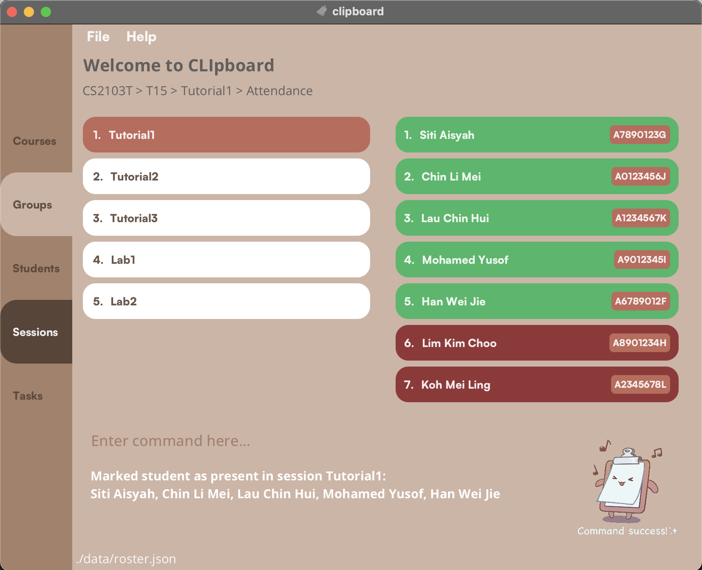
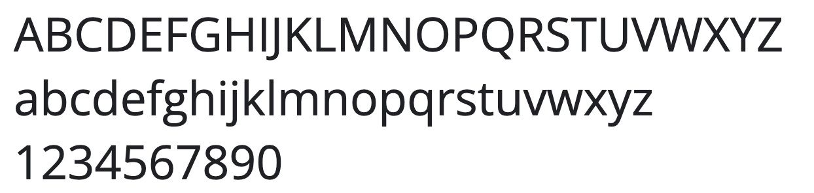
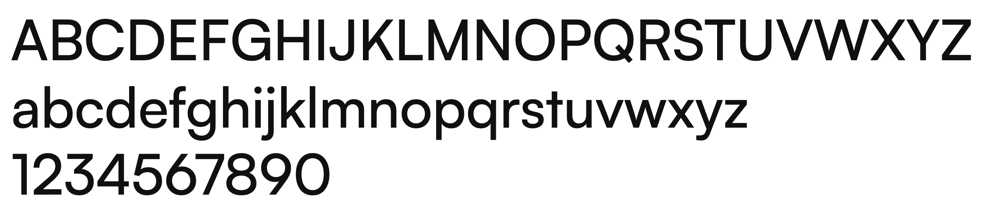
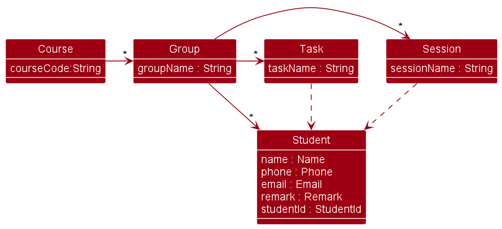
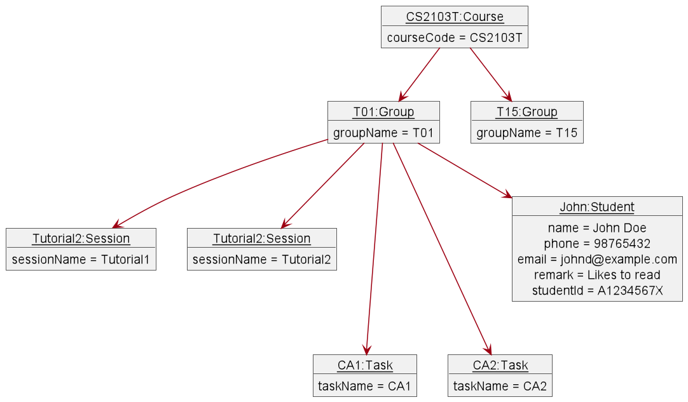
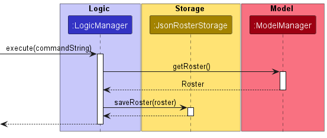

* Table of Contents
{:toc}

--------------------------------------------------------------------------------------------------------------------

## **Setting up, getting started**

Refer to the guide [_Setting up and getting started_](SettingUp.md).

--------------------------------------------------------------------------------------------------------------------

## **Design**

:bulb: **Tip:** The `.puml` files used to create diagrams in this document can be found in the [diagrams](https://github.com/AY2223S2-CS2103T-T15-4/tp/tree/master/docs/diagrams/) folder. Refer to the [_PlantUML Tutorial_ at se-edu/guides](https://se-education.org/guides/tutorials/plantUml.html) to learn how to create and edit diagrams.

### Architecture

###### Figure 1

The ***Architecture Diagram*** given above explains the high-level design of the App.

Given below is a quick overview of main components and how they interact with each other.

**Main components of the architecture**

**`Main`** has two classes called [`Main`](https://github.com/AY2223S2-CS2103T-T15-4/tp/blob/master/src/main/java/tfifteenfour/clipboard/Main.java) and [`MainApp`](https://github.com/AY2223S2-CS2103T-T15-4/tp/blob/master/src/main/java/tfifteenfour/clipboard/MainApp.java). It is responsible for,
* At app launch: Initializes the components in the correct sequence, and connects them up with each other.
* At shut down: Shuts down the components and invokes cleanup methods where necessary.

[**`Commons`**](#common-classes) represents a collection of classes used by multiple other components.

The rest of the App consists of four components.

* [**`UI`**](#ui-component): The UI of the App.
* [**`Logic`**](#logic-component): The command executor.
* [**`Model`**](#model-component): Holds the data of the App in memory.
* [**`Storage`**](#storage-component): Reads data from, and writes data to, the hard disk.

**How the architecture components interact with each other**

The *Sequence Diagram* below shows how the components interact with each other for the scenario where the user issues the command `delete student 1`.

###### Figure 2

Each of the four main components (also shown in the diagram above),

* defines its *API* in an `interface` with the same name as the Component.
* implements its functionality using a concrete `{Component Name}Manager` class (which follows the corresponding API `interface` mentioned in the previous point.

For example, the `Logic` component defines its API in the `Logic.java` interface and implements its functionality using the `LogicManager.java` class which follows the `Logic` interface. Other components interact with a given component through its interface rather than the concrete class (reason: to prevent outside component's being coupled to the implementation of a component), as illustrated in the (partial) class diagram below.

###### Figure 3

The sections below give more details of each component.

### UI component

The **API** of this component is specified in [`Ui.java`](https://github.com/AY2223S2-CS2103T-T15-4/tp/blob/master/src/main/java/tfifteenfour/clipboard/ui/Ui.java) and uses the JavaFx UI framework.
The layout of these UI parts are defined in matching `.fxml` files that are in the `src/main/resources/view` folder. For example, the layout of the [`MainWindow`](https://github.com/AY2223S2-CS2103T-T15-4/tp/blob/master/src/main/java/tfifteenfour/clipboard/ui/MainWindow.java) is specified in [`MainWindow.fxml`](https://github.com/AY2223S2-CS2103T-T15-4/tp/blob/master/src/main/resources/view/MainWindow.fxml)

###### Figure 4: Packages in the UI component

As CLIpboard is a multi-page application, it is made up of different UI components corresponding to each page. The UI classes relevant to each page are classified in their own individual packages as shown in Figure 3.

###### Figure 5

The UI also consists of a `MainWindow` that is made up of parts e.g.`CommandBox`, `ResultDisplay`, `HelpWindow`, and `StatusBarFooter`. All these, including the `MainWindow`, inherit from the abstract `UiPart` class which captures the commonalities between classes that represent parts of the visible GUI.
These parts also remain visible as the user navigates through the different pages in the GUI.

#### Initialising the UI

###### Figure 6: CLIpboard landing page

The `UiManager` is a controller class containing the `start` method which initialises the UI in the following sequence:

1. Instantiate a new `MainWindow` object.
2. `show` the `MainWindow` object.
3. Populate the UI window using the the `fillInnerParts` method of `MainWindow`.

The `MainWindow#fillInnerParts` method will populate the UI by:
1. Populating the Left Pane with a `CourseListPanel`.
2. Populating the `pageTab`
3. Populating the `commandBox`
4. Populating the `resultDisplay`
5. Populating the `statusBarFooter`

As shown in Figure 6, users will be shown the Course Page upon launching the application. The GUI will then refresh accordingly as the user navigates through the different pages in the application.

### Logic component

**API** : [`Logic.java`](https://github.com/AY2223S2-CS2103T-T15-4/tp/blob/master/src/main/java/tfifteenfour/clipboard/logic/Logic.java)

Here's a (partial) class diagram of the `Logic` component:

###### Figure 7

How the `Logic` component works:
1. When `Logic` is called upon to execute a command, it uses the `RosterParser` class to parse the user command.
2. This results in a `Command` object (more precisely, an object of one of its subclasses e.g., `AddStudentCommand`) which is executed by the `LogicManager`.
3. The command can communicate with the `Model` when it is executed (e.g. to add a student).
4. The result of the command execution is encapsulated as a `CommandResult` object which is returned back from `Logic`.

The Sequence Diagram below illustrates the interactions within the `Logic` component for the `execute("delete student 1")` API call.

###### Figure 8

:information_source: **Note:** The lifeline for `DeleteCommandParser` should end at the destroy marker (X) but due to a limitation of PlantUML, the lifeline reaches the end of diagram.

Here are the other classes in `Logic` (omitted from the class diagram above) that are used for parsing a user command:

###### Figure 9

How the parsing works:
* When called upon to parse a user command, the `RosterParser` class creates an `XYZCommandParser` (`XYZ` is a placeholder for the specific command name e.g., `AddCommandParser`) which uses the other classes shown above to parse the user command and create a `XYZCommand` object (e.g., `AddCommand`) which the `RosterParser` returns back as a `Command` object.
* All `XYZCommandParser` classes (e.g., `AddCommandParser`, `DeleteCommandParser`, ...) inherit from the `Parser` interface so that they can be treated similarly where possible e.g, during testing.

### Model component
**API** : [`Model.java`](https://github.com/AY2223S2-CS2103T-T15-4/tp/blob/master/src/main/java/tfifteenfour/clipboard/model/Model.java)

###### Figure 10

The `Model` component,

* stores the roster data i.e., all `Course` objects (which can subsequently be traversed to access all stored data)
* stores a `CurrentSelection` object that is a container object for pointing to the various `Course`/`Group`/`Student`/`Session`/`Task` objects that the user has selected.
* stores a `UserPref` object that represents the user’s preferences. This is exposed to the outside as a `ReadOnlyUserPref` objects.
* stores the `Command` object that was last executed, as well as its corresponding command string input, for purposes of accessing previous states (i.e like in the case of `undo` command)
* does not depend on any of the other three components (as the `Model` represents data entities of the domain, they should make sense on their own without depending on other components)

Detailed implementation of `Course` can be found under [Implementation section](#implementation).

### Storage component

**API** : [`Storage.java`](https://github.com/AY2223S2-CS2103T-T15-4/tp/blob/master/src/main/java/tfifteenfour/clipboard/storage/Storage.java)

###### Figure 11

The `Storage` component,
* can save both roster data and user preference data in json format, and read them back into corresponding objects.
* inherits from both `RosterStorage` and `UserPrefsStorage`, which means it can be treated as either one (if only the functionality of only one is needed).
* depends on some classes in the `Model` component (because the `Storage` component's job is to save/retrieve objects that belong to the `Model`)

### Common classes

Classes used by multiple components are in the `tfifteenfour.clipboard.commons` package.

--------------------------------------------------------------------------------------------------------------------

## **Implementation**

This section describes some noteworthy details on how certain features are implemented.

### User Interface Implementation

This subsection describes implementation details related to `UI`, such as page navigation and design.

#### Navigating through pages

###### Figure 12: CLIpboard navigation guide

As shown in Figure 12, users can navigate through the application using a combination of `select`, `task`, `session`, and `back` commands.
When a command such as `select` is called, the left pane or the right pane, or both, will be refreshed in `MainWindow`.

###### Figure 13: Sequence Diagram for `select`

Figure 13's Sequence Diagram depicts how the `UI`, `Logic`, and `Model` components interact when `select 1` is called on the Course Page. The user's selection path (in this case `Course` -> `Group`) is tracked by the `CurrentSelection` class as they navigate from the Course Page to the Group Page.

To display the Group Page after the user selects a `Course` from the Course Page, the `UI` first obtains the `PageType` to be displayed in the GUI from the `Logic` component. Then, the `UI` retrieves the selected `Course` from `CurrentSelection` and subsequently invokes the `showGroupPane` method based on the selected `Course`.

Before creating the `GroupListPanel` to display the groups in the selected `Course`, the UI obtains an `ObservableList<Group>` from the selected `Course` in the `Model` component.
Each `Group` in the `ObservableList<Group>` is then mapped into a `GroupListViewCell` in `GroupListPanel`.
At the end of the `showGroupPane` method call, the Left Pane, previously populated by the `CourseListPanel`, will be refreshed to show the `GroupListPanel`

This sequence of interactions is similar across each page navigation.

#### Design considerations

- **Attendance Page Design**

###### Figure 14: Screenshot of Attendance Page*

In Figure 14, we have a screenshot of the student page, with the Left Pane and Right Pane populated with a `SessionListPanel` and an `AttendanceListPanel` respectively.
The navigation from Session Page to Attendance Page does not close the `SessionListPanel`, instead the `SessionListPanel` remain displayed in the Left Pane and the `AttendanceListPanel` is displayed in the Right Pane.
However, the current page shown in Figure 14 is still treated as the Attendance Page, hence only commands applicable to the Attendance Page is accepted.
This also applies to the Grades Page, when the `SessionListPanel` is displayed alongside the `GradesListPanel`.

Initially, each student in the Attendance Page will be marked as absent and their individual student cards will be shown in red.
After marking a student's attendance with the `mark` command, the student card will be changed to green.
This change occurs immediately after the command execution by generating a new `AttendanceListPanel` when a `mark` command is called.
Figure 15 shows the Sequence Diagram when a `mark` command is executed.

###### Figure 15: Sequence Diagram of mark command. Due to Plant UML limitations, the `alt` frame extends slightly beyond the `UI` frame.

As shown in Figure 15, when a new `AttendanceListPanel` is initialised, an `AttendanceListViewCell` will be created.
Similar to the sequence described under Figure 13, the `AttendanceListPanel` takes in an `ObservableList<StudentWithAttendance>` and maps each `StudentWithAttendance` into an `AttendanceListViewCell`.
Each `StudentWithAttendance` has an `attendance` flag to indicate if they are present or absent for a particular session.
Based on the flag, either a new `PresentAttendanceListCard` (with a green background) or a new `AbsentAttendanceListCard` (with a red background) will be created for the particular student.

- **Student Page Design**

###### Figure 16: Screenshot of Student Page

In Figure 16, we have a screenshot of the student page, with the Left Pane and Right Pane populated with a `StudentListPanel` and a `StudentViewCard` respectively.
The user interface has a straightforward dashboard layout that uses a list panel to display Courses, Groups, Sessions, Tasks, or Students in the Left Pane.
Since we are on the student page, a list of students is shown.
Unlike the Attendance and Grades Page, even though both Left and Right Panes are populated, the page shown in Figure 15 is still the Student Page, hence commands which are applicable to the Student Page are accepted here.

##### Alternative considerations

###### Figure 17: A student list card*

Instead of `StudentId`, we initially considered displaying the `Course` and `Group` the student belongs to in their individual student cards.
However, this information is already displayed in the navigation bar (shown in Figure 15, above the `StudentListPanel` in "CS2103T > T15").
Furthermore, since each `Student` is uniquely identified by their `StudentId` (i.e adding another student with the same `StudentId` to the same `Group` will throw an error message), it would be more useful to display their `StudentId` instead.

Another alternative we considered was displaying the full information of a `Student` in each `StudentListCard`, however doing so will quickly overwhelm the `StudentListPanel` if there were many students in the group.
As such, we have implemented a separate `StudentViewCard` that will be shown on the Right Pane (as shown in Figure 15) when the user enters a `select` command on the Student Page.

#### CLIpboard Theme

Most of the CLIpboard style components can be found in the CSS file `BrownTheme.css`, found under `src/main/resources/view`.

Below is the colour palette used for CLIpboard. CLIpboard mainly adopts brown tones to reflect a wooden traditional clipboard.

**Main colours:**

 **#A1826D** : A chestnut-brown colour.

 **#D8B4A4** : A light sandy brown used for the background.

**Accent colours:**

 **#574539** : A darker shade of brown, mainly used for lettering and page tabs.

 **#B56D5E** : A reddish-brown accent for `StudentId` in Student Page.

 **#8B3A3A** : A deep red colour used for students marked as absent.

 **#5EB56D** : A light green colour used for students marked as present.

CLIpboard also utilises two primary fonts, namely the Open Sans font family and the Satoshi font family.
Both are free to use, and can be downloaded from [Google Fonts](https://fonts.google.com/specimen/Open+Sans) and [FontShare](https://www.fontshare.com/fonts/satoshi) respectively.

**Open Sans:**

**Satoshi:**

--------------------------------------------------------------------------------------------------------------------

### Student Roster Object Types
In our implementation, we have defined several object types that accurately represent the student roster, including
`Course`, `Group`, `Session`, `Task`, and `Student`. These object types are interdependent and have been designed to
work together seamlessly to provide a comprehensive solution for managing the student roster.

#### Object Dependencies
To simplify the management of the student roster and improve the user experience, we have established dependencies
between these objects. For example, when a student is added or edited in a `Group`, any changes will cascade to the
list of students in the `Session` object as well. This ensures consistency across the different object types and
reduces the risk of inconsistencies between related objects.

#### Implementation Details
The dependencies between these objects have been implemented using a combination of object-oriented design principles
and programming techniques. The specific implementation details are beyond the scope of this document, but the
following high-level overview may be useful:

Each object type has been defined as a separate class with its own set of properties and methods.
The relationships between these object types have been established using object references.
Changes to one object type will trigger an update to the related object types by means of cascading method calls.
Overall, the implementation of these object types and their dependencies has been designed to provide a robust,
scalable, and user-friendly solution for managing the student roster. Given below is the class diagram omitting most of the details.

###### Figure 17

In addition to the above diagram, the following object diagram illustrate a more comprehensive view of the dependencies between various objects during the program's runtime.

###### Figure 18

--------------------------------------------------------------------------------------------------------------------

### Undo feature
`undo` allows restoring up to 5 previous states, but can be modified to restore more/less states.

:information_source: **Note:**  Allowing more states to be saved, or adding more information to be tied to a state, will deteriorate CLIpboard's performance.

If new commands are to be added, it's interaction with `undo` must be kept in mind:
* For typical commands that do CRUD operations on roster data, `undo` can handle them.
* For navigating and UI related commands, some extra handling may be needed to also restore and refresh the UI to the previous state (e.g `undo` of `select` command has special handling to refresh GUI elements).

###### Figure 19

:information_source: **Note:** The lifeline for `UndoCommand` should end at the destroy marker (X) but due to a limitation of PlantUML, the lifeline reaches the end of diagram.

#### Design considerations:

**Aspect: How undo executes:**

* **Alternative 1 (current choice):** Saves the entire `Roster`.
  * Pros: Easy to implement.
  * Cons: May have performance issues in terms of memory usage.

* **Alternative 2:** Individual command knows how to undo by
  itself.
  * Pros: Will use less memory (e.g. for `delete`, just save the person being deleted).
  * Cons: We must ensure that the implementation of each individual command are correct.

--------------------------------------------------------------------------------------------------------------------

### Unique list of items
Represented by the `UniqueList<T>` class, where `T` is the type of the item to be contained.

`UniqueList` is an abstract class that was created to accommodate the storing of different types of items which require list operations. This class provides a generalized solution that can be applied to various scenarios where a list of unique items is needed.

While `UniqueList<T>` provides some basic list operations, a child class has to be extended from it to override the more intricate operations that require different types of handling for different types of objects. Only the methods that are `abstract` need to be overriden.

The `UniqueList`'s in CLIpboard are:
1. `UniqueCoursesList`
2. `UniqueGroupsList`
3. `UniqueStudentsList`
4. `UniqueSessionsList`
5. `UniqueTaskslist`

#### Proposed Future Improvement

The extra work of creating child classes of `UniqueList` can be tedious.

A possible improvement would be allowing `UniqueList` to be an instantiable class, and at the same time create an interface `ListableItem` to represent objects to be contained in `UniqueList`.

The `ListableItem` interface would require that its classes also support the handling of list operations that were previously handled by a child class of `UniqueList`. This would then allow `UniqueList` to be generalisable to any `ListableItem` object, without the need of creating child classes of `UniqueList`.

--------------------------------------------------------------------------------------------------------------------

### Serialized Objects for `Storage`
Found in `src/main/storage/serializedclasses`, these classes are for serializing a `Roster` and its containing objects into `json` objects, or vice versa.
This serves to store/load data to/from a plaintext json file.

##### During loading of data
Loading in of data (if a data file exists) is done once during the initialization of the program. The sequence diagram below illustrates how `MainApp` creates a `Model` containing the saved data, through interactions with `Storage`.

###### Figure 20

##### During saving of data
Saving of data is done every time a command is executed. The sequence diagram below illustrates how a `Roster` is saved into storage.

###### Figure 21

#### Design considerations:

* **Alternative 1 (current choice):** Save the `Roster` every time a command is executed.
  * Pros: Easy to implement.
  * Cons: Redundant saving operations executed on commands that don't modify any data.

* **Alternative 2:** Save the `Roster` only when data has been modified.
  * Pros: Optimized performance as saving is only done when needed.
  * Cons: Need to maintain an extra flag in `Command` or `CommandResult` on whether a command has modified data.

--------------------------------------------------------------------------------------------------------------------
## **Planned Enhancements**

### Unable to see long texts
Currently CLIpboard's UI automatically truncates very long strings, however the whole string is unable to be seen.
#### Proposed Changes:
* Alternative 1: Show full text when mouse hovers over the long string
    * Pros: Provides a solution without potentially cluttering the UI.
    * Cons: Involving mouse action might diminish our selling point as a CLI app optimised for keyboard users.
* Alternative 2: Text wrapping
    * Pros: Easy to implement.
    * Cons: Could clog up the UI.

### After executing `find`, the list cannot be refreshed
After the user calls `find student` in the Students page, they are unable to display the original unfiltered list again.
#### Proposed Changes:
* Alternative 1 (current choice): Get the user to use the `undo` command
    * Pros: No need to implement a new command.
    * Cons: Does not feel intuitive.
* Alternative 2: Implement a `list` command that displays the unfiltered list
    * Pros: Intuitive for the user.
    * Cons: We are unable to implement it in v1.4 due to the feature freeze.

### Orderings of students in Attendance Page and Students Page are not standardised
Currently, the ordering of the student list in Students Page is not consistent with that in the Attendance Page.
#### Proposed Changes:
* Alternative 1: Save the student list from the Students Page to transfer it to the Attendance Page
    * Pros: Ordering is standardised everytime.
    * Cons: Might slow the performance down.

--------------------------------------------------------------------------------------------------------------------
## **Documentation, logging, testing, configuration, dev-ops**

* [Documentation guide](Documentation.md)
* [Testing guide](Testing.md)
* [Logging guide](Logging.md)
* [Configuration guide](Configuration.md)
* [DevOps guide](DevOps.md)

--------------------------------------------------------------------------------------------------------------------

## **Appendix: Requirements**

### Product scope

**Target user profile**:

* has a need to manage a significant number of students from different classes
* prefer desktop apps over other types
* can type fast
* prefers typing to mouse interactions
* is reasonably comfortable using CLI apps

**Value proposition**: manage their students’ particulars, grades and class attendance, in one centralised platform.

### User stories

Priorities: High (must have) - `* * *`, Medium (nice to have) - `* *`, Low (unlikely to have) - `*`

| Priority | As a …​     | I want to …​                                                                          | So that I can…​                                                                          |
|----------|----------------|---------------------------------------------------------------------------------------|---------------------------------------------------------------------------------------------------|
| `* * *`  | user           | add new students with their particulars                                               | create a new profile for a student                                                                |
| `* * *`  | user           | remove students from my class                                                         | update my class list if anyone needs to be removed                                                |
| `* * *`  | user           | list out all students in a particular class                                           | retrieve a list with all of my students’ names and their particulars                              |
| `* * *`  | user           | list all students being taught by me in the semester                                  | memorize my students' name                                                                        |
| `* * *`  | user           | view personal information for a particular student                                    | easily locate particulars for a single student                                                    |
| `* * *`  | user           | edit students' information easily                                                     | update the new information easily for viewing                                                     |
| `* * *`  | user           | filter students based on data such as results or class                                | find and compare student data                                                                     |
| `* *`    | user           | remove all students from a class                                                      | save time and don’t have to delete them one by one                                                |
| `* *`    | user           | leave a note under a student's profile                                                | keep track of additional information of students                                                  |
| `* *`    | returning user | familiarise myself with the app‘s UI again with a quick refresher                     | use the app again without needing to re-learn the whole UI                                        |
| `* *`    | forgetful user | see photos of the student associated with their name                                  | remember their names better and refer to the correct student during class                         |
| `* *`    | user           | be able to leave a note under a student's profile                                     | keep track of additional information of students                                                  |
| `* *`    | user           | have a list of all emails of my students from the same class                          | contact my students from that class                                                               |
| `* *`    | user           | Group and view certain students                                                       | keep track of their grades for group project                                                      |
| `* *`    | new user       | see the app populated with sample data                                                | get a sense how the app work when it is in use                                                    |
| `* *`    | new user       | learn more about the available features through tooltips                              | gain proficiency at using the program                                                             |
| `*`      | user           | toggle the app between light and dark mode                                            | change the application environment to suit the current light settings for less strain on the eyes |
| `*`      | user           | have a chart / graph of the assessments grades for every student                      | view students that may require more help                                                          |
| `*`      | user           | keep track of class materials such as slides                                          | share these materials with my students                                                            |
| `*`      | user           | save my most used commands                                                            | save time and don’t have to type them out again                                                   |
| `*`      | user           | see notifications/alert of upcoming events                                            | be reminded of assignments that are due soon                                                      |
| `*`      | expert user    | see a graph with the students’ performances from this semester and previous semesters | compare the overall performance of my students from this semester and last semester               |
| `*`      | expert user    | have an export function that allows me to export data from the app to an excel sheet  | easily transfer student data from the app to excel sheet if my higher ups require it              |

### Use cases

(For all use cases below, the **System** is the `CLIpboard` and the **Actor** is the `user`, unless specified otherwise)

<h3>Use case 1: Add a new course</h3>

**Preconditions: User is on the Course Page**

**MSS**

1.  User requests to add a new course into the list
2.  CLIpboard updates the list with a new course

    Use case ends.

<h3>Use case 2: Edit an existing course</h3>

**Preconditions: User is on the Course Page**

**MSS**

1.  User requests to edit an existing course in the list
2.  CLIpboard updates the course with the new name provided by the user

    Use case ends.

**Extensions**

* 1a. The list is empty

    * 1a1. CLipboard shows an error message.

      Use case ends.

* 1b. The course index does not exist in the list

    * 1b1. CLipboard shows an error message.

      Use case ends.

<h3>Use case 3: Delete en existing course</h3>

**Preconditions: User is on the Course Page**

**MSS**

1.  User requests to delete a course in the list
2.  CLIpboard updates the course list without the course

    Use case ends.

**Extensions**

* Similar to UC2 extension

<h3>Use case 4: Add a new student</h3>

**Preconditions: User is on the Student Page**

**MSS**

1.  User requests to add a new student into the list
2.  CLIpboard adds the particulars of the student into the list

    Use case ends.

**Extensions**

* 1a. The list is empty
  * 1a1. CLIpboard shows an error message.

    Use case ends.

* 1b. A student with the same student ID already exists

    * 1b1.  CLIpboard shows an error message.

      Use case ends.

<h3>Use case 5: Edit an existing student's information</h3>

**Preconditions: User is on the Student Page**

**MSS**

1.  User requests to edit a specific student in the list
2.  CLIpboard updates the particulars of the student

    Use case ends.

**Extensions**

* Similar to UC2 extension, for student index

<h3>Use case 6: Delete a student</h3>

**Preconditions: User is on the Student Page**

**MSS**

1.  User requests to delete a specific student in the list
2.  CLIpboard deletes the student

    Use case ends.

**Extensions**

* Similar to UC2 extension, for student index

<h3>Use case 7: Update a remark under a student's profile</h3>

**Preconditions: User is on the Student Page**

**MSS**

1.  User requests to update a remark under a specific student in the list
2.  CLIpboard updates the particulars of the student to the new remark

    Use case ends.

**Extensions**

* Similar to UC2 extension, for student index

### Non-Functional Requirements

1.  Should work on any _mainstream OS_ as long as it has Java `11` or above installed.
2.  Should be able to hold up to 1000 students without a noticeable sluggishness in performance for typical usage.
3.  A user with above average typing speed for regular English text (i.e. not code, not system admin commands) should be able to accomplish most of the tasks faster using commands than using the mouse.

### Glossary

* **Mainstream OS**: Windows, Linux, Unix, OS-X
* **Personal information**: Student particulars including `name`, `phone number`, `student id`, `email`, and can include `remark`.
* **UCx**: Represents Use Case x, where x is a use case number

--------------------------------------------------------------------------------------------------------------------

## **Appendix: Instructions for manual testing**

Given below are instructions to test the app manually.

:information_source: **Note:** These instructions only provide a starting point for testers to work on;
testers are expected to do more *exploratory* testing.

---

### Launch and Shutdown

1. Initial launch.

   1. Download the latest jar file from our [releases](https://github.com/AY2223S2-CS2103T-T15-4/tp/releases) and copy into an empty folder.

   1. Open terminal/command prompt and `cd` to the empty folder. Run the application with `java -jar clipboard.jar`. The window size may not be optimum.

2. Saving window preferences.

   1. Resize the window to an optimum size. Move the window to a preferred location. Close the window by typing in `exit` in the command box.

   1. Re-launch the app by following step 1.2 
      Expected: The most recent window size and location is retained.

3. Exit application.

    1. Type in `exit` on any page in CLIpboard.

    1. Clicking on the `File` tab at the navigation bar above and then clicking `Exit` also exits the app.

[Back to Instructions for Manual Testing](#appendix-instructions-for-manual-testing)

---

### General Commands
These commands can be tested on any page. Specific pages are given for this section as a starting point.

1. Displaying the home page while on the Course Page.

    1. Test case: `home` 
       Expected: Course Page is displayed.  

2. Displaying the previous page while on the Group Page.

    1. Test case: `back` 
       Expected: Course Page is displayed.  

3. Displaying the previous page while on the Course Page.

    1. Test case: `back` 
       Expected: Error message shows up on the log box as the Course Page is the home page. 
       The application begins from the home page.  

4. Undoing a select command from the Course Page (the current page to run the test case is the Group Page).

    1. Test case: `undo` 
       Expected: Course Page is displayed.  

5. Opening the help window from the Course Page.

    1. Test case: `help` 
       Expected: Help window for Course Page pops up.

[Back to Instructions for Manual Testing](#appendix-instructions-for-manual-testing)

---

### Course Page Commands
These commands should be tested on the Course Page.

#### Adding a course

1. Adding a course while the course list is empty or the course does not exist in the course list.

    1. Test case: `add course CS3223` 
       Expected: New course is added into the list. Details of the added course shown in the log box.

    1. Other incorrect `add course` commands to try: `add`, `add course` (where the course code is empty) 
       Expected: No course is added. Error details shown in the log box.

2. Adding a course which already exists in the list.

    1. Test case: `add course CS3223` 
       Expected: No course is added. Error details shown in the log box.

#### Deleting a course

1. Deleting a course while all courses are being shown from the Course Page. At least 1 course exists in the list.

    1. Test case: `delete course 1` 
       Expected: First course is deleted from the list. Details of the deleted course shown in the log box.

    1. Test case: `delete course 0` 
       Expected: No course is deleted. Error details shown in the log box.

    1. Other incorrect `delete course` commands to try: `delete`, `delete course x` (where x is larger than the list size) 
       Expected: Similar to previous step 1.2 under `Deleting a course`.

2. Deleting a course while the course list is empty in the Course Page.

    1. Incorrect `delete course` commands to try: `delete`, `delete course x` (where x is any number) 
       Expected: No course is deleted. Error details shown in the log box.

#### Editing a course

1. Editing a course which exists in the course list.

    1. Test case: `edit course 1 CS4225` 
       Expected: First course is edited to the new course code. Details of the edited course shown in the log box.

    1. Test case: `edit course 0 CS4225` 
       Expected: No course is edited. Error details shown in the log box.

    1. Other incorrect `edit course` commands to try: `edit`, `edit course x` (where x is any number), `edit course x CS4225` (where x is larger than the list size)  
       Expected: Similar to previous step 1.2 under `Editing a course`.

2. Editing a course while the course list is empty in the Course Page.

    1. Refer to step 1.3 above under `Editing a course`.

#### Selecting a course

1. Selecting a course while on the Course Page.

    1. Test case: `select 1` 
       Expected: First course is selected. Details of the selected course shown in the log box. Page redirected to the
       corresponding Group Page.

    1. Test case: `select x` (where x is larger than the list size) 
       Expected: No course is selected. Error details shown in the log box.

#### Finding a course

1. Finding a course while on the Course Page, with the following courses - `CS3223`, `CS1101`, `PL1101` in the list.

    1. Test case: `find course CS` 
       Expected: `CS3223` and `CS1101` is displayed. Details of the found courses shown in the log box.

    1. Test case: `find course 1101` 
       Expected: `CS1101` and `PL1101` is displayed. Details of the found courses shown in the log box.

    1. Test case: `find course CS4225` (this course does not exist in the list) 
       Expected: The list is not filtered. Details of no found courses shown in the log box.

    1. Other incorrect `find course` commands to try: `find`, `find course` 
       Expected: The list is not filtered. Error details shown in the log box.

[Back to Instructions for Manual Testing](#appendix-instructions-for-manual-testing)

---

### Group Page Commands
These commands should be tested on the Group Page.

#### Adding a group

1. Adding a group while the group list is empty, or the group does not exist in the group list.

    1. Test case: `add group T10` 
       Expected: New group is added into the list. Details of the added group shown in the log box.

    1. Other incorrect `add group` commands to try: `add`, `add group` (where the group name is empty) 
       Expected: No group is added. Error details shown in the log box.

2. Adding a group into the list containing the following groups - `T01`, `T02`, `L01`.

    1. Test case: `add group L02` 
       Expected: New group is added. Details of the added group shown in the log box.

    1. Test case: `add group T01` 
       Expected: No group is added. Error details shown in the log box.

#### Deleting a group

1. Deleting a group while all groups are being shown from the Group Page. At least 1 group exists in the list.

    1. Test case: `delete group 1` 
       Expected: First group is deleted from the list. Details of the deleted group shown in the log box.

    1. Test case: `delete group 0` 
       Expected: No group is deleted. Error details shown in the log box.

    1. Other incorrect `delete group` commands to try: `delete`, `delete group x` (where x is larger than the list size) 
       Expected: Similar to previous step 1.2 under `Deleting a group`.

2. Deleting a group while the group list is empty in the Group Page.

    1. Incorrect `delete group` commands to try: `delete`, `delete group x` (where x is any number) 
       Expected: No group is deleted. Error details shown in the log box.

#### Editing a group

1. Editing a group which exists in the group list.

    1. Test case: `edit group 1 T02` 
       Expected: First group is edited to the new group name. Details of the edited group shown in the log box.

    1. Test case: `edit group 0 T02` 
       Expected: No group is edited. Error details shown in the log box.

    1. Other incorrect `edit group` commands to try: `edit`, `edit group x` (where x is any number), `edit group x T02` (where x is larger than the list size)  
       Expected: Similar to previous step 1.2 under `Editing a group`.

2. Editing a group while the group list is empty in the Group Page.

    1. Refer to step 1.3 above under `Editing a group`.

#### Selecting a group

1. Selecting a group while on the Group Page.

    1. Test case: `select 1` 
       Expected: First group is selected. Details of the selected group shown in the log box. Page redirected to the
       corresponding Students Page.

    1. Test case: `select x` (where x is larger than the list size) 
       Expected: No group is selected. Error details shown in the log box.

#### Displaying sessions of a group

1. Selecting a group to display its sessions while on the Group Page.

    1. Test case: `session 1` 
       Expected: First group is selected to view its sessions. Details of the selected group to view its
       sessions shown in the log box. Page redirected to the corresponding session page for the selected group.

    1. Test case: `session x` (where x is larger than the list size) 
       Expected: No group is selected to view its sessions. Error details shown in the log box.

#### Displaying tasks of a group

1. Selecting a group to display its tasks while on the Group Page.

    1. Test case: `task 1` 
       Expected: First group is selected to view its tasks. Details of the selected group to view its
       tasks shown in the log box. Page redirected to the corresponding Task Page for the selected group.

    1. Test case: `task x` (where x is larger than the list size) 
       Expected: No group is selected to view its tasks. Error details shown in the log box.

#### Finding a group

1. Finding a group while on the Group Page, with the following groups - `T01`, `T02`, `L01` in the list.

    1. Test case: `find group T` 
       Expected: `T01` and `T02` is displayed. Details of the found groups shown in the log box.

    1. Test case: `find group 01` 
       Expected: `T01` and `L01` is displayed. Details of the found groups shown in the log box.

    1. Test case: `find group T03` (this group does not exist in the list) 
       Expected: The list is not filtered. Details of no found groups shown in the log box.

    1. Other incorrect `find group` commands to try: `find`, `find group` 
       Expected: The list is not filtered. Error details shown in the log box.

[Back to Instructions for Manual Testing](#appendix-instructions-for-manual-testing)

---

### Students Page Commands
These commands should be tested on the Students Page.

#### Adding a student

1. Adding a student while the student list is empty or the student does not exist in the course list.

   1. Test case: `add student n/John Doe p/98765432 e/johnd@example.com sid/A1234567X` 
      Expected: New student is added into the list. Details of the added student shown in the log box.

   2. Other incorrect `add student` commands to try: `add`, `add student` (where the name, phone number, email or student ID is not specified) 
      Expected: No student is added. Error details shown in the log box.

2. Adding a student whose student ID already exists in the list. 

    1. Test case: `add student n/John p/98765432 e/johnd@example.com sid/A1234567X`, where another student with student ID A1234567X already exists in the student list 
       Expected: No student is added. Error details shown in the log box.

3. Adding a student whose name already exists in the list.
   1. Test case: `add student n/John Doe p/98765432 e/johnd@example.com sid/A1234567X`, where John Doe with a different student ID exists in the student list.
   Expected: New student is added into the list. Duplicate names are allowed as long as the student ID is different. Details of the added student shown in the log box.

#### Deleting a student

1. Deleting a student while all students are being shown from the Student Page. At least 1 student exists in the list.

   1. Test case: `delete student 1` 
      Expected: First student is deleted from the list. Details of the deleted student shown in the log box.

   2. Test case: `delete student 0` 
          Expected: No student is deleted. Error details shown in the log box.

   3. Other incorrect `delete student` commands to try: `delete`, `delete student x` (where x is larger than the list size) 
          Expected: Similar to previous step 1.2 under `Deleting a student`.

2. Deleting a student while the student list is empty in the Student Page.

    1. Incorrect `delete student` commands to try: `delete`, `delete student x` (where x is any number) 
       Expected: No student is deleted. Error details shown in the log box.

#### Editing a student

1. Editing a student which exists in the course list.

    1. Test case: `edit student 1 n/John p/98765432 e/John@gmail.com sid/A2345678X` where at least one of the fields
   `n/<NAME>`, `p/<PHONE_NUMBER>`, `e/<EMAIL>` or `sid/<STUDENT_NUMBER>` must be provided 
       Expected: First student is edited to have the new field details provided. Details of the edited student shown in the log box.

   2. Test case: `edit student 0 n/John` 
       Expected: No student is edited. Error details shown in the log box.

   3. Other incorrect `edit student` commands to try: `edit`, `edit student`, `edit student x` (where x is any number), `edit student x n/John` (where x is larger than the list size)  
       Expected: Similar to previous step 1.2 under `Editing a student`.

2. Editing a student while the student list is empty in the Student Page.

    1. Refer to step 1.3 above under `Editing a student`.

#### Selecting a student

1. Selecting a student while on the Student Page.

    1. Test case: `select 1` 
       Expected: First student is selected. Details of the selected student shown in the log box. Displays the student's information on the view panel on the right.

   2. Test case: `select x` (where x is larger than the list size) 
       Expected: No student is selected. Error details shown in the log box.

#### Finding a student

1. Finding a student while on the Student Page, with the following students - `John Doe`, `Johnny Yu`, `Alice Yeoh` in the list,
with respective student IDs `A1234567X`, `A123`, `A98765432X`.

   1. Test case: `find student John` 
   Expected: `John Doe` and `Johnny Yu` is displayed. Details of the found students shown in the log box.

   2. Test case: `find student A123` 
   Expected: students with student ID `A1234567X` and `A123` are displayed. Details of the found students shown in the log box.

   3. Test case: `find student Alice Yu` 
   Expected: `Alice Yeoh` and `Johnny Yu` are displayed. Details of the found students shown in the log box.

   4. Test case: `find student Alex Tan` (this student does not exist in the list) 
   Expected: The list is not filtered. Details of no found students shown in the log box.

   5. Other incorrect `find student` commands to try: `find`, `find student` 
   Expected: The list is not filtered. Error details shown in the log box.

#### Deleting a student

1. Deleting a student while all students are being shown from the Students Page.

    1. Test case: `delete student 1` 
       Expected: First student is deleted from the list. Details of the deleted student shown in the log box.

    2. Test case: `delete student 0` 
       Expected: No student is deleted. Error details shown in the log box.

   3. Other incorrect `delete student` commands to try: `delete`, `delete student x`, (where x is larger than the list size) 
          Expected: No student is deleted. Error details shown in the log box.

2. Deleting a student while the student list is empty on the Students Page.
    1. Test case: `delete student 1` 
    Expected: No student is deleted. Error details shown in the log box.

#### Copying a student's email
1. Copying a student's email to your clipboard, while there is more than one student on the Students Page.
    1. Test case: `copy 1` 
    Expected: First student's email is copied to your clipboard. Successful command message shown in the log box.
   2. Test case: `copy 0` 
   Expected: No student email is copied. Error details shown in the log box.
   3. Other incorrect `copy` commands to try: `copy`, `copy x`, (where x is larger than the student list) 
   Expected: No student email is copied. Error details shown in the log box.
2. Copying a student's email while the student list is empty on the Students Page.
    1. Test case: `copy 1` 
    Expected: Nothing is copied to your clipboard. Error details shown in the log box.

#### Sorting students by their name or student ID
1. Sorting student list by their name
    1. Test case: `sort name` 
   Expected: Student list sorted by name in alphabetical order.
2. Sorting student list by their student IDs
    1. Test case: `sort id` 
   Expected: Student list sorted by student ID.

#### Adding or deleting a remark
1. Adding a remark to a student that does not have an existing remark.
    1. Test case: `remark 1 Loves photography` 
   Expected: Adds a remark `Loves photography` to the first student on the student list. Details of the new remark displayed in the log box.
   2. Test case: `remark 0 Loves sci-fi movies` 
   Expected: Displays error message on the log box.
   3. Other incorrect `remark` commands to try: `remark`, `remark x`, (where x is larger than the student list) 
   Expected: Displays error message on the log box.
2. Adding a remark to a student that already has a remark.
   1. Test case: `remark 1 Plays football`  
      Expected: Replaces the previous remark that the first student has with `Plays football`. Details of the new remark displayed in the log box.
   2. Test case: `remark 0 Loves sci-fi movies` 
     Expected: Displays error message on the log box.
   3. Other incorrect `remark` commands to try: `remark`, `remark x`, (where x is larger than the student list) 
      Expected: Displays error message on the log box.
   4. Test case: `remark 1` where the first student already has a remark.  
      Expected: Deletes the remark from the first student listed in the student list.

#### Uploading a student's photo
1. Uploads a student's photo to be displayed in the student roster.
    1. Test case: `upload <LOCAL_FILE_PATH>`, where file path can be either relative or absolute file path  
    Example: `upload C:/Users/AlexYeoh/Desktop/A0123456X.png`  
    Expected: Image `A0123456X.png` will be uploaded to the CLIpboard data folder and the photo will be displayed in the profile of student with student ID `A0123456X`.
    2. Test case: `upload <INVALID_FILE_PATH>`, where file path does not exist.  
    Expected: Error message displayed on the log box.

#### Viewing a student's attendance throughout the course after selecting him/her
1. View a student's attendance throughout the course after using `select` command on the Students Page.
    1. Test case: `attendance`  
    Expected: Displays the student's attendance throughout the course on the log box and the view panel on the right.

[Back to Instructions for Manual Testing](#appendix-instructions-for-manual-testing)

---

### Session Page Commands
These commands should be tested on the Session Page.

#### Adding a session
1. Adding a session while the session list is empty, or the session does not exist in the session list.

    1. Test case: `add session Tutorial1` 
       Expected: New session is added into the list. Details of the added session shown in the log box.

    1. Other incorrect `add session` commands to try: `add`, `add session` (where the session name is empty) 
       Expected: No session is added. Error details shown in the log box.

2. Adding a session into the list containing the following sessions - `Tutorial1`, `Tutorial2`, `Lab1`.

    1. Test case: `add session Tutorial3` 
       Expected: New session is added. Details of the added session shown in the log box.

    1. Test case: `add session Tutorial1` 
       Expected: No session is added. Error details shown in the log box.

#### Deleting a session

1. Deleting a session while all sessions are being shown from the Session Page. At least 1 session exists in the list.

    1. Test case: `delete session 1` 
       Expected: First session is deleted from the list. Details of the deleted session shown in the log box.

    1. Test case: `delete session 0` 
       Expected: No session is deleted. Error details shown in the log box.

    1. Other incorrect `delete session` commands to try: `delete`, `delete session x` (where x is larger than the list size) 
       Expected: Similar to previous step 1.2 under `Deleting a session`.

2. Deleting a session while the session list is empty in the Session Page.

    1. Incorrect `delete session` commands to try: `delete`, `delete session x` (where x is any number) 
       Expected: No session is deleted. Error details shown in the log box.

#### Editing a session

1. Editing a session which exists in the Session list.

   1. Test case: `edit session 1 Tutorial4` 
      Expected: First session is edited to the new session name. Details of the edited session shown in the log box.

   2. Test case: `edit session 0 Tutorial4` 
      Expected: No session is edited. Error details shown in the log box.

   3. Other incorrect `edit session` commands to try: `edit`, `edit session x` (where x is any number), `edit session x Tutorial4`
      (where x is larger than the list size)  
      Expected: Similar to previous step 1.2 under `Editing a session`.

2. Editing a session while the session list is empty in the Session Page.

    1. Refer to step 1.3 above under `Editing a session`.

#### Selecting a session

1. Selecting a session while on the Session Page.

   1. Test case: `select 1` 
      Expected: First session is selected. Details of the selected session shown in the log box. Page redirected to the
      corresponding Attendance Page.

   2. Test case: `select x` (where x is larger than the list size) 
      Expected: No session is selected. Error details shown in the log box.

2. Selecting a session while the session list is empty in the Session Page.
    1. Refer to step 1.2 above under `Selecting a session`

#### Finding a session

1. Finding a session while on the Session Page, with the following sessions - `Tutorial1`, `Tutorial2`, `Lab1` in the list.

    1. Test case: `find session 1` 
       Expected: `Tutorial1` and `Lab1` is displayed. Details of the found sessions shown in the log box.

    1. Test case: `find session tutorial` 
       Expected: `Tutorial1` and `Tutorial2` is displayed. Details of the found sessions shown in the log box.

    1. Test case: `find session Tutorial3` (this session does not exist in the list) 
       Expected: The list is not filtered. Details of no found session(s) shown in the log box.

    1. Other incorrect `find session` commands to try: `find`, `find session` 
       Expected: The list is not filtered. Error details shown in the log box.

[Back to Instructions for Manual Testing](#appendix-instructions-for-manual-testing)

---

### Attendance Page Commands
These commands should be tested on the Attendance Page.

#### Marking selected student(s) as present

1. Marking selected student as present, with at least one student in the list.

   1. Test case: `mark 1` 
      Expected: First student is marked as present. Details of the student marked as present shown in the log box.

   2. Other incorrect `mark` commands to try: `mark`, `mark x` (where x is larger than the student list size, `mark -1`  
      Expected: No student is marked as present. Error details shown in the log box.

2. Marking selected students as present, with 6 students in the list.
    1. Test case: `mark 1, 4, 6` 
        Expected: First, fourth and sixth students are marked as present. Details of the students marked as present shown in the log box.
    2. Test case: `mark 2, 3, 5, 7` (where there is no student in the seventh index)  
        Expected: No student is marked as present. Error details shown in the log box.
    3. Other incorrect `mark` commands to try: `mark`, `mark 0`  
       Expected: No student is marked as present. Error details shown in the log box.

#### Marking selected student(s) as absent
1. Marking selected student as absent, with at least one student in the list.

    1. Test case: `unmark 1` 
       Expected: First student is marked as absent. Details of the student marked as absent shown in the log box.

    2. Other incorrect `unmark` commands to try: `unmark`, `unmark x` (where x is larger than the student list size), `unmark -1` 
       Expected: No student is marked as absent. Error details shown in the log box.

2. Marking selected students as absent, with 6 students in the list.
    1. Test case: `unmark 1, 4, 6` 
       Expected: First, fourth and sixth students are marked as absent. Details of the students marked as absent shown in the log box.
    2. Test case: `unmark 2, 3, 5, 7` (where there is no student in the seventh index)  
       Expected: No student is marked as absent. Error details shown in the log box.
    3. Other incorrect `unmark` commands to try: `unmark`, `unmark 0`  
       Expected: No student is marked as absent. Error details shown in the log box.

#### Viewing the overall attendance of the session
1. Viewing the overall attendance of the session.
    1. Test case: `attendance` 
    Expected: Overall attendance of the session is displayed in the log box.

[Back to Instructions for Manual Testing](#appendix-instructions-for-manual-testing)

---

### Task Page Commands
These commands should be tested on the Task Page.

#### Adding a task

1. Adding a task while the task list is empty, or the task does not exist in the task list.

    1. Test case: `add task PE1` 
       Expected: New task is added into the list. Details of the added task shown in the log box.

    1. Other incorrect `add task` commands to try: `add`, `add task` (where the task name is empty) 
       Expected: No task is added. Error details shown in the log box.

2. Adding a task into the list containing the following tasks - `CA1`, `CA2`, `Critical Reflection 1`.

    1. Test case: `add task CA3` 
       Expected: New task is added. Details of the added task shown in the log box.

    1. Test case: `add task CA1` 
       Expected: No task is added. Error details shown in the log box.

#### Deleting a task

1. Deleting a task while all tasks are being shown from the Task Page. At least 1 task exists in the list.

    1. Test case: `delete task 1` 
       Expected: First task is deleted from the list. Details of the deleted task shown in the log box.

    1. Test case: `delete task 0` 
       Expected: No task is deleted. Error details shown in the log box.

    1. Other incorrect `delete task` commands to try: `delete`, `delete task x` (where x is larger than the list size) 
       Expected: Similar to previous step 1.2 under `Deleting a task`.

2. Deleting a task while the task list is empty in the Task Page.

    1. Incorrect `delete task` commands to try: `delete`, `delete task x` (where x is any number) 
       Expected: No task is deleted. Error details shown in the log box.

#### Editing a task

1. Editing a task which exists in the task list.

    1. Test case: `edit task 1 CA4` 
       Expected: First task is edited to the new task name. Details of the edited task shown in the log box.

    1. Test case: `edit task 0 CA4` 
       Expected: No task is edited. Error details shown in the log box.

    1. Other incorrect `edit task` commands to try: `edit`, `edit task x` (where x is any number), `edit task x CA4`
       (where x is larger than the list size)  
       Expected: Similar to previous step 1.2 under `Editing a task`.

2. Editing a task while the task list is empty in the Task Page.

    1. Refer to step 1.3 above under `Editing a task`.

#### Selecting a task

1. Selecting a task while on the Task Page.

    1. Test case: `select 1` 
       Expected: First task is selected. Details of the selected task shown in the log box. Page redirected to the
       corresponding Grades Page.

    1. Test case: `select x` (where x is larger than the list size) 
       Expected: No task is selected. Error details shown in the log box.

#### Finding a task

1. Finding a task while on the Task Page, with the following tasks - `CA1`, `CA2`, `Critical Reflection 1` in the list.

    1. Test case: `find task 1` 
       Expected: `CA1` and `Critical Reflection 1` is displayed. Details of the found tasks shown in the log box.

    1. Test case: `find task CA` 
       Expected: `CA1` and `CA2` is displayed. Details of the found tasks shown in the log box.

    1. Test case: `find task CA3` (this task does not exist in the list) 
       Expected: The list is not filtered. Details of no found task(s) shown in the log box.

    1. Other incorrect `find task` commands to try: `find`, `find task` 
       Expected: The list is not filtered. Error details shown in the log box.

[Back to Instructions for Manual Testing](#appendix-instructions-for-manual-testing)

---

### Grades Page Commands
These commands should be tested on the Grades Page.

#### Assigning a grade to a student

1. Assigning a grade to a student, with at least one student in the list.

    1. Test case: `assign 1 80` 
       Expected: First student is assigned the grade. Details of the student assigned a grade shown in the log box.

    1. Other incorrect `assign` commands to try: `assign`, `assign x` (where x is larger than the student list size)
       , `assign x -1` or `assign x 101` (where x is a valid index from the student list)  
       Expected: No student is assigned a mark. Error details shown in the log box.

[Back to Instructions for Manual Testing](#appendix-instructions-for-manual-testing)

---

### Saving data

1. Dealing with missing/corrupted data files

   1. Test case: Corrupted data file. This includes any invalid fields in `roster.json` located in `tp/data`.  
      Expected: A new set of roster sample data from `sampleRoster.json` will be loaded into the original file.
      Do exit the app for the new data from the uncorrupted sample file to overwrite `roster.java`.

   1. Test case: Missing data file. This indicates that `roster.java` does not exist in `tp/data`.  
      Expected: A set of roster sample data from `sampleRoster.json` will be copied and loaded into a newly created `roster.java`.
      Do exit the app for `roster.java` to be created.

[Back to Instructions for Manual Testing](#appendix-instructions-for-manual-testing)

---
## Appendix: Effort
##### Multiple Object Types
One of the main challenges we faced was establishing dependencies between the various object types in a way that
ensured consistency and minimized data duplication. This is in contrast to AB3 which has only 1 main object type (`Person`) to manipulate in the `AddressBook`.
Detailed implementation is described under [Implementation](#student-roster-object-types).

##### Page Navigation
As CLIpboard has multiple different pages to display different types of objects at a given time. So, we needed to keep track of the current page, and the possible pages to navigate to.

Additionally, navigating a page also meant traversing the object hierarchy, and we had to store a pointer to the objects selected by the user. All these were done through the `CurrentSelection` class.

Adding page navigation added more factors to be considered. These include restricting certain commands to only be allowed on certain pages, commands executing differently depending on the current page, and handling the loading of appropriate GUI elements respective to the page.

##### Storage
As compared to AB3, CLIpboard maintains several more types of objects to store. These added types of objects needed their own respective classes to serialize them into `json` objects.

The added types also had a specific hierarchy (e.g `Roster` -> `Course` -> `Group` -> `Student`), different data fields, as well as a deeper serialization depth than AB3, which required further modification to the storage classes to handle.

[Back to Appendix: Effort](#appendix-effort)
