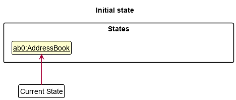
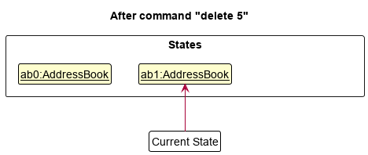
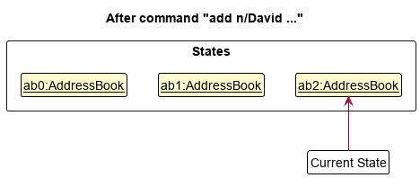
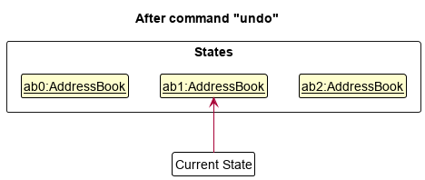
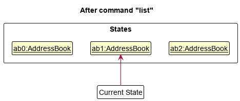
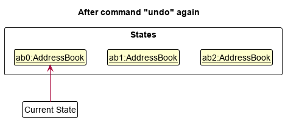
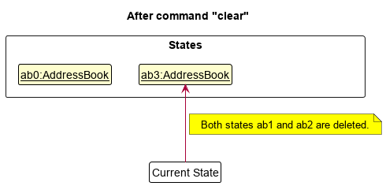
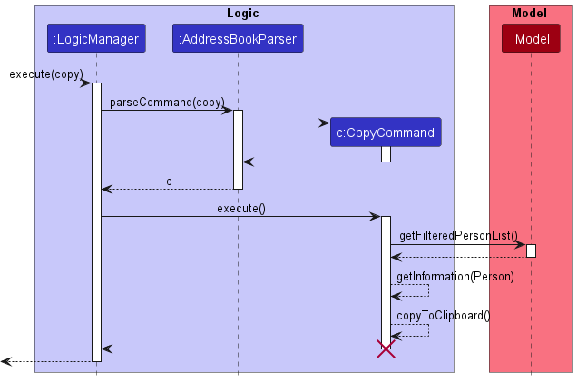

- [**Acknowledgements**](#acknowledgements)
- [**Setting up, getting started**](#setting-up-getting-started)
- [**Design**](#design)
  - [Architecture](#architecture)
  - [UI component](#ui-component)
  - [Logic component](#logic-component)
  - [Model component](#model-component)
  - [Storage component](#storage-component)
  - [Common classes](#common-classes)
- [**Implementation**](#implementation)
  - [Undo feature](#undo-feature)
    - [Undo: Current implementation](#undo-current-implementation)
    - [Undo: Design considerations](#undo-design-considerations)
  - [Filter feature](#filter-feature)
    - [Filter: Current implementation](#filter-current-implementation)
  - [Copy feature](#copy-feature)
    - [Copy: Current implementation](#copy-current-implementation)
  - [New army-specific fields](#new-army-specific-fields)
    - [New army fields: Current implementation](#new-army-fields-current-implementation)
  - [\[Proposed\] Data archiving](#proposed-data-archiving)
- [**Documentation, logging, testing, configuration, dev-ops**](#documentation-logging-testing-configuration-dev-ops)
- [**Appendix: Requirements**](#appendix-requirements)
  - [Product scope](#product-scope)
  - [User stories](#user-stories)
  - [Use cases](#use-cases)
  - [Non-Functional Requirements](#non-functional-requirements)
  - [Glossary](#glossary)
- [**Appendix: Instructions for manual testing**](#appendix-instructions-for-manual-testing)
  - [Launch and shutdown](#launch-and-shutdown)
  - [Deleting a person](#deleting-a-person)
  - [Saving data](#saving-data)

---

## **Acknowledgements**

- {list here sources of all reused/adapted ideas, code, documentation, and third-party libraries -- include links to the original source as well}

---

## **Setting up, getting started**

Refer to the guide [*Setting up and getting started*](SettingUp.md).

---

## **Design**

:bulb: **Tip:** The `.puml` files used to create diagrams in this document can be found in the [diagrams](https://github.com/se-edu/addressbook-level3/tree/master/docs/diagrams/) folder. Refer to the [*PlantUML Tutorial* at se-edu/guides](https://se-education.org/guides/tutorials/plantUml.html) to learn how to create and edit diagrams.

### Architecture

The ***Architecture Diagram*** given above explains the high-level design of the App.

Given below is a quick overview of main components and how they interact with each other.

**Main components of the architecture**

**`Main`** has two classes called [`Main`](https://github.com/se-edu/addressbook-level3/tree/master/src/main/java/seedu/address/Main.java) and [`MainApp`](https://github.com/se-edu/addressbook-level3/tree/master/src/main/java/seedu/address/MainApp.java). It is responsible for,

- At app launch: Initializes the components in the correct sequence, and connects them up with each other.

- At shut down: Shuts down the components and invokes cleanup methods where necessary.

[**`Commons`**](#common-classes) represents a collection of classes used by multiple other components.

The rest of the App consists of four components.

- [**`UI`**](#ui-component): The UI of the App.
- [**`Logic`**](#logic-component): The command executor.
- [**`Model`**](#model-component): Holds the data of the App in memory.
- [**`Storage`**](#storage-component): Reads data from, and writes data to, the hard disk.

**How the architecture components interact with each other**

The *Sequence Diagram* below shows how the components interact with each other for the scenario where the user issues the command `delete 1`.

Each of the four main components (also shown in the diagram above),

- defines its *API* in an `interface` with the same name as the Component.
- implements its functionality using a concrete `{Component Name}Manager` class (which follows the corresponding API `interface` mentioned in the previous point)

For example, the `Logic` component defines its API in the `Logic.java` interface and implements its functionality using the `LogicManager.java` class which follows the `Logic` interface. Other components interact with a given component through its interface rather than the concrete class (reason: to prevent outside component's being coupled to the implementation of a component), as illustrated in the (partial) class diagram below.

The sections below give more details of each component.

### UI component

The **API** of this component is specified in [`Ui.java`](https://github.com/se-edu/addressbook-level3/tree/master/src/main/java/seedu/address/ui/Ui.java)

The UI consists of a `MainWindow` that is made up of parts e.g.`CommandBox`, `ResultDisplay`, `PersonListPanel`, `StatusBarFooter` etc. All these, including the `MainWindow`, inherit from the abstract `UiPart` class which captures the commonalities between classes that represent parts of the visible GUI.

The `UI` component uses the JavaFx UI framework. The layout of these UI parts are defined in matching `.fxml` files that are in the `src/main/resources/view` folder. For example, the layout of the [`MainWindow`](https://github.com/se-edu/addressbook-level3/tree/master/src/main/java/seedu/address/ui/MainWindow.java) is specified in [`MainWindow.fxml`](https://github.com/se-edu/addressbook-level3/tree/master/src/main/resources/view/MainWindow.fxml)

The `UI` component,

- executes user commands using the `Logic` component.
- listens for changes to `Model` data so that the UI can be updated with the modified data.
- keeps a reference to the `Logic` component, because the `UI` relies on the `Logic` to execute commands.
- depends on some classes in the `Model` component, as it displays `Person` object residing in the `Model`.

### Logic component

**API** : [`Logic.java`](https://github.com/se-edu/addressbook-level3/tree/master/src/main/java/seedu/address/logic/Logic.java)

Here's a (partial) class diagram of the `Logic` component:

How the `Logic` component works:

1. When `Logic` is called upon to execute a command, it uses the `AddressBookParser` class to parse the user command.
1. This results in a `Command` object (more precisely, an object of one of its subclasses e.g., `AddCommand`) which is executed by the `LogicManager`.
1. The command can communicate with the `Model` when it is executed (e.g. to add a person).
1. The result of the command execution is encapsulated as a `CommandResult` object which is returned back from `Logic`.

The Sequence Diagram below illustrates the interactions within the `Logic` component for the `execute("delete 1")` API call.

:information_source: **Note:** The lifeline for `DeleteCommandParser` should end at the destroy marker (X) but due to a limitation of PlantUML, the lifeline reaches the end of diagram.

Here are the other classes in `Logic` (omitted from the class diagram above) that are used for parsing a user command:

How the parsing works:

- When called upon to parse a user command, the `AddressBookParser` class creates an `XYZCommandParser` (`XYZ` is a placeholder for the specific command name e.g., `AddCommandParser`) which uses the other classes shown above to parse the user command and create a `XYZCommand` object (e.g., `AddCommand`) which the `AddressBookParser` returns back as a `Command` object.
- All `XYZCommandParser` classes (e.g., `AddCommandParser`, `DeleteCommandParser`, ...) inherit from the `Parser` interface so that they can be treated similarly where possible e.g, during testing.

### Model component

**API** : [`Model.java`](https://github.com/se-edu/addressbook-level3/tree/master/src/main/java/seedu/address/model/Model.java)

The `Model` component,

- stores the address book data i.e., all `Person` objects (which are contained in a `UniquePersonList` object).
- stores the currently 'selected' `Person` objects (e.g., results of a search query) as a separate *filtered* list which is exposed to outsiders as an unmodifiable `ObservableList<Person>` that can be 'observed' e.g. the UI can be bound to this list so that the UI automatically updates when the data in the list change.
- stores a `UserPref` object that represents the user's preferences. This is exposed to the outside as a `ReadOnlyUserPref` objects.
- does not depend on any of the other three components (as the `Model` represents data entities of the domain, they should make sense on their own without depending on other components)

:information_source: **Note:** An alternative (arguably, a more OOP) model is given below. It has a `Tag` list in the `AddressBook`, which `Person` references. This allows `AddressBook` to only require one `Tag` object per unique tag, instead of each `Person` needing their own `Tag` objects.

### Storage component

**API** : [`Storage.java`](https://github.com/se-edu/addressbook-level3/tree/master/src/main/java/seedu/address/storage/Storage.java)

The `Storage` component,

- can save both address book data and user preference data in json format, and read them back into corresponding objects.
- inherits from both `AddressBookStorage` and `UserPrefStorage`, which means it can be treated as either one (if only the functionality of only one is needed).
- depends on some classes in the `Model` component (because the `Storage` component's job is to save/retrieve objects that belong to the `Model`)

### Common classes

Classes used by multiple components are in the `seedu.addressbook.commons` package.

---

## **Implementation**

This section describes some noteworthy details on how certain features are implemented.

### Undo feature

#### Undo: Current implementation

The current undo mechanism is handled by `AddressBook`. It stores the address book history internally as an `addressBookStateList` and uses a `currentStatePointer` to track where the current address book state is in the history. Additionally, it implements the following operations:

- `AddressBook#commit()` — Saves the current address book state in its history.
- `AddressBook#undo()` — Restores the previous address book state from its history.

These operations are exposed in the `Model` interface as `Model#commit()` and `Model#undo()` respectively.

The following sequence diagram shows how the undo operation works:

:information_source: **Note:** The lifeline for `UndoCommand` should end at the destroy marker (X) but due to a limitation of PlantUML, the lifeline reaches the end of diagram.

The following activity diagram summarizes what happens when a user executes a new command:

 

Given below is an example usage scenario and how the undo mechanism behaves at each step:

1. The user launches the application for the first time. The `AddressBook` will be initialized with the initial address book state, and the `currentStatePointer` will point to that single address book state.

   

      

      
 Initial state of the address book history upon startup

       

   

1. The user executes `delete 5` command to delete the 5th person in the address book. The `delete` command calls `Model#commit()`, causing the modified state of the address book after the `delete 5` command executes to be saved in the `addressBookStateList`, and the `currentStatePointer` is shifted to the newly inserted address book state.

   

      

      
 State of the address book history after calling <code>delete 5</code>

       

   

1. The user executes `add n/David …​` to add a new person. The `add` command also calls `Model#commit()`, causing another modified address book state to be saved into the `addressBookStateList` as shown below.

   

      

      
 State of the address book history after calling <code>add n/David …​</code>

       

   

   

   :information_source: **Note:** If a command fails its execution (e.g., the `add` command syntax was incorrect), it will not call `Model#commit()`, so the address book state will not be saved into the `addressBookStateList`.

   

1. The user now decides that adding the person was a mistake, and decides to undo that action by executing the `undo` command. The `undo` command will call `Model#undo()`, which will shift the `currentStatePointer` once to the left, pointing it to the previous address book state, and restores the address book to that state.

   

      

      
 State of the address book history after calling <code>undo</code>

       

   

1. The user then decides to execute the command `list`. Commands that do not modify the address book (such as `list`) will usually not call `Model#commit()` or `Model#undo()`. Thus, the `addressBookStateList` remains unchanged.

   

      

      
 State of the address book history after calling <code>list</code>. Note that it hasn't changed from the previous figure above

       

   

1. The user decides to call the `undo` command again.

   

      

      
 State of the address book history after calling <code>undo</code> again

       

   

   

   :information_source: **Note:** The `undo` command will first call `Model#canUndo()` to check if there are address book states to restore. If there are none (i.e., the `currentStatePointer` is at index 0 already), it will return an error to the user rather than attempt to perform the undo.

   

1. The user executes `clear`, which calls `Model#commit()`. Since the `currentStatePointer` is not pointing at the end of the `addressBookStateList`, all address book states after the `currentStatePointer` will be purged. Reason: It no longer makes sense to redo the `add n/David …​` command. This is the behavior that most modern desktop applications follow.

   

      

      
 State of the address book history after having "overwritten" old states

       

   

#### Undo: Design considerations

**Aspect: How undo executes:**

- **Alternative 1 (current choice):** Saves the entire address book.

  - Pros: Easy to implement.
  - Cons: May have performance issues in terms of memory usage.

- **Alternative 2:** Individual command knows how to undo/redo by
  itself.
  - Pros: Will use less memory (e.g. for `delete`, just save the person being deleted).
  - Cons: We must ensure that the implementation of each individual command are correct.

*{more aspects and alternatives to be added}*

### Filter feature

#### Filter: Current implementation

The current filter feature is facilitated by `FilterCommand` which extends `Command`. The `FilterCommand`
has a constructor that requires a non-null `FilterDescriptor`, which is an inner class of `FilterCommand`.
It is used to store the desired filter's information. `FilterDescriptor` has all the fields that a `Person`
object has (i.e. `Phone`, `Email`,`Rank`, etc), except that the field values can be empty
and do not need to follow any format or restriction.

When `FilterCommand` receives a valid `FilterDescriptor`, it creates a `FieldContainsPartialKeywordsPredicate`
using all of the `FilterDescriptor`'s information. This `Predicate` is used go through all the `Person` objects that are
currently in the `Model`. A `Person` is filtered out if it does not contain the keyword in the corresponding field.

The following sequence diagram shows an example of how the filter feature runs with user input:
`filter e/gmail r/3sg`.

:information_source: **Note:** The lifeline for `FilterCommandParser` should end at the destroy marker (X) but due to a limitation of PlantUML, the lifeline reaches the end of diagram.

### Copy feature

#### Copy: Current implementation

The copy feature is implemented by extracting information of the specified `Person` and then setting it as the content of the user's system's clipboard. The copy mechanism is facilitated by `CopyCommand` which extends `Command`.
Since the information of a `Person` is required, the `Model#getFilteredPersonList()` operation is invoked to retrieve the specified `Person` and the information is extracted and copied into the user's system's clipboard.

The following sequence diagram shows how the copy operation works:

:information_source: **Note:** The lifeline for `CopyCommand` should end at the destroy marker (X) but due to a limitation of PlantUML, the lifeline reaches the end of diagram.

In the scenario where the user's system's clipboard is not accessible, the requested information will be displayed in the UI for the user to manually copy it.

### New army-specific fields

#### New army fields: Current implementation

The new army-specific fields are `rank`, `unit`, `company` and `platoon`.

- We made the `rank` field compulsory since we are only dealing with army personnel (i.e., everyone should have a `rank`).
  - `rank` is not a free-response field as `"ABCDEF"` is *not* a valid rank. For now, `rank` can only take on the values `"REC"`, `"PTE"`, `"CPL"`, `"3SG"` or `"2LT"` -- we intend to expand this list to include all valid ranks in the future.
- We made the `unit`, `company` and `platoon` fields optional as military personnel might not always be assigned to a unit, company, and/or platoon.
  - If the user omitted the `unit`, `company` and/or `platoon` fields when creating a new contact, they will be automatically set to `"N/A"`.

### \[Proposed\] Data archiving

*{Explain here how the data archiving feature will be implemented}*

---

## **Documentation, logging, testing, configuration, dev-ops**

- [Documentation guide](Documentation.md)
- [Testing guide](Testing.md)
- [Logging guide](Logging.md)
- [Configuration guide](Configuration.md)
- [DevOps guide](DevOps.md)

---

## **Appendix: Requirements**

### Product scope

**Target user profile**: Military admin clerk who handles information of other military personnel

**Value proposition**: Contains dedicated fields in a contact card that manages military-specific information (e.g., rank, company, unit, etc.)

### User stories

Priority:

- 1 = must have
- 2 = nice to have
- 3 = unlikely to have

 

| Priority | As a/an...                | I can...                                                                                | so that...                                                                                                     |
| -------- | ------------------------- | --------------------------------------------------------------------------------------- | -------------------------------------------------------------------------------------------------------------- |
| 1        | fast typer                | type in a command and the contact details to create a new contact                       | I can save time (instead of using the mouse to interact with the software which is slower)                     |
| 1        | fast typer                | type in a command to delete a contact                                                   | I can save time (instead of using the mouse to interact with the software which is slower)                     |
| 1        | fast typer                | type in a command to view all contacts                                                  | I can save time (instead of using the mouse to interact with the software which is slower)                     |
| 2        | beginner                  | view the user guide                                                                     | I look up the syntax of a command that I had forgotten                                                         |
| 2        | beginner                  | search for a contact by name                                                            | I can save time (instead of searching manually)                                                                |
| 2        | beginner                  | edit an existing contact                                                                | I don't have to create an entirely new contact just because of a small typo                                    |
| 2        | beginner                  | tag contacts with extra information (e.g., leader of XYZ)                               | I can find the leader of XYZ easily                                                                            |
| 2        | seasoned user             | filter and sort contacts                                                                | I can quickly find contacts that meet the criteria (instead of searching manually)                             |
| 3        | security conscious person | set up an app password                                                                  | I can prevent others from reading the sensitive information on the military personnel                          |
| 3        | security conscious person | change the app password                                                                 | I can ensure the security of the password                                                                      |
| 3        | new user                  | import contacts from a CSV file                                                         | I can easily migrate from other contacts management systems                                                    |
| 3        | clumsy user               | undo the previous action                                                                | I can rectify grave mistakes quickly                                                                           |
| 3        | forgetful user            | search for a contact by any identifying details                                         | I can still find a contact even if I have forgotten the person's name                                          |
| 3        | busy user                 | see recently viewed contacts                                                            | I can revisit previously accessed contacts quickly (instead of searching for them again)                       |
| 3        | busy user                 | generate a nicely formatted text template that contains all of the person's information | I do not need to re-type the same headers / tables whenever I send a new email                                 |
| 3        | seasoned user             | save commonly used contacts as favourites                                               | I can quickly look up commonly used contacts                                                                   |
| 3        | seasoned user             | hide unavailable personnel (using filters)                                              | I can see only those people that are currently available                                                       |
| 3        | seasoned user             | be shown daily tips on how to use some advanced features of FAILS                       | I can continuously learn how to save even more time (and become an advanced user)                              |
| 3        | seasoned user             | see a count of the number of people in the current list                                 | I can quickly calculate the number of people in each subset of the military                                    |
| 3        | advanced user             | export all FAILS data to a FAILS data file                                              | I don't lose my data when I change computers / departments                                                     |
| 3        | advanced user             | import all FAILS data from a FAILS data file                                            | I don't lose my data when I change computers / departments                                                     |
| 3        | advanced user             | delete all the data on the FAILS                                                        | I can ensure that the sensitive data will not remain on the old computer when I change computers / departments |
| 3        | advanced user             | automatically see the ORD date of a recruit                                             | I can inform them of the administrative processes that must completed before they ORD                          |
| 3        | advanced user             | mark that a person is on leave from `start_date` to `end_date`                          | I can tell if the soldier is available or not (and when he will be available)                                  |
| 3        | advanced user             | make simultaneous edits to multiple contacts at once (e.g., update rank)                | I can save time by rectifying mass mistakes / save time by updating multiple people's information quickly      |
| 3        | advanced user             | view two contacts side by side                                                          | I can compare two contacts side by side easily (instead of having to open up another instance of the app)      |
| 3        | advanced user             | save commonly used combinations of filters as favourites                                | I can view the updated data quickly without having to apply the same combination of filters again              |
| 3        | inaccurate typer          | search for contacts even with typos (fuzzy search)                                      | I can search fast even with minor typos                                                                        |
| 3        | slower typer              | see suggested names when searching                                                      | I can easily autocomplete my search query                                                                      |
| 3        | slower typer              | see all contacts that match my current search query even before I press ENTER           | I do not need to type out my complete search query to start seeing results                                     |
| 3        | ration manager            | filter and count the number of people that need halal meals / are allergic to seafood   | I know how many halal / non-seafood food packs to order                                                        |
| 3        | artistic user             | edit the theme of the app/font of the UI                                                | I can personalize the look of the app to be more aesthetically pleasing to me                                  |
| 3        | person with bad eyesight  | increase the font size/UI size of the whole app                                         | I can see text better                                                                                          |

### Use cases

(For all use cases below, the **System** is the `Fast Army Internal Lookup System (FAILS)`, unless specified otherwise)

**Use case: UC2 - Create a new military personnel**

**Actor: Admin clerk**

**MSS**

1. Admin clerk creates a new military personnel contact by entering the command.
1. FAILS creates and displays the newly created military personnel contact to the admin clerk.

   Use case ends.

**Extensions**

- 1a. FAILS detects an error in the command (e.g. missing information, incorrect syntax).
  - 1a1. FAILS displays an error message to the admin clerk.
  - 1a2. Admin clerk re-enters the information to create the military personnel contact.
  - Steps 1a1-1a2 are repeated until the information provided is acceptable.
  - Use case resumes at step 2.

---

**Use case: UC101 - Update the rank of person named "Lawrence Tay"**

**Actor: Admin clerk**

**MSS**

1. Admin clerk <ins>searches for a person named "Lawrence Tay" (UC5)</ins>.
1. Admin clerk <ins>edits the *rank* information of "Lawrence Tay" (UC6)</ins>.
1. FAILS displays the updated *rank* information of "Lawrence Tay".

   Use case ends.

**Extensions**

- 1a. After searching, there is more than one "Lawrence Tay" in the displayed list.
  - 1a1. Admin clerk scrolls through the list of "Lawrence Tay"s and mentally notes down the index of the exact "Lawrence Tay" person she is looking for.
  - Use cases resumes at step 2.

---

**Use case: UC102 - Import contacts from CSV file**

**Actor: Admin clerk**

**MSS**

1. Admin clerk chooses to import a CSV file containing the personal information of military personnel from her computer.
1. FAILS imports the CSV file.
1. FAILS prompts the admin clerk whether the information in the CSV file should *replace* or be *added* to the existing list of contacts.
1. Admin clerk chooses one of the options.
1. If the option was to *replace*, FAILS will delete all existing all contacts. Otherwise, FAILS does nothing in this step.
1. FAILS adds the CSV contacts to the existing list of contacts.

   Use case ends.

**Extensions**

- 2a. FAILS is unable to automatically match the CSV column names to FAILS contact fields.
  - 2a1. FAILS prompts the admin clerk to decide which CSV column refer to which FAILS contact field (e.g., the CSV might have a column called "mobile_number" whereas FAILS has a field called "phone").
  - Use case resumes at step 3.

*{More to be added}*

### Non-Functional Requirements

1. FAILS must store the personal data of military personnel securely.
1. FAILS must only allow the authorised admin clerk access to the military personnel data (in compliance with PDPA).
1. FAILS must not leak the personal data of military personnel even during a computer crash.
1. FAILS must not connect to the Internet.
1. FAILS must be able to handle at least 1000 military personnel contacts.
1. FAILS should be easy to use even for non-technical persons like an admin clerk.
1. FAILS should be efficient enough that it performs well even on lower-tier hardware (e.g., like those found in everyday office computers that admin clerks use).
1. FAILS should respond within 1 second for any command the user inputs.
1. FAILS must not lose critical data on military personnel even during a computer crash.
1. FAILS must be accessible to military personnel with disabilities.

### Glossary

- **Mainstream OS**: Windows, Linux, Unix, OS-X
- **Private contact detail**: A contact detail that is not meant to be shared with others
- **Non-technical person**: Someone who is able to execute basic tasks using the computer's point-and-click interface and has the ability to use simple GUI applications.

---

## **Appendix: Instructions for manual testing**

Given below are instructions to test the app manually.

:information_source: **Note:** These instructions only provide a starting point for testers to work on;
testers are expected to do more *exploratory* testing.

### Launch and shutdown

1. Initial launch
   1. Download the jar file and copy into an empty folder
   1. Double-click the jar file Expected: Shows the GUI with a set of sample contacts. The window size may not be optimum.
1. Saving window preferences
   1. Resize the window to an optimum size. Move the window to a different location. Close the window.
   1. Re-launch the app by double-clicking the jar file. 
      Expected: The most recent window size and location is retained.
1. *{ more test cases …​ }*

### Deleting a person

1. Deleting a person while all persons are being shown
   1. Prerequisites: List all persons using the `list` command. Multiple persons in the list.
   1. Test case: `delete 1` 
      Expected: First contact is deleted from the list. Details of the deleted contact shown in the status message. Timestamp in the status bar is updated.
   1. Test case: `delete 0` 
      Expected: No person is deleted. Error details shown in the status message. Status bar remains the same.
   1. Other incorrect delete commands to try: `delete`, `delete x`, `...` (where x is larger than the list size) 
      Expected: Similar to previous.
1. *{ more test cases …​ }*

### Saving data

1. Dealing with missing/corrupted data files
   1. *{explain how to simulate a missing/corrupted file, and the expected behavior}*
1. *{ more test cases …​ }*
