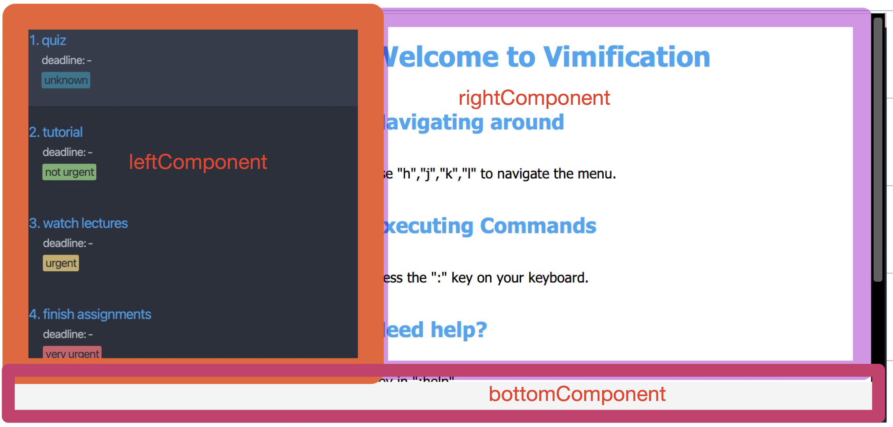
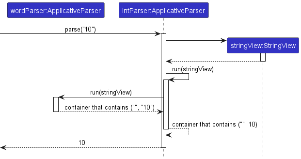
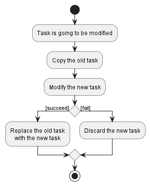
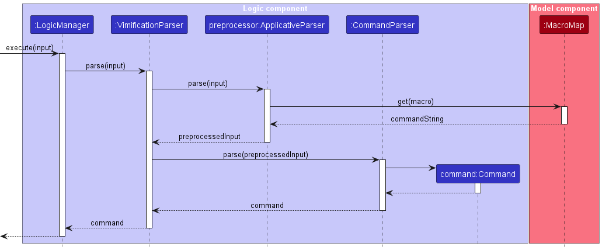
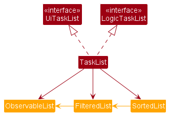

## **Overview**

Vimification is a **desktop app for managing to-do and deadlines, optimized for use via a Command Line Interface** (CLI) **that uses vim-like command syntax** while still having the benefits of a Graphical User Interface (GUI).

If you're interested in contributing to the Vimification project, this Developer Guide will assist you in becoming acquainted with Vimification's architecture, as well as comprehending the design decisions and key feature implementations.

---

## **Table of Contents**

- [Acknowledgements](#acknowledgements)
- [Setting up, getting started](#setting-up-getting-started)
- [Design](#design)
  - [Architecture](#architecture)
  - [UI component](#ui-component)
  - [Logic component](#logic-component)
  - [Model component](#model-component)
  - [Storage component](#storage-component)
  - [Common classes](#common-classes)
- [Implementation](#implementation)
  - [ApplicativeParser\<T\>](#applicativeparsert)
  - [Command parser](#command-parser)
  - [Command implementation](#command-implementation)
  - [Atomic data modification](#atomic-data-modification)
  - [Undo feature](#undo-feature)
  - [Macro feature](#macro-feature)
  - [Syncing view with internal logic](#syncing-view-with-internal-logic)
- [Documentation, logging, testing, configuration, dev-ops](#documentation-logging-testing-configuration-dev-ops)
- [Appendix: Requirements](#appendix-requirements)
  - [Product scope](#product-scope)
  - [User stories](#user-stories)
  - [Use cases](#use-cases)
  - [Non-Functional Requirements](#non-functional-requirements)
  - [Glossary](#glossary)
- [Appendix: Instructions for manual testing](#appendix-instructions-for-manual-testing)
  - [Launch and shutdown](#launch-and-shutdown)
  - [Adding](#adding)
  - [Inserting](#inserting)
  - [Deleting](#deleting)
  - [Filtering](#filtering)
  - [Sorting](#sorting)
  - [Refresh](#refresh)
  - [Help](#help)
- [Appendix: Planned Enhancements](#appendix-planned-enhancements)

---

## **Acknowledgements**

- This project is based on the [AddressBook-Level3](https://github.com/se-edu/addressbook-level3) project created by the [SE-EDU initiative](https://se-education.org/)

* Our application makes use of [Jackson](https://github.com/FasterXML/jackson) as the JSON parser.
* Our application makes use of [JavaFX](https://openjfx.io/) as the UI framework.
* Our application makes use of [JUnit5](https://junit.org/junit5/) as the testing framework.

---

## **Setting up, getting started**

Refer to the guide [_Setting up and getting started_](SettingUp.md).

---

## **Design**

<div markdown="span" class="alert alert-primary">

:bulb: **Tip:** The `.puml` files used to create diagrams in this document can be found in the [diagrams](https://github.com/AY2223S2-CS2103T-T15-3/tp/tree/master/docs/diagrams) folder. Refer to the [_PlantUML Tutorial_ at se-edu/guides](https://se-education.org/guides/tutorials/plantUml.html) to learn how to create and edit diagrams.

</div>

### Architecture


The **Architecture Diagram** given above explains the high-level design of the App.

Given below is a quick overview of main components and how they interact with each other.

**Main components of the architecture**

**`Main`** has two classes called [`Main`](https://github.com/se-edu/addressbook-level3/tree/master/src/main/java/seedu/address/Main.java) and [`MainApp`](https://github.com/se-edu/addressbook-level3/tree/master/src/main/java/seedu/address/MainApp.java). It is responsible for:

- At app launch: Initializes the components in the correct sequence, and connects them up with each other.
- At shut down: Shuts down the components and invokes cleanup methods where necessary.

[**`Common`**](#common-classes) represents a collection of classes used by multiple other components.

The rest of the app consists of four components:

- [**`UI`**](#ui-component): The UI of the app.
- [**`Logic`**](#logic-component): The command executor.
- [**`Model`**](#model-component): Holds the data of the app in memory.
- [**`Storage`**](#storage-component): Reads data from, and writes data to, the hard disk.

**How the components interact with each other**

Each of the main components (except the `Model` component):

- Defines its **API** in an interface with the same name as the component.
- Implements its functionality using a concrete `{Component Name}Manager` class (which follows the corresponding interface mentioned in the previous point).

For example, the `Logic` component defines its API in the `Logic` interface and implements its functionality using the `LogicManager` class. Other components interact with a given component through its interface rather than the concrete class (reason: to prevent outside components from being coupled to the implementation of a component), as illustrated in the (partial) class diagram below.


The **API** of the `Model` component is defined in multiple interfaces, instead of a single interface. The detailed reason behind this design is discussed [here](#model-component).

The sections below give more details of each component.

### UI component

The **API** of this component is specified in [`Ui.java`](https://github.com/AY2223S2-CS2103T-T15-3/tp/blob/master/src/main/java/vimification/taskui/Ui.java).

Here's a (partial) class diagram of the `UI` component:


The `UI` component uses the JavaFx UI framework and consists of a a `Facade` interface `Ui` that is implemented by the concrete class `UiManager`.

`UiManager` consists of a `MainWindow`, which holds all UI `sub-components` of Vimification like `TaskListPanel`,`TaskDetailPanel`,`CommandInput`,`CommandResultPanel`,`HelpManualPanel`, `WelcomePanel`, etc.

**NOTE: Each `sub-component` is created to do one, and only one thing to obey single responsibility principle.**

Within `TaskListPanel` is a `ListView` that could hold multiple `TaskListViewCell` and each `TaskListViewCell` has a `TaskCard`, which represents `Task` and displays a summary of it.

**File Structure**
In order to represent each sub-component, you need to define 2 things:

1. Controller (located in `src/main/java/vimification/taskui/`) controls the behaviour of the `sub-component.
2. FXML file (located in `src/main/resources/view`) dictates what to display.

For example, `MainScreen` has a controller [`MainScreen.java`](https://github.com/AY2223S2-CS2103T-T15-3/tp/blob/master/src/main/java/vimification/taskui/MainScreen.java) is specified in [`MainScreen.fxml`](https://github.com/AY2223S2-CS2103T-T15-3/tp/blob/master/src/main/resources/view/MainScreen.fxml)

**MainScreen Structure**
`MainScreen` is the main(root) component that holds all other `sub-components` and is divided into 3 main parts(leftComponent, rightComponent,bottomComponent) as shown below.
`MainScreen` is also a `Facade` component, that helps other `sub-components` communicate with each other.


1. `leftComponent`
2. `rightComponent`
3. `bottomComponent`

<br>

By breaking MainScreen into 3 parts, it makes it very easy to load and eject `sub-components` (e.g `CommandInput`, `CommandResultPanel`, etc).

The following is a summary of what each part would load/eject.
`leftComponent` _always_ and _only_ loads the `TaskListPanel` upon initialization.

`bottomComponent` loads the `CommandInput` when the user presses `:` key on their keyboard.
After the user finishes typing their command in `CommandInput` and presses `Enter`, `bottomComponent` ejects `CommandInput` and loads `CommandResultPanel` to show the command result at the bottom of the screen.

`rightComponent` loads the `WelcomePanel` when Vimification first launches to show a breif guide to guide the user.
`rightComponent` loads the `HelpManualPanel` when the user executes the `:help` command using `CommandInput`.
`rightComponent` loads the `TaskDetailPanel` when the user presses `l` key on their keyboard when they hover over a `TaskListViewCell`(a cell in `TaskListPanel` in `leftComponent`).

`rightComponent` ejects all `sub-components` within it when the user presses the `h` k.

**NOTE: `rightComponent` automatically ejects the previous `sub-component` first when the user tries to load a new `sub-component`.**

All these, including the `MainScreen`, inherit from the abstract `UiPart` class which captures the commonalities between classes that represent parts of the visible GUI and helps us load the FXML file automatically when we call `super(FXML)`, where FXML is the `PATH` of the FXML file for the corresponding `Controller`.

**MainScreen and sub-component responsibility**

1. `MainScreen`: Holds the sub-components and handle `load`/`eject` calls from sub-components.
2. `CommandInput`: Executes commands using `logic.execute()` and show/hide depending on whether the user has entered Command mode by pressing the `:` key.
3. `TaskListPanel`: Displays the list of `TaskViewCell` and listens to the user's navigation key and `load`/`eject` rightComponent's `sub-component`.
4. `TaskListViewCell`: Encapsulates `TaskCard`.
5. `TaskCard`: Displays a summary of the `Task`.
6. `HelpManualPanel`: Displays the `UG` when the user executes the command `:help`.
7. `WelcomeManualPanel`: Displasy the welcome page to the user upon boot up.

The `UI` component:

- Communicates with the back-end via a single-entry point `Logic` component to execute user commands.
- Keeps a reference to the `Logic` component, because the `UI` relies on the `Logic` to execute commands and to display the list of tasks.
- Updates the UI every time a command is executed.

### Logic component

The **API** of this component is specified in [`Logic.java`](https://github.com/se-edu/addressbook-level3/tree/master/src/main/java/seedu/address/logic/Logic.java).

Here's a (partial) class diagram of the `Logic` component:


**How the `Logic` component works:**

- When `Logic` is called upon to execute a command, it uses the `VimificationParser` class to parse the user command.
- This results in a `Command` object (more precisely, an object of one of its subclasses e.g., `AddCommand`) which is executed by the `LogicManager`.
- The command can communicate with multiple model objects (`TaskList`, `MacroMap`, etc.) when it is executed (e.g. to add a task).
- The result of the command execution is encapsulated as a `CommandResult` object which is returned back from `Logic`.

The sequence diagram below illustrates the interactions within the `Logic` component for the `execute("d 1")` API call.


Here are the parser classes that are used for parsing a user command:


**How the parsing works:**

- Each command has a dedicated parser, `XYZCommandParser` (`XYZ` is a placeholder for the specific command name e.g., `AddCommandParser`) to parse it.
- When called upon to parse a user command, the `VimificationParser` forwards the user input to different `XYZCommandParser` objects. If the `XYZCommandParser` recognizes the command, it will continue to parse the user input and create an `XYZCommand` object (e.g., `AddCommand`) which the `VimificationParser` returns back as a `Command` object. Otherwise, `VimificationParser` will move on and tries the next parser available.
- All `XYZCommandParser` classes (e.g., `AddCommandParser`, `DeleteCommandParser`, ...) inherit from the `CommandParser` interface so that they can be treated similarly where possible e.g, during testing.

### Model component

Compared to the original design of AB3, we decided to split the model components into multiple classes and interfaces with different purposes.

We argue that the original `Model` component from AB3 handles too many responsibilities (it handles both the business logic and the view at the same time) - which results in high coupling and low cohesion. This causes a number of bad consequences on the code base - one of them is mentioned below.

Consider the command classes in AB3 - they are dependent on the `Model` interface. A change in the `Model` interface forces us to recompile all command classes (and remember, there are classes that are dependent on the command classes - we also need to recompile them), even if the change is not related to the command.

We may add a method to sort data, and then we must recompile `AddCommand` because `Model` has changed. But, `AddCommand` only modifies internal data - it is not dependent on the view, and ideally, we do not need to recompile it.

Therefore, we decided to split the `Model` components into different classes and interfaces, following the [interface segregation principle](https://en.wikipedia.org/wiki/Interface_segregation_principle):

- **`ReadOnlyUserPrefs`**: Stores the user's preferences.
- **`LogicTaskList`**: Stores and manages all `Task` objects in memory.
- **`UiTaskList`**: Selects and orders `Task` objects to be displayed to the user.
- **`MacroMap`**: Stores and manages all macros in the memory.
- **`CommandStack`**: Manages a stack of `UndoableLogicCommand` (a subclass of `Command`) objects for the undo feature.

Here's a (partial) class diagram of the `Model` component:


Currently, `MacroMap` and `CommandStack` are classes and are used directly in other components (without using an immediate interface). With the current version of the app, using interfaces for these classes to hide the implementation details are not very necessary. We do plan to introduce interfaces for these classes in future version of the app as it makes the code base more consistent.

### Storage component

The **API** of this component is specified in [`Storage.java`](https://github.com/se-edu/addressbook-level3/tree/master/src/main/java/seedu/address/storage/Storage.java).


The `Storage` component:

- Can save both user preference data, task data and macro data in JSON format, and read them back into corresponding objects.
- Inherits from both `TaskListStorage`, `MacroMapStorage` and `UserPrefStorage`, which means it can be treated as either one (if only the functionality of only one is needed).
- Depends on some classes in the `Model` component (because the `Storage` component's job is to save/retrieve objects that belong to the `Model`).

### Common classes

Classes used by multiple components are in the `vimificationbook.common` package.

---

## **Implementation**

This section describes some noteworthy details on how certain features are implemented.

### ApplicativeParser\<T\>

`Applicative Parser` is an idea from functional programming languages, where we have a set of **basic parsers** (also called **combinators**), and we can combine them to form more powerful parsers.

**Motivation**

The parser of Vimification is implemented with `ApplicativeParser` instead of `regex`. The main reason why we use `ApplicativeParser` becauses it allows a more declarative style to write the parser, which is (arguably) easier to read and maintain, compared to a long `regex` expression.

**Implementation overview**

`ApplicativeParser` is implemented as a wrapper around a function that accepts some input sequence, and returns a container that:

- Is empty, if the parser fails.
- Contains the remaining input sequence, together with the parsing result, if the parser succeeds.

For example, consider a parser that tries to parse the string `"foo"`:

- If the input sequence is `"bar"`, the parser will fail (no `"foo"` to parse). The returned container after running the parser will be empty.
- If the input sequence is `"foo bar"`, the parser will succeed. The returned container after running the parser will contain the remaining input sequence `" bar"`, and the parsing result `"foo"`.

The parsing result can be further transformed, using some methods such as `ApplicativeParser#map()` or `ApplicativeParser#flatMap()`.

**Concrete implementation**

The current signature of the wrapped function is:

```java
private Function<StringView, Optional<Pair<StringView, T>>> runner;
```

Where `T` is the type of the parsing result.

For example, suppose we have an `ApplicativeParser` that parses an integer:

```java
ApplicativeParser<String> wordParser = ApplicativeParser.nonWhitespaces1();
ApplicativeParser<Integer> intParser = wordParser.flatMap(word -> {
    try {
        return ApplicativeParser.of(Integer.parseInt(word));
    } catch (NumberFormatException ex) {
        return ApplicativeParser.fail();
    }
});
```

Given the input sequence `"10"`, the returned container will contain the remaining sequence `""` and the parsing result `10`.



The input sequence used (internally) by `ApplicativeParser` is `StringView`, a thin wrapper class representing a slice on a `String`:

```java
public class StringView {

    private String value;
    private int offset;

    // constructors and methods
}
```

This choice is purely for performance reasons - consuming input with `StringView` is much faster as we only need to change the offset stored in the `StringView` in `O(1)`, instead of having to copy the entire substring into a new `String` in `O(n)`.

In the current implementation, the container used is `Optional` from the Java standard library. One problem with `Optional` is that it cannot contain error infomation, and we currently have to use `Exception` for that purpose. However, `Exception` may create unpredictable control flow, and must be used with care. When an `Exception` is thrown, the parser will stop immediately and control is returned to the caller.

The only way to create new `ApplicativeParser` instances is to use static factory methods. This is to ensure that the implementation of `ApplicativeParser` is hidden, and allows us to change the internal implementation of the parser to a more suitable one (in the future, if necessary) without breaking the exposed **API**.

### Command parser

All command parsers implement a common interface:

```java
public interface CommandParser<T extends Command> { /* implementation details */ }
```

Where `T` is the type of the command object returned by the parser.

**Implementation overview**

`ApplicativeParser` combinators will be combined to create powerful parsers that can recognize different commands.

A class implementing `CommandParser` must provide an implementation for `CommandParser#getInternalParser()`. This method will return the appropriate `ApplicativeParser` to parse the user input.

### Command implementation

All command classes in the application inherit from a common interface:

```java
public interface Command { /* implementation details */ }
```

**Inheritance hierarchy**

Currently, there are 3 kinds of commands in the application:

- `LogicCommand`: responsible for modifying the internal data.
- `MacroCommand`: responsible for handling macro-related features.
- `UiCommand`: responsible for changing the GUI.

Each kind has a single interface, with a single abstract method:

```java
public CommandResult execute(/* parameters */);
```

**Motivation**

This design allows the parameters required by different kinds to be different. For example, the signature of `LogicCommand#execute()` is:

```java
public CommandResult execute(LogicTaskList taskList, CommandStack commandStack);
```

While the signature of `UiCommand#execute()` is:

```java
public CommandResult execute(MainScreen mainScreen);
```

This is a big modification compared to the original design in AB3. The reason is that we want to reduce the coupling between different kinds of commands - `LogicCommand` does not need to know about UI details to be executed. This also aligns with our design of the `Model` component.

Concrete classes will implements the corresponding interfaces.

**Design considerations**

The current downside of this design is that, in order to execute a certain command, we need to check the runtime type (using `instanceof`) operator and cast the instance to the appropriate type before calling its `execute` method (by providing the correct arguments).

This is very error-prone, due to some reasons:

- Mismatch between the type used with `instanceof` operator and the type used to cast the instance.

```java
if (command instanceof LogicCommand) {
    UiCommand castedCommand = (UiCommand) command; // ClassCastException
}
```

- Missing a kind of command.

```java
if (command instanceof LogicCommand) {
    // statements
} else if (command instanceof UiCommand) {
    // statements
} else {
    // throw Exception
}
// missing MacroCommand, the compiler cannot catch this
```

Java 11 compiler cannot check for these problems, and we risk having serious bugs. However, we argue that the reduction of coupling is worth it, as it prevents other kind of bugs that are harder to catch (such as modification of logic in ui-related command).

Future versions of Java contain features that can handle the problems mentioned above: sealed class and pattern matching. In the future, we may consider upgrading Java and refactor the current implementation with these new features to eliminates these problems.

### Atomic data modification

**Motivation**

Modifications to data inside the application must be atomic. Within a single operation, if there is a failure, then all changes completed so far must be discarded, and the operation must stop. This ensures that the system is always left in a consistent state.

**Implementation details**

Currently, the only modification that can fail is a modification to `Task` object(s).

Whenever a task (in the task list) needs to be modified, the following workflow will be applied:

- Copy the task to be modified.
- Sequentially applies different modifications to the new task.
- If there is a failure, we discard the new task and stop the operation.
- If there is no failure, we replace the old task with the new (modified) task.

Refer to the diagram below for a visualization of this workflow:



Apart from ensuring atomic data operation, this implementation also greatly simplifies the implementation of the undo feature.

### Undo feature

The user can undo the previous command (that modifies the internal data) by typing `"undo"` in the command box.

**Motivation**

Users may make mistakes in their commands, and commands can be destructive. For example, the user may accidentally issue a delete command and delete _all_ information about a task. This is annoying and sometimes troublesome.

Undo command is implemented to addresss this concern. Note that in our application, undo command only undoes modifications to the internal data.

**Implementation details**

The undo mechanism is facilitated by 2 classes: `CommandStack` and `UndoableLogicCommand`.

```java
public interface UndoableLogicCommand extends LogicCommand {

    public CommandResult undo(LogicTaskList taskList);

    // other methods, if any
}
```

All command that modifies the internal data (`AddCommand`, `DeleteCommand`, etc.) must implement `UndoableLogicCommand` and provide an implementation for `UndoableLogicCommand#undo()`.

Apart from modifying the data (atomically), `UndoableLogicCommand#execute()` also:

- Maintains relevant information (before modification) for the `undo` method.
- Pushes the command into the stack of commands (if the command succeeds).

To undo a command, the following steps are executed:

- An `Undo Command` object is created after the user type `"undo"` into the command box.
- Pops the first command out of the stack.
- Calls the `undo` method of the popped command.

Refer to the diagram below for a visualization of this workflow:


Recall that, we modify the data by copying the old task and replacing it with a modified version. We can store this old task before replacing it, and restore it back when we undo the command.

**Design considerations**

Currently, undo command does not support commands that modify the macros and GUI. We do not plan to implement a undo command that reverses changes to the GUI, it does not make sense (as the user can just refresh or retype the command to change the view again). However, undoing a command that modifies the macros may be beneficial. We can extend the behavior of undo command to support this behavior in future versions.

### Macro feature

Macros are just shortcuts for longer commands. This feature allows the user to define, delete and view macro(s) in the application.

**Motivation**

The motivation for this feature comes from **bash aliases**, where the user may define customized shortcuts to invoke their commands.

**Implementation details**

The macro mechanism is facilitated by 3 classes: `MacroMap`, `MacroCommand` and `VimificationParser`.

Macro is expanded using the following workflow:

- The parser try to parse the first word in the user input.
- If there is a macro that matches the word, the entire word will be expanded into a command string. Otherwise, the word is kept unchanged.
- The remaining input will be concatenated with the processed word and feed into the command parser.

Consider the following scenario: the user already defined a macro `"cs2103t"`, and associated this macro with the command `"a 'weekly quiz' -d Fri 14:00"`. Now, if the user types `"cs2103t -l cs2103t"`, the following actions will happen:

- The parser identifies the first word that appeared in the input: `"cs2103t"`.
- There is a macro that matches the word. The word will be expanded into `"a 'weekly quiz' -d Fri 14:00"`.
- The remaining input is concatenated with the expanded macro, forming the string `"a 'weekly quiz' -d Fri 14:00 -l cs2103t"`.
- This preprocessed string will be fed into the command parser. An `AddCommand` object is then returned.

Refer to the diagram below for a visualization of this workflow:



**Design considerations**

The current implementation is still fairly minimal - the main mechanism is just simple string substitution. The problem with this mechanism is that the macro engine cannot reject an invalid macro (e.g. macros that expand to invalid command string) when it is registered, and the user may use these invalid macros.

Currently, there is no proposal to improve this behavior - any idea is appreciated.

### Syncing view with internal logic

**Motivation**

After the user uses the `sort` or `filter` command, the displayed index may not reflect the actual index of the data in the internal list. Syncing the display index with internal logic is necessary to ensure intuative and understandable behavior.

**Problem**

We still want to separate the UI details from logic details, as we don't want to introduce high coupling into our system.

**Implementation details**

Two interfaces were created to handle this problem: `LogicTaskList` and `UiTaskList`. `LogicTaskList` declares methods that modify the internal data, and a single method used to transform the display index into the actual index in the underlying data list, while `UiTaskList` declares methods that modify the GUI by setting appropriate predicates and comparators to filter and/or sort tasks. `TaskList` (the main class that controls the data of the application) will implement both interfaces.

The `TaskList` contains:

- An `ObservableList` object that stores all tasks in the application.
- A `FilteredList`, which stores the `ObservableList` as its source. We can set the predicate attached to this list to select the data to be displayed.
- A `SortedList`, which stores the `FilteredList` as its source. We can set the comparator attached to this list to sort the data to be displayed.



<div markdown="span" class="alert alert-info">

:information_source: **Note:** The classes in orange above are provided by **JavaFX**.

</div>

Note that, the command classes do not interact directly with `TaskList`, but with the interfaces `LogicTaskList` and `UiTaskList`.

---

## **Documentation, logging, testing, configuration, dev-ops**

- [Documentation guide](Documentation.md)
- [Testing guide](Testing.md)
- [Logging guide](Logging.md)
- [Configuration guide](Configuration.md)
- [DevOps guide](DevOps.md)

---

## **Appendix: Requirements**

### Product scope

**Target user profile**:

- has a need to manage a significant number of contacts
- prefer desktop apps over other types
- can type fast
- prefers typing to mouse interactions
- is reasonably comfortable using CLI apps

**Value proposition**: manage contacts faster than a typical mouse/GUI driven app

### User stories

Priorities: High (must have) - `* * *`, Medium (nice to have) - `* *`, Low (unlikely to have) - `*`

| Priority | As a …​                   | I want to …​                                                                            | So that I can…​                                                                                                                                                                                 |
| -------- | ------------------------- | --------------------------------------------------------------------------------------- | ----------------------------------------------------------------------------------------------------------------------------------------------------------------------------------------------- |
| `* * *`  | SoC Student who knows Vim | use my task planner efficiently                                                         | reduce time spent on managing my tasks and editing my task planner                                                                                                                              |
| `* * *`  | SoC Student who knows Vim | list down all the tasks on my to-do list                                                | look at all the things I need to do at one glance                                                                                                                                               |
| `* * *`  | SoC Student who knows Vim | quickly add new tasks that come to my mind                                              | always keep track of all the tasks I need to do especially when many things come to my mind at the same time                                                                                    |
| `* * *`  | SoC Student who knows Vim | keep track of the deadline of a task                                                    | always finish my assignments and submissions before their due dates                                                                                                                             |
| `* * *`  | SoC Student who knows Vim | assign a high priority level to tasks that are more urgent/important                    | filter/sort the tasks by their priorities later                                                                                                                                                 |
| `* * *`  | SoC Student who knows Vim | add labels to a task                                                                    | filter/sort the tasks by specifying the labels later                                                                                                                                            |
| `* * *`  | SoC Student who knows Vim | mark a task as completed                                                                | filter out the incompleted tasks from the completed ones later                                                                                                                                  |
| `* * *`  | SoC Student who knows Vim | unmark a task as not yet completed                                                      | change the status of the task back to be not yet completed if I last minute realise that it is still not done but I have previously marked it as completed                                      |
| `* * *`  | SoC Student who knows Vim | insert labels to a task                                                                 | filter/sort the tasks by specifying the labels later                                                                                                                                            |
| `* * *`  | SoC Student who knows Vim | insert deadline to a task                                                               | keep track of the date that to complete the task                                                                                                                                                |
| `* * *`  | SoC Student who knows Vim | edit priority to a task                                                                 | give higher priority to more important tasks which should be completed first                                                                                                                    |
| `* * *`  | SoC Student who knows Vim | delete a task                                                                           | remove the tasks that I no longer want them to exist in my task planner                                                                                                                         |
| `* * *`  | SoC Student who knows Vim | delete a task’s title, deadline and/or label                                            | delete the details if no longer needed                                                                                                                                                          |
| `* * *`  | SoC Student who knows Vim | filter for tasks which the descriptions contain certain keywords                        | find all task with the same keyword                                                                                                                                                             |
| `* * *`  | SoC Student who knows Vim | filter for a task based on a specified priority level                                   | view tasks with higher priority to complete them first                                                                                                                                          |
| `* * *`  | SoC Student who knows Vim | filter for tasks based on a specific label                                              | view all the tasks in the specified categories                                                                                                                                                  |
| `* * *`  | SoC Student who knows Vim | filter for all tasks that are not completed                                             | view tasks to are not completed                                                                                                                                                                 |
| `* * *`  | SoC Student who knows Vim | filter for tasks with deadlines before a certain date and time                          | view all tasks that need to be done before a certain date and time                                                                                                                              |
| `* * *`  | SoC Student who knows Vim | filter for tasks with deadlines after a certain date and time                           | find all tasks that need to be done after a certain date and time                                                                                                                               |
| `* * *`  | SoC Student who knows Vim | edit and delete based on the filtered list                                              | make changes to the list of task easily                                                                                                                                                         |
| `* * *`  | SoC Student who knows Vim | sort tasks by upcoming deadlines                                                        | view all the tasks in the order of upcoming deadlines and know which more urgent tasks I should be completing first, allowing me to finish them on time                                         |
| `* * *`  | SoC Student who knows Vim | sort tasks by priorities in descending order                                            | see which are the more important tasks I should focus on completing first                                                                                                                       |
| `* * *`  | New user                  | be able to access a briefer version of the user guide without the need to leave the app | save the hassle of leaving and coming back to the app while referring to the user guide                                                                                                         |
| `* * *`  | SoC Student who knows Vim | sort based on the filtered list                                                         | sort only the tasks that are from a certain category                                                                                                                                            |
| `* * *`  | SoC Student who knows Vim | edit and delete based on the sorted list                                                | make changes to the list of task easily                                                                                                                                                         |
| `* * *`  | SoC Student who knows Vim | refresh the task list                                                                   | go to the original task after sorting or filter                                                                                                                                                 |
| `* * *`  | SoC Student who knows Vim | use macro commands to customise a shortcuts for longer commands                         | use a short keyword instead of the full command for recurring tasks                                                                                                                             |
| `* *`    | SoC Student who knows Vim | mark a task as "in progress"                                                            | keep a mental note and come back to the task at a later time if I only halfway done with the task                                                                                               |
| `* *`    | SoC Student who knows Vim | edit a task’s title, deadline, labels and/or priority level                             | change the details if added wrongly                                                                                                                                                             |
| `* *`    | SoC Student who knows Vim | undo an action                                                                          | revert to the previous state if I have made a mistake or any unintended change to my tasks in the task planner                                                                                  |
| `* *`    | SoC Student who knows Vim | pre-save the actions of adding or deleting a certain task as shortcuts                  | save time by streamlining the process of carrying out these actions, as compared to doing it the usual way                                                                                      |
| `* *`    | SoC Student who knows Vim | group the tasks together by their status                                                | identify tasks that are not yet started, tasks that are in progress and tasks that are completed all within a single list using a single action without needing to filter by each of the status |
| `* *`    | SoC Student who knows Vim | view tasks with different priorities using different indicating colors                  | notice the urgent/important tasks more easily                                                                                                                                                   |
| `* *`    | SoC Student who knows Vim | configure the storage location of the file                                              | customise the storage location to my own preference, allowing me to refer to it easily in future                                                                                                |
| `*`      | SoC Student who knows Vim | delete all completed task                                                               | remove the completed tasks that I no longer want to track                                                                                                                                       |
| `*`      | SoC Student who knows Vim | add a task that recurs at a specified fixed itme interval                               | save time as I do not need to repeatedly create the same tasks over and over again                                                                                                              |
| `*`      | SoC Student who knows Vim | sort tasks lexicographically or alphabetically                                          | find the tasks that I want to look for more quickly while scrolling through the list of tasks in alphabetical order                                                                             |

### Use cases

(For all use cases below, the **System** is the `Vimification` and the **Actor** is the `user`, unless specified otherwise)

**Use case 1: Adding a new task**

**MSS**

1.  User specifies entries of the new task with the title, priority level (optional), status (optional) and deadline (optional).
2.  Vimification uses these entries to create a new task.
3.  Vimification adds the new task to the end of the current list of tasks.

    Use case ends.

**Extensions**

- 1a. The command format is invalid.

  - 1a1. Vimification shows an error message.

    Use case ends.

- 1b. The title is empty.

  - 1b1. Vimification shows an error message.

    Use case ends.

- 1c. The deadline is invalid.

  - 1c1. Vimification shows an error message.

    Use case ends.

- 1d. The priority level is invalid.

  - 1d1. Vimification shows an error message.

    Use case ends.

- 1e. The status is invalid.

  - 1e1. Vimification shows an error message.

- 1e. The status is invalid.
  - 1e1. Vimification shows an error message.

**Use case 2: Delete a task**

**MSS**

1.  User indicates which task he wants to delete by specifying the index of the task.
2.  Vimification uses this index to remove the chosen task from the current list of tasks.

    Use case ends.

**Extensions**

- 1a. The command format is invalid.

  - 1a1. Vimification shows an error message.

  Use case ends.

- 1b. The index is invalid.

  - 1b1. Vimification shows an error message.

  Use case ends.

**Use case 3: Delete an attribute (deadline and/or label) of a task**

**MSS**

1.  User indicates which task he is referring to by specifying the index of the task.
2.  User input the attribute's flag.
3.  If user is deleting a label, user input the name of the label to be deleted.
4.  Vimification uses this index to remove the deadline of the chosen task from the current list of tasks.

    Use case ends.

**Extensions**

- 1a. The command format is invalid.

  - 1a1. Vimification shows an error message.

  Use case ends.

- 1b. The index is invalid.

  - 1b1. Vimification shows an error message.

  Use case ends.

- 1c. The flag is invalid.

  - 1b1. Vimification shows an error message.

  Use case ends.

- 1d. The attribute does not exist.

- 1d1. Vimification shows an error message.

Use case ends.

- 1e. The attribute (only for label) does not exist.

  - 1e1. Vimification shows an error message.

# Use case ends.

    - 1d1. Vimification shows an error message.

Use case ends.

- 1e. The attribute (only for label) does not exist.

  - 1e1. Vimification shows an error message.

Use case ends.

> > > > > > > e4e5165e51b6e521ef7c71afdb033c9e5cd92e98

**Use case 4: Inserting an attribute (deadline and/or label) to a task**

**MSS**

1.  User indicates which task he is referring to by specifying the index of the task.
2.  User input the attribute's flag and the attribute to be inserted.
3.  Vimification uses this index to insert the deadline to the chosen task.

    Use case ends.

**Extensions**

- 1a. The command format is invalid.

  - 1a1. Vimification shows an error message.

  Use case ends.

- 1b. The index is invalid.

  - 1b1. Vimification shows an error message.

  Use case ends.

- 1c. The flag is invalid.

  - 1b1. Vimification shows an error message.

  Use case ends.

- 1d. The attribute (only for deadline) is invalid.

  - 1d1. Vimification shows an error message.

  Use case ends.

- 1e. The attribute is empty.

  - 1e1. Vimification shows an error message.

  Use case ends.

**Use case 5: Edit certain attribute of an existing task**

**MSS**

1.  User indicates which task he wants to edit by specifying the index of the task.
2.  User specifies which attribute of the task he wants to edit.
3.  User inputs the new value of the attribute.
4.  Vimification uses the specified index to locate the chosen task.
5.  Vimification updates the specified attribute to the new value.

    Use case ends.

**Extensions**

- 1a. The command format is invalid.

  - 1a1. Vimification shows an error message.

    Use case ends.

- 1b. The index is invalid.

  - 1b1. Vimification shows an error message.

  Use case ends.

- 1c. The attribute is invalid.

  - 1c1. Vimification shows an error message.

  Use case ends.

- 1d. The attribute is empty.

  - 1d1. Vimification shows an error message.

  Use case ends.

- 1e. The new value is empty.

  - 1e1. Vimification shows an error message.

  Use case ends.

- 1f. The new value is invalid.

  - 1f1. Vimification shows an error message.

  Use case ends.

**Use case 6: Filter for tasks based on certain conditions**

**MSS**

1.  User specifies the attribute. The attribute can be either keyword, priority, status, label or before/after a date. User also specifies the conditions for the search.
2.  Vimification converts the conditions into a predicate.
3.  # Vimification uses this predicate to filter and search for the tasks that satisfy the specified conditions.
4.  Vimification converts the conditions into a predicate.
5.  Vimification uses this predicate to filter and search for the tasks that satisfy the specified conditions.

    > > > > > > > e4e5165e51b6e521ef7c71afdb033c9e5cd92e98

        Use case ends.

**Extensions**

- 1a. The command format is invalid.

  - 1a1. Vimification shows an error message.

  Use case ends.

- 1b. The attribute is invalid.

  - 1b1. Vimification shows an error message.

  Use case ends.

- 1c. The attribute is empty.

  - 1c1. Vimification shows an error message.

  Use case ends.

- 1d. The condition is invalid.

  - 1d1. Vimification shows an error message.

  Use case ends.

- 1e. The condition is empty.

  - 1e1. Vimification shows an error message.

    Use case ends.

**Use case 7: Sort the tasks based on certain attribute**

**MSS**

1.  User specifies which attribute he wants to sort the tasks on. The attribute can be either priority or deadline.
2.  Vimification sorts the task list by the attribute.
3.  Vimification displays the sorted list to the user.

    Use case ends.

**Extensions**

- 1a The command format is invalid.

  - 1a1 Vimification shows an error message.

    Use case ends.

- 1b The attribute is invalid.

  - 1b1 Vimification shows an error message.

    Use case ends.

- 1c The attribute is empty.

  - 1c1 Vimification shows an error message.

    Use case ends.

**Use case 8: Adds a macro command**

**MSS**

1.  User specifies that he wants to add a macro command.
2.  User specifies the name of the macro command and the full command associated with the macro command.
3.  Vimification add the new command to its internal list

    Use case ends.

**Extensions**

- 1a The command format is invalid.

  - 1a1 Vimification shows an error message.

    Use case ends.

- 1b The name of the macro command is empty.

  - 1b1 Vimification shows an error message.

    Use case ends.

- 1c The name of the full command is empty.

  - 1c1 Vimification shows an error message.

    Use case ends.

**Use case 9: Use a macro command**

**MSS**

1.  User inputs the specific macro command.
2.  Vimification will find the corresponding full command from its internal list and execute it.

    Use case ends.

**Extensions**

- 1a The macro command is empty.

  - 1a1 Vimification shows an error message.

    Use case ends.

**Use case 10: Refresh the task list**

**MSS**

1.  User input the command word.
2.  Vimification displays the original list, without any filtering or sorting, to the user.

    Use case ends.

**Extensions**

- 1a The command format is invalid.

  - 1a1 Vimification shows an error message.

    Use case ends.

**Use case 11: Undo an action**

**MSS**

1.  User input the command word.
2.  Vimification displays the previous state of the task list to the user.

    Use case ends.

**Extensions**

- 1a The command format is invalid.

  - 1a1 Vimification shows an error message.

    Use case ends.

### Non-Functional Requirements

1.  Should work on any _mainstream OS_ as long as it has Java `11` or above installed.
2.  Should be able to hold up to 1000 tasks without a noticeable sluggishness in performance for typical usage.
3.  A user with above average typing speed for regular English text (i.e. not code, not system admin commands) should be able to accomplish most of the tasks faster using commands than using the mouse.

### Glossary

- **Mainstream OS**: Windows, Linux, Unix, OS-X
- **GUI**: Graphical User Interface
- **UML**: Unified Modeling Language

---

## **Appendix: Instructions for manual testing**

Given below are instructions to test the app manually.

<div markdown="span" class="alert alert-info">:information_source: **Note:** These instructions only provide a starting point for testers to work on;
testers are expected to do more *exploratory* testing.

</div>

### Launch and shutdown

1. Initial launch

   1. Download the jar file and copy into an empty folder

   1. Double-click the jar file Expected: Shows the GUI with a set of sample contacts. The window size may not be optimum.

1. Saving window preferences

   1. Resize the window to an optimum size. Move the window to a different location. Close the window.

   1. Re-launch the app by double-clicking the jar file.<br>
      Expected: The most recent window size and location is retained.


### Adding

1. Adding a task with only title to the task list
   1. Test case: `:a "quiz" `<br>
      Expected: Task with "quiz" as the title added to the task list.
   2. Test case: `:a "" `<br>
      Expected: An error message will be displayed since title cannot be empty
2. Adding a task with the title and deadline to the task list.
   1. Test case: `:a "quiz" -d 2023-04-10 23:59`<br>
      Expected: Task with "quiz" as the title and 10 April 2023, 23 hours 59 secs as the deadline added to the task list.
   2. Test case: `:a "quiz" -d 2023-04-10`<br>
      Expected: Task with name "quiz" and 10 April 2023, 00 hours 00 secs as the deadline added to the task list.
   3. Test case: `:a "quiz" -d 2023-13-01`<br>
      Excepted: An error message will be displayed since the deadline is invalid (there is no 13th month)
   4. Other incorrect test cases: `:a "quiz" -d 2023 April 1`, `:a "quiz" -d ""`<br>
      Excepted: An error message will be displayed since the deadline is invalid
3. Adding a task with the title and status to the task list.
   1. Test case: `:a "quiz" -s 0`<br>
      Expected: Task with "quiz" as the title and not done as the status is added to the task list.
   2. Test case: `:a "quiz" -s 1`<br>
      Expected: Task with "quiz" as the title and in progress as the status is added to the task list.
   3. Test case: `:a "quiz" -s 2 `<br>
      Expected: Task with "quiz" as the title and completed as the status is added to the task list.
   4. Other incorrect test cases: `:a "quiz" -s 3` or `:a "quiz" -s -1` or `:a "quiz" -s `<br>
      Excepted: An error message will be displayed since the status cannot be empty and can only be 0, 1 or 2.
4. Adding a task with the title and priority to the task list.
   1. Test case: `:a "quiz" -p 0`<br>
      Expected: Task with "quiz" as the title and unknown as the priority is added to the task list.
   2. Test case: `:a "quiz" -p 1`<br>
      Expected: Task with "quiz" as the title and very urgent as the priority is added to the task list.
   3. Test case: `:a "quiz" -p 2 `<br>
      Expected: Task with "quiz" as the title and urgent as the priority is added to the task list.
   4. Test case: `:a "quiz" -p 3`<br>
      Expected: Task with "quiz" as the title and not urgent as the priority is added to the task list.
   5. Other incorrect test cases: `:a "quiz" -p 4` or `:a "quiz" -p -1` or `:a "quiz" -p `<br>
      Excepted: An error message will be displayed since the priority cannot be empty and can only be 0, 1, 2 or 3.

### Inserting

1. Inserting deadline to a task
   Prerequisites: there is only one task in the list.
   1. Test case: `:i 1 -d 2023-04-10 23:59`<br>
      Expected: Task at index 1 now has a new deadline of 10 April 2023, 23 hours 59 secs.
   2. Test case: `:i 1 -d 2023-04-10`<br>
      Expected: Task at index 1 now has a new deadline of 10 April 2023, 00 hours 00 secs.
   3. Test case: `:i 0 -d 2023-04-10` or `:i 2 -d 2023-04-10`<br>
      Excepted: An error message will be displayed since there is not task at index 0 or 2.
   4. Test case: `:i 1 -d 2023-13-01`<br>
      Excepted: An error message will be displayed since the deadline is invalid (there is no 13th month)
2. Inserting label to a task.
   Prerequisites: there is only one task in the list with an existing label, "graded"
   1. Test case: `:i 1 -l "cs2103t"`<br>
      Expected: Task at index 1 now has a new label "cs2103t".
   2. Test case: `:i 1 -l ""`<br>
      Expected: An error message will be displayed since label cannot be empty
   3. Test case: `:i 0 -l "cs2103t"` or `:i 2 -l "cs2103t"` <br>
      Excepted: An error message will be displayed since there is not task at index 0 or 2.
   4. Test case: `:i 1 -l "graded"`<br>
      Excepted: An error message will be displayed since there cannot be identical label for the same task.

### Deleting

1. Deleting the task
   Prerequisites: there is only one task in the list.
   1. Test case: `:d 1`<br>
      Expected: Task at index 1 is now deleted.
   2. Test case: `:d 0` or `:d 2`<br>
      Excepted: An error message will be displayed since there is not task at index 0 or 2.
   3. Test case: `:d `<br>
      Excepted: An error message will be displayed since index cannot be empty.
2. Deleting the label to a task.
   Prerequisites: there is only one task in the list with an existing label, "cs2103t"
   1. Test case: `:d 1 -l "cs2103t"`<br>
      Expected: Task at index 1 now has the "cs2103t" label removed.
   2. Test case: `:d 1 -l "graded"`<br>
      Expected: An error message will be displayed since there is no existing "graded" label
   3. Test case: `:d 0 -l "cs2103t"` or `:d 2 -l "cs2103t"`<br>
      Excepted: An error message will be displayed since there is not task at index 0 or 2.
3. Deleting the deadline to a task.
   Prerequisites: there is only one task in the list with an existing deadline
   1. Test case: `:d 1 -d`<br>
      Expected: Task at index 1 now has its deadline removed.
   2. Test case: `:d 0 -d` or `:d 2 -d`<br>
      Excepted: An error message will be displayed since there is not task at index 0 or 2.

### Filtering

1. Filtering the task by keyword
   1. Test case: `:f -w "quiz"`<br>
      Expected: All the task with "quiz" as the keyword will be displayed
   2. Test case: `:f -w ""` <br>
      Excepted: An error message will be displayed since keyword cannot be empty
2. Filtering the task by priority
   1. Test case: `:f -p 0`<br>
      Expected: All the task with "unknown" as the priority will be displayed
   2. Test case: `:f -p 1`<br>
      Expected: All the task with "very urgent" as the priority will be displayed
   3. Test case: `:f -p 2`<br>
      Expected: All the task with "urgent" as the priority will be displayed
   4. Test case: `:f -p 3`<br>
      Expected: All the task with "not urgent" as the priority will be displayed
   5. Test case: `:f -p -1` or `:f -p 4` or `:f -p `<br>
      Expected: An error message will be displayed since priority cannot be empty and can only be 0, 1, 2 or 3.
3. Filtering the task by status
   1. Test case: `:f -s 0`<br>
      Expected: All the task with "not done" as the status will be displayed
   2. Test case: `:f -s 1`<br>
      Expected: All the task with "in progress" as the status will be displayed
   3. Test case: `:f -s 2`<br>
      Expected: All the task with "completed" as the tatus will be displayed
   4. Test case: `:f -s -1` or `:f -s 3` or `:f -s `<br>
      Expected: An error message will be displayed since status cannot be empty and can only be 0, 1, or 2.
4. Filtering the task by label
   1. Test case: `:f -l "cs2103t"`<br>
      Expected: All the task with "cs2103t" as the label will be displayed
   2. Test case: `:f -l ""`<br>
      Expected: An error message will be displayed since label cannot be empty
5. Filtering the task by date before
   1. Test case: `:f --before 2023-04-10`<br>
      Expected: All the task with "deadline" before 10 April 2023, 0 hours 0 secs will be displayed.
   2. Test case: `:f --before 2023-04-10 23:59`<br>
      Expected: All the task with "deadline" before 10 April 2023, 23 hours 59 secs will be displayed.
   3. Test case: `:f --before 2023-13-01`<br>
      Excepted: An error message will be displayed since the deadline is invalid (there is no 13th month)
6. Filtering the task by date after
   1. Test case: `:f --after 2023-04-10`<br>
      Expected: All the task with "deadline" after 10 April 2023, 0 hours 0 secs will be displayed.
   2. Test case: `:f --after 2023-04-10 23:59`<br>
      Expected: All the task with "deadline" after 10 April 2023, 23 hours 59 secs will be displayed.
   3. Test case: `:f --after 2023-13-01`<br>
      Excepted: An error message will be displayed since the deadline is invalid (there is no 13th month)

### Sorting

1. Sort the task by priority
   1. Test case: `:s -p`<br>
      Expected: Task is now sorted according to priority.
   2. Test case: `:s` <br>
      Excepted: An error message will be displayed since no flag is specified.
2. Sort the task by deadline
   1. Test case: `:s -d`<br>
      Expected: Task is now sorted according to deadline.
   2. Test case: `:s` <br>
      Excepted: An error message will be displayed since no flag is specified.

### Refresh

1. Refresh the tasklist
   1. Test case: `:refresh`<br>
      Expected: TaskList now has no filter and is sorted according to the time added to the task list.
   2. Test case: `:refresh 123` <br>
      Excepted: An error message will be displayed.

### Help

1. View the help manual
   1. Test case: `:help`<br>
      Expected: A help manual will be displayed.
   2. Test case: `:help 123` <br>
      Excepted: An error message will be displayed.

## **Appendix: Planned Enhancements**

1. The current error message is not very informative nor precise. We plan to fix this feature flaw by adding more details to the error message. For example, the error message will show the user the correct format of the command. This will allow the user to easily identify the problem and fix it.

2. We plan to add new commands like the "clear all" and "clear completed" commands. These commands will allow the user to clear all the tasks or clear all the completed tasks in a single command, instead of having to delete each task one by one.

3. We plan to add an "overdue" status to the tasks. This will allow the user to see all the tasks that are overdue in a single tab. Each time when the app is open on a new day, the "overdue" status will be updated accordingly by comparing the current date with the deadline of each task.

4. We plan to have a multiple tabs instead of the current single tab. Each of these tabs corresponds to the different status of the tasks. For example, one tab will show all the tasks that are overdue, another tab will show all the tasks that are ongoing and another tab will show all the tasks that are completed.

5. We plan to add a "reminder" feature to the app. This will allow the user to set a reminder for a task. The reminder will be displayed to the user when the app is open on the day that the reminder is set for.

6. We plan to add scheduled tasks to the app. This means the task will have a start time and an end time. The user can set a task to be scheduled for a certain time period. For example, the user can set a task to be scheduled from 2pm to 4pm on 1st January 2016. The status of the task will be changed to "ongoing" when the current time is between the start time and the end time. The status of the task will be changed to "completed" when the current time is after the end time.

7. We plan to add a feature that allows users to search for free time slots. This will allow the user to find a time slot that is free for a certain period of time. For example, the user can search for a time slot that is free for 2 hours and the app will then produce time slots that are free for 2 hours within next 7 days.

8. We plan to add recurring tasks. This will allow the user to set a task to recur on a certain day of the week. For example, the user can set a task to recur every Monday. The task will be added to the task list every Monday. User can also set a task to recur at a fixed interval. For example, the user can set a task to recur every 2 days. The task will be added to the task list every 2 days.

9. We plan to devise simpler and more intuitive command formats for the user. This will allow the user to use the app more efficiently by reducing the amount of typing required to execute a command. With more intuitive command formats, the user will also be able to remember the command formats more easily.

10. Currently, the "insert" and "edit" commands seem to be very similar. We plan to devise a way to better structure & streamline these two commands so that the user can easily differentiate between them. With due consideration, we might even be able to merge these two commands into one command. Hopefully with this, the user will be able to remember the command formats more easily as they will be more intuitive.
